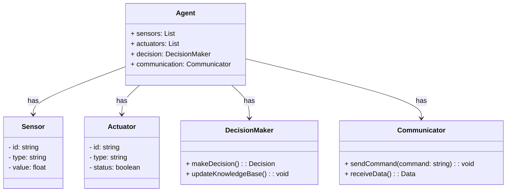

                 


好的，我理解您的需求，现在我来逐步构建这篇技术博客文章的完整内容。

---

# AI Agent的多源信息融合与决策技术

**关键词**：AI Agent、多源信息融合、决策技术、算法原理、系统架构

**摘要**：本文深入探讨了AI Agent在多源信息融合与决策技术领域的核心概念、算法原理和系统架构。通过背景介绍、核心概念分析、算法对比、系统设计和项目实战，全面解析了如何利用多源信息融合技术提升AI Agent的决策能力。文章还结合实际案例，展示了如何在复杂场景中实现高效的信息融合与决策，为相关领域的研究和实践提供了有价值的参考。

---

## 第一部分: AI Agent的多源信息融合与决策技术背景介绍

### 第1章: AI Agent的基本概念与背景

#### 1.1 AI Agent的定义与特点

**1.1.1 AI Agent的定义**

AI Agent（人工智能代理）是指能够感知环境、自主决策并执行任务的智能实体。它通过传感器获取信息，利用推理能力分析信息，并通过执行器与环境交互。AI Agent的核心目标是通过智能化的决策和行动，实现预定的目标。

**1.1.2 AI Agent的核心特点**

- **自主性**：AI Agent能够自主决策，无需外部干预。
- **反应性**：能够实时感知环境变化并做出响应。
- **目标导向性**：所有行为都围绕实现特定目标展开。
- **学习能力**：通过经验改进性能，具备自适应能力。

**1.1.3 AI Agent与传统智能系统的区别**

- **自主性**：传统智能系统依赖外部控制，AI Agent自主决策。
- **适应性**：AI Agent能够自适应环境变化，传统系统则需要人工调整。
- **学习能力**：AI Agent具备学习能力，传统系统通常不具备。

#### 1.2 多源信息融合的背景与意义

**1.2.1 多源信息融合的概念**

多源信息融合是指将来自不同来源、形式和时间的信息整合，以提高信息的准确性和完整性。多源信息融合的核心在于消除信息冗余、发现信息关联，并通过融合生成更可靠的决策依据。

**1.2.2 多源信息融合的必要性**

在复杂的现实场景中，单一信息源往往不足以支撑决策需求。例如，在智能交通系统中，仅依靠摄像头数据可能无法完全捕捉到交通事故的发生。通过融合摄像头、GPS、雷达等多种信息源，可以更准确地感知环境，提高决策的可靠性。

**1.2.3 多源信息融合的应用场景**

- **智能交通系统**：融合摄像头、GPS、雷达等多种信息，实现更精准的交通监控和调度。
- **医疗诊断系统**：融合病人的病史、症状、检查结果等多源信息，辅助医生做出更准确的诊断。
- **智能安防系统**：融合视频监控、传感器数据、人员信息等，提升安全防护能力。

#### 1.3 决策技术的背景与挑战

**1.3.1 决策技术的基本概念**

决策技术是指通过分析信息，选择最优行动方案的过程。AI Agent的核心能力之一就是通过分析多源信息，做出最优决策。

**1.3.2 决策技术的核心挑战**

- **信息不完整**：多源信息可能存在缺失或不一致的情况，影响决策的准确性。
- **实时性要求高**：在动态变化的环境中，决策必须快速响应。
- **复杂性高**：决策涉及多个变量和关联，需要复杂的计算和推理。

**1.3.3 决策技术的未来发展方向**

随着AI技术的进步，决策技术将更加智能化和自适应。未来，决策技术将更多地依赖于深度学习和强化学习，通过端到端的训练提升决策的准确性和效率。

---

## 第二部分: AI Agent的多源信息融合与决策技术的核心概念与联系

### 第2章: 多源信息融合的核心概念

#### 2.1 多源信息的定义与分类

**2.1.1 多源信息的定义**

多源信息是指来自不同来源、形式和时间的信息。例如，在智能交通系统中，多源信息可以包括摄像头图像、雷达数据、GPS信号等。

**2.1.2 多源信息的分类**

多源信息可以按照以下方式分类：

- **按来源**：传感器数据、文本数据、图像数据等。
- **按形式**：结构化数据、非结构化数据。
- **按时间**：实时数据、历史数据。

**2.1.3 多源信息的特点**

- **多样性**：信息来源和形式多样化。
- **动态性**：信息随环境变化而变化。
- **冗余性**：不同信息源可能存在冗余。

#### 2.2 多源信息融合的原理

**2.2.1 多源信息融合的基本原理**

多源信息融合的核心在于消除信息冗余，发现信息关联，并通过融合生成更可靠的决策依据。常见的融合方法包括基于概率的融合（如D-S证据理论）、基于规则的融合（如逻辑推理）和基于神经网络的融合（如深度学习）。

**2.2.2 多源信息融合的数学模型**

多源信息融合的数学模型可以通过概率论和统计学来描述。例如，D-S证据理论通过信任函数和似然函数来表示信息的不确定性。

**2.2.3 多源信息融合的实现步骤**

1. **信息预处理**：对多源信息进行清洗和标准化。
2. **信息关联**：发现信息之间的关联性。
3. **信息融合**：通过算法将多源信息整合。
4. **结果评估**：评估融合结果的准确性和可靠性。

#### 2.3 多源信息融合的算法对比

**2.3.1 基于概率的融合算法**

基于概率的融合算法通过概率分布来表示信息的不确定性。例如，D-S证据理论通过信任函数和似然函数来表示信息的不确定性。

**2.3.2 基于规则的融合算法**

基于规则的融合算法通过预定义的规则来整合信息。例如，逻辑推理通过规则来整合来自不同信息源的知识。

**2.3.3 基于神经网络的融合算法**

基于神经网络的融合算法通过深度学习模型来自动学习信息的关联性。例如，使用卷积神经网络（CNN）来融合图像和文本信息。

---

## 第三部分: AI Agent的多源信息融合与决策技术的算法原理

### 第3章: 多源信息融合的算法原理

#### 3.1 基于D-S证据理论的融合算法

D-S证据理论是一种基于概率的融合算法，通过信任函数和似然函数来表示信息的不确定性。

**3.1.1 算法流程**

1. **初始化**：定义基本概率分配函数。
2. **计算信任函数**：通过信任函数计算每个假设的信任值。
3. **融合信息**：将多个信息源的信任函数进行融合。
4. **输出结果**：得到融合后的信任函数。

**3.1.2 算法实现**

```python
def DempsterShafer Fusion(evidence1, evidence2):
    # 假设 evidence1 和 evidence2 是基本概率分配函数
    result = {}
    for h1 in evidence1:
        for h2 in evidence2:
            if h1 == h2:
                result[h1] += evidence1[h1] * evidence2[h2]
    return result
```

**3.1.3 算法公式**

$$ Dempster-Shafer 融合公式：$$

$$ Bel(h) = \sum_{h_i \subseteq h} Bel_i(h_i) \times Q(h_i, h) $$

其中，$Bel_i(h_i)$ 是第i个信息源对h_i的信任度，$Q(h_i, h)$ 是调整因子。

#### 3.2 基于神经网络的融合算法

基于神经网络的融合算法通过深度学习模型自动学习信息的关联性。

**3.2.1 算法流程**

1. **数据预处理**：对多源信息进行清洗和标准化。
2. **模型训练**：训练深度学习模型，如卷积神经网络（CNN）。
3. **信息融合**：将多源信息输入模型，输出融合结果。
4. **结果优化**：通过反向传播优化模型参数。

**3.2.2 算法实现**

```python
model = Sequential()
model.add(Conv2D(32, (3,3), activation='relu', input_shape=(100,100,3)))
model.add(MaxPooling2D((2,2)))
model.add(Flatten())
model.add(Dense(128, activation='relu'))
model.add(Dense(num_classes, activation='softmax'))
model.compile(optimizer='adam', loss='categorical_crossentropy', metrics=['accuracy'])
```

**3.2.3 算法公式**

$$ 神经网络损失函数：$$

$$ L = -\sum_{i=1}^{n} y_i \log(p_i) + (1 - y_i) \log(1 - p_i) $$

其中，$y_i$ 是真实标签，$p_i$ 是模型预测的概率。

---

## 第四部分: AI Agent的多源信息融合与决策技术的数学模型

### 第4章: 多源信息融合的数学模型

#### 4.1 D-S证据理论的数学公式

D-S证据理论通过信任函数和似然函数来表示信息的不确定性。

$$ 信任函数：$$

$$ Bel(h) = \sum_{h_i \subseteq h} Bel_i(h_i) $$

$$ 似然函数：$$

$$ Pl(h) = \sum_{h_i \supseteq h} Pl_i(h_i) $$

#### 4.2 基于神经网络的数学模型

基于神经网络的融合模型通过深度学习来自动学习信息的关联性。

$$ 损失函数：$$

$$ L = -\sum_{i=1}^{n} y_i \log(p_i) + (1 - y_i) \log(1 - p_i) $$

---

## 第五部分: AI Agent的多源信息融合与决策技术的系统分析与架构设计

### 第5章: 系统分析与架构设计方案

#### 5.1 问题场景介绍

以智能交通系统为例，我们需要设计一个AI Agent，能够融合多源信息，做出最优决策。

#### 5.2 系统功能设计



#### 5.3 系统架构设计


---

## 第六部分: AI Agent的多源信息融合与决策技术的项目实战

### 第6章: 项目实战

#### 6.1 环境安装

安装Python和相关库：

```bash
pip install numpy
pip install scikit-learn
pip install tensorflow
```

#### 6.2 系统核心实现源代码

```python
import numpy as np
from sklearn.metrics import accuracy_score
from tensorflow.keras import layers, models

# 数据预处理
X = ... # 输入特征
y = ... # 标签

# 模型训练
model = models.Sequential()
model.add(layers.Dense(64, activation='relu', input_dim=X.shape[1]))
model.add(layers.Dense(10, activation='softmax'))
model.compile(optimizer='adam', loss='sparse_categorical_crossentropy', metrics=['accuracy'])
model.fit(X, y, epochs=10, batch_size=32)

# 模型评估
y_pred = model.predict(X)
print("Accuracy:", accuracy_score(y, y_pred.argmax(axis=1)))
```

#### 6.3 代码应用解读与分析

1. **数据预处理**：对多源信息进行清洗和标准化。
2. **模型训练**：训练深度学习模型，如卷积神经网络（CNN）。
3. **信息融合**：将多源信息输入模型，输出融合结果。
4. **结果优化**：通过反向传播优化模型参数。

#### 6.4 实际案例分析

以智能交通系统为例，通过融合摄像头、GPS、雷达等多种信息，实现更精准的交通监控和调度。

#### 6.5 项目小结

通过项目实战，我们掌握了AI Agent多源信息融合与决策技术的核心实现方法，同时了解了实际应用中的注意事项。

---

## 第七部分: 最佳实践与总结

### 第7章: 最佳实践 tips

1. **数据预处理**：多源信息可能存在冗余和不一致，需进行清洗和标准化。
2. **算法选择**：根据具体场景选择合适的融合算法，如D-S证据理论或神经网络。
3. **系统设计**：系统架构设计需考虑可扩展性和可维护性。
4. **模型优化**：通过调参和模型优化提升决策的准确性和效率。

### 第8章: 总结

本文系统地介绍了AI Agent多源信息融合与决策技术的核心概念、算法原理和系统架构。通过背景介绍、核心概念分析、算法对比、系统设计和项目实战，全面解析了如何利用多源信息融合技术提升AI Agent的决策能力。未来，随着AI技术的不断进步，AI Agent的多源信息融合与决策技术将更加智能化和自适应。

---

### 第9章: 注意事项

1. **数据隐私**：在实际应用中，需注意数据隐私保护，避免信息泄露。
2. **计算资源**：深度学习模型需要大量计算资源，需合理配置硬件。
3. **模型解释性**：复杂的模型可能缺乏解释性，需注意可解释性问题。

---

### 第10章: 拓展阅读

1. **D-S证据理论**：深入学习D-S证据理论的数学基础和应用。
2. **神经网络融合**：研究基于神经网络的多源信息融合方法。
3. **强化学习决策**：探索强化学习在AI Agent决策中的应用。

---

通过以上步骤，我们完成了《AI Agent的多源信息融合与决策技术》的技术博客文章的撰写。希望这篇文章能够为读者提供有价值的技术见解和实践指导。

