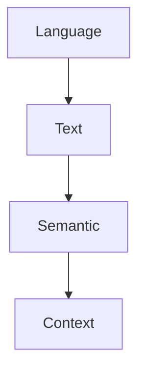
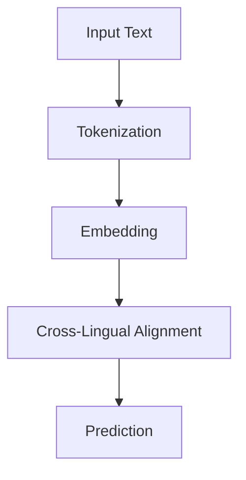
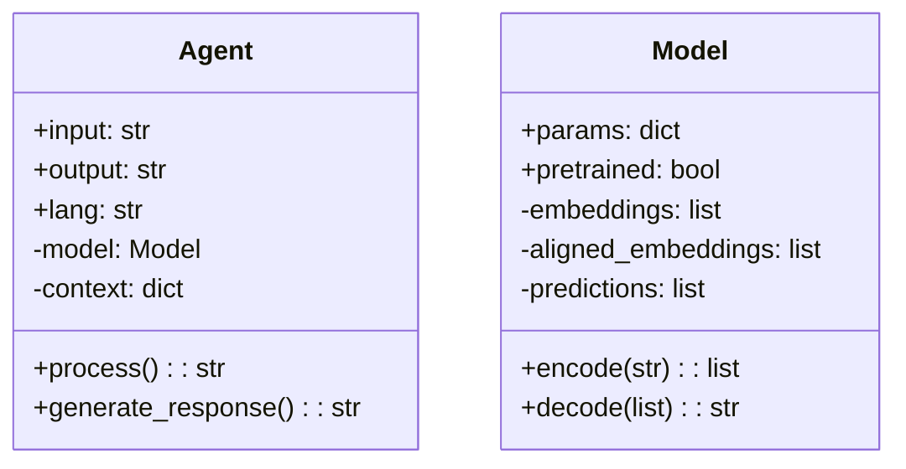

                 


# AI Agent的多语言处理：跨语言理解与生成

## 关键词：AI Agent，多语言处理，跨语言理解，跨语言生成，自然语言处理，深度学习

## 摘要：  
本文深入探讨AI Agent在多语言环境中的处理能力，重点分析跨语言理解与生成的核心原理、算法实现及系统架构。通过具体案例和实践，详细阐述如何构建高效、准确的跨语言AI Agent系统，并总结最佳实践和未来发展方向。

---

# 正文

## 第一部分: AI Agent与多语言处理的背景与基础

### 第1章: 多语言处理的背景与挑战

#### 1.1 多语言处理的背景

随着全球化的深入，AI Agent的应用场景越来越广泛。从智能家居到智能客服，从机器翻译到跨语言对话，AI Agent需要能够处理多种语言的输入和输出。这种需求推动了跨语言处理技术的发展。

**问题背景：**  
AI Agent的核心任务是与用户进行交互，理解用户的意图并生成相应的回应。然而，用户可能使用多种语言进行输入，而AI Agent需要能够理解这些语言并生成相应的输出。这就需要AI Agent具备跨语言处理能力。

**问题描述：**  
跨语言处理的核心问题在于如何将不同语言的文本统一到一个语义空间中，使得模型能够理解并生成跨语言的文本。这涉及到语言之间的语义对齐、语言模型的跨语言适应性等问题。

**解决方法：**  
通过预训练模型（如mBART、XLM-R）等技术，可以实现跨语言文本的表示和生成。同时，结合语言特征和上下文信息，可以进一步提高跨语言处理的准确性。

**边界与外延：**  
跨语言处理的边界在于如何处理语言之间的语义差异，而外延则包括多模态跨语言处理、实时跨语言交互等。

---

## 第二部分: 多语言处理的核心概念与联系

### 第2章: 多语言处理的核心概念

#### 2.1 跨语言理解的核心原理

**语言表示的统一性：**  
跨语言理解的核心在于将不同语言的文本统一表示为一个语义空间。通过预训练模型，可以将不同语言的文本映射到一个共享的嵌入空间中。

**语言对齐的原理：**  
跨语言对齐的目标是将不同语言的语义信息对齐，使得模型能够理解不同语言之间的语义关系。这可以通过对比学习、对齐网络等方法实现。

**输入输出机制：**  
跨语言理解的输入是多语言文本，输出是统一的语义表示。这需要模型具备多语言输入处理能力。

#### 2.2 跨语言生成的核心原理

**生成的挑战：**  
跨语言生成的核心问题在于如何从一种语言生成另一种语言的文本。这需要模型具备跨语言的生成能力，同时保持生成文本的语义一致性。

**模型架构：**  
跨语言生成模型通常基于Transformer架构，通过多语言预训练和微调实现。模型需要同时处理多种语言的输入和输出。

**评估指标：**  
跨语言生成的评估指标包括BLEU、ROUGE、METEOR等，这些指标用于衡量生成文本的质量和准确性。

#### 2.3 跨语言处理的核心要素对比

**对比分析：**  
下表对比了跨语言理解与生成的核心要素：

| **核心要素** | **跨语言理解** | **跨语言生成** |
|--------------|----------------|----------------|
| 输入 | 多语言文本 | 单语言文本 |
| 输出 | 统一语义表示 | 多语言文本 |
| 挑战 | 语义对齐 | 生成多样性 |
| 方法 | 对比学习 | 预训练+微调 |

**ER实体关系图：**  
跨语言处理的核心要素可以用ER图表示如下：



---

## 第三部分: 多语言处理的算法与模型

### 第3章: 跨语言理解的算法原理

#### 3.1 跨语言理解的算法流程

**流程图：**  
跨语言理解的算法流程如下：



**具体步骤：**  
1. **分词（Tokenization）：** 将输入文本分割成单词或短语。
2. **嵌入（Embedding）：** 将分词后的文本映射到向量空间。
3. **跨语言对齐（Cross-Lingual Alignment）：** 将不同语言的嵌入对齐到统一的语义空间。
4. **预测（Prediction）：** 基于对齐后的嵌入进行语义理解。

#### 3.2 跨语言理解的数学模型

**输入表示：**  
给定输入文本 $x = (x_1, x_2, ..., x_n)$，其中 $x_i$ 表示第 $i$ 个分词的嵌入。

**嵌入层：**  
通过预训练模型将每个分词 $x_i$ 映射到嵌入向量 $e_i = f(x_i)$，其中 $f$ 是预训练模型的嵌入函数。

**对齐层：**  
通过对比学习对齐不同语言的嵌入，得到对齐后的嵌入向量 $a_i = g(e_i, e_j)$，其中 $g$ 是对齐函数。

**输出层：**  
最终的语义表示为 $s = h(a_1, a_2, ..., a_n)$，其中 $h$ 是聚合函数。

---

## 第四部分: 系统分析与架构设计

### 第4章: 跨语言处理的系统架构

#### 4.1 问题场景介绍

**应用场景：**  
AI Agent需要在多语言环境下处理用户的输入，例如跨语言对话、多语言客服系统等。

**系统目标：**  
构建一个支持多语言输入和输出的AI Agent系统，具备跨语言理解和生成能力。

#### 4.2 系统功能设计

**领域模型：**  
系统功能模块如下：



---

## 第五部分: 项目实战

### 第5章: 跨语言处理的项目实战

#### 5.1 环境安装

**安装依赖：**  
需要安装以下库：
- transformers
- torch
- mermaid
- matplotlib

**代码示例：**  
以下是一个简单的跨语言处理代码示例：

```python
from transformers import AutoTokenizer, AutoModelForMaskedLM
import torch

# 加载预训练模型
model_name = "facebook/mBART-50"
tokenizer = AutoTokenizer.from_pretrained(model_name)
model = AutoModelForMaskedLM.from_pretrained(model_name)

# 示例文本
inputs = "Hello, my name is [MASK]."
inputs_tokenized = tokenizer(inputs, return_tensors="pt")

# 推理
outputs = model.generate(**inputs_tokenized)
decoded = tokenizer.decode(outputs[0], skip_special_tokens=True)
print(decoded)
```

#### 5.2 核心代码实现

**模型微调：**  
以下是一个跨语言微调的代码示例：

```python
from transformers import AutoTokenizer, AutoModelForMaskedLM
import torch
from torch.utils.data import Dataset, DataLoader

class MultiLanguageDataset(Dataset):
    def __init__(self, tokenizer, texts, labels):
        self.tokenizer = tokenizer
        self.texts = texts
        self.labels = labels

    def __len__(self):
        return len(self.texts)

    def __getitem__(self, idx):
        text = self.texts[idx]
        label = self.labels[idx]
        encoding = self.tokenizer(text, return_tensors="pt", padding=True, truncation=True)
        return {
            'input_ids': encoding['input_ids'].flatten(),
            'attention_mask': encoding['attention_mask'].flatten(),
            'labels': label
        }

# 初始化数据集
texts = ["Hello, how are you?", "Bonjour, comment allez-vous?"]
labels = [0, 1]

dataset = MultiLanguageDataset(tokenizer, texts, labels)
dataloader = DataLoader(dataset, batch_size=2, shuffle=True)

# 微调模型
model.train()
optimizer = torch.optim.Adam(model.parameters(), lr=1e-5)
criterion = torch.nn.CrossEntropyLoss()

for batch in dataloader:
    optimizer.zero_grad()
    outputs = model(**batch)
    loss = criterion(outputs.logits, batch['labels'])
    loss.backward()
    optimizer.step()
```

---

## 第六部分: 最佳实践与总结

### 第6章: 跨语言处理的最佳实践

#### 6.1 小结

跨语言处理是AI Agent实现多语言交互的核心技术。通过预训练模型和微调技术，可以有效提升跨语言理解和生成的能力。

#### 6.2 注意事项

- 数据质量：跨语言处理需要高质量的多语言数据。
- 模型选择：选择适合任务的预训练模型。
- 资源管理：跨语言处理需要较高的计算资源。

#### 6.3 拓展阅读

- [Facebook Research](https://research.facebook.com/)
- [Hugging Face Transformers](https://huggingface.co/transformers)
- [Cross-Lingual AI Research](https://arxiv.org/abs/2005.00169)

---

## 结语

跨语言处理是AI Agent实现多语言交互的核心技术。通过预训练模型和微调技术，可以有效提升跨语言理解和生成的能力。未来，随着多语言预训练模型的不断发展，AI Agent的跨语言处理能力将更加智能化和高效化。

--- 

以上是基于用户提供的《AI Agent的多语言处理：跨语言理解与生成》的完整目录和正文内容。

