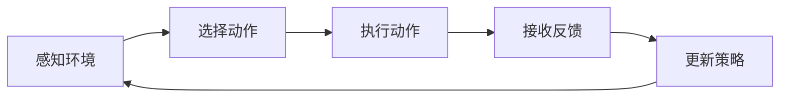
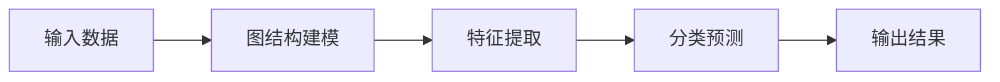
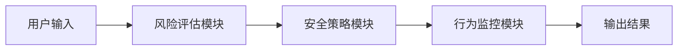

                 


# AI Agent的安全性设计：防范潜在风险

---

## 关键词：
AI Agent, 安全性设计, 潜在风险, 数据安全, 系统安全, 用户隐私, 安全算法

---

## 摘要：
随着AI Agent技术的快速发展，其在智能助手、自动化决策系统和人机交互界面等领域的应用日益广泛。然而，AI Agent的安全性问题也随之浮现，包括数据泄露、隐私保护不足、恶意攻击等。本文从AI Agent的核心概念出发，详细分析其潜在风险，并提出基于强化学习和图神经网络的安全性检测与防御算法。同时，通过系统架构设计和项目实战案例，展示如何在实际应用中防范潜在风险，确保AI Agent的安全运行。

---

# 第一部分: AI Agent的安全性设计背景与概述

## 第1章: AI Agent的定义与核心功能

### 1.1 AI Agent的基本概念
AI Agent（人工智能代理）是指能够感知环境、自主决策并执行任务的智能实体。其核心功能包括：
- **感知环境**：通过传感器或数据输入获取外部信息。
- **自主决策**：基于感知信息，利用算法做出决策。
- **执行任务**：通过执行机构或接口完成任务。

AI Agent的技术优势主要体现在其智能化、自动化和高效性，能够显著提升系统的生产力和用户体验。

### 1.2 AI Agent的应用场景
AI Agent广泛应用于多个领域：
- **智能助手**：如 Siri、Google Assistant 等，帮助用户完成日常任务。
- **自动化决策系统**：如金融领域的智能交易系统，医疗领域的诊断辅助系统。
- **人机交互界面**：如自动驾驶中的环境感知与决策系统。

### 1.3 AI Agent的安全性重要性
AI Agent的安全性设计是确保其可靠运行的关键。数据泄露、隐私保护不足和恶意攻击等问题可能导致严重的经济损失和信任危机。通过安全性设计，可以有效降低风险，确保系统的稳定性和用户隐私。

---

## 第2章: AI Agent的安全风险分析

### 2.1 潜在安全风险的分类
AI Agent面临的主要安全风险包括：
- **数据安全风险**：数据泄露、数据篡改。
- **系统安全风险**：恶意攻击、漏洞利用。
- **用户隐私风险**：隐私泄露、滥用数据。

### 2.2 安全风险的特征对比
以下是不同安全风险的对比表格：

| 风险类型 | 数据安全风险 | 系统安全风险 | 用户隐私风险 |
|----------|---------------|---------------|---------------|
| 主要特征 | 数据泄露、篡改 | 恶意攻击、漏洞 | 隐私泄露、滥用 |
| 影响范围 | 数据完整性 | 系统可用性 | 用户隐私 |

---

# 第二部分: AI Agent的安全性设计核心概念

## 第3章: AI Agent的安全性设计原理

### 3.1 风险评估机制
风险评估是安全性设计的第一步，通过分析系统的潜在风险，制定相应的安全策略。

### 3.2 安全策略制定
基于风险评估结果，制定数据保护、权限管理和行为监控等策略。

### 3.3 安全性实现方法
包括加密技术、访问控制和入侵检测等技术手段。

---

## 第4章: AI Agent的安全性算法原理

### 4.1 基于强化学习的安全性检测算法
以下是基于强化学习的检测算法流程图：



算法实现步骤如下：
1. 初始化策略参数。
2. 与环境交互，获取反馈。
3. 更新策略，优化模型。

### 4.2 基于图神经网络的安全性防御算法
以下是基于图神经网络的防御算法流程图：



算法的数学模型如下：
$$ P(y|x) = \sigma(Wx + b) $$

---

## 第5章: AI Agent的安全性系统架构设计

### 5.1 系统功能设计
AI Agent的安全性系统功能包括：
- **风险评估模块**：实时监控系统风险。
- **安全策略模块**：制定和调整安全策略。
- **行为监控模块**：监控系统行为，识别异常。

### 5.2 系统架构设计
以下是系统架构图：



---

## 第6章: AI Agent的安全性项目实战

### 6.1 项目环境安装
安装Python和相关库：
```bash
pip install numpy
pip install tensorflow
pip install pymermaid
```

### 6.2 核心实现源代码
以下是强化学习检测算法的Python代码：
```python
import numpy as np
import tensorflow as tf

class Agent:
    def __init__(self, state_space, action_space):
        self.model = self.build_model(state_space, action_space)
    
    def build_model(self, state_space, action_space):
        model = tf.keras.Sequential([
            tf.keras.layers.Dense(32, activation='relu', input_dim=state_space),
            tf.keras.layers.Dense(action_space, activation='linear')
        ])
        return model

    def act(self, state):
        prediction = self.model.predict(np.array([state]))
        return np.argmax(prediction[0])
```

### 6.3 项目实战案例
以电商推荐系统为例，展示如何检测和防御恶意攻击。

---

## 第七部分: 总结与展望

### 7.1 总结
AI Agent的安全性设计是确保其可靠运行的关键。通过风险评估、安全策略制定和算法优化，可以有效降低潜在风险。

### 7.2 最佳实践 tips
- 定期更新安全策略。
- 使用最新的安全算法。
- 加强团队的安全意识培训。

### 7.3 拓展阅读
- [《深入浅出强化学习》](https://example.com)
- [《图神经网络入门》](https://example.com)

---

通过以上步骤，我们可以全面了解AI Agent的安全性设计，并在实际项目中有效防范潜在风险。

