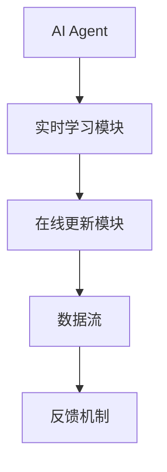
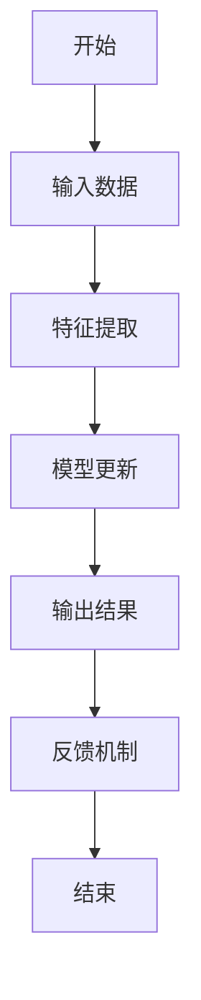
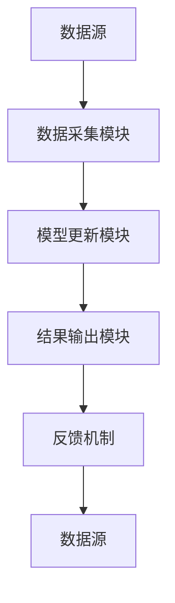

                 


# AI Agent的实时学习与在线更新技术

> 关键词：AI Agent, 实时学习, 在线更新, 机器学习, 分布式系统, 系统架构

> 摘要：本文深入探讨了AI Agent的实时学习与在线更新技术，从基本概念到算法原理，从系统架构到项目实战，全面分析了该技术的核心内容与实现方法。文章通过详细的技术分析和丰富的案例解读，帮助读者全面理解AI Agent的实时学习与在线更新技术，并提供了实际应用中的最佳实践和未来发展方向。

---

# 第1章: AI Agent与实时学习概述

## 1.1 AI Agent的基本概念

### 1.1.1 AI Agent的定义与特点
- AI Agent的定义：AI Agent是一种能够感知环境、自主决策并执行任务的智能实体。
- AI Agent的特点：
  - 智能性：能够通过学习和推理完成复杂任务。
  - 实时性：能够快速响应环境变化。
  - 自适应性：能够根据反馈不断优化行为。

### 1.1.2 AI Agent的核心组成要素
- 感知模块：负责感知环境信息。
- 决策模块：负责制定行动策略。
- 执行模块：负责执行具体任务。
- 学习模块：负责实时学习与在线更新。

### 1.1.3 AI Agent的分类与应用场景
- 分类：
  - 简单反射型AI Agent：基于规则的简单决策。
  - 复杂推理型AI Agent：基于逻辑推理的复杂决策。
  - 机器学习型AI Agent：基于数据驱动的自主学习。
- 应用场景：
  - 智能推荐系统
  - 自动交易系统
  - 智能客服系统

## 1.2 实时学习与在线更新的背景

### 1.2.1 实时学习的定义与特点
- 实时学习的定义：在数据流不断变化的情况下，动态调整模型参数以适应新数据的学习方式。
- 实时学习的特点：
  - 数据流处理：能够处理连续的、实时的数据流。
  - 快速响应：能够在较短时间内完成模型更新并输出结果。
  - 鲁棒性：能够在噪声和不确定性环境中稳定运行。

### 1.2.2 在线更新技术的必要性
- 在线更新技术的必要性：
  - 数据动态变化：现实环境中的数据通常是动态变化的，需要模型能够实时调整。
  - 高效性要求：在实时应用中，模型更新必须高效，以保证系统的实时响应能力。
  - 可扩展性：在线更新技术能够支持大规模数据的处理和分布式系统的扩展。

### 1.2.3 实时学习与在线更新的边界与外延
- 边界：
  - 离线学习的边界：数据是静态的，模型更新是批量的。
  - 在线学习的边界：数据是动态的，模型更新是实时的。
- 外延：
  - 实时学习的外延：结合分布式系统和流数据处理技术，扩展到更大规模的应用场景。

## 1.3 本章小结
本章从AI Agent的基本概念出发，介绍了实时学习与在线更新技术的背景和必要性，明确了实时学习与在线更新的核心概念和应用场景。

---

# 第2章: AI Agent实时学习的核心概念与联系

## 2.1 核心概念原理

### 2.1.1 实时学习的基本原理
- 实时学习的基本原理：
  - 数据流处理：模型在接收到新的数据后，逐步更新模型参数。
  - 模型更新：通过优化算法（如随机梯度下降）实时更新模型参数。
  - 模型评估：在每一步更新后，评估模型的性能并进行调整。

### 2.1.2 在线更新的数学模型
- 在线更新的数学模型：
  - 参数更新公式：
    $$\theta_{t+1} = \theta_t - \eta \nabla J(\theta_t)$$
    其中，$\theta_t$ 表示第 $t$ 步的模型参数，$\eta$ 表示学习率，$\nabla J(\theta_t)$ 表示损失函数的梯度。
  - 损失函数：
    $$J(\theta) = \frac{1}{n}\sum_{i=1}^{n} (y_i - \hat{y}_i)^2$$

### 2.1.3 实时学习与在线更新的联系
- 联系：
  - 实时学习是在线更新的基础，而在线更新是实时学习的核心实现方式。
  - 两者结合能够实现模型的动态调整和持续优化。

## 2.2 核心概念对比分析

### 2.2.1 实时学习与批量学习的对比
| 对比维度 | 实时学习 | 批量学习 |
|----------|----------|----------|
| 数据处理方式 | 流式数据，逐条处理 | 批次数据，批量处理 |
| 计算效率 | 实时性高，资源消耗低 | 计算效率高，但需要较大的内存 |
| 模型更新 | 每个数据点更新一次 | 每个批次更新一次 |

### 2.2.2 在线更新与离线更新的对比
| 对比维度 | 在线更新 | 离线更新 |
|----------|----------|----------|
| 更新时机 | 数据生成时立即更新 | 数据生成后集中更新 |
| 响应时间 | 实时响应 | 延后响应 |
| 系统资源 | 资源占用较高 | 资源占用较低 |

### 2.2.3 核心概念对比特征表格
| 对比维度 | 实时学习 | 在线更新 |
|----------|----------|----------|
| 数据流 | 流式数据 | 流式数据 |
| 更新频率 | 每个数据点 | 每个时间步 |
| 模型稳定性 | 动态调整 | 动态调整 |

## 2.3 实体关系图


## 2.4 本章小结
本章详细分析了实时学习与在线更新的核心概念，通过对比分析和实体关系图，明确了两者的联系与区别。

---

# 第3章: AI Agent实时学习的算法原理

## 3.1 算法原理概述

### 3.1.1 增量学习算法
- 增量学习算法：
  - 核心思想：利用新数据逐步更新模型参数。
  - 优势：计算效率高，适合实时数据流处理。
  - 常用算法：随机梯度下降（SGD）、AdaGrad、Adam等。

### 3.1.2 在线优化算法
- 在线优化算法：
  - 核心思想：在每一步更新中优化目标函数。
  - 优势：能够适应动态变化的环境，保持模型的最优性。
  - 常用算法：在线支持向量机（Online SVM）、在线逻辑回归（Online LR）等。

### 3.1.3 实时学习的数学模型
- 实时学习的数学模型：
  - 损失函数：
    $$J(\theta) = \frac{1}{n}\sum_{i=1}^{n} (y_i - \hat{y}_i)^2$$
  - 参数更新公式：
    $$\theta_{t+1} = \theta_t - \eta \nabla J(\theta_t)$$

## 3.2 算法流程图



## 3.3 算法实现代码

```python
def online_learning_algorithm(data_stream):
    model = initialize_model()
    for x, y in data_stream:
        prediction = model.predict(x)
        loss = calculate_loss(y, prediction)
        model.update_weights(loss)
    return model
```

## 3.4 本章小结
本章从算法原理的角度，详细分析了实时学习的核心算法，包括增量学习算法和在线优化算法，并通过流程图和代码示例，帮助读者理解其实现过程。

---

# 第4章: AI Agent实时学习的系统分析与架构设计

## 4.1 系统功能设计

### 4.1.1 领域模型设计
- 领域模型设计：
  - 用户需求分析：实时更新模型参数，动态调整模型行为。
  - 功能模块划分：
    - 数据采集模块：负责采集实时数据流。
    - 模型更新模块：负责基于实时数据更新模型参数。
    - 结果输出模块：负责输出实时结果。

### 4.1.2 系统架构设计
- 系统架构设计：
  - 分层架构：数据采集层、模型更新层、结果输出层。
  - 组件设计：
    - 数据采集组件：负责从数据源获取实时数据。
    - 模型更新组件：负责基于实时数据更新模型参数。
    - 结果输出组件：负责将模型输出结果传递给上层系统。

### 4.1.3 系统交互设计
- 系统交互设计：
  - 数据流方向：数据从数据源流向数据采集组件，再流向模型更新组件，最后流向结果输出组件。
  - 反馈机制：系统根据结果输出模块的反馈，动态调整模型参数。

## 4.2 系统架构图



## 4.3 系统接口设计

### 4.3.1 数据接口设计
- 数据接口设计：
  - 数据格式：JSON格式。
  - 数据传输协议：HTTP协议。
  - 接口定义：
    - GET请求：获取实时数据流。
    - POST请求：提交模型更新结果。

### 4.3.2 模型接口设计
- 模型接口设计：
  - 模型参数接口：用于获取当前模型参数。
  - 模型更新接口：用于更新模型参数。

## 4.4 系统交互序列图


## 4.5 本章小结
本章从系统设计的角度，详细分析了AI Agent实时学习的系统架构，包括功能设计、架构设计和接口设计，并通过序列图展示了系统的交互流程。

---

# 第5章: AI Agent实时学习的项目实战

## 5.1 项目介绍

### 5.1.1 项目背景
- 项目背景：
  - 实现一个基于实时学习的在线推荐系统。
  - 系统能够根据用户的实时行为动态调整推荐策略。

### 5.1.2 项目目标
- 项目目标：
  - 实现模型的实时更新。
  - 实现推荐结果的动态调整。
  - 实现系统的高效响应。

## 5.2 核心代码实现

### 5.2.1 环境配置
- 环境配置：
  - Python版本：3.8及以上。
  - 依赖库：TensorFlow、Kafka、Flask。

### 5.2.2 核心代码
```python
from kafka import KafkaConsumer, KafkaProducer
import tensorflow as tf

# 数据采集模块
def data_consumer():
    consumer = KafkaConsumer('realtime_data')
    for message in consumer:
        data = message.value
        yield data

# 模型更新模块
def model_updater(data):
    model = tf.keras.Sequential([
        tf.keras.layers.Dense(64, activation='relu'),
        tf.keras.layers.Dense(1, activation='sigmoid')
    ])
    model.compile(optimizer='adam', loss='binary_crossentropy')
    for x, y in data:
        model.fit(x, y, epochs=1, batch_size=1)
        yield model.get_weights()

# 结果输出模块
def result_publisher(weights):
    producer = KafkaProducer('recommendation_results')
    for weight in weights:
        producer.send('recommendation_results', weight)
```

### 5.2.3 功能实现
- 功能实现：
  - 数据采集：通过Kafka消费者实时采集用户行为数据。
  - 模型更新：基于实时数据更新模型参数。
  - 结果输出：将模型更新结果发布到Kafka主题。

## 5.3 项目实战总结

### 5.3.1 实际案例分析
- 实际案例分析：
  - 系统在实时推荐场景中的表现。
  - 系统的实时响应能力。
  - 系统的模型更新效率。

### 5.3.2 功能实现分析
- 功能实现分析：
  - 数据采集模块的性能优化。
  - 模型更新模块的优化策略。
  - 结果输出模块的可靠性保障。

## 5.4 本章小结
本章通过一个具体的在线推荐系统案例，详细讲解了AI Agent实时学习技术的项目实现过程，包括环境配置、核心代码实现和功能实现分析。

---

# 第6章: AI Agent实时学习的最佳实践与未来展望

## 6.1 最佳实践

### 6.1.1 系统设计 tips
- 系统设计 tips：
  - 数据流处理：确保数据流的实时性和高效性。
  - 模型更新：选择适合的在线优化算法，如Adam。
  - 系统架构：采用分层架构，便于模块化开发。

### 6.1.2 代码实现 tips
- 代码实现 tips：
  - 使用分布式系统：如Kafka、Redis等。
  - 优化模型更新：采用异步更新和批量处理。
  - 提高系统容错性：采用冗余设计和自动恢复机制。

### 6.1.3 系统优化 tips
- 系统优化 tips：
  - 数据预处理：减少数据处理时间。
  - 模型压缩：减少模型占用的内存。
  - 系统监控：实时监控系统性能。

## 6.2 未来展望

### 6.2.1 技术发展趋势
- 技术发展趋势：
  - 在线学习与分布式系统的结合。
  - 更高效的模型更新算法。
  - 更智能的反馈机制。

### 6.2.2 应用场景拓展
- 应用场景拓展：
  - 实时金融交易。
  - 实时社交网络分析。
  - 实时自动驾驶决策。

## 6.3 本章小结
本章总结了AI Agent实时学习技术的最佳实践，并展望了未来的技术发展趋势和应用场景。

---

# 第7章: 总结与展望

## 7.1 全文总结
- 全文总结：
  - AI Agent的实时学习与在线更新技术是实现智能系统动态调整的核心技术。
  - 通过实时学习和在线更新，系统能够快速适应环境变化，提高决策的准确性和实时性。

## 7.2 未来展望
- 未来展望：
  - 更高效的在线学习算法。
  - 更智能的模型更新策略。
  - 更广泛的应用场景。

## 7.3 本章小结
本章对全文进行了总结，并展望了AI Agent实时学习与在线更新技术的未来发展方向。

---

# 参考文献

（此处列出相关文献和参考资料）

---

通过以上目录大纲，您可以开始撰写完整的文章内容，每章内容可以根据上述结构展开详细讲解。

