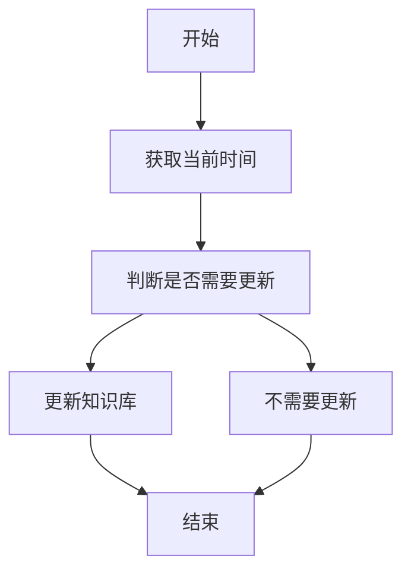
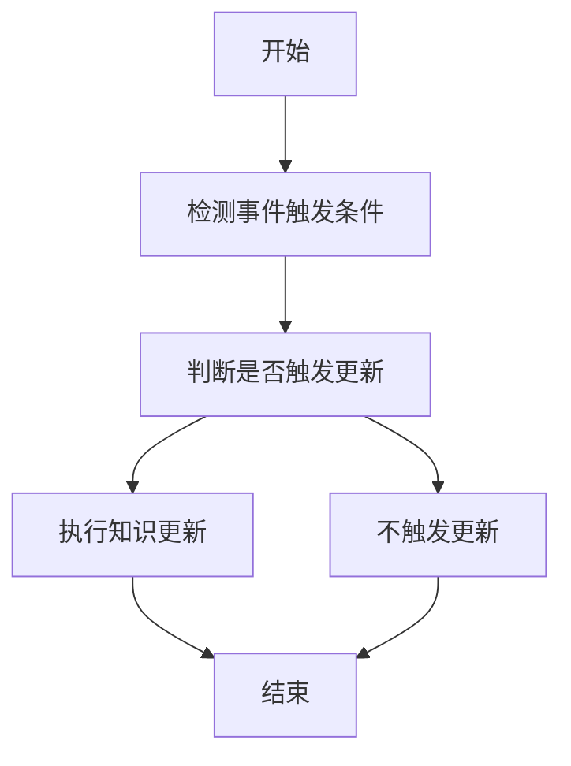
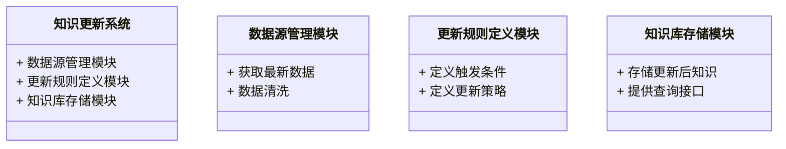

                 


# AI Agent的实时知识更新：保持LLM信息的时效性

> 关键词：AI Agent, 知识更新, LLM, 信息时效性, 实时更新, 数据源, 知识表示

> 摘要：本文深入探讨AI Agent实时知识更新的重要性及其实现方法，分析如何保持LLM信息的时效性，通过数据源管理、更新机制设计、知识表示优化等多维度的技术手段，确保AI Agent能够实时获取最新信息，从而提升其决策能力和应用场景的广泛性。

---

# 第一部分: AI Agent实时知识更新的背景与核心概念

## 第1章: AI Agent与知识更新概述

### 1.1 问题背景与描述

#### 1.1.1 LLM信息时效性的挑战
- **问题背景**：随着AI技术的快速发展，大语言模型（LLM）在各种应用场景中发挥着越来越重要的作用。然而，LLM的知识库通常是静态的，无法实时更新，导致其输出的信息可能存在过时的问题。
- **问题描述**：在动态变化的现实环境中，如金融市场、医疗健康、新闻资讯等领域，信息的时效性至关重要。如果AI Agent无法实时更新其知识库，可能会导致决策失误或提供错误信息。
- **问题解决**：需要设计一种高效的实时知识更新机制，确保AI Agent能够持续获取最新信息，保持其知识库的时效性。

#### 1.1.2 AI Agent的知识更新需求
- **动态适应性**：AI Agent需要能够根据实时数据调整其知识库，以应对环境的变化。
- **高效性**：知识更新过程需要快速完成，以保证实时性。
- **准确性**：更新的信息必须准确无误，避免引入错误数据。

#### 1.1.3 问题的边界与外延
- **知识更新的范围**：明确知识更新的范围，包括哪些信息需要更新、更新的频率等。
- **时效性与准确性的平衡**：在实时更新的同时，确保信息的准确性，避免因为追求实时性而引入错误信息。
- **外部数据源的依赖性**：AI Agent的知识更新通常依赖于外部数据源，需要考虑数据源的可靠性和稳定性。

### 1.2 核心概念与定义

#### 1.2.1 AI Agent的基本概念
- **AI Agent**：AI Agent是一种智能体，能够感知环境并采取行动以实现目标。它需要依赖知识库来做出决策。
- **知识库**：AI Agent的“大脑”，存储着用于决策所需的所有信息，包括静态知识和动态知识。

#### 1.2.2 实时知识更新的定义
- **实时知识更新**：通过持续从外部数据源获取最新信息，动态更新AI Agent的知识库，以保持其知识的时效性。

#### 1.2.3 LLM信息时效性的衡量标准
- **数据新鲜度**：信息的时间戳，越接近当前时间，数据越新鲜。
- **信息准确性**：信息与实际情况的一致程度。

### 1.3 问题的边界与外延

#### 1.3.1 知识更新的范围界定
- **静态知识**：如常识、领域知识，通常不需要频繁更新。
- **动态知识**：如实时新闻、市场数据，需要频繁更新。

#### 1.3.2 时效性与准确性的平衡
- **实时性优先**：在时效性要求较高的场景中，允许一定程度的信息不准确。
- **准确性优先**：在关键任务中，优先保证信息的准确性，适当牺牲实时性。

#### 1.3.3 外部数据源的依赖性
- **数据源的多样性**：包括结构化数据（如数据库）、非结构化数据（如文本、图像）。
- **数据源的可靠性**：需要选择可靠的数据源，避免引入错误信息。

### 1.4 核心概念的结构与组成

#### 1.4.1 知识更新的主体与客体
- **主体**：AI Agent或其背后的系统，负责执行知识更新操作。
- **客体**：外部数据源，提供最新信息。

#### 1.4.2 时效性与数据新鲜度的关系
- **数据新鲜度**：数据的时间戳，越接近当前时间，数据越新鲜。
- **时效性**：信息的有效时间窗口，超过该窗口的信息需要更新。

#### 1.4.3 知识更新的触发机制
- **主动触发**：定期或基于事件触发更新。
- **被动触发**：基于查询请求触发更新。

---

## 第2章: 知识更新的核心概念与联系

### 2.1 核心概念的原理分析

#### 2.1.1 数据源的多样性
- **结构化数据**：如数据库中的表格数据。
- **非结构化数据**：如文本、图像、视频。

#### 2.1.2 知识表示的结构化
- **知识图谱**：通过图结构表示知识，支持语义理解。
- **向量表示**：通过向量空间模型表示知识，支持相似性计算。

#### 2.1.3 更新机制的实时性
- **实时更新**：信息发生变化时立即更新。
- **准实时更新**：信息变化后经过一定时间窗口更新。

### 2.2 概念属性特征对比表

| 概念       | 属性       | 特征                                                                 |
|------------|------------|----------------------------------------------------------------------|
| 数据源     | 类型       | 结构化数据、非结构化数据                                           |
| 更新机制   | 类型       | 基于时间、基于事件                                                 |
| 时效性     | 衡量标准   | 数据新鲜度、信息准确性                                             |

### 2.3 ER实体关系图

```mermaid
erd
    title 实体关系图
    entity 知识库 {
        id
        知识内容
        更新时间
    }
    entity 数据源 {
        id
        数据类型
        数据来源
    }
    entity 更新机制 {
        id
        更新规则
        触发条件
    }
    知识库 -[1..n] -> 数据源
    知识库 -[1..n] -> 更新机制
```

---

## 第3章: 知识更新的算法原理

### 3.1 基于时间的更新算法

#### 3.1.1 算法流程



#### 3.1.2 算法实现

```python
import datetime

def update_knowledge_base(last_updated_time, update_interval):
    current_time = datetime.datetime.now()
    if current_time - last_updated_time >= update_interval:
        # 执行知识更新
        print("Updating knowledge base...")
        return current_time
    else:
        print("No update needed.")
        return last_updated_time

# 示例
last_updated = datetime.datetime(2023, 10, 1, 0, 0)
update_interval = datetime.timedelta(hours=1)
new_time = update_knowledge_base(last_updated, update_interval)
print("Last updated:", new_time)
```

#### 3.1.3 数学模型

$$ update\_interval = current\_time - last\_updated\_time $$

---

### 3.2 基于事件的更新算法

#### 3.2.1 算法流程



#### 3.2.2 算法实现

```python
def event_driven_update(trigger_conditions, knowledge_base):
    for condition in trigger_conditions:
        if check_condition(condition):
            # 执行知识更新
            print(f"Triggered update due to {condition}.")
            update_knowledge_base(knowledge_base)
            break
    return knowledge_base

# 示例
trigger_conditions = ["market_change", "new_news"]
knowledge_base = {"data": {"market": "stable", "news": "none"}}
event_driven_update(trigger_conditions, knowledge_base)
```

---

## 第4章: 知识更新的系统分析与架构设计

### 4.1 系统功能设计

#### 4.1.1 功能模块



---

## 第5章: 项目实战

### 5.1 环境安装

```bash
pip install requests
pip install pyyaml
pip install datetime
```

### 5.2 核心代码实现

#### 5.2.1 数据获取模块

```python
import requests
import json
import datetime

def fetch_data(api_key, endpoint):
    headers = {"Authorization": f"Bearer {api_key}"}
    response = requests.get(endpoint, headers=headers)
    if response.status_code == 200:
        return response.json()
    else:
        return None
```

#### 5.2.2 知识更新模块

```python
def update_knowledge_base(api_key, endpoint, knowledge_base):
    data = fetch_data(api_key, endpoint)
    if data:
        knowledge_base.update(data)
        print("Knowledge base updated successfully.")
    else:
        print("Failed to update knowledge base.")
    return knowledge_base
```

---

## 第6章: 最佳实践与小结

### 6.1 最佳实践

1. **选择可靠的数据源**：确保数据的准确性和及时性。
2. **合理设置更新频率**：根据应用场景的需求，平衡实时性和资源消耗。
3. **结合多种更新机制**：在不同场景下灵活切换更新方式，提高系统的适应性。

### 6.2 小结

本文详细探讨了AI Agent实时知识更新的重要性及其实现方法，通过数据源管理、更新机制设计、知识表示优化等多维度的技术手段，确保AI Agent能够实时获取最新信息，从而提升其决策能力和应用场景的广泛性。

