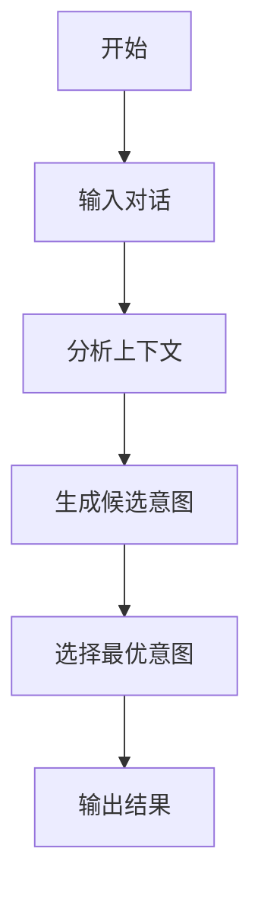
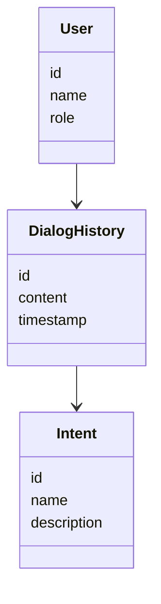
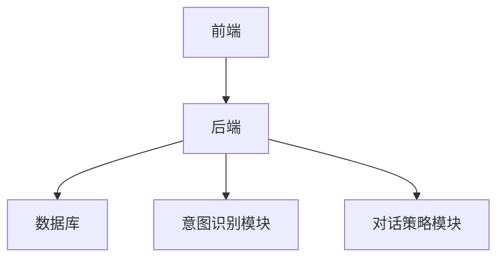
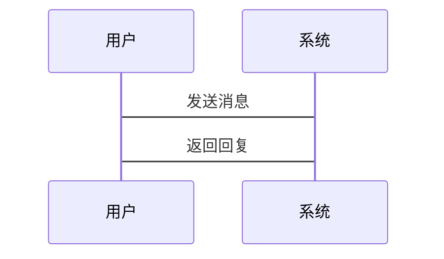

                 


好的，我来为您撰写《AI Agent的实时自适应对话管理系统》这篇文章。首先，我们从背景和概述开始，逐步展开技术细节。

# AI Agent的实时自适应对话管理系统

## 关键词：
AI Agent、实时自适应、对话管理、意图识别、自然语言处理

## 摘要：
本文详细探讨了AI Agent的实时自适应对话管理系统的构建与实现，从核心概念到算法原理，再到系统架构和项目实战，全面解析了如何设计一个高效、智能的对话管理系统，满足多样化的用户需求。

---

## 第1章: AI Agent与实时自适应对话管理概述

### 1.1 AI Agent的基本概念
#### 1.1.1 AI Agent的定义
AI Agent（人工智能代理）是能够感知环境、自主决策并执行任务的智能实体。在对话管理领域，AI Agent通过自然语言处理技术与用户进行交互，实时理解和响应用户需求。

#### 1.1.2 实时自适应对话管理的定义
实时自适应对话管理是指系统能够根据对话的动态变化，实时调整对话策略，以最优的方式引导对话向目标方向发展。这种管理方式依赖于对对话上下文的深度理解和实时反馈机制。

#### 1.1.3 对话管理的核心问题与挑战
对话管理的核心问题包括对话状态表示、意图识别、上下文依赖的策略选择等。挑战在于如何在复杂多变的对话场景中保持高效性和准确性。

---

### 1.2 AI Agent的发展历程
#### 1.2.1 对话系统的历史演变
从基于规则的简单对话系统到现在的深度学习驱动的智能对话系统，对话管理技术经历了从静态到动态的转变。

#### 1.2.2 AI Agent技术的演进
AI Agent技术的进步主要体现在自然语言处理能力的提升和实时适应能力的增强，使其能够更贴近人类的对话方式。

#### 1.2.3 当前AI Agent技术的现状
当前，AI Agent在智能客服、智能助手等领域得到广泛应用，但仍面临技术瓶颈，如上下文理解和实时决策的复杂性。

---

### 1.3 AI Agent的应用场景
#### 1.3.1 智能客服
AI Agent在智能客服中的应用显著提高了服务效率，能够处理多种复杂查询。

#### 1.3.2 智能助手
智能助手如Siri、Alexa等，通过实时对话管理为用户提供便捷的服务。

#### 1.3.3 虚拟对话伙伴
虚拟对话伙伴如社交机器人，能够进行深度对话，提供个性化的交流体验。

---

### 1.4 AI Agent技术的优势与挑战
#### 1.4.1 技术优势
AI Agent能够实现24/7的实时响应，提供个性化的服务，并且能够处理大量的数据。

#### 1.4.2 实际应用中的挑战
对话管理的复杂性、数据隐私问题、多语言支持等都是实际应用中的挑战。

#### 1.4.3 未来发展的潜力
随着技术的进步，AI Agent将在更多领域发挥重要作用，尤其是在教育、医疗等领域。

---

## 第2章: AI Agent的核心概念与理论基础

### 2.1 对话管理的基本原理
#### 2.1.1 对话状态表示
对话状态表示是对话管理的基础，通常包括当前对话的上下文信息和用户意图。

#### 2.1.2 对话历史记录
记录对话历史是理解用户意图的重要依据，通常采用序列数据结构进行存储。

#### 2.1.3 对话目标设定
对话目标的设定决定了对话的方向和深度，是对话管理的核心要素。

---

### 2.2 实时自适应的关键技术
#### 2.2.1 动态意图识别
动态意图识别是实时自适应对话管理的核心技术，能够根据对话上下文动态调整意图识别模型。

#### 2.2.2 实时反馈机制
实时反馈机制通过用户行为数据不断优化对话策略，确保对话的高效性和准确性。

#### 2.2.3 上下文依赖的对话策略
上下文依赖的对话策略能够根据对话的上下文信息，选择最合适的回复方式。

---

### 2.3 对话系统中的实体关系图
```mermaid
erDiagram
    user {
        id
        name
        role
    }
    dialog_history {
        id
        user_id
        content
        timestamp
    }
    intent {
        id
        name
        description
    }
    slot {
        id
        name
        value
    }
    user -> dialog_history
    dialog_history -> intent
    dialog_history -> slot
```

---

## 第3章: AI Agent的算法原理

### 3.1 动态意图识别算法
#### 3.1.1 基于马尔可夫链的意图识别


#### 3.1.2 基于贝叶斯网络的意图识别
$$P(A|B) = \frac{P(B|A)P(A)}{P(B)}$$

---

### 3.2 实时反馈机制
#### 3.2.1 基于强化学习的反馈机制
$$ reward = r(s, a) $$

#### 3.2.2 基于监督学习的反馈机制
$$ y = f(x) $$

---

### 3.3 上下文依赖的对话策略
#### 3.3.1 基于决策树的策略选择


---

## 第4章: AI Agent的系统架构设计

### 4.1 问题场景介绍
#### 4.1.1 对话系统的核心问题
对话系统的核心问题包括意图识别、上下文理解和实时反馈等。

#### 4.1.2 系统需求分析
系统需求包括实时响应、个性化服务、多语言支持等。

---

### 4.2 系统功能设计
#### 4.2.1 领域模型


---

### 4.3 系统架构设计


---

### 4.4 系统接口设计
#### 4.4.1 API接口设计
```http
POST /api/dialog
Content-Type: application/json

{
    "message": "hello",
    "context": {}
}
```

#### 4.4.2 接口交互流程


---

## 第5章: AI Agent的项目实战

### 5.1 环境安装
```bash
pip install python
pip install numpy
pip install scikit-learn
```

---

### 5.2 核心代码实现
```python
class AI-Agent:
    def __init__(self):
        self.history = []
        self.intents = {}
    
    def process_message(self, message):
        # 分析上下文
        context = self.analyze_context(message)
        # 识别意图
        intent = self.recognize_intent(context)
        # 生成回复
        response = self.generate_response(intent)
        return response
```

---

### 5.3 代码解读与分析
- `AI-Agent`类初始化时，初始化对话历史和意图库。
- `process_message`方法负责处理用户消息，包括上下文分析、意图识别和回复生成。

---

### 5.4 实际案例分析
#### 5.4.1 案例1：简单对话
用户：你好
系统：你好！有什么可以帮助你的吗？

#### 5.4.2 案例2：复杂对话
用户：我想订一张去北京的票
系统：您是指机票还是火车票？

---

## 第6章: 最佳实践与小结

### 6.1 实用建议
- 数据预处理：确保数据的准确性和完整性。
- 模型优化：定期更新模型，提高识别准确率。
- 安全注意：保护用户隐私，防止数据泄露。

### 6.2 小结
本文详细介绍了AI Agent的实时自适应对话管理系统的构建与实现，从核心概念到算法原理，再到系统架构和项目实战，全面解析了如何设计一个高效、智能的对话管理系统。

### 6.3 注意事项
在实际应用中，需要考虑多语言支持、数据隐私等问题。

### 6.4 拓展阅读
推荐阅读《自然语言处理实战》和《深度学习入门》等书籍，以进一步提升技术能力。

---

## 关键词：
AI Agent、实时自适应、对话管理、意图识别、自然语言处理

## 摘要：
本文详细探讨了AI Agent的实时自适应对话管理系统的构建与实现，从核心概念到算法原理，再到系统架构和项目实战，全面解析了如何设计一个高效、智能的对话管理系统，满足多样化的用户需求。

---

希望这篇文章能满足您的需求。如果需要进一步调整或补充，请随时告知！

