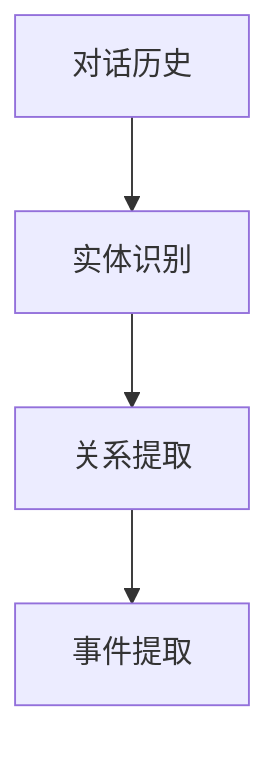
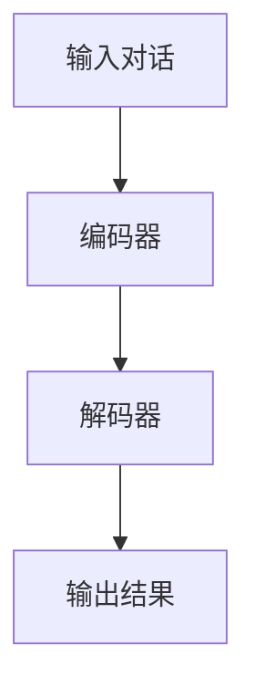
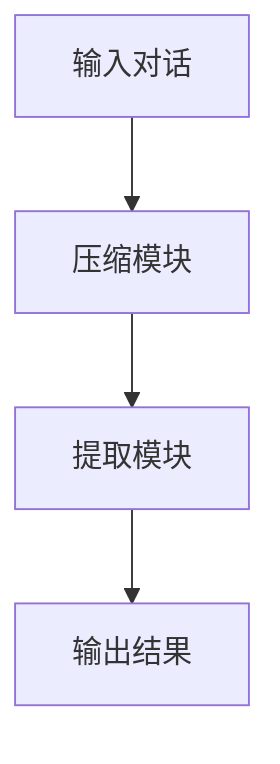

                 


# AI Agent的对话历史压缩与重要信息提取

## 关键词：AI Agent、对话历史压缩、重要信息提取、自然语言处理、算法优化

## 摘要：  
AI Agent在现代人机交互系统中扮演着越来越重要的角色，其对话历史的高效管理和信息提取能力直接影响用户体验和系统性能。随着对话数据的快速增长，如何有效地压缩对话历史并提取关键信息成为了一个亟待解决的问题。本文将从AI Agent的基本概念出发，详细探讨对话历史压缩与重要信息提取的核心原理、算法实现及系统设计。通过对多种算法的对比分析和实战案例的深入解读，为读者提供一个全面而系统的解决方案，帮助他们在实际项目中优化AI Agent的性能和用户体验。

---

## 第1章 AI Agent与对话历史压缩概述

### 1.1 AI Agent的基本概念

#### 1.1.1 AI Agent的定义与特点
AI Agent（人工智能代理）是一种能够感知环境、执行任务并进行人机交互的智能实体。它通过自然语言处理（NLP）技术理解和生成人类语言，能够在多种场景中提供智能化的服务。AI Agent的特点包括：

1. **智能性**：能够理解上下文并生成有意义的回复。
2. **交互性**：支持多轮对话，保持对话的连贯性。
3. **适应性**：能够根据用户反馈动态调整响应策略。
4. **高效性**：能够在较短的时间内处理大量信息并生成响应。

#### 1.1.2 对话历史压缩的背景与意义
随着AI Agent的应用场景越来越广泛（如智能客服、智能助手、智能聊天机器人等），对话历史数据的规模也在快速增长。然而，过长的对话历史不仅会占用大量存储资源，还会影响系统的处理效率。此外，冗长的对话历史可能导致信息重复或混乱，从而降低用户体验。因此，对话历史压缩成为一项重要的技术任务。

对话历史压缩的意义在于：

1. **降低存储成本**：通过压缩对话历史，减少存储空间的占用。
2. **提高处理效率**：压缩后的对话历史可以更快地被处理和分析。
3. **提升用户体验**：通过提取关键信息，为用户提供更精准的服务。

#### 1.1.3 信息提取在AI Agent中的作用
信息提取是从对话历史中抽取关键实体、关系和事件的过程。在AI Agent中，信息提取能够帮助系统快速理解对话内容，并基于提取的信息生成更智能的响应。例如，在医疗咨询场景中，提取患者的症状信息可以帮助AI Agent更快地生成诊断建议。

---

### 1.2 对话历史压缩的必要性

#### 1.2.1 对话数据膨胀的问题
随着AI Agent的应用普及，每天产生的对话数据呈指数级增长。例如，一个智能客服系统每天可能处理成千上万条对话记录。如果不进行压缩，这些数据将占用巨大的存储空间，并增加计算资源的消耗。

#### 1.2.2 对话历史压缩的目标与价值
对话历史压缩的目标是通过去除冗余信息，保留关键内容，从而减少数据量。压缩的价值体现在以下几个方面：

1. **提升系统性能**：减少数据处理时间，提高系统响应速度。
2. **降低存储成本**：通过压缩数据，减少存储空间的使用。
3. **增强数据安全性**：压缩后的数据更难被篡改或滥用。

#### 1.2.3 对话历史压缩的边界与外延
对话历史压缩的边界在于如何在压缩过程中保持信息的完整性。如果压缩过猛，可能导致关键信息丢失，影响系统性能。因此，压缩需要在减少数据量和保持信息完整性之间找到平衡点。

---

### 1.3 重要信息提取的核心要素

#### 1.3.1 信息提取的关键概念
信息提取是对话历史压缩的重要组成部分。它通过分析对话内容，提取出对后续任务有用的实体、关系和事件。例如，在电商场景中，提取用户的购买记录可以帮助AI Agent推荐相关商品。

#### 1.3.2 信息提取的特征对比
信息提取的关键特征包括：

1. **实体识别**：提取对话中的具体事物或概念（如人名、地点、时间等）。
2. **关系提取**：提取实体之间的关系（如“购买了”、“属于”等）。
3. **事件提取**：提取对话中发生的动作或事件（如“下单”、“退货”等）。

#### 1.3.3 信息提取的实体关系图
以下是信息提取的实体关系图：



通过实体关系图，我们可以清晰地看到信息提取的流程和各部分之间的关系。

---

## 第2章 对话历史压缩与信息提取的核心概念

### 2.1 对话历史压缩的原理

#### 2.1.1 基于相似度的压缩算法
基于相似度的压缩算法通过计算对话内容之间的相似性，去除重复或冗余的信息。常用的相似度计算方法包括余弦相似度和杰卡德相似度。

##### 余弦相似度计算公式
$$\text{余弦相似度} = \frac{\vec{A} \cdot \vec{B}}{|\vec{A}| |\vec{B}|}$$

##### 基于相似度的压缩流程
1. **计算对话内容之间的相似度**。
2. **识别相似度较高的对话片段**。
3. **去除冗余片段，保留关键信息**。

#### 2.1.2 基于重要性的压缩方法
基于重要性的压缩方法通过评估对话内容的重要性，优先保留关键信息。常用的评估指标包括TF-IDF（词频-逆文档频率）和BM25。

##### TF-IDF公式
$$\text{TF-IDF} = \text{TF} \times \text{IDF}$$

#### 2.1.3 压缩算法的优缺点对比
以下是对几种常见压缩算法的优缺点对比：

| 算法名称       | 优点                     | 缺点                     |
|----------------|--------------------------|--------------------------|
| 基于相似度的压缩 | 适用于内容相似的对话     | 可能丢失语义信息         |
| 基于重要性的压缩 | 保留关键信息             | 实现复杂度较高           |

---

### 2.2 重要信息提取的原理

#### 2.2.1 基于关键词提取的方法
基于关键词提取的方法通过预定义的关键词列表，从对话中提取出相关的信息。这种方法简单易实现，但可能漏掉一些重要的信息。

#### 2.2.2 基于语义理解的提取方法
基于语义理解的提取方法利用自然语言处理技术（如BERT、GPT）来理解对话的语义，并提取出关键信息。这种方法能够更好地捕捉对话的上下文关系，但实现复杂度较高。

#### 2.2.3 提取算法的数学模型
以下是一个基于BERT的信息提取模型的流程图：



---

### 2.3 对话历史压缩与信息提取的联系

#### 2.3.1 压缩与提取的关系
对话历史压缩与信息提取是相辅相成的。压缩可以减少数据量，提高提取效率；而提取可以指导压缩过程，确保关键信息不被丢失。

#### 2.3.2 压缩与提取的协同优化
通过协同优化，可以实现数据压缩和信息提取的双重目标。例如，先进行信息提取，再根据提取结果进行压缩，可以更好地保留关键信息。

#### 2.3.3 压缩与提取的系统架构图
以下是一个对话历史压缩与信息提取的系统架构图：



---

## 第3章 对话历史压缩与信息提取的算法原理

### 3.1 基于相似度的压缩算法

#### 3.1.1 余弦相似度计算
余弦相似度是衡量两个向量之间相似程度的重要指标。在对话压缩中，可以通过计算对话片段之间的余弦相似度，找出相似度较高的片段并进行合并。

#### 3.1.2 基于相似度的压缩流程
1. **计算对话片段之间的相似度**。
2. **识别相似度较高的片段**。
3. **合并相似片段，去除冗余信息**。

#### 3.1.3 算法实现代码示例
以下是一个基于余弦相似度的对话压缩算法的Python代码示例：

```python
import numpy as np

def cosine_similarity(vec1, vec2):
    return np.dot(vec1, vec2) / (np.linalg.norm(vec1) * np.linalg.norm(vec2))

# 示例对话向量
vec1 = np.array([1, 2, 3])
vec2 = np.array([2, 4, 6])

similarity = cosine_similarity(vec1, vec2)
print("余弦相似度为:", similarity)
```

---

### 3.2 基于重要性的提取算法

#### 3.2.1 TF-IDF方法
TF-IDF是一种常用的文本挖掘技术，通过计算词语在文档中的重要性，提取出关键信息。

#### 3.2.2 基于深度学习的提取方法
基于深度学习的提取方法（如BERT、GPT）能够更好地捕捉对话的语义信息，提取出更准确的关键信息。

#### 3.2.3 算法实现代码示例
以下是一个基于TF-IDF的关键词提取算法的Python代码示例：

```python
from sklearn.feature_extraction.text import TfidfVectorizer

# 示例文本
text = "The quick brown fox jumps over the lazy dog."

vectorizer = TfidfVectorizer()
tfidf = vectorizer.fit_transform([text])
print(vectorizer.get_feature_names_out())
```

---

### 3.3 算法的数学模型与公式

#### 3.3.1 余弦相似度公式
$$\text{余弦相似度} = \frac{\vec{A} \cdot \vec{B}}{|\vec{A}| |\vec{B}|}$$

#### 3.3.2 TF-IDF公式
$$\text{TF-IDF} = \text{TF} \times \text{IDF}$$

---

## 第4章 对话历史压缩与信息提取的系统分析

### 4.1 系统功能设计

#### 4.1.1 领域模型设计
领域模型是系统功能设计的核心部分。它通过定义系统的功能模块和它们之间的关系，帮助我们更好地理解系统的整体结构。

#### 4.1.2 功能模块划分
功能模块划分是系统设计的重要步骤。常见的功能模块包括对话压缩模块、信息提取模块和结果输出模块。

#### 4.1.3 系统功能流程图
以下是一个系统的功能流程图：


---

### 4.2 系统架构设计

#### 4.2.1 分层架构图
分层架构是一种常见的系统架构设计方法。它将系统划分为多个层次，每个层次负责不同的功能。

#### 4.2.2 组件交互关系
组件交互关系是系统架构设计中的重要部分。它定义了系统中各组件之间的交互方式和数据流。

#### 4.2.3 系统架构代码示例
以下是一个简单的系统架构代码示例：

```python
class CompressModule:
    def compress(self, text):
        pass

class ExtractModule:
    def extract(self, text):
        pass

class System:
    def __init__(self):
        self.compress_module = CompressModule()
        self.extract_module = ExtractModule()

    def process(self, text):
        compressed = self.compress_module.compress(text)
        extracted = self.extract_module.extract(compressed)
        return extracted
```

---

### 4.3 系统接口设计

#### 4.3.1 API接口定义
API接口是系统与外部交互的重要桥梁。常见的API接口包括对话压缩接口和信息提取接口。

#### 4.3.2 接口交互流程
接口交互流程是系统设计中的重要部分。它定义了系统如何通过接口与外部系统进行交互。

#### 4.3.3 接口实现代码示例
以下是一个API接口的实现代码示例：

```python
class API:
    def compress(self, text):
        pass

    def extract(self, text):
        pass
```

---

## 第5章 对话历史压缩与信息提取的项目实战

### 5.1 环境安装与配置

#### 5.1.1 开发环境搭建
开发环境的搭建是项目实施的基础。常见的开发环境包括Python、Jupyter Notebook和IDE（如PyCharm）。

#### 5.1.2 依赖库安装
在项目中，我们需要安装一些常用的依赖库，如NLTK、Spacy和Scikit-learn。

#### 5.1.3 环境配置示例
以下是一个环境配置的示例：

```bash
pip install numpy
pip install scikit-learn
pip install spacy
```

---

### 5.2 核心代码实现

#### 5.2.1 对话历史压缩算法实现
以下是一个基于余弦相似度的对话压缩算法的实现代码：

```python
import numpy as np

def cosine_similarity(vec1, vec2):
    return np.dot(vec1, vec2) / (np.linalg.norm(vec1) * np.linalg.norm(vec2))

def compress_dialogue(dialogue):
    compressed_dialogue = []
    for i in range(len(dialogue)):
        for j in range(i+1, len(dialogue)):
            if cosine_similarity(dialogue[i], dialogue[j]) > 0.8:
                compressed_dialogue.append(dialogue[i])
                break
    return compressed_dialogue
```

#### 5.2.2 重要信息提取算法实现
以下是一个基于TF-IDF的关键词提取算法的实现代码：

```python
from sklearn.feature_extraction.text import TfidfVectorizer

def extract_keywords(dialogue):
    vectorizer = TfidfVectorizer()
    tfidf = vectorizer.fit_transform([dialogue])
    feature_names = vectorizer.get_feature_names_out()
    return feature_names
```

#### 5.2.3 系统功能实现代码
以下是一个完整的系统功能实现代码：

```python
class CompressModule:
    def compress(self, dialogue):
        compressed = []
        for i in range(len(dialogue)):
            for j in range(i+1, len(dialogue)):
                if self._calculate_similarity(dialogue[i], dialogue[j]) > 0.8:
                    compressed.append(dialogue[i])
                    break
        return compressed

    def _calculate_similarity(self, vec1, vec2):
        return np.dot(vec1, vec2) / (np.linalg.norm(vec1) * np.linalg.norm(vec2))

class ExtractModule:
    def extract(self, compressed_dialogue):
        vectorizer = TfidfVectorizer()
        tfidf = vectorizer.fit_transform(compressed_dialogue)
        feature_names = vectorizer.get_feature_names_out()
        return feature_names

class System:
    def __init__(self):
        self.compress_module = CompressModule()
        self.extract_module = ExtractModule()

    def process(self, dialogue):
        compressed = self.compress_module.compress(dialogue)
        extracted = self.extract_module.extract(compressed)
        return extracted
```

---

### 5.3 项目测试与优化

#### 5.3.1 测试方案设计
测试方案设计是项目实施的重要步骤。常见的测试方法包括单元测试、集成测试和性能测试。

#### 5.3.2 测试结果分析
通过测试结果分析，我们可以评估算法的性能和效果。例如，可以通过准确率、召回率和F1值来评估信息提取的效果。

#### 5.3.3 优化建议
根据测试结果，我们可以对算法进行优化。例如，调整相似度阈值或改进算法模型。

---

## 第6章 总结与展望

### 6.1 总结
通过对AI Agent的对话历史压缩与重要信息提取的系统性研究，我们可以看到，对话历史压缩和信息提取是实现高效人机交互的重要技术。本文详细探讨了对话历史压缩的必要性、核心概念、算法原理和系统设计，并通过实战案例展示了如何在实际项目中应用这些技术。

### 6.2 展望
未来的研究方向包括：

1. **更高效的压缩算法**：研究更高效的压缩算法，进一步减少数据量。
2. **更智能的信息提取技术**：利用更先进的自然语言处理技术，提高信息提取的准确性。
3. **多模态对话压缩**：结合图像、语音等多种模态信息，实现更智能的对话压缩。

---

通过本文的学习和实践，读者可以更好地理解AI Agent的对话历史压缩与重要信息提取的核心技术，并能够在实际项目中应用这些技术，优化系统的性能和用户体验。

