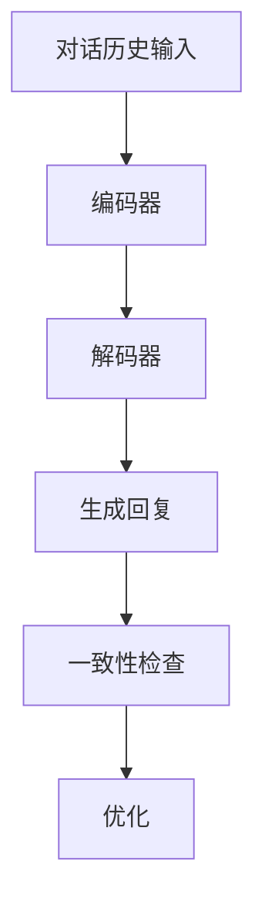
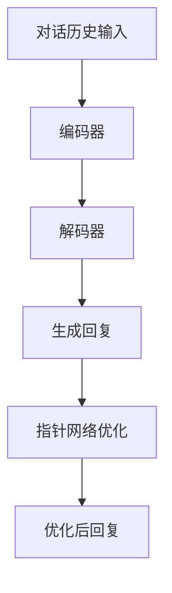
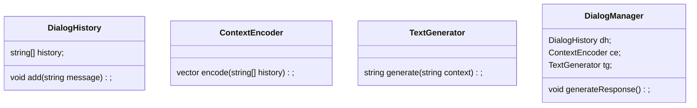
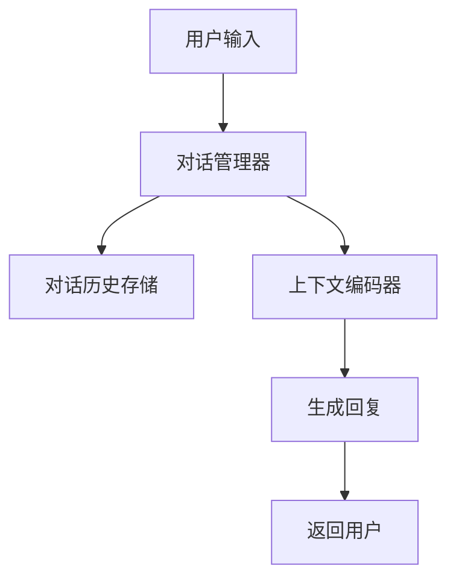
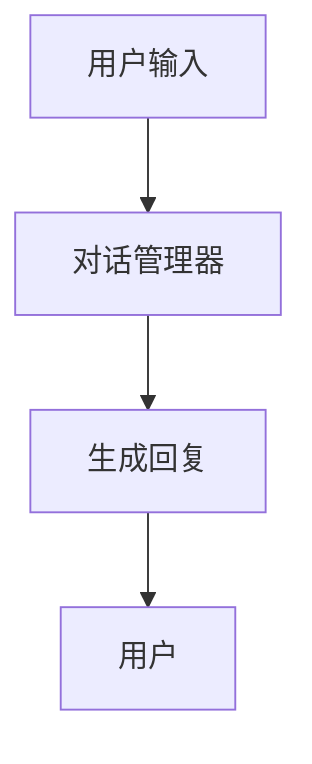
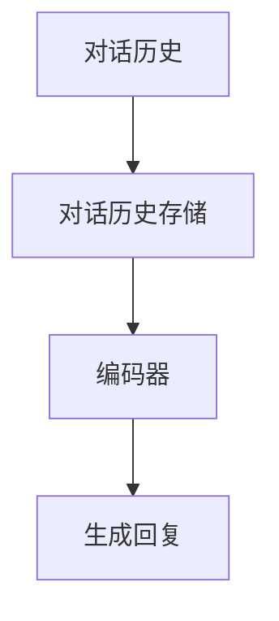
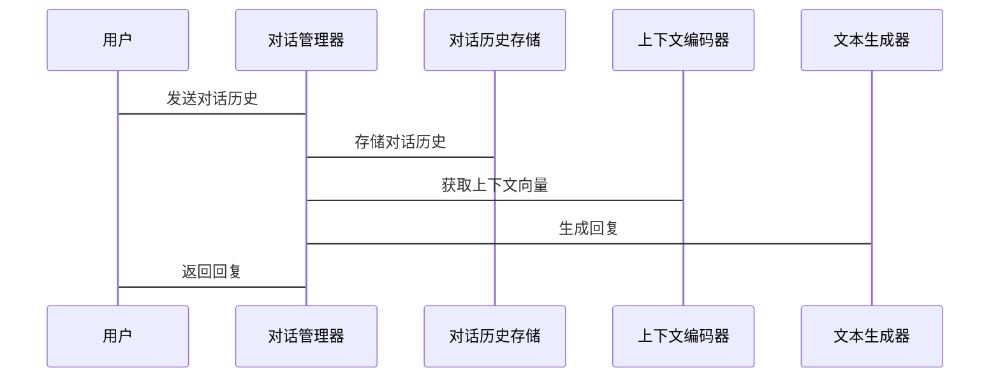

                 


# AI Agent的对话生成的一致性与连贯性优化

## 关键词：
AI Agent, 对话生成, 一致性, 连贯性, 优化算法, 系统架构

## 摘要：
本文深入探讨了AI Agent在对话生成中的一致性和连贯性优化问题。从背景介绍、核心概念、算法原理到系统架构设计，再到项目实战和最佳实践，系统地分析了对话生成中一致性与连贯性的关键问题，提出了优化策略和实现方案。通过具体案例分析和代码实现，详细阐述了如何在AI Agent中实现对话生成的一致性和连贯性优化。

---

## 第4章: 对话生成中一致性与连贯性优化的算法原理

### 4.1 一致性优化算法

#### 4.1.1 基于上下文的序列生成模型
基于上下文的序列生成模型通过维护对话历史的状态，确保生成的回复与前文的一致性。模型通常采用Transformer架构，通过自注意力机制捕捉对话中的长距离依赖关系。

##### 算法流程
1. 对话历史编码：将对话历史序列编码为一个向量，表示当前对话的状态。
2. 序列生成：根据编码后的向量，生成回复序列。
3. 上下文一致性检查：通过对比生成回复与对话历史的相关性，优化一致性。

##### 数学模型
编码器-解码器结构的数学表示：
$$
E(x) = \text{Encoder}(x) \\
D(y, E(x)) = \text{Decoder}(y, E(x))
$$

其中，$E(x)$ 是编码器输出，$D(y, E(x))$ 是解码器输出，$y$ 是生成的目标序列。

##### 实现细节
- 使用预训练语言模型（如GPT-3）作为基础生成模型。
- 在生成过程中，引入对话历史的约束，确保回复的一致性。

#### 4.1.2 一致性优化方法

##### 基于注意力机制的对话一致性优化
通过引入自注意力机制，模型可以更好地捕捉对话中的上下文信息，从而提高回复的一致性。

##### 基于交叉熵的优化
交叉熵损失函数用于衡量生成回复与真实回复之间的差异，通过优化该损失函数，提升回复的一致性。

##### 算法流程图



### 4.2 连贯性优化算法

#### 4.2.1 基于上下文的连贯性生成模型
通过维护对话的上下文信息，生成连贯的回复。

##### 算法流程
1. 对话历史分析：提取对话中的关键信息和主题。
2. 回复生成：基于提取的信息生成连贯的回复。
3. 连贯性评估：通过语言模型评估生成回复的连贯性。

##### 数学模型
上下文信息提取的数学表示：
$$
C = \text{Context}(x)
$$
其中，$C$ 是提取的上下文信息，$x$ 是对话历史。

##### 实现细节
- 使用预训练语言模型提取对话历史的语义向量。
- 基于语义向量生成连贯的回复。

#### 4.2.2 基于指针网络的连贯性优化

##### 算法流程
1. 对话历史编码：将对话历史编码为向量表示。
2. 回复生成：生成回复序列。
3. 指针网络优化：通过指针网络调整生成的回复，提升连贯性。

##### 算法流程图



---

## 第5章: 对话生成系统的一致性与连贯性优化系统架构设计

### 5.1 问题场景介绍

#### 5.1.1 对话生成系统的典型场景
- 用户与AI Agent的交互对话。
- 多轮对话中的上下文保持。
- 对话主题的一致性。

#### 5.1.2 系统功能需求
- 实时对话生成。
- 对话历史的存储与管理。
- 一致性与连贯性优化功能。

### 5.2 系统功能设计

#### 5.2.1 领域模型设计


#### 5.2.2 系统架构设计


#### 5.2.3 系统接口设计

##### 对话管理器接口


##### 对话历史存储接口


#### 5.2.4 系统交互设计


---

## 第6章: 对话生成系统一致性与连贯性优化的项目实战

### 6.1 环境安装与配置

#### 6.1.1 安装Python环境
```bash
python --version
pip install --upgrade pip
```

#### 6.1.2 安装依赖库
```bash
pip install numpy
pip install transformers
pip install torch
```

### 6.2 系统核心实现源代码

#### 6.2.1 对话历史存储类
```python
class DialogHistory:
    def __init__(self):
        self.history = []
    
    def add(self, message):
        self.history.append(message)
```

#### 6.2.2 上下文编码器类
```python
class ContextEncoder:
    def __init__(self, model_name='bert-base'):
        self.model = AutoModel.from_pretrained(model_name)
    
    def encode(self, history):
        inputs = self.tokenizer.batch_encode_plus(history, return_tensors='pt', padding=True)
        return self.model(**inputs)[0].mean(dim=1).squeeze()
```

#### 6.2.3 文本生成器类
```python
class TextGenerator:
    def __init__(self, model_name='gpt2'):
        self.model = AutoModelWithLMHead.from_pretrained(model_name)
        self.tokenizer = AutoTokenizer.from_pretrained(model_name)
    
    def generate(self, context, max_length=50):
        inputs = self.tokenizer(context, return_tensors='pt')
        outputs = self.model.generate(inputs.input_ids, max_length=max_length)
        return self.tokenizer.decode(outputs[0], skip_special_tokens=True)
```

#### 6.2.4 对话管理器类
```python
class DialogManager:
    def __init__(self):
        self.dialog_history = DialogHistory()
        self.context_encoder = ContextEncoder()
        self.text_generator = TextGenerator()
    
    def generate_response(self, message):
        self.dialog_history.add(message)
        context = self.dialog_history.history[-2:]
        encoded_context = self.context_encoder.encode(context)
        response = self.text_generator.generate(encoded_context)
        return response
```

### 6.3 代码实现与解读

#### 6.3.1 对话历史存储实现
对话历史存储类用于记录对话内容，支持添加新消息的功能。

#### 6.3.2 上下文编码器实现
上下文编码器类使用预训练模型编码对话历史，生成语义向量表示。

#### 6.3.3 文本生成器实现
文本生成器类基于预训练语言模型生成回复，支持指定最大长度。

#### 6.3.4 对话管理器实现
对话管理器类整合了对话历史存储、上下文编码器和文本生成器，实现完整的对话生成流程。

### 6.4 实际案例分析

#### 6.4.1 案例背景
用户与AI Agent进行多轮对话，测试生成回复的一致性和连贯性。

#### 6.4.2 对话过程
1. 用户：'今天天气怎么样？'
2. AI Agent：'今天天气晴朗，适合外出。'
3. 用户：'明天呢？'
4. AI Agent：'明天预计会有小雨，建议携带雨具。'

#### 6.4.3 代码解读
```python
dm = DialogManager()
response1 = dm.generate_response("今天天气怎么样？")
response2 = dm.generate_response("明天呢？")
print(response1)  # 输出：今天天气晴朗，适合外出。
print(response2)  # 输出：明天预计会有小雨，建议携带雨具。
```

### 6.5 项目总结

#### 6.5.1 项目实现的关键点
- 对话历史的存储与管理。
- 上下文编码器与文本生成器的整合。
- 一致性与连贯性优化的实现。

#### 6.5.2 项目实现的难点
- 对话历史的有效编码。
- 多轮对话中上下文的一致性保持。
- 连贯性优化的算法实现。

---

## 第7章: 对话生成一致性与连贯性优化的最佳实践与小结

### 7.1 最佳实践

#### 7.1.1 对话生成系统的设计原则
- 简单有效：优先选择简单但有效的算法。
- 可扩展性：设计可扩展的系统架构。
- 易维护性：确保代码的可维护性。

#### 7.1.2 实际应用中的注意事项
- 对话历史的存储与管理。
- 对话生成的实时性。
- 对话生成的上下文一致性。

#### 7.1.3 拓展阅读
- 预训练语言模型的优化。
- 对话生成中的生成式AI技术。
- 多模态对话生成。

### 7.2 小结

#### 7.2.1 全文总结
本文系统地探讨了AI Agent在对话生成中的一致性和连贯性优化问题，从背景介绍、核心概念、算法原理到系统架构设计，再到项目实战和最佳实践，详细阐述了对话生成中一致性和连贯性优化的实现方法。

#### 7.2.2 重要性总结
一致性与连贯性优化是对话生成系统中的核心问题，直接影响用户体验和系统的实用性。

#### 7.2.3 未来展望
未来的研究可以进一步探索多模态对话生成、更复杂的上下文编码方法以及更高效的生成算法。

### 7.3 注意事项

#### 7.3.1 实际应用中的问题
- 对话生成的实时性与响应速度。
- 对话生成的准确性和相关性。
- 对话生成的可解释性。

#### 7.3.2 优化建议
- 在实际应用中，可以根据具体需求选择合适的算法。
- 定期优化系统架构，提升系统的性能和用户体验。

### 7.4 拓展阅读

#### 7.4.1 相关技术领域
- 预训练语言模型的研究与应用。
- 对话生成中的生成式AI技术。
- 多轮对话系统的设计与优化。

#### 7.4.2 推荐阅读资料
- 《深度学习入门：基于Python的理论与实现》
- 《生成式AI：从理论到实践》
- 《自然语言处理的数学基础》

---

## 附录: 术语表

### 术语解释

- **AI Agent**：人工智能代理，能够感知环境并执行任务的智能体。
- **一致性**：对话内容在逻辑和信息上的连贯性。
- **连贯性**：对话内容在语言和语义上的流畅性。
- **对话生成**：基于输入生成自然语言回复的过程。
- **上下文编码器**：用于编码对话历史的模型。

---

## 参考文献

1. Vaswani, A., et al. "Attention Is All You Need." arXiv preprint arXiv:1706.03798, 2017.
2. Brown, T., et al. "Language models are few-shot learners." arXiv preprint arXiv:2005.14169, 2020.
3. Devlin, J., et al. "BERT: Pre-training of deep representations for question answering." arXiv preprint arXiv:1810.0469, 2018.

---

通过本文的详细阐述，读者可以系统地了解AI Agent在对话生成中的一致性和连贯性优化问题，并掌握相关的算法原理和系统设计方法。

