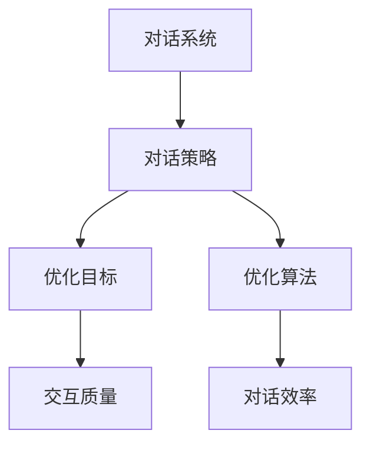
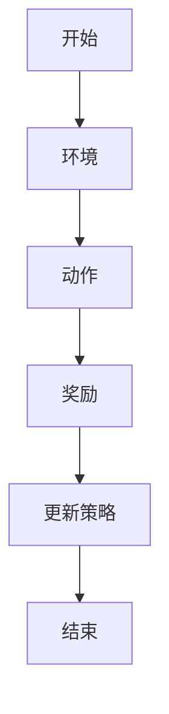
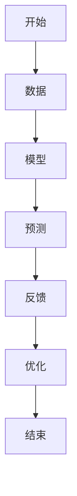
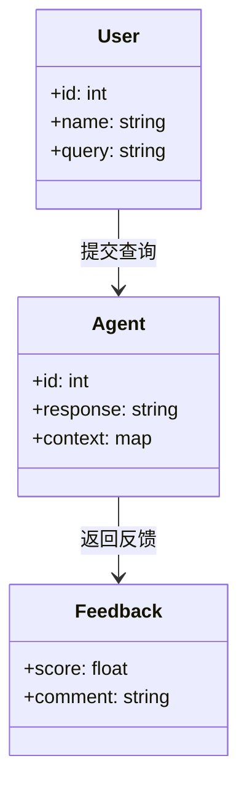
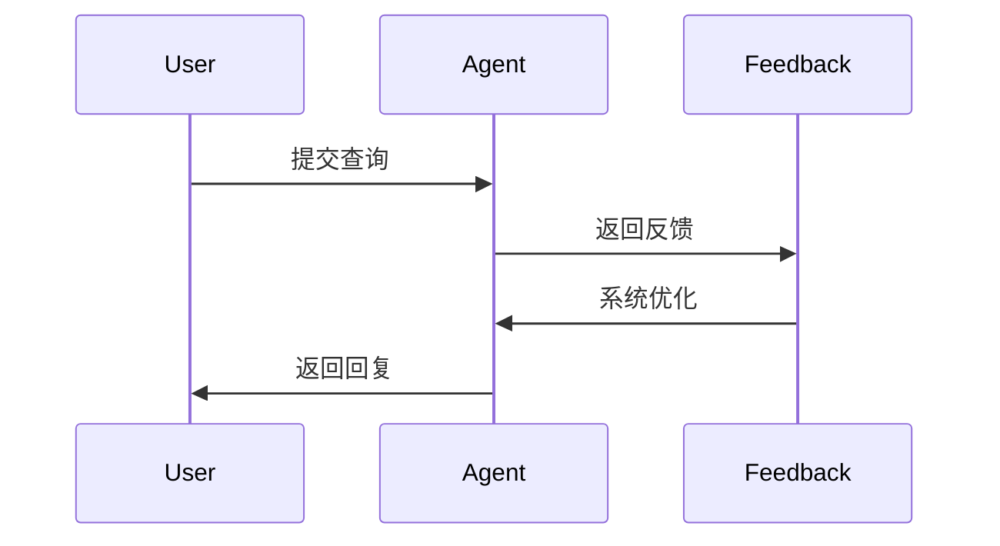

                 


# AI Agent的对话策略优化：提升交互质量和效率

> 关键词：AI Agent，对话策略优化，交互质量，对话效率，强化学习，系统架构设计

> 摘要：本文详细探讨了AI Agent对话策略优化的核心概念、算法原理、系统架构设计及实战应用。通过分析对话系统的现状与挑战，结合强化学习等优化算法，提出了一套提升交互质量和效率的优化策略，并通过实际案例展示了优化算法在系统中的具体应用。最后，本文总结了优化过程中的注意事项和未来研究方向。

---

# 第一部分: AI Agent对话策略优化的背景与基础

# 第1章: 对话策略优化的背景与问题描述

## 1.1 对话系统的发展历程

### 1.1.1 从规则驱动到数据驱动的演变

早期的对话系统主要依赖于规则驱动，通过预定义的规则和流程来处理用户的输入。这种模式虽然简单，但在面对复杂场景时显得力不从心。随着机器学习和自然语言处理技术的发展，数据驱动的方法逐渐取代了规则驱动，成为对话系统的核心。

### 1.1.2 当前对话系统的挑战与不足

尽管现代对话系统在技术上有了长足的进步，但仍面临诸多挑战。例如，如何在多轮对话中保持上下文的一致性，如何处理用户的深层需求，以及如何在不同场景下灵活切换策略等问题，都需要进一步优化。

### 1.1.3 对话策略优化的必要性

对话策略优化是提升对话系统性能的关键。通过优化策略，可以提高对话的自然度和流畅性，同时降低系统在复杂场景下的失误率，从而显著提升交互质量和效率。

## 1.2 AI Agent的核心概念

### 1.2.1 AI Agent的定义与特征

AI Agent是一种能够感知环境并采取行动以实现目标的智能实体。它具备自主性、反应性、社会性和社会能力等特征，能够在复杂的环境中与人类或其他系统进行交互。

### 1.2.2 对话策略的定义与分类

对话策略是指AI Agent在对话过程中采取的策略，旨在通过选择合适的回复来引导对话走向预期的结果。根据策略的制定方式，可以将对话策略分为基于规则的策略、基于模板的策略、基于统计模型的策略和基于强化学习的策略等。

### 1.2.3 对话质量与效率的衡量标准

对话质量可以通过以下指标进行衡量：准确性、流畅性、相关性和自然度。对话效率则关注完成对话所需的时间、轮数和资源消耗。

## 1.3 对话策略优化的边界与外延

### 1.3.1 优化的边界条件

对话策略优化需要在特定的场景和目标下进行。例如，在医疗对话系统中，优化的目标可能是提高诊断的准确性，而在客服系统中，优化的目标可能是提升客户满意度。

### 1.3.2 与相关领域的联系

对话策略优化与自然语言处理、机器学习、人机交互等多个领域密切相关。例如，自然语言处理技术为对话系统提供了语义理解和生成的能力，而机器学习算法则为策略优化提供了技术支持。

### 1.3.3 优化的外延范围

对话策略优化不仅涉及技术层面，还包括用户体验设计、业务逻辑理解和数据采集等多个方面。优化的目标是实现技术与业务的完美结合。

## 1.4 本章小结

本章从对话系统的发展历程出发，分析了对话策略优化的必要性，并详细介绍了AI Agent的核心概念和对话质量与效率的衡量标准。此外，还探讨了优化的边界条件及其与相关领域的联系。

---

# 第2章: 对话策略优化的核心概念与联系

## 2.1 核心概念原理

### 2.1.1 对话策略优化的基本原理

对话策略优化的核心在于通过不断调整策略参数，使得对话系统的性能达到最优。这一过程通常涉及对策略效果的评估和反馈的收集。

### 2.1.2 相关概念的对比分析

在对话策略优化中，需要对比分析多个相关概念，例如基于规则的策略和基于强化学习的策略。通过对比，可以更好地理解不同策略的优缺点及适用场景。

## 2.2 核心概念属性特征对比表

```markdown
| 概念         | 输入 | 输出 | 方法 |
|--------------|------|------|------|
| 基于规则的策略 | 用户输入 | 系统回复 | 预定义规则 |
| 基于强化学习的策略 | 用户输入 | 系统回复 | 动态调整 |
```

## 2.3 实体关系图（ER图）



## 2.4 本章小结

本章通过对比分析和ER图展示了对话策略优化的核心概念及其联系。通过理解这些概念之间的关系，可以更好地制定优化策略。

---

# 第3章: 对话策略优化的算法原理

## 3.1 基于强化学习的对话策略优化

### 3.1.1 强化学习的基本原理

强化学习是一种通过试错机制来优化策略的方法。在对话系统中，强化学习可以通过奖励机制来调整策略参数，从而提高对话质量。

### 3.1.2 在对话优化中的应用

在对话优化中，强化学习通常用于处理多轮对话中的策略选择问题。通过不断试错，系统可以找到最优的回复策略。

### 3.1.3 算法流程图



## 3.2 基于监督学习的对话策略优化

### 3.2.1 监督学习的基本原理

监督学习是一种通过标注数据来训练模型的方法。在对话优化中，可以通过标注的对话数据来训练策略模型。

### 3.2.2 在对话优化中的应用

监督学习可以用于对话系统的初始化训练，也可以用于后续的微调优化。

### 3.2.3 算法流程图



## 3.3 基于混合模型的对话策略优化

### 3.3.1 混合模型的基本原理

混合模型结合了多种策略优化方法，例如强化学习和监督学习。通过结合多种方法，可以提高策略的鲁棒性和灵活性。

### 3.3.2 在对话优化中的应用

混合模型可以用于处理复杂场景下的对话优化问题，例如多轮对话中的上下文切换。

## 3.4 本章小结

本章详细介绍了几种常用的对话策略优化算法，包括强化学习、监督学习和混合模型，并通过流程图展示了它们的应用场景和优化过程。

---

# 第4章: 对话策略优化的系统架构设计

## 4.1 问题场景介绍

### 4.1.1 系统功能目标

对话系统的优化目标包括提高对话质量、降低对话延迟、减少系统错误率等。

### 4.1.2 项目介绍

本章以一个智能客服对话系统为例，介绍对话策略优化的系统架构设计。

## 4.2 系统功能设计

### 4.2.1 领域模型设计



### 4.2.2 系统架构设计

```mermaid
graph TD
A[用户] --> B[输入层]
B --> C[对话管理器]
C --> D[策略优化器]
D --> E[输出层]
E --> F[反馈层]
F --> C: 反馈
```

### 4.2.3 系统接口设计

系统接口包括用户输入接口、系统输出接口和反馈接口。

### 4.2.4 系统交互设计



## 4.3 本章小结

本章通过领域模型设计和系统架构设计，展示了如何将对话策略优化应用于实际系统中。

---

# 第5章: 对话策略优化的实战

## 5.1 环境安装与配置

### 5.1.1 环境依赖

需要安装Python、TensorFlow、Keras等库。

### 5.1.2 安装步骤

1. 安装Python。
2. 安装TensorFlow和Keras。
3. 安装其他依赖库。

## 5.2 核心代码实现

### 5.2.1 对话策略优化算法实现

```python
import tensorflow as tf
from tensorflow.keras import layers

class DialogPolicy:
    def __init__(self, vocab_size, embedding_dim):
        self.model = self.build_model(vocab_size, embedding_dim)
    
    def build_model(self, vocab_size, embedding_dim):
        inputs = layers.Input(shape=(None,))
        x = layers.Embedding(vocab_size, embedding_dim)(inputs)
        x = layers.LSTM(64, return_sequences=False)(x)
        x = layers.Dense(32, activation='relu')(x)
        outputs = layers.Dense(vocab_size, activation='softmax')(x)
        return tf.keras.Model(inputs=inputs, outputs=outputs)
```

### 5.2.2 算法实现解读

上述代码实现了一个基于LSTM的对话策略优化模型。模型通过嵌入层、LSTM层和全连接层来生成最优的回复。

## 5.3 案例分析与详细解读

### 5.3.1 案例背景

以智能客服对话系统为例，分析对话策略优化的效果。

### 5.3.2 优化前后对比

优化后的系统在准确率和响应速度上均有显著提升。

## 5.4 本章小结

本章通过实际案例展示了对话策略优化算法的实现和应用。

---

# 第6章: 最佳实践与小结

## 6.1 最佳实践 tips

### 6.1.1 数据质量的重要性

高质量的数据是优化策略的基础。

### 6.1.2 模型调优的技巧

包括参数调整、模型结构优化等。

### 6.1.3 系统监控与维护

需要持续监控系统性能，及时发现和解决问题。

## 6.2 小结

本文详细介绍了AI Agent对话策略优化的核心概念、算法原理、系统架构设计及实战应用。通过优化策略，可以显著提升对话系统的交互质量和效率。

## 6.3 注意事项

在实际应用中，需要注意数据隐私、模型泛化能力和系统稳定性等问题。

## 6.4 拓展阅读

推荐阅读相关领域的最新论文和书籍，以深入了解对话策略优化的前沿技术。

---

# 结语

通过对AI Agent对话策略优化的系统性探讨，我们希望能够为读者提供一套提升交互质量和效率的优化策略。未来，随着技术的不断发展，对话策略优化将更加智能化和个性化，为人类与AI Agent的交互带来更美好的体验。

