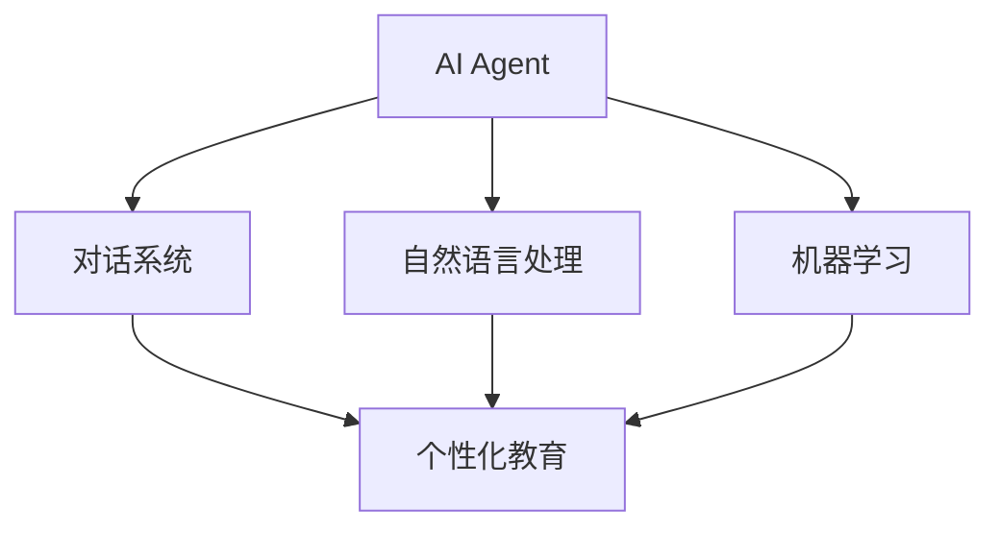
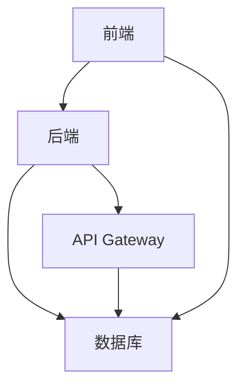

                 


```markdown
# AI Agent的对话系统在个性化教育中的应用

> 关键词：AI Agent，对话系统，个性化教育，自然语言处理，机器学习

> 摘要：本文详细探讨了AI Agent在个性化教育中的对话系统的应用，分析了其背后的技术原理、系统架构以及实际案例，为教育领域的智能化发展提供了新的思路。

---

## 第一部分: AI Agent的对话系统概述

### 第1章: AI Agent与对话系统基础

#### 1.1 AI Agent的基本概念
- **1.1.1 AI Agent的定义与特点**
  - AI Agent的定义：智能体（AI Agent）是指在计算机系统中，能够感知环境并采取行动以实现目标的实体。
  - 特点：自主性、反应性、目标导向、社交能力。

- **1.1.2 对话系统的定义与分类**
  - 对话系统的定义：通过自然语言处理技术，实现人与计算机之间的交互。
  - 分类：基于规则的对话系统、统计模型对话系统、端到端模型对话系统。

- **1.1.3 个性化教育的需求与现状**
  - 个性化教育的核心目标：因材施教，满足不同学生的学习需求。
  - 现状：传统教育模式难以实现真正的个性化，技术驱动的解决方案成为趋势。

#### 1.2 对话系统的工作原理
- **1.2.1 自然语言处理基础**
  - 词法分析：分词、词性标注。
  - 句法分析：语法树构建。
  - 意义理解：语义解析。

- **1.2.2 对话系统的流程**
  - 用户输入：自然语言查询。
  - 系统理解：解析用户意图。
  - 系统响应：生成回答并反馈给用户。

- **1.2.3 个性化教育中的对话系统特点**
  - 适应性：根据学生特点调整对话内容。
  - 持续性：长期跟踪学生学习进度。
  - 智能性：通过机器学习不断优化对话策略。

#### 1.3 个性化教育的现状与挑战
- **1.3.1 传统教育模式的局限性**
  - 教学资源分配不均。
  - 教学方式单一。

- **1.3.2 个性化教育的核心目标**
  - 提供个性化学习路径。
  - 优化学习效果。
  - 提高学习效率。

- **1.3.3 当前技术在教育中的应用瓶颈**
  - 数据隐私问题。
  - 系统可解释性不足。
  - 模型泛化能力有限。

### 第2章: 对话系统的自然语言处理基础

#### 2.1 自然语言处理的核心技术
- **2.1.1 词法分析**
  - 分词：将连续文本分割成词语。
  - 词性标注：确定每个词语的词性。

- **2.1.2 句法分析**
  - 语法树构建：分析句子的结构。
  - 命名实体识别：识别专有名词。

- **2.1.3 意义理解**
  - 语义解析：理解文本的深层含义。
  - 情感分析：识别文本的情感倾向。

#### 2.2 机器学习在对话系统中的应用
- **2.2.1 监督学习与无监督学习**
  - 监督学习：基于标记数据进行训练。
  - 无监督学习：从无标记数据中发现模式。

- **2.2.2 深度学习模型的引入**
  - RNN（循环神经网络）：处理序列数据。
  - LSTM（长短期记忆网络）：解决梯度消失问题。
  - Transformer：提升并行计算能力。

- **2.2.3 现代对话系统的演变**
  - 从基于规则到基于模型的转变。
  - 多轮对话能力的增强。
  - 模型压缩与轻量化。

#### 2.3 对话系统的训练与优化
- **2.3.1 数据预处理**
  - 文本清洗：去除噪声。
  - 分割训练集、验证集和测试集。

- **2.3.2 模型训练**
  - 确定损失函数：交叉熵损失。
  - 选择优化器：Adam优化器。
  - 设置超参数：学习率、批量大小。

- **2.3.3 模型调优与评估**
  - 调整模型结构：增加层数、改变隐藏层大小。
  - 使用验证集评估模型性能。
  - 应用交叉验证防止过拟合。

---

## 第三部分: AI Agent对话系统的应用

### 第3章: 对话系统的个性化推荐算法

#### 3.1 个性化推荐的核心原理
- **3.1.1 基于内容的推荐**
  - 基于文本相似度的推荐。
  - 基于知识图谱的推荐。

- **3.1.2 基于协同过滤的推荐**
  - 基于用户的协同过滤。
  - 基于物品的协同过滤。

- **3.1.3 混合推荐策略**
  - 组合多种推荐算法。
  - 动态调整推荐权重。

#### 3.2 对话系统的个性化特征提取
- **3.2.1 用户画像构建**
  - 收集用户基本信息。
  - 分析用户行为数据。
  - 建立用户画像模型。

- **3.2.2 上下文信息的处理**
  - 时间、地点、情境等信息的整合。
  - 上下文表示的学习。

- **3.2.3 动态个性化调整**
  - 实时更新用户画像。
  - 根据反馈调整推荐策略。

#### 3.3 对话系统的推荐模型实现
- **3.3.1 模型选择与设计**
  - 选择合适的推荐算法。
  - 设计模型的输入输出结构。
  - 确定模型的训练目标。

- **3.3.2 模型训练与测试**
  - 使用训练数据训练模型。
  - 通过验证集调整模型参数。
  - 测试集评估模型性能。

- **3.3.3 模型部署与优化**
  - 将模型部署到实际系统中。
  - 监控模型的运行状态。
  - 根据反馈优化模型。

### 第4章: 个性化教育中的对话系统应用案例

#### 4.1 项目背景与目标
- **4.1.1 项目背景**
  - 教育领域的智能化需求。
  - 个性化教育的市场潜力。

- **4.1.2 项目目标**
  - 提供个性化的学习指导。
  - 优化学生的学习体验。
  - 提高教学效率。

#### 4.2 系统设计与实现
- **4.2.1 系统功能设计**
  - 学生信息收集模块。
  - 学习计划制定模块。
  - 个性化对话模块。

- **4.2.2 系统架构设计**
  - 前端：用户界面。
  - 后端：业务逻辑处理。
  - 数据库：存储用户数据和学习记录。

- **4.2.3 系统实现**
  - 选择合适的技术栈。
  - 编写核心功能模块的代码。
  - 测试系统功能。

#### 4.3 实际应用与效果分析
- **4.3.1 应用场景**
  - 在线教育平台。
  - 校园学习辅助系统。

- **4.3.2 应用效果**
  - 学生学习效率提升。
  - 教师教学效果优化。
  - 平台用户活跃度增加。

### 第5章: 系统优化与未来展望

#### 5.1 系统优化策略
- **5.1.1 技术优化**
  - 提升模型的训练效率。
  - 优化对话系统的响应速度。
  - 增强系统的可解释性。

- **5.1.2 产品优化**
  - 提升用户体验。
  - 增加功能模块。
  - 优化界面设计。

#### 5.2 未来展望
- **5.2.1 技术发展**
  - 更先进的自然语言处理模型。
  - 新型的人工智能算法。
  - 跨平台的应用场景。

- **5.2.2 教育领域的应用潜力**
  - 更广泛的应用场景。
  - 更深入的个性化学习。
  - 更高效的教学方式。

---

## 第四部分: 总结与展望

### 第6章: 总结与展望

#### 6.1 最佳实践
- **6.1.1 技术实现**
  - 选择合适的算法和模型。
  - 注重系统的可扩展性。
  - 保证系统的稳定性和安全性。

- **6.1.2 应用推广**
  - 提供易于使用的界面。
  - 提供完善的用户支持。
  - 不断收集反馈并优化系统。

#### 6.2 小结
- AI Agent的对话系统在个性化教育中的应用前景广阔。
- 通过不断的技术创新和产品优化，可以实现更高效的个性化教育。

#### 6.3 注意事项
- 数据隐私保护的重要性。
- 系统的可解释性要求。
- 模型的泛化能力。

#### 6.4 拓展阅读
- 推荐相关技术书籍和论文。
- 提供学习资源和社区支持。

---

## 附录

### 附录A: 代码示例

#### A.1 环境安装
```bash
pip install numpy
pip install tensorflow
pip install transformers
```

#### A.2 核心代码实现
```python
import tensorflow as tf
from tensorflow.keras import layers

# 模型定义
def build_model(vocab_size, embedding_dim, hidden_dim):
    model = tf.keras.Sequential()
    model.add(layers.Embedding(vocab_size, embedding_dim))
    model.add(layers.LSTM(hidden_dim))
    model.add(layers.Dense(1, activation='sigmoid'))
    return model

# 模型训练
def train_model(model, X_train, y_train, X_val, y_val, epochs=10):
    model.compile(loss='binary_crossentropy', optimizer='adam', metrics=['accuracy'])
    history = model.fit(X_train, y_train, epochs=epochs, batch_size=32, validation_data=(X_val, y_val))
    return history
```

#### A.3 代码解读与分析
- **模型定义**：使用Embedding层和LSTM层构建文本分类模型。
- **模型训练**：使用二进制交叉熵损失函数和Adam优化器进行训练。
- **模型评估**：通过验证集评估模型性能。

### 附录B: Mermaid 图

#### B.1 实体关系图


#### B.2 系统架构图


---

## 结语

AI Agent的对话系统在个性化教育中的应用是一个充满潜力的领域，随着技术的不断进步，未来将有更多创新的应用场景出现。通过本文的分析，我们希望能够为教育领域的智能化发展提供一些新的思路和方法。
</think>

```markdown
# AI Agent的对话系统在个性化教育中的应用

> 关键词：AI Agent，对话系统，个性化教育，自然语言处理，机器学习

> 摘要：本文详细探讨了AI Agent在个性化教育中的对话系统的应用，分析了其背后的技术原理、系统架构以及实际案例，为教育领域的智能化发展提供了新的思路。

---

## 第一部分: AI Agent的对话系统概述

### 第1章: AI Agent与对话系统基础

#### 1.1 AI Agent的基本概念
- **1.1.1 AI Agent的定义与特点**
  - AI Agent的定义：智能体（AI Agent）是指在计算机系统中，能够感知环境并采取行动以实现目标的实体。
  - 特点：自主性、反应性、目标导向、社交能力。

- **1.1.2 对话系统的定义与分类**
  - 对话系统的定义：通过自然语言处理技术，实现人与计算机之间的交互。
  - 分类：基于规则的对话系统、统计模型对话系统、端到端模型对话系统。

- **1.1.3 个性化教育的需求与现状**
  - 个性化教育的核心目标：因材施教，满足不同学生的学习需求。
  - 现状：传统教育模式难以实现真正的个性化，技术驱动的解决方案成为趋势。

#### 1.2 对话系统的工作原理
- **1.2.1 自然语言处理基础**
  - 词法分析：分词、词性标注。
  - 句法分析：语法树构建。
  - 意义理解：语义解析。

- **1.2.2 对话系统的流程**
  - 用户输入：自然语言查询。
  - 系统理解：解析用户意图。
  - 系统响应：生成回答并反馈给用户。

- **1.2.3 个性化教育中的对话系统特点**
  - 适应性：根据学生特点调整对话内容。
  - 持续性：长期跟踪学生学习进度。
  - 智能性：通过机器学习不断优化对话策略。

#### 1.3 个性化教育的现状与挑战
- **1.3.1 传统教育模式的局限性**
  - 教学资源分配不均。
  - 教学方式单一。

- **1.3.2 个性化教育的核心目标**
  - 提供个性化学习路径。
  - 优化学习效果。
  - 提高学习效率。

- **1.3.3 当前技术在教育中的应用瓶颈**
  - 数据隐私问题。
  - 系统可解释性不足。
  - 模型泛化能力有限。

### 第2章: 对话系统的自然语言处理基础

#### 2.1 自然语言处理的核心技术
- **2.1.1 词法分析**
  - 分词：将连续文本分割成词语。
  - 词性标注：确定每个词语的词性。

- **2.1.2 句法分析**
  - 语法树构建：分析句子的结构。
  - 命名实体识别：识别专有名词。

- **2.1.3 意义理解**
  - 语义解析：理解文本的深层含义。
  - 情感分析：识别文本的情感倾向。

#### 2.2 机器学习在对话系统中的应用
- **2.2.1 监督学习与无监督学习**
  - 监督学习：基于标记数据进行训练。
  - 无监督学习：从无标记数据中发现模式。

- **2.2.2 深度学习模型的引入**
  - RNN（循环神经网络）：处理序列数据。
  - LSTM（长短期记忆网络）：解决梯度消失问题。
  - Transformer：提升并行计算能力。

- **2.2.3 现代对话系统的演变**
  - 从基于规则到基于模型的转变。
  - 多轮对话能力的增强。
  - 模型压缩与轻量化。

#### 2.3 对话系统的训练与优化
- **2.3.1 数据预处理**
  - 文本清洗：去除噪声。
  - 分割训练集、验证集和测试集。

- **2.3.2 模型训练**
  - 确定损失函数：交叉熵损失。
  - 选择优化器：Adam优化器。
  - 设置超参数：学习率、批量大小。

- **2.3.3 模型调优与评估**
  - 调整模型结构：增加层数、改变隐藏层大小。
  - 使用验证集评估模型性能。
  - 应用交叉验证防止过拟合。

---

## 第三部分: AI Agent对话系统的应用

### 第3章: 对话系统的个性化推荐算法

#### 3.1 个性化推荐的核心原理
- **3.1.1 基于内容的推荐**
  - 基于文本相似度的推荐。
  - 基于知识图谱的推荐。

- **3.1.2 基于协同过滤的推荐**
  - 基于用户的协同过滤。
  - 基于物品的协同过滤。

- **3.1.3 混合推荐策略**
  - 组合多种推荐算法。
  - 动态调整推荐权重。

#### 3.2 对话系统的个性化特征提取
- **3.2.1 用户画像构建**
  - 收集用户基本信息。
  - 分析用户行为数据。
  - 建立用户画像模型。

- **3.2.2 上下文信息的处理**
  - 时间、地点、情境等信息的整合。
  - 上下文表示的学习。

- **3.2.3 动态个性化调整**
  - 实时更新用户画像。
  - 根据反馈调整推荐策略。

#### 3.3 对话系统的推荐模型实现
- **3.3.1 模型选择与设计**
  - 选择合适的推荐算法。
  - 设计模型的输入输出结构。
  - 确定模型的训练目标。

- **3.3.2 模型训练与测试**
  - 使用训练数据训练模型。
  - 通过验证集调整模型参数。
  - 测试集评估模型性能。

- **3.3.3 模型部署与优化**
  - 将模型部署到实际系统中。
  - 监控模型的运行状态。
  - 根据反馈优化模型。

### 第4章: 个性化教育中的对话系统应用案例

#### 4.1 项目背景与目标
- **4.1.1 项目背景**
  - 教育领域的智能化需求。
  - 个性化教育的市场潜力。

- **4.1.2 项目目标**
  - 提供个性化的学习指导。
  - 优化学生的学习体验。
  - 提高教学效率。

#### 4.2 系统设计与实现
- **4.2.1 系统功能设计**
  - 学生信息收集模块。
  - 学习计划制定模块。
  - 个性化对话模块。

- **4.2.2 系统架构设计**
  - 前端：用户界面。
  - 后端：业务逻辑处理。
  - 数据库：存储用户数据和学习记录。

- **4.2.3 系统实现**
  - 选择合适的技术栈。
  - 编写核心功能模块的代码。
  - 测试系统功能。

#### 4.3 实际应用与效果分析
- **4.3.1 应用场景**
  - 在线教育平台。
  - 校园学习辅助系统。

- **4.3.2 应用效果**
  - 学生学习效率提升。
  - 教师教学效果优化。
  - 平台用户活跃度增加。

### 第5章: 系统优化与未来展望

#### 5.1 系统优化策略
- **5.1.1 技术优化**
  - 提升模型的训练效率。
  - 优化对话系统的响应速度。
  - 增强系统的可解释性。

- **5.1.2 产品优化**
  - 提升用户体验。
  - 增加功能模块。
  - 优化界面设计。

#### 5.2 未来展望
- **5.2.1 技术发展**
  - 更先进的自然语言处理模型。
  - 新型的人工智能算法。
  - 跨平台的应用场景。

- **5.2.2 教育领域的应用潜力**
  - 更广泛的应用场景。
  - 更深入的个性化学习。
  - 更高效的教学方式。

---

## 第四部分: 总结与展望

### 第6章: 总结与展望

#### 6.1 最佳实践
- **6.1.1 技术实现**
  - 选择合适的算法和模型。
  - 注重系统的可扩展性。
  - 保证系统的稳定性和安全性。

- **6.1.2 应用推广**
  - 提供易于使用的界面。
  - 提供完善的用户支持。
  - 不断收集反馈并优化系统。

#### 6.2 小结
- AI Agent的对话系统在个性化教育中的应用前景广阔。
- 通过不断的技术创新和产品优化，可以实现更高效的个性化教育。

#### 6.3 注意事项
- 数据隐私保护的重要性。
- 系统的可解释性要求。
- 模型的泛化能力。

#### 6.4 拓展阅读
- 推荐相关技术书籍和论文。
- 提供学习资源和社区支持。

---

## 附录

### 附录A: 代码示例

#### A.1 环境安装
```bash
pip install numpy
pip install tensorflow
pip install transformers
```

#### A.2 核心代码实现
```python
import tensorflow as tf
from tensorflow.keras import layers

# 模型定义
def build_model(vocab_size, embedding_dim, hidden_dim):
    model = tf.keras.Sequential()
    model.add(layers.Embedding(vocab_size, embedding_dim))
    model.add(layers.LSTM(hidden_dim))
    model.add(layers.Dense(1, activation='sigmoid'))
    return model

# 模型训练
def train_model(model, X_train, y_train, X_val, y_val, epochs=10):
    model.compile(loss='binary_crossentropy', optimizer='adam', metrics=['accuracy'])
    history = model.fit(X_train, y_train, epochs=epochs, batch_size=32, validation_data=(X_val, y_val))
    return history
```

#### A.3 代码解读与分析
- **模型定义**：使用Embedding层和LSTM层构建文本分类模型。
- **模型训练**：使用二进制交叉熵损失函数和Adam优化器进行训练。
- **模型评估**：通过验证集评估模型性能。

### 附录B: Mermaid 图

#### B.1 实体关系图


#### B.2 系统架构图


---

## 结语

AI Agent的对话系统在个性化教育中的应用是一个充满潜力的领域，随着技术的不断进步，未来将有更多创新的应用场景出现。通过本文的分析，我们希望能够为教育领域的智能化发展提供一些新的思路。
```

