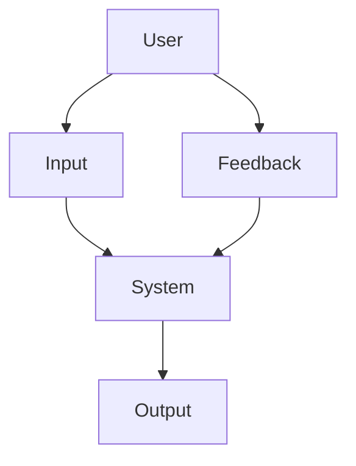
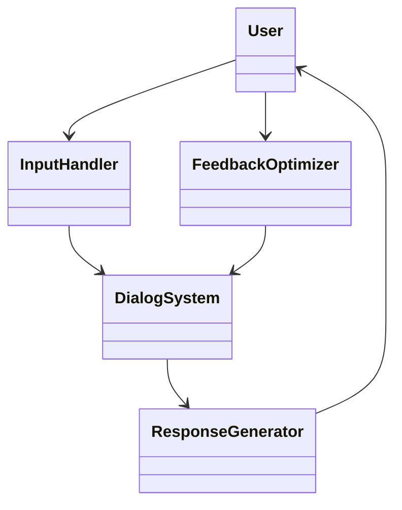
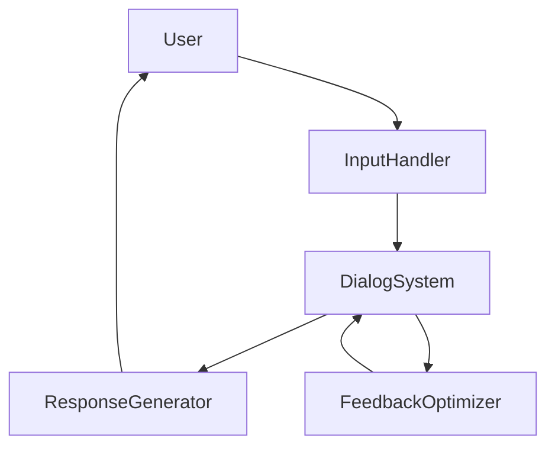
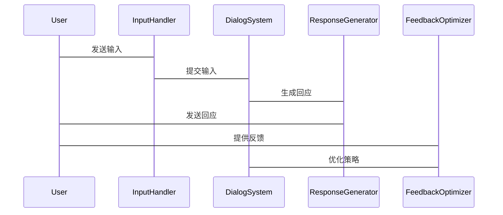

                 


# AI Agent的对话系统在危机干预中的应用

## 关键词：AI Agent，对话系统，危机干预，人工智能，自然语言处理

## 摘要

AI Agent对话系统在危机干预中的应用是一个结合人工智能技术与社会需求的重要研究方向。随着人工智能技术的快速发展，AI Agent对话系统在心理危机、医疗危机、社会危机等场景中展现出了巨大的潜力。本文从AI Agent对话系统的背景、核心概念、算法原理、系统架构到实际应用，全面探讨了其在危机干预中的应用。通过分析对话系统的输入输出模型、训练优化方法、实体关系模型以及具体实现案例，本文为读者提供了一个全面的视角，帮助更好地理解AI Agent对话系统在危机干预中的价值和实现路径。

---

# 第一部分: AI Agent的对话系统概述

## 第1章: AI Agent与对话系统基础

### 1.1 AI Agent的基本概念

#### 1.1.1 AI Agent的定义与特点

AI Agent（人工智能代理）是指能够感知环境、执行任务并做出决策的智能实体。AI Agent具有以下特点：

- **自主性**：能够在没有外部干预的情况下自主执行任务。
- **反应性**：能够实时感知环境并做出反应。
- **目标导向**：基于目标驱动行为，追求最优解决方案。
- **学习能力**：通过数据和经验不断优化自身的决策能力。

AI Agent的核心目标是通过智能化的方式解决复杂问题，提高效率和准确性。

#### 1.1.2 对话系统的定义与分类

对话系统是一种基于自然语言处理技术的交互系统，能够理解用户的输入并生成相应的回应。对话系统可以分为以下几类：

- **基于规则的对话系统**：通过预定义的规则和关键词匹配生成回应。
- **基于统计的对话系统**：利用概率模型和机器学习算法生成对话内容。
- **基于生成模型的对话系统**：使用深度学习模型（如Transformer）生成自然流畅的对话。

#### 1.1.3 AI Agent在对话系统中的作用

AI Agent在对话系统中的作用主要体现在以下几个方面：

- **理解用户需求**：通过自然语言处理技术解析用户的输入，识别其意图和情感。
- **生成智能回应**：基于对话历史和上下文，生成符合逻辑和情感的回应。
- **动态优化对话**：根据对话的实时反馈，调整对话策略以提高用户体验。

### 1.2 危机干预的背景与需求

#### 1.2.1 危机干预的定义与分类

危机干预是指在危机事件发生时，采取有效措施减少损失、恢复秩序的过程。常见的危机类型包括：

- **心理危机**：如抑郁、焦虑等心理问题。
- **医疗危机**：如突发疾病、疫情等。
- **社会危机**：如自然灾害、社会动荡等。

#### 1.2.2 危机干预的现状与挑战

目前，危机干预主要依赖于专业人员（如心理咨询师、医生等）进行面对面的干预。然而，这种方式存在以下挑战：

- **资源有限**：专业人员数量有限，难以覆盖所有需求。
- **时间延迟**：在紧急情况下，专业人员可能无法及时介入。
- **隐私问题**：在某些情况下，面对面干预可能涉及隐私泄露的风险。

#### 1.2.3 对话系统在危机干预中的潜在价值

对话系统在危机干预中的潜在价值体现在以下几个方面：

- **24/7可用性**：对话系统可以全天候为用户提供支持，弥补了人类干预的时空限制。
- **隐私保护**：用户可以通过匿名方式与系统互动，保护个人隐私。
- **成本降低**：对话系统可以大幅降低危机干预的成本，扩大服务覆盖范围。

### 1.3 AI Agent对话系统的核心要素

#### 1.3.1 对话系统的输入输出模型

对话系统的输入输出模型描述了系统如何处理用户输入并生成回应。典型的输入输出模型包括：

- **输入处理**：解析用户的输入，提取关键词和意图。
- **生成策略**：根据输入生成合适的回应。
- **反馈机制**：根据用户的反馈调整生成策略。

#### 1.3.2 AI Agent的感知、决策与执行机制

AI Agent的感知、决策与执行机制是对话系统的核心部分。感知阶段通过自然语言处理技术理解用户输入，决策阶段基于理解和上下文生成最优回应，执行阶段通过对话系统将回应发送给用户。

#### 1.3.3 对话系统的训练与优化

对话系统的训练与优化是确保系统性能的关键。训练阶段包括数据预处理、模型训练和参数调优，优化阶段则通过实时反馈不断改进系统性能。

---

## 第2章: AI Agent对话系统的核心概念与联系

### 2.1 对话系统的原理与流程

#### 2.1.1 对话系统的输入处理

对话系统的输入处理阶段包括以下步骤：

1. **语言理解**：通过自然语言处理技术解析用户的输入，识别其意图和情感。
2. **关键词提取**：提取用户输入中的关键信息，如关键词、实体等。
3. **上下文管理**：维护对话的上下文，确保回应的连贯性。

#### 2.1.2 对话系统的生成机制

对话系统的生成机制是基于训练好的模型，根据输入生成相应的回应。生成机制包括：

- **基于规则的生成**：通过预定义的规则生成回应。
- **基于统计的生成**：利用概率模型生成回应。
- **基于生成模型的生成**：使用深度学习模型生成自然流畅的对话。

#### 2.1.3 对话系统的反馈与优化

对话系统的反馈与优化是通过用户的实时反馈不断改进系统性能。反馈机制包括：

- **用户满意度评分**：用户对系统回应的满意度评分。
- **对话历史分析**：分析对话历史，识别系统在对话中的不足。
- **实时调整生成策略**：根据反馈动态调整生成策略。

### 2.2 AI Agent对话系统的实体关系模型

#### 2.2.1 实体关系图的构建

实体关系图的构建是理解对话系统结构的重要步骤。常见的实体包括用户、对话系统、输入、输出等。通过构建实体关系图，可以清晰地理解系统各部分之间的关系。

#### 2.2.2 对话系统中的实体与关系分析

在对话系统中，实体与关系分析是理解系统运作的关键。例如，用户输入与系统输出之间的关系，系统内部各模块之间的关系等。

#### 2.2.3 实体关系图的Mermaid流程图展示

以下是一个简单的实体关系图的Mermaid流程图展示：



---

## 第3章: AI Agent对话系统的算法原理

### 3.1 对话系统的算法框架

#### 3.1.1 基于Transformer的对话模型

基于Transformer的对话模型是一种常用的深度学习模型。其核心思想是通过自注意力机制捕捉输入中的长距离依赖关系，生成流畅的对话回应。

#### 3.1.2 对话系统的训练目标与损失函数

对话系统的训练目标是生成与用户输入相关的最优回应。常用的损失函数包括交叉熵损失函数和困惑度损失函数。

#### 3.1.3 对话系统的生成策略

对话系统的生成策略包括贪心搜索和贝叶斯搜索等方法。贪心搜索是一种简单的生成方法，而贝叶斯搜索则可以通过概率模型生成更优的回应。

### 3.2 对话系统的数学模型与公式

#### 3.2.1 Transformer模型的数学公式

Transformer模型的核心是自注意力机制，其数学公式如下：

$$
\text{Attention}(Q, K, V) = \text{softmax}\left(\frac{QK^T}{\sqrt{d_k}}\right)V
$$

其中，$Q$、$K$、$V$分别是查询、键和值向量，$d_k$是键的维度。

#### 3.2.2 对话系统的概率分布模型

对话系统的概率分布模型描述了系统生成特定回应的概率。常用的概率分布模型包括多项分布和软最大分布。

#### 3.2.3 对话系统的损失函数与优化算法

常用的损失函数包括交叉熵损失函数和困惑度损失函数。优化算法包括随机梯度下降（SGD）和Adam优化器。

### 3.3 对话系统的算法实现

#### 3.3.1 基于Python的对话系统实现

以下是一个简单的基于Python的对话系统实现代码示例：

```python
import torch
import torch.nn as nn
import torch.optim as optim

class DialogSystem(nn.Module):
    def __init__(self, vocab_size, embed_dim, hidden_dim):
        super(DialogSystem, self).__init__()
        self.embedding = nn.Embedding(vocab_size, embed_dim)
        self.lstm = nn.LSTM(embed_dim, hidden_dim, batch_first=True)
        self.fc = nn.Linear(hidden_dim, vocab_size)

    def forward(self, input, hidden):
        embed = self.embedding(input)
        output, hidden = self.lstm(embed, hidden)
        output = self.fc(output)
        return output, hidden

# 初始化模型和优化器
vocab_size = 10000
embed_dim = 512
hidden_dim = 256
model = DialogSystem(vocab_size, embed_dim, hidden_dim)
optimizer = optim.Adam(model.parameters(), lr=0.001)

# 训练过程
for batch in batches:
    optimizer.zero_grad()
    input, target = batch
    output, _ = model(input, None)
    loss = nn.CrossEntropyLoss()(output, target)
    loss.backward()
    optimizer.step()
```

#### 3.3.2 对话系统的训练代码示例

以下是一个对话系统的训练代码示例：

```python
# 数据预处理
def preprocess(data):
    # 将数据转换为适当的格式
    pass

# 训练数据
train_data = preprocess(train_set)
test_data = preprocess(test_set)

# 训练过程
for epoch in range(num_epochs):
    for batch in train_data:
        input, target = batch
        output, _ = model(input, None)
        loss = criterion(output, target)
        optimizer.zero_grad()
        loss.backward()
        optimizer.step()
    # 验证过程
    with torch.no_grad():
        for batch_val in test_data:
            input_val, target_val = batch_val
            output_val, _ = model(input_val, None)
            val_loss = criterion(output_val, target_val)
            # 记录验证损失
            val_losses.append(val_loss.item())

# 保存模型
torch.save(model.state_dict(), 'dialog_system.pth')
```

#### 3.3.3 对话系统的生成代码示例

以下是一个对话系统的生成代码示例：

```python
# 加载模型
model.load_state_dict(torch.load('dialog_system.pth'))
model.eval()

# 生成对话
def generate_response(input_str):
    # 将输入字符串转换为模型输入格式
    input_ids = tokenizer.encode(input_str, add_special_tokens=True)
    input_ids = input_ids.unsqueeze(0)  # 增加batch维度
    with torch.no_grad():
        output, _ = model(input_ids)
    # 生成回应
    response = tokenizer.decode(output[0], skip_special_tokens=True)
    return response

# 示例对话
user_input = "我感到非常焦虑。"
response = generate_response(user_input)
print(response)
```

---

## 第4章: AI Agent对话系统的系统分析与架构设计

### 4.1 危机干预场景下的系统需求分析

#### 4.1.1 危机干预场景的定义与特点

危机干预场景是指在危机事件发生时，需要快速响应和处理的场景。常见的危机干预场景包括：

- **心理危机**：如用户出现抑郁、焦虑等情绪问题。
- **医疗危机**：如突发疾病、疫情等。
- **社会危机**：如自然灾害、社会动荡等。

#### 4.1.2 项目介绍

本项目旨在开发一个基于AI Agent的对话系统，用于危机干预场景下的用户支持。系统需要具备以下功能：

- **用户输入处理**：解析用户的输入，识别其意图和情感。
- **对话生成**：基于用户输入生成相应的回应。
- **实时反馈与优化**：根据用户的反馈不断优化对话策略。

### 4.2 系统功能设计

#### 4.2.1 系统功能模块

系统功能模块包括：

- **输入处理模块**：解析用户的输入，提取关键词和意图。
- **对话生成模块**：基于输入生成对话回应。
- **反馈与优化模块**：根据用户反馈优化对话策略。

#### 4.2.2 系统功能设计的Mermaid类图展示

以下是一个简单的系统功能设计的Mermaid类图展示：



### 4.3 系统架构设计

#### 4.3.1 系统架构的Mermaid架构图展示

以下是一个系统的架构图展示：



### 4.4 系统接口设计

系统接口设计包括：

- **输入接口**：接收用户的输入，格式为文本。
- **输出接口**：生成对话回应，格式为文本。
- **反馈接口**：接收用户的反馈，用于优化对话策略。

### 4.5 系统交互的Mermaid序列图展示

以下是一个系统的交互序列图展示：



---

## 第5章: 项目实战

### 5.1 环境安装

#### 5.1.1 Python环境的安装与配置

- 安装Python：建议使用Python 3.6或更高版本。
- 安装必要的库：如`torch`、`transformers`等。

#### 5.1.2 项目依赖管理

使用`pip`管理项目依赖：

```bash
pip install torch transformers
```

### 5.2 系统核心实现

#### 5.2.1 对话系统的核心代码实现

以下是一个简单的对话系统实现代码：

```python
from transformers import AutoTokenizer, AutoModelForSeq2Seq

# 加载预训练模型
tokenizer = AutoTokenizer.from_pretrained('facebook/blenderbot')
model = AutoModelForSeq2Seq.from_pretrained('facebook/blenderbot')

# 生成对话
def generate_response(input_str):
    inputs = tokenizer.encode(input_str, return_tensors='pt')
    outputs = model.generate(inputs, max_length=50, num_beams=5, temperature=0.7)
    response = tokenizer.decode(outputs[0], skip_special_tokens=True)
    return response

# 示例对话
user_input = "我感到非常焦虑。"
response = generate_response(user_input)
print(response)
```

#### 5.2.2 代码实现的功能解读

- **输入处理**：将用户的输入转换为模型可以处理的格式。
- **对话生成**：使用预训练模型生成对话回应。
- **输出结果**：将生成的回应返回给用户。

### 5.3 代码应用解读与分析

#### 5.3.1 代码实现的优化建议

- **模型优化**：可以尝试使用不同的预训练模型，如GPT-3、BERT等。
- **对话策略优化**：可以根据具体场景调整对话生成的参数，如温度、生成长度等。
- **反馈机制优化**：可以引入用户反馈机制，动态调整对话策略。

### 5.4 实际案例分析与详细讲解

#### 5.4.1 案例分析

以下是一个实际案例分析：

**场景**：用户因自然灾害感到恐慌，寻求心理支持。

**用户输入**：我感到非常害怕，不知道该怎么办。

**系统回应**：首先，我会理解用户的输入，识别其情感和意图。然后，生成相应的回应，帮助用户缓解焦虑情绪。

**生成过程**：

1. **输入处理**：解析用户的输入，提取关键词“害怕”和“不知道该怎么办”。
2. **对话生成**：基于预训练模型生成回应，如“我能理解你的感受。自然灾害确实让人感到非常害怕。你可以试着深呼吸，尽量保持冷静。如果需要，我可以为你提供一些应对策略。”
3. **反馈与优化**：根据用户的反馈，动态调整对话策略，提供更符合用户需求的支持。

#### 5.4.2 详细讲解

- **输入处理**：通过自然语言处理技术解析用户的输入，识别其情感和意图。
- **对话生成**：基于用户的输入生成相应的回应，确保回应的连贯性和情感一致性。
- **反馈与优化**：根据用户的反馈，优化对话策略，提高用户体验。

### 5.5 项目小结

通过本项目的实施，我们可以看到AI Agent对话系统在危机干预中的巨大潜力。系统能够通过实时对话支持用户，缓解其焦虑情绪，提供实用的应对策略。然而，系统仍需不断优化，以应对各种复杂的危机场景。

---

## 第6章: 最佳实践

### 6.1 小结

AI Agent对话系统在危机干预中的应用具有重要的现实意义。通过智能化的对话系统，可以有效缓解危机事件中的各种问题，为用户提供及时、有效的支持。

### 6.2 注意事项

- **数据隐私**：在危机干预中，用户可能需要提供敏感信息，系统必须严格保护用户隐私。
- **伦理问题**：AI Agent的决策可能涉及伦理问题，需要谨慎处理。
- **系统稳定性**：危机干预场景下，系统必须保证高可用性和稳定性。

### 6.3 拓展阅读

- **相关书籍**：《Deep Learning》、《自然语言处理实战》。
- **相关论文**：《Attention Is All You Need》、《BERT: Pre-training of Deep Bidirectional Transformers for NLP》。
- **技术博客**：各大技术博客平台上有大量关于AI Agent和对话系统的优秀文章。

---

## 结语

AI Agent对话系统在危机干预中的应用是一个充满挑战和机遇的领域。通过不断的技术创新和实践探索，我们可以为用户提供更高效、更人性化的支持，帮助他们度过危机时刻。

