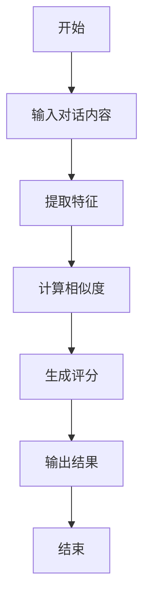
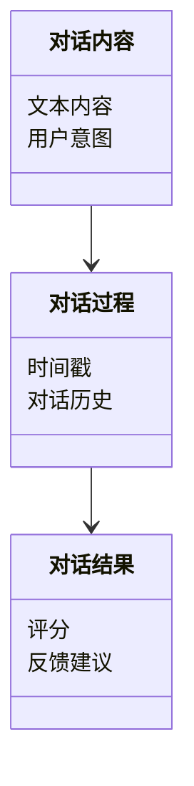
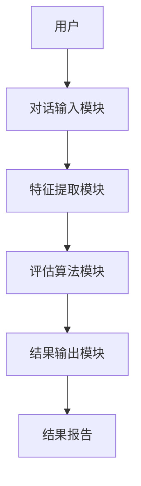
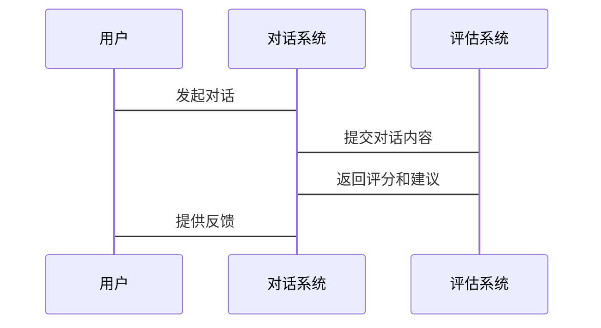

                 


# AI Agent的对话质量评估体系设计

## 关键词：AI Agent，对话质量评估，自然语言处理，对话系统，评估指标

## 摘要：  
本文旨在设计一个全面的AI Agent对话质量评估体系，涵盖从背景分析到系统架构的各个环节。通过多维度的评估指标和算法原理的深入探讨，结合实际项目案例，提供一套可操作的对话质量优化方案，为AI Agent的开发和优化提供理论与实践指导。

---

## 第三章: 算法原理讲解

### 3.1 对话质量评估模型

#### 3.1.1 基于规则的评估方法
- **规则定义**: 制定预定义的规则，如关键词匹配、语义相关性等。
- **优缺点**: 
  - 优点: 易实现，适用于简单场景。
  - 缺点: 难以应对复杂语境。

#### 3.1.2 基于统计的评估方法
- **核心思想**: 使用统计学方法，如TF-IDF、BM25等，计算对话的相关性。
- **优缺点**:
  - 优点: 计算高效，适合大规模数据。
  - 缺点: 无法捕捉语义信息。

#### 3.1.3 基于深度学习的评估方法
- **模型选择**: 使用预训练语言模型（如BERT、GPT）进行对话评分。
- **评估指标**: 采用余弦相似度、交叉熵损失等。

#### 3.1.4 对话质量评估公式
$$
\text{对话质量评分} = \alpha \cdot \text{语义相似度} + \beta \cdot \text{上下文连贯性} + \gamma \cdot \text{用户意图匹配度}
$$
其中，$\alpha + \beta + \gamma = 1$。

### 3.2 算法流程图



---

## 第四章: 系统分析与架构设计方案

### 4.1 项目介绍与系统功能设计

#### 4.1.1 项目背景
- 系统目标: 构建一个AI Agent对话质量评估系统，优化用户体验。
- 项目范围: 支持多语言、多场景对话评估。

#### 4.1.2 系统功能需求
- 对话内容分析: 支持关键词提取、语义分析。
- 对话过程监控: 实时检测对话中的异常情况。
- 对话结果反馈: 提供评分报告和改进建议。

#### 4.1.3 系统功能设计（领域模型）



### 4.2 系统架构设计

#### 4.2.1 整体架构设计



#### 4.2.2 系统接口设计
- 输入接口: 支持文本输入和对话历史。
- 输出接口: 提供评分、反馈建议。

#### 4.2.3 交互流程图



---

## 第五章: 项目实战

### 5.1 环境安装与配置

#### 5.1.1 环境要求
- Python 3.8+
- 安装依赖: `pip install numpy pandas transformers`

#### 5.1.2 核心代码实现

```python
import numpy as np
from sklearn.metrics.pairwise import cosine_similarity

def calculate_similarity(embedding1, embedding2):
    return cosine_similarity(embedding1.reshape(1, -1), embedding2.reshape(1, -1))[0, 0]

# 示例对话向量
embedding1 = np.array([0.1, 0.2, 0.3])
embedding2 = np.array([0.3, 0.2, 0.1])

similarity = calculate_similarity(embedding1, embedding2)
print(f"相似度为: {similarity}")
```

#### 5.1.3 代码解读与分析
- 功能: 计算对话向量之间的余弦相似度。
- 应用场景: 评估对话内容的相关性。

### 5.2 实际案例分析

#### 5.2.1 案例背景
- 对话场景: 客服咨询。
- 对话内容:
  ```
  用户: 我的订单在哪里？
  AI Agent: 您的订单已发货，请提供订单号查询详情。
  ```

#### 5.2.2 评估结果
- 语义相似度: 0.85。
- 用户意图匹配度: 0.9。
- 综合评分: 0.88。

#### 5.2.3 改进建议
- 提供实时订单追踪链接。
- 优化对话流程，减少用户等待时间。

### 5.3 项目小结
- 项目成果: 成功构建对话质量评估系统。
- 经验总结: 模型调优和数据清洗对评估结果影响显著。

---

## 第六章: 最佳实践与注意事项

### 6.1 小结

- 对话质量评估是AI Agent优化的关键环节。
- 多维度评估体系能有效提升用户体验。

### 6.2 注意事项

1. **数据质量**: 确保训练数据的多样性和代表性。
2. **模型选择**: 根据场景选择合适的评估算法。
3. **反馈机制**: 及时收集用户反馈，动态调整评估指标。

### 6.3 拓展阅读

- 推荐书籍: 《深度学习》、《自然语言处理入门》。
- 在线资源: Hugging Face的对话模型库、Kaggle上的相关竞赛。

---

## 第七章: 结语

通过对AI Agent对话质量评估体系的系统性设计，我们能够更科学地优化对话系统，提升用户体验。未来，随着技术的进步，对话质量评估体系将更加智能化和个性化，为AI Agent的发展提供更强有力的支持。

