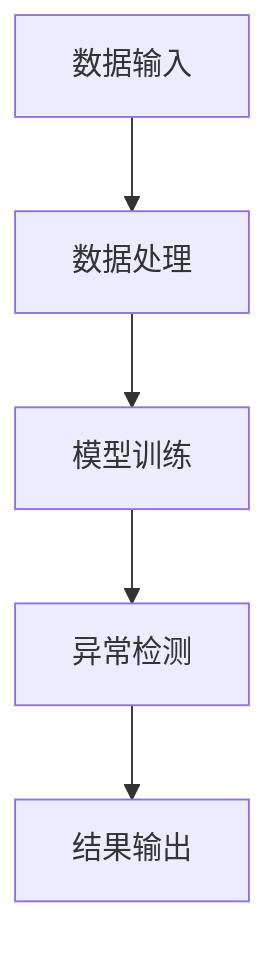
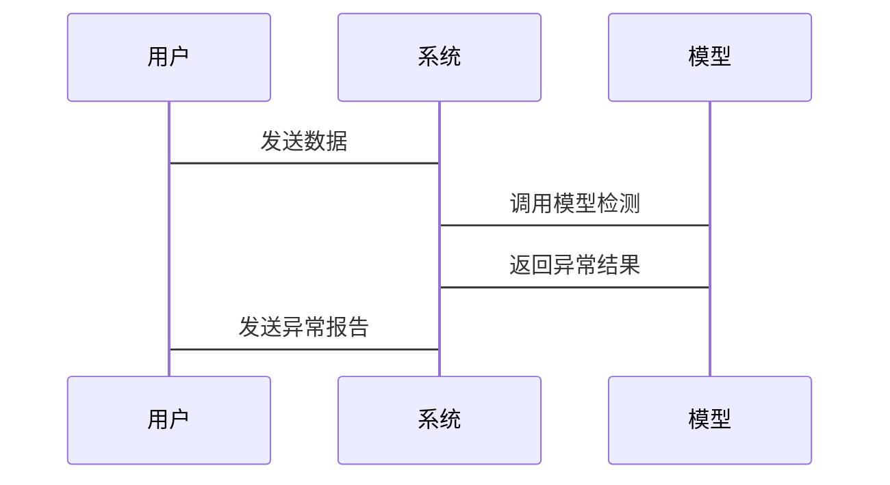

                 


# AI Agent的异常检测：识别非正常模式

---

## 关键词
- AI Agent
- 异常检测
- 数据分析
- 机器学习
- 深度学习

---

## 摘要
在人工智能和大数据快速发展的今天，AI Agent（智能体）在各个领域的应用越来越广泛。然而，随着数据规模的不断扩大和复杂性的增加，异常检测成为了AI Agent系统中不可或缺的一部分。本文将从AI Agent的基本概念出发，系统地介绍异常检测的核心原理、数学模型、算法实现以及实际应用场景。通过详细讲解几种典型的异常检测方法，结合实际案例，本文旨在帮助读者理解如何识别和处理AI Agent中的异常模式，从而提升系统的 robustness 和性能。

---

# 第一部分: AI Agent异常检测概述

## 第1章: 异常检测的基本概念与背景

### 1.1 异常检测的定义与重要性
#### 1.1.1 异常检测的定义
异常检测（Anomaly Detection）是指通过分析数据，识别出与预期模式或行为不一致的异常数据点。这些异常可能代表了潜在的问题、错误或潜在的机会。

#### 1.1.2 异常检测在AI Agent中的重要性
在AI Agent系统中，异常检测可以帮助识别数据中的异常值或异常行为，从而优化系统性能、提升决策的准确性，并及时发现潜在的安全威胁。

#### 1.1.3 异常检测的应用场景
- 网络安全：检测入侵行为或异常流量。
- 金融领域：识别欺诈交易或异常交易模式。
- 健康医疗：发现异常的生理数据或疾病早期症状。
- 工业监控：检测设备故障或异常生产过程。

### 1.2 AI Agent的基本概念
#### 1.2.1 什么是AI Agent
AI Agent（人工智能代理）是一种能够感知环境、自主决策并执行任务的智能实体。它可以是一个软件程序、机器人或其他智能系统。

#### 1.2.2 AI Agent的核心功能
- 感知环境：通过传感器或数据输入获取信息。
- 分析数据：利用机器学习算法处理和分析数据。
- 制定决策：基于分析结果做出最优决策。
- 执行任务：根据决策执行具体操作。

#### 1.2.3 AI Agent的应用领域
- 智能客服：提供个性化服务和问题解决。
- 自动驾驶：实时感知和决策驾驶行为。
- 智能推荐：基于用户行为推荐相关内容。

### 1.3 异常检测与AI Agent的结合
#### 1.3.1 异常检测在AI Agent中的作用
在AI Agent系统中，异常检测可以帮助识别异常数据或行为，从而优化系统的运行效率和准确性。

#### 1.3.2 AI Agent如何实现异常检测
AI Agent可以通过以下方式实现异常检测：
- 数据预处理：清洗和归一化数据。
- 特征提取：提取关键特征用于异常检测。
- 模型训练：训练异常检测模型。
- 实时监控：持续监控数据并识别异常。

#### 1.3.3 异常检测对AI Agent性能的影响
异常检测可以显著提升AI Agent的性能，例如：
- 提高决策的准确性。
- 减少误判和错误决策。
- 提升系统的鲁棒性和可靠性。

---

## 第2章: 异常检测的核心概念与原理

### 2.1 异常检测的核心概念
#### 2.1.1 异常检测的基本原理
异常检测的核心在于识别数据中的异常模式。常见的方法包括基于统计的方法和基于机器学习的方法。

#### 2.1.2 异常检测的主要方法
- 基于统计的方法：通过统计学原理识别异常值。
- 基于机器学习的方法：利用监督或无监督学习算法识别异常。
- 基于深度学习的方法：使用神经网络模型学习正常模式并识别异常。

#### 2.1.3 异常检测的分类与对比
| 方法类型      | 描述                                      | 优缺点                  |
|---------------|------------------------------------------|-------------------------|
| 基于统计      | 使用统计学原理（如均值、标准差）检测异常 | 简单但对复杂数据效果有限 |
| 基于机器学习  | 利用机器学习算法（如随机森林、SVM）      | 高效但需要大量标注数据  |
| 基于深度学习  | 使用神经网络模型学习正常模式             | 高精度但计算复杂         |

### 2.2 异常检测的关键技术
#### 2.2.1 基于统计的异常检测
##### Grubbs检验
Grubbs检验是一种常用的统计方法，用于检测单变量数据中的异常值。其原理是基于数据的均值和标准差，判断数据点是否偏离均值超过一定范围。

$$ Grubbs统计量 = \frac{|x_i - \mu|}{s} $$

其中，$\mu$ 是数据的均值，$s$ 是标准差。

#### 2.2.2 基于机器学习的异常检测
##### Isolation Forest
Isolation Forest是一种无监督学习算法，通过构建随机树将数据点隔离出来。其核心思想是将异常点与正常点区分开。

$$ score = \frac{depth}{total\_depth} $$

其中，$depth$ 是数据点所在的树深度，$total\_depth$ 是树的总深度。

#### 2.2.3 基于深度学习的异常检测
##### Autoencoder
Autoencoder是一种基于神经网络的异常检测方法，通过训练网络重构输入数据，异常点通常会导致重构误差较大。

$$ loss = \frac{1}{n} \sum_{i=1}^{n} (x_i - \hat{x}_i)^2 $$

其中，$x_i$ 是输入数据，$\hat{x}_i$ 是重构数据。

---

## 第3章: 异常检测的数学模型与算法原理

### 3.1 异常检测的数学模型
#### 3.1.1 统计模型
统计模型基于概率分布，假设正常数据服从某种分布（如高斯分布），异常数据则偏离该分布。

$$ P(x | \theta) \sim \mathcal{N}(\mu, \sigma^2) $$

其中，$\mu$ 是均值，$\sigma^2$ 是方差。

#### 3.1.2 机器学习模型
机器学习模型通过训练数据学习正常模式，异常数据则被视为偏离正常模式。

$$ f(x) = \text{sigmoid}(w^T x + b) $$

其中，$w$ 是权重，$b$ 是截距。

#### 3.1.3 深度学习模型
深度学习模型通过多层神经网络学习复杂的正常模式，异常数据通常会导致较高的重建误差或分类错误。

$$ f(x) = \text{softmax}(W^T h(x) + b) $$

其中，$h(x)$ 是隐藏层输出，$W$ 和 $b$ 是模型参数。

### 3.2 异常检测的经典算法
#### 3.2.1 基于统计的Grubbs检验
Grubbs检验适用于检测单变量数据中的异常值，其步骤如下：
1. 计算数据的均值 $\mu$ 和标准差 $s$。
2. 计算每个数据点的Grubbs统计量。
3. 判断统计量是否超过阈值，超过则标记为异常。

#### 3.2.2 基于机器学习的Isolation Forest
Isolation Forest通过构建随机树将数据点隔离出来，具体步骤如下：
1. 随机选择特征和分割值，构建随机树。
2. 计算每个数据点的异常得分。
3. 根据得分判断数据点是否为异常。

#### 3.2.3 基于深度学习的Autoencoder
Autoencoder通过训练网络重构输入数据，异常点通常会导致较大的重构误差。具体步骤如下：
1. 构建Autoencoder网络，包含编码器和解码器。
2. 训练网络，最小化重构误差。
3. 使用训练好的模型检测异常点。

---

## 第4章: 异常检测的系统架构与设计

### 4.1 异常检测系统的组成
#### 4.1.1 数据预处理模块
数据预处理模块负责清洗和归一化数据，确保输入数据的质量。

#### 4.1.2 模型训练模块
模型训练模块负责训练异常检测模型，包括选择算法和优化参数。

#### 4.1.3 异常检测模块
异常检测模块负责实时监控数据，识别异常点并发出警报。

#### 4.1.4 结果分析模块
结果分析模块负责分析异常点，结合上下文提供解释和建议。

### 4.2 异常检测系统的架构设计
#### 4.2.1 系统功能设计
- 数据输入：接收原始数据。
- 数据处理：清洗和归一化数据。
- 模型训练：训练异常检测模型。
- 异常检测：实时检测异常点。
- 结果输出：输出异常报告。

#### 4.2.2 系统架构图


#### 4.2.3 系统接口设计
- 数据接口：接收数据流和控制命令。
- 模型接口：与训练好的模型交互。
- 输出接口：发送异常报告和警报信息。

#### 4.2.4 系统交互图


---

## 第5章: 异常检测的项目实战

### 5.1 项目背景与目标
#### 5.1.1 项目背景
在电商平台中，异常交易检测是保障交易安全的重要环节。

#### 5.1.2 项目目标
通过异常检测算法，识别潜在的欺诈交易。

#### 5.1.3 项目需求
- 数据预处理：清洗和归一化交易数据。
- 模型训练：训练异常检测模型。
- 异常检测：实时检测异常交易。
- 结果分析：分析异常交易并提供建议。

### 5.2 项目实现
#### 5.2.1 环境搭建
- 安装Python和相关库（如scikit-learn、tensorflow）。
- 安装Jupyter Notebook用于数据分析和可视化。

#### 5.2.2 数据收集与预处理
```python
import pandas as pd
import numpy as np

# 数据加载
data = pd.read_csv('transactions.csv')

# 数据清洗
data.dropna()
data = data[abs(data['amount'] - data['amount'].mean()) < 3 * data['amount'].std()]

# 数据归一化
from sklearn.preprocessing import StandardScaler
scaler = StandardScaler()
data_scaled = scaler.fit_transform(data[['amount', 'time']])
```

#### 5.2.3 模型训练与优化
```python
from sklearn.ensemble import IsolationForest
from tensorflow.keras import layers, Model

# 使用Isolation Forest训练模型
iforest = IsolationForest(random_state=42)
iforest.fit(data_scaled)

# 使用Autoencoder训练模型
input_layer = layers.Input(shape=(data_scaled.shape[1],))
encoder = layers.Dense(64, activation='relu')(input_layer)
encoder = layers.Dense(32, activation='relu')(encoder)
decoder = layers.Dense(64, activation='relu')(encoder)
output_layer = layers.Dense(data_scaled.shape[1], activation='sigmoid')(decoder)
autoencoder = Model(inputs=input_layer, outputs=output_layer)
autoencoder.compile(optimizer='adam', loss='mse')
autoencoder.fit(data_scaled, data_scaled, epochs=100, batch_size=32)
```

#### 5.2.4 异常检测与结果分析
```python
# 使用Isolation Forest检测异常
scores = iforest.score_samples(data_scaled)
threshold = np.percentile(scores, 10)
anomalies_iforest = data[scores < threshold]

# 使用Autoencoder检测异常
reconstructed = autoencoder.predict(data_scaled)
reconstruction_error = np.mean(np.square(reconstructed - data_scaled), axis=1)
threshold = np.percentile(reconstruction_error, 95)
anomalies_autoencoder = data[reconstruction_error > threshold]

# 结果分析
print("Isolation Forest检测到的异常点数量：", len(anomalies_iforest))
print("Autoencoder检测到的异常点数量：", len(anomalies_autoencoder))
```

### 5.3 项目小结
通过项目实战，我们可以看到异常检测算法在实际应用中的效果。不同的算法有不同的优缺点，需要根据具体场景选择合适的算法。

---

## 第6章: 异常检测的最佳实践与小结

### 6.1 异常检测的最佳实践
#### 6.1.1 数据质量的重要性
数据预处理是异常检测的关键步骤，确保数据的干净和一致性。

#### 6.1.2 模型选择的策略
根据数据类型和业务需求选择合适的异常检测算法。

#### 6.1.3 结果解释与可视化
通过可视化工具（如折线图、散点图）分析异常点的分布和特征。

### 6.2 小结
本文系统地介绍了异常检测的核心概念、数学模型和算法原理，并通过实际案例展示了异常检测的应用。读者可以从中掌握异常检测的基本知识，并将其应用到实际项目中。

### 6.3 注意事项
- 异常检测模型需要定期更新，以应对数据分布的变化。
- 异常检测结果需要结合业务背景进行解释，避免误报和漏报。

### 6.4 拓展阅读
- 《Anomaly Detection: A survey》
- 《Deep Learning for Anomaly Detection: A Review》

---

# 附录: 异常检测算法对比表

| 算法名称         | 方法类型 | 优点                           | 缺点                           |
|------------------|----------|--------------------------------|--------------------------------|
| Grubbs检验       | 统计     | 简单高效，适合单变量数据       | 对复杂数据效果有限             |
| Isolation Forest | 机器学习 | 无监督学习，适合高维数据       | 对异常点数量敏感               |
| Autoencoder     | 深度学习 | 高精度，适合复杂模式           | 计算复杂，需要大量数据         |

---

# 结语

异常检测是AI Agent系统中的重要环节，通过识别非正常模式，我们可以提升系统的性能和安全性。希望本文的内容能够为读者提供有价值的参考，帮助他们在实际项目中更好地应用异常检测技术。

