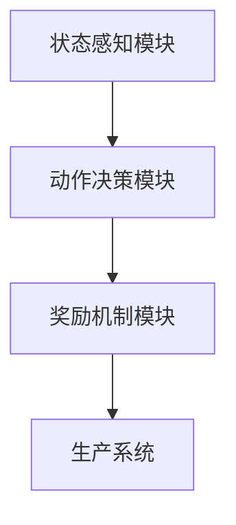
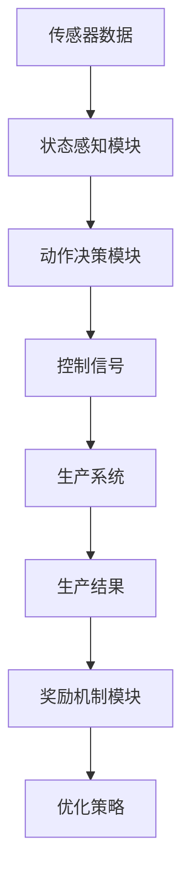

                 


# AI Agent的强化学习在智能制造中的应用

> 关键词：AI Agent，强化学习，智能制造，深度强化学习，数学模型，系统架构

> 摘要：本文系统地探讨了AI Agent在智能制造中的应用，重点分析了强化学习在该领域的核心原理和实际应用。通过详细讲解Q-Learning和深度强化学习（DQN）算法，结合智能制造中的具体场景，展示了如何利用这些算法优化生产流程、提高效率和质量。文章还通过Mermaid图表和数学公式，深入剖析了系统的架构设计和实现细节，最后给出了实际案例分析和最佳实践建议。

---

## 第一部分: AI Agent与强化学习基础

### 第1章: AI Agent的基本概念

#### 1.1 AI Agent的定义与特点

##### 1.1.1 AI Agent的定义
AI Agent（人工智能代理）是指能够感知环境、做出决策并执行动作的智能体。它能够通过与环境的交互，自主地完成特定任务，优化目标函数。AI Agent的核心在于其自主性、反应性和目标导向性。

##### 1.1.2 AI Agent的核心特点
- **自主性**：AI Agent能够自主决策，无需外部干预。
- **反应性**：能够实时感知环境变化并做出响应。
- **目标导向性**：所有行为都以实现特定目标为导向。
- **学习能力**：通过强化学习等方法不断优化自身行为。

##### 1.1.3 AI Agent与传统自动化的区别
传统自动化系统通常基于固定的规则运行，而AI Agent能够通过学习和适应，动态调整其行为以应对环境的变化。例如，在智能制造中，传统自动化系统可能只能按照预设的流程运行，而AI Agent可以根据实时数据调整生产节奏，优化资源分配。

---

#### 1.2 强化学习的基本原理

##### 1.2.1 强化学习的定义
强化学习（Reinforcement Learning，RL）是一种机器学习方法，通过智能体与环境的交互，学习最优策略以最大化累积奖励。与监督学习不同，强化学习不需要标注数据，而是通过试错机制优化行为。

##### 1.2.2 强化学习的核心要素
- **状态（State）**：环境在某一时刻的描述。
- **动作（Action）**：智能体在给定状态下做出的行为。
- **奖励（Reward）**：智能体执行动作后获得的反馈，用于指导行为优化。
- **策略（Policy）**：智能体选择动作的概率分布。
- **值函数（Value Function）**：衡量状态或动作-状态对奖励的期望。

##### 1.2.3 强化学习与监督学习的区别
| 特性 | 监督学习 | 强化学习 |
|------|----------|----------|
| 数据 | 标签数据 | 奖励信号 |
| 目标 | 最小化误差 | 最大化累积奖励 |
| 反馈 | 即时反馈 | 延时反馈 |

---

### 第2章: 制造业中的强化学习应用背景

#### 2.1 智能制造的现状与挑战

##### 2.1.1 智能制造的定义与目标
智能制造是通过数字化技术优化生产流程，实现高效、灵活和可持续的生产模式。其目标是提高生产效率、降低资源消耗、增强产品质量和生产灵活性。

##### 2.1.2 当前制造业中的痛点
- **生产效率低下**：传统生产流程缺乏灵活性，难以应对市场变化。
- **资源浪费**：设备利用率低，能源消耗大。
- **质量不稳定**：人工操作可能导致产品质量波动。

##### 2.1.3 强化学习在智能制造中的潜力
强化学习可以通过优化生产调度、资源分配和质量控制，显著提高生产效率和产品质量。例如，AI Agent可以实时调整生产线的参数，以应对原材料波动或设备故障。

---

#### 2.2 AI Agent在智能制造中的应用场景

##### 2.2.1 生产优化
AI Agent可以通过强化学习优化生产顺序、设备调度和生产节奏，减少等待时间，提高设备利用率。

##### 2.2.2 质量控制
AI Agent可以实时监控生产过程，识别异常情况，并调整参数以提高产品质量。

##### 2.2.3 资源调度
AI Agent可以优化原材料采购、库存管理和物流调度，降低资源浪费和成本。

---

### 第3章: 强化学习算法的核心原理

#### 3.1 马尔可夫决策过程（MDP）

##### 3.1.1 MDP的定义
MDP是一个用于描述强化学习问题的数学框架，包含状态、动作、奖励和转移概率等要素。

##### 3.1.2 MDP的核心要素
- **状态空间（State Space）**：所有可能的状态集合。
- **动作空间（Action Space）**：所有可能的动作集合。
- **奖励函数（Reward Function）**：给定状态和动作后，智能体获得的奖励。
- **转移概率（Transition Probability）**：从当前状态执行动作后转移到下一个状态的概率。

##### 3.1.3 动态规划与近似方法
动态规划是解决MDP问题的一种方法，适用于状态空间较小的情况。近似方法（如值函数近似）适用于状态空间较大的情况。

---

#### 3.2 Q-Learning算法

##### 3.2.1 Q-Learning的基本原理
Q-Learning是一种基于值函数的强化学习算法，通过更新Q表（Q-Table）来学习最优策略。

##### 3.2.2 Q-Learning的数学模型
Q值更新公式：
$$ Q(s, a) = Q(s, a) + \alpha [r + \gamma \max Q(s', a') - Q(s, a)] $$
其中，$\alpha$是学习率，$\gamma$是折扣因子。

##### 3.2.3 Q-Learning的应用场景
适用于离散状态和动作空间的环境，例如机器人路径规划。

---

#### 3.3 深度强化学习（Deep RL）

##### 3.3.1 DQN算法的原理
DQN（Deep Q-Network）通过神经网络近似值函数，避免了Q-Learning对Q表的依赖。

##### 3.3.2 DQN与传统强化学习的区别
- DQN使用神经网络替代Q表。
- DQN引入经验回放和目标网络，提高了稳定性和收敛速度。

##### 3.3.3 深度神经网络在强化学习中的作用
神经网络用于近似值函数或策略函数，能够处理高维状态空间和动作空间。

---

## 第4章: AI Agent的强化学习数学模型

### 4.1 强化学习的数学表达

#### 4.1.1 状态空间的定义
状态空间是所有可能状态的集合，可以用数学符号表示为：
$$ S = \{ s_1, s_2, \dots, s_n \} $$

#### 4.1.2 动作空间的定义
动作空间是所有可能动作的集合，表示为：
$$ A = \{ a_1, a_2, \dots, a_m \} $$

#### 4.1.3 奖励函数的设计
奖励函数定义为：
$$ R: S \times A \rightarrow \mathbb{R} $$
表示在状态$s$执行动作$a$后获得的奖励。

---

### 4.2 Q-Learning的数学推导

#### 4.2.1 Q值的更新公式
Q-Learning的更新公式为：
$$ Q(s, a) = Q(s, a) + \alpha [r + \gamma \max Q(s', a') - Q(s, a)] $$

#### 4.2.2 探索与利用的平衡
- 探索：尝试未尝试过的行为，避免陷入局部最优。
- 利用：利用已知的最优策略，最大化累积奖励。

---

### 4.3 深度强化学习的数学模型

#### 4.3.1 神经网络的输入输出
输入为状态$s$，输出为动作$a$的概率分布：
$$ P(a | s) = \text{softmax}(W \cdot s + b) $$

#### 4.3.2 神经网络的训练目标
目标是最小化损失函数：
$$ \mathcal{L} = -\sum_{i=1}^n [y_i \log p_i + (1 - y_i) \log (1 - p_i)] $$
其中，$y_i$是目标概率，$p_i$是预测概率。

#### 4.3.3 梯度下降的优化方法
使用随机梯度下降（SGD）更新参数：
$$ \theta = \theta - \eta \nabla_\theta \mathcal{L} $$
其中，$\eta$是学习率。

---

## 第5章: 系统架构与设计

### 5.1 AI Agent在智能制造中的系统架构

#### 5.1.1 系统的组成模块
- **状态感知模块**：实时采集生产环境数据。
- **动作决策模块**：基于强化学习算法做出决策。
- **奖励机制模块**：计算并反馈奖励信号。

#### 5.1.2 系统架构的Mermaid图


#### 5.1.3 系统的输入输出接口
- 输入：传感器数据、生产订单。
- 输出：控制信号、优化策略。

---

### 5.2 系统功能设计

#### 5.2.1 状态感知模块
- 功能：采集生产环境中的数据，如温度、湿度、设备状态。
- 实现：使用传感器和物联网技术。

#### 5.2.2 动作决策模块
- 功能：根据当前状态，通过强化学习算法做出决策。
- 实现：基于DQN算法的神经网络模型。

#### 5.2.3 奖励机制模块
- 功能：根据生产结果计算奖励信号。
- 实现：定义奖励函数并实时计算。

---

### 5.3 系统架构的实现

#### 5.3.1 系统架构的Mermaid图


#### 5.3.2 系统功能的实现
- **状态感知模块**：实时采集并传输数据。
- **动作决策模块**：基于DQN算法生成控制信号。
- **奖励机制模块**：根据生产结果更新奖励函数。

---

## 第6章: 项目实战

### 6.1 环境安装

#### 6.1.1 安装Python环境
使用Anaconda安装Python 3.8及以上版本。

#### 6.1.2 安装依赖库
安装必要的库：
```bash
pip install numpy matplotlib tensorflow
```

---

### 6.2 系统核心实现源代码

#### 6.2.1 Q-Learning算法实现
```python
import numpy as np

class QLearning:
    def __init__(self, state_space_size, action_space_size):
        self.q_table = np.zeros((state_space_size, action_space_size))
    
    def choose_action(self, state, epsilon=0.1):
        if np.random.random() < epsilon:
            return np.random.randint(0, action_space_size)
        return np.argmax(self.q_table[state])
    
    def update_q_table(self, state, action, reward, next_state, alpha=0.1, gamma=0.99):
        next_max = np.max(self.q_table[next_state])
        self.q_table[state][action] += alpha * (reward + gamma * next_max - self.q_table[state][action])
```

#### 6.2.2 DQN算法实现
```python
import numpy as np
import tensorflow as tf

class DQN:
    def __init__(self, state_dim, action_dim):
        self.model = self.build_model(state_dim, action_dim)
        self.target_model = self.build_model(state_dim, action_dim)
        self.model.compile(optimizer='adam', loss='mse')
    
    def build_model(self, state_dim, action_dim):
        model = tf.keras.Sequential()
        model.add(tf.keras.layers.Dense(64, activation='relu', input_dim=state_dim))
        model.add(tf.keras.layers.Dense(64, activation='relu'))
        model.add(tf.keras.layers.Dense(action_dim, activation='linear'))
        return model
    
    def act(self, state, epsilon=0.1):
        if np.random.random() < epsilon:
            return np.random.randint(0, action_dim)
        q_values = self.model.predict(state)
        return np.argmax(q_values[0])
    
    def update(self, states, actions, rewards, next_states, gamma=0.99):
        q_values = self.model.predict(states)
        target_q_values = self.target_model.predict(next_states)
        target = q_values.copy()
        target[0][actions] = rewards + gamma * np.max(target_q_values[0])
        self.model.fit(states, target, epochs=1, verbose=0)
```

---

### 6.3 实际案例分析

#### 6.3.1 案例背景
假设我们有一个智能化工厂，需要优化设备调度和生产顺序。

#### 6.3.2 数据采集与预处理
- 采集设备状态、生产订单、时间等数据。
- 数据预处理：归一化、特征提取。

#### 6.3.3 模型训练与部署
- 使用DQN算法训练模型。
- 部署到生产系统中，实时调整设备参数。

#### 6.3.4 模型优化与调优
- 调整学习率、折扣因子等超参数。
- 使用经验回放提高训练稳定性。

---

## 第7章: 总结与展望

### 7.1 总结

#### 7.1.1 AI Agent与强化学习的核心要点
- AI Agent能够自主决策并优化生产流程。
- 强化学习通过试错机制实现最优策略。

#### 7.1.2 制造业中的具体应用
- 生产优化、质量控制、资源调度等。

---

### 7.2 未来展望

#### 7.2.1 更复杂的生产场景
- 多智能体协作、动态环境适应。

#### 7.2.2 更先进的算法
- 多目标强化学习、元强化学习。

#### 7.2.3 更广泛的应用领域
- 智能物流、智能维护、智能供应链。

---

## 第8章: 最佳实践与注意事项

### 8.1 小结

#### 8.1.1 核心概念回顾
- AI Agent、强化学习、智能制造。

#### 8.1.2 算法实现要点
- 状态空间设计、奖励函数定义、模型训练与部署。

---

### 8.2 注意事项

#### 8.2.1 系统设计
- 明确系统目标和约束条件。
- 设计合理的奖励机制。

#### 8.2.2 模型调优
- 选择合适的算法和超参数。
- 避免过拟合和欠拟合。

#### 8.2.3 系统集成
- 确保系统兼容性和稳定性。
- 处理实时性和延迟问题。

---

## 第9章: 拓展阅读

### 9.1 相关领域

#### 9.1.1 多智能体强化学习
- 集智体系统、协作与竞争。

#### 9.1.2 强化学习的最新进展
- 基于Transformer的强化学习、无模型强化学习。

#### 9.1.3 智能制造的前沿技术
- 数字孪生、边缘计算、工业互联网。

---

## 结语

通过本文的详细分析，我们可以看到AI Agent和强化学习在智能制造中的巨大潜力。从基础概念到实际应用，强化学习正在改变传统的生产方式，推动制造业向智能化、高效化发展。未来，随着算法的不断进步和应用场景的拓展，AI Agent将在智能制造中发挥更加重要的作用。

