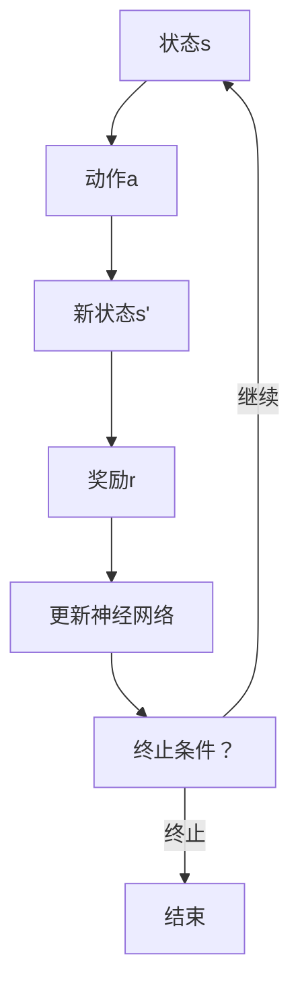
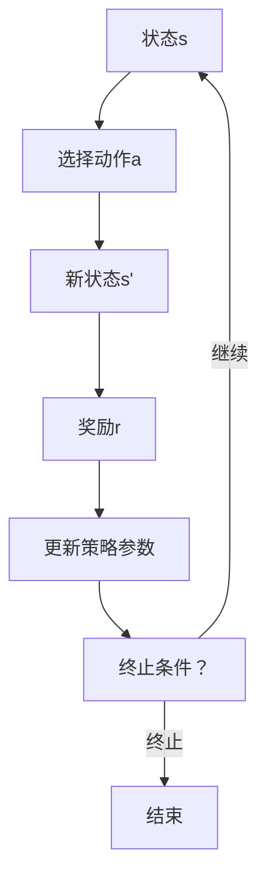
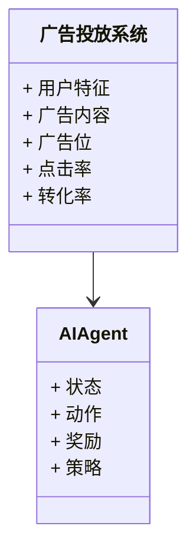
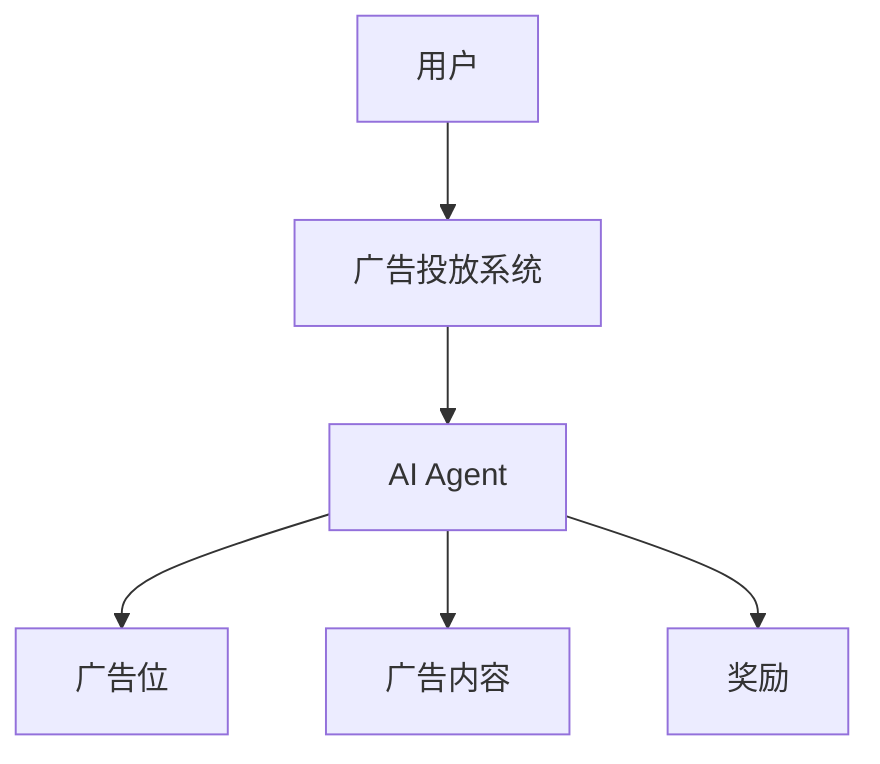
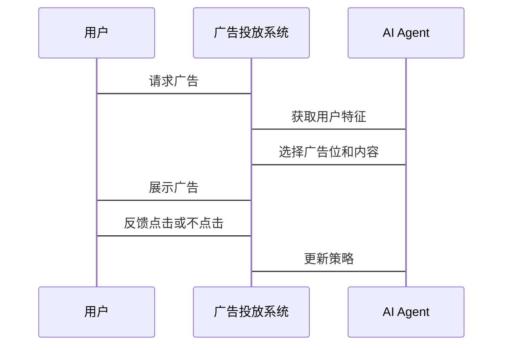

                 


# AI Agent的强化学习在智能广告投放中的应用

## 关键词：AI Agent, 强化学习, 智能广告投放, 广告优化, 算法原理, 系统设计, 项目实战

## 摘要：  
随着人工智能技术的快速发展，AI Agent在广告投放中的应用越来越广泛。通过强化学习，AI Agent能够智能地选择最优的广告策略，从而提高广告投放的效果和效率。本文将深入探讨AI Agent的强化学习在智能广告投放中的应用，从基础理论到算法实现，再到系统设计和项目实战，全面解析其在实际应用中的优势与挑战。

---

# 第1章: AI Agent与强化学习概述

## 1.1 AI Agent的基本概念

### 1.1.1 AI Agent的定义
AI Agent（人工智能代理）是指能够感知环境并采取行动以实现目标的智能实体。它可以是一个软件程序、机器人或其他智能系统，通过与环境交互来完成特定任务。

### 1.1.2 AI Agent的核心特征
- **自主性**：能够在没有外部干预的情况下独立运行。
- **反应性**：能够感知环境并实时调整行为。
- **目标导向性**：以实现特定目标为导向。
- **学习能力**：通过经验改进自身性能。

### 1.1.3 AI Agent与传统AI的区别
AI Agent不仅具备传统AI的数据处理和分析能力，还能够主动采取行动并适应环境变化。传统AI主要关注数据分析和模式识别，而AI Agent则更注重与环境的交互和目标的实现。

## 1.2 强化学习的基本原理

### 1.2.1 强化学习的定义
强化学习是一种机器学习范式，通过智能体与环境的交互，学习如何采取最优动作以最大化累积奖励。与监督学习不同，强化学习不需要明确的标签数据，而是通过奖励机制来指导学习过程。

### 1.2.2 强化学习的核心要素
- **状态（State）**：智能体所处的环境状态。
- **动作（Action）**：智能体采取的行动。
- **奖励（Reward）**：智能体采取动作后所获得的反馈。
- **策略（Policy）**：决定智能体在给定状态下采取哪个动作的规则。

### 1.2.3 强化学习与监督学习的区别
| 对比维度 | 监督学习 | 强化学习 |
|----------|----------|----------|
| 数据来源 | 标签数据 | 环境反馈 |
| 反馈机制 | 确定性 | 延时性、累积性 |
| 应用场景 | 分类、回归 | 游戏、机器人控制、广告投放 |

## 1.3 AI Agent在广告投放中的应用背景

### 1.3.1 广告投放的智能化需求
传统的广告投放依赖人工经验，效率低且效果不稳定。随着市场竞争的加剧，广告投放需要更加智能化和精准化。

### 1.3.2 AI Agent在广告投放中的优势
- **自动化决策**：AI Agent能够实时分析广告投放效果并调整策略。
- **数据驱动**：基于大量数据优化广告投放策略。
- **动态适应**：能够快速响应市场变化。

### 1.3.3 当前广告投放中的挑战与痛点
- **数据复杂性**：广告投放涉及大量数据，包括用户行为、点击率、转化率等。
- **决策复杂性**：广告投放需要考虑多个因素，如预算分配、投放时间、目标受众等。
- **动态环境**：市场环境和用户行为不断变化，需要动态调整策略。

## 1.4 本章小结

---

# 第2章: 强化学习算法原理

## 2.1 强化学习的核心算法

### 2.1.1 Q-learning算法
Q-learning是一种基于值函数的强化学习算法，通过更新Q表来学习最优策略。

#### Q-learning流程图
```mermaid
graph TD
A[状态s] --> B[动作a]
B --> C[新状态s']
C --> D[奖励r]
D --> E[更新Q(s,a)]
E --> F[终止条件？]
F -->|继续|A
F -->|终止|结束
```

### 2.1.2 Deep Q-Networks (DQN)算法
DQN通过深度神经网络近似Q值函数，避免了Q表的存储问题。

#### DQN算法流程图


### 2.1.3 Policy Gradient方法
Policy Gradient通过直接优化策略来最大化期望奖励。

#### Policy Gradient算法流程图


## 2.2 强化学习的数学模型

### 2.2.1 状态空间与动作空间
- **状态空间**：所有可能的状态集合。
- **动作空间**：所有可能的动作集合。

### 2.2.2 奖励函数的设计
奖励函数定义了智能体在某个状态下采取某个动作后所获得的奖励。常见的奖励函数包括：
- **线性奖励**：$r = \alpha \cdot \text{点击率} + \beta \cdot \text{转化率}$
- **非线性奖励**：$r = \log(\text{点击率} \cdot \text{转化率})$

### 2.2.3 动作价值函数(Q-value)的计算公式
$$ Q(s, a) = \max_{a'} Q(s', a') + r $$

## 2.3 强化学习的实现步骤

### 2.3.1 状态的定义与表示
状态可以是用户的行为特征、广告内容、投放时间等。

### 2.3.2 动作的选择与执行
智能体根据当前状态选择一个动作并执行。

### 2.3.3 奖励的计算与策略更新
根据动作执行的结果计算奖励，并更新策略参数。

## 2.4 本章小结

---

# 第3章: AI Agent在广告投放中的应用分析

## 3.1 广告投放的场景分析

### 3.1.1 广告投放的典型场景
- **实时竞价广告**：多个广告商竞争广告位，AI Agent需要快速决策。
- **用户行为预测**：基于用户行为数据预测广告点击率。

### 3.1.2 广告投放的目标与约束
- **目标**：最大化广告点击率和转化率。
- **约束**：预算限制、投放时间限制、目标受众限制。

## 3.2 广告投放中的状态与动作定义

### 3.2.1 状态空间的构建
- **当前时间**：影响用户行为和广告效果。
- **用户特征**：性别、年龄、兴趣爱好等。
- **广告内容**：标题、描述、图片等。

### 3.2.2 动作空间的设计
- **选择广告位**：不同的广告位可能带来不同的效果。
- **调整广告内容**：根据用户反馈优化广告内容。

## 3.3 奖励机制的设计

### 3.3.1 奖励函数的设计原则
- **及时性**：奖励应尽快反馈，避免信息延迟。
- **可区分性**：不同的动作应得到不同的奖励。

### 3.3.2 常见奖励函数的实现
- **线性奖励函数**：$r = 1$ 如果用户点击广告，$r = 0$ 否则。
- **非线性奖励函数**：$r = \log(1 + \text{点击率})$

## 3.4 AI Agent的策略设计

### 3.4.1 策略网络的构建
策略网络可以通过神经网络实现，输入是状态，输出是动作概率。

### 3.4.2 策略的更新与优化
通过梯度下降优化策略网络，最大化期望奖励。

## 3.5 本章小结

---

# 第4章: 基于强化学习的广告投放系统设计

## 4.1 问题场景介绍
广告投放系统需要在多个广告位和多个广告之间进行选择，优化广告点击率和转化率。

## 4.2 系统功能设计

### 4.2.1 领域模型（领域类图）


### 4.2.2 系统架构设计


### 4.2.3 系统接口设计
- **输入接口**：用户特征、广告内容、广告位。
- **输出接口**：选择的广告位、广告内容优化建议。

### 4.2.4 系统交互设计


## 4.3 本章小结

---

# 第5章: 项目实战

## 5.1 环境搭建

### 5.1.1 安装依赖
安装Python、TensorFlow、Keras等框架。

### 5.1.2 安装环境
```bash
pip install numpy
pip install matplotlib
pip install tensorflow
```

## 5.2 系统核心实现源代码

### 5.2.1 策略网络实现
```python
import tensorflow as tf
from tensorflow.keras import layers

class PolicyNetwork(tf.keras.Model):
    def __init__(self):
        super(PolicyNetwork, self).__init__()
        self.fc1 = layers.Dense(64, activation='relu')
        self.fc2 = layers.Dense(32, activation='relu')
        self.fc3 = layers.Dense(1, activation='sigmoid')

    def call(self, x):
        x = self.fc1(x)
        x = self.fc2(x)
        x = self.fc3(x)
        return x
```

### 5.2.2 强化学习算法实现
```python
import numpy as np

class AI-Agent:
    def __init__(self, state_space, action_space):
        self.state_space = state_space
        self.action_space = action_space
        self.Q = np.zeros((state_space, action_space))

    def choose_action(self, state, epsilon):
        if np.random.random() < epsilon:
            return np.random.randint(self.action_space)
        else:
            return np.argmax(self.Q[state, :])

    def update_Q(self, state, action, reward, next_state):
        self.Q[state, action] = self.Q[state, action] * 0.9 + reward + 0.1 * np.max(self.Q[next_state, :])
```

## 5.3 代码应用解读与分析
- **策略网络**：用于生成广告内容和选择广告位。
- **强化学习算法**：通过不断试错优化广告投放策略。

## 5.4 实际案例分析和详细讲解剖析
- **案例**：实时竞价广告场景。
- **分析**：AI Agent需要在短时间内选择最优的广告位和内容。

## 5.5 项目小结

---

# 第6章: 实际应用中的挑战与解决方案

## 6.1 挑战与解决方案

### 6.1.1 数据质量
- **解决方案**：使用数据增强和数据清洗技术。

### 6.1.2 计算资源
- **解决方案**：使用分布式计算和云服务优化计算效率。

### 6.1.3 模型泛化能力
- **解决方案**：采用迁移学习和多任务学习提升模型泛化能力。

## 6.2 最佳实践 tips
- **数据预处理**：确保数据质量和完整性。
- **模型优化**：使用合适的优化算法和超参数调整。
- **环境模拟**：建立真实的环境模拟器进行测试和优化。

## 6.3 本章小结

---

# 第7章: 总结与展望

## 7.1 总结
本文详细探讨了AI Agent的强化学习在智能广告投放中的应用，从理论到实践，全面分析了其在广告投放中的优势与挑战。

## 7.2 未来展望
随着AI技术的不断发展，AI Agent在广告投放中的应用将更加广泛和深入。未来的研究方向包括更复杂的强化学习算法、多智能体协作优化等。

## 7.3 鼓励读者进一步学习
读者可以深入学习强化学习的高级算法，尝试将AI Agent应用于其他领域，探索更多的应用场景。

---

通过本文的系统讲解，读者可以全面掌握AI Agent的强化学习在智能广告投放中的应用，从理论到实践，逐步实现智能化的广告投放系统。

