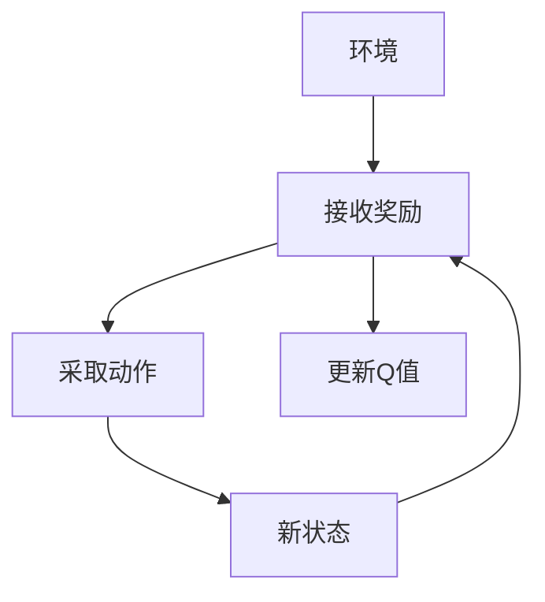
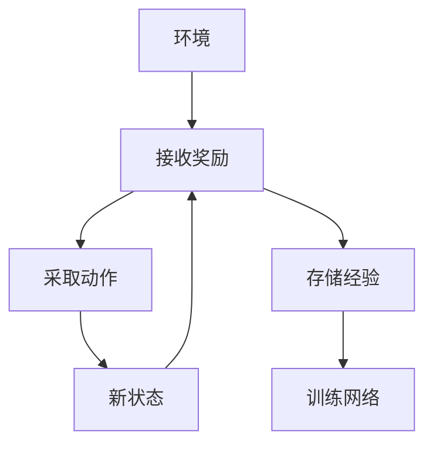
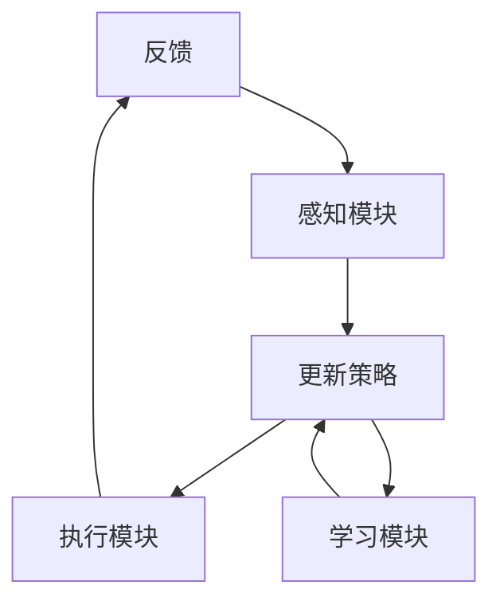
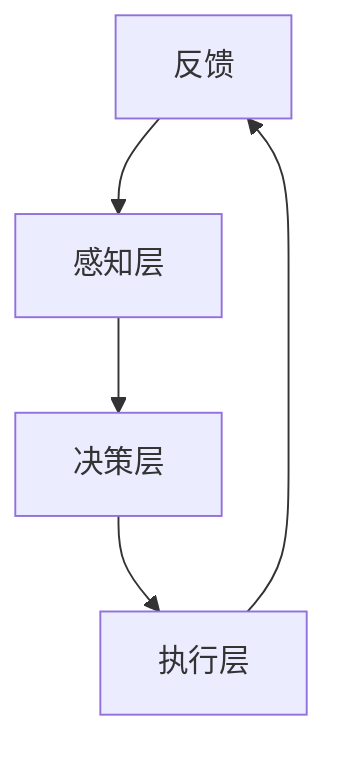
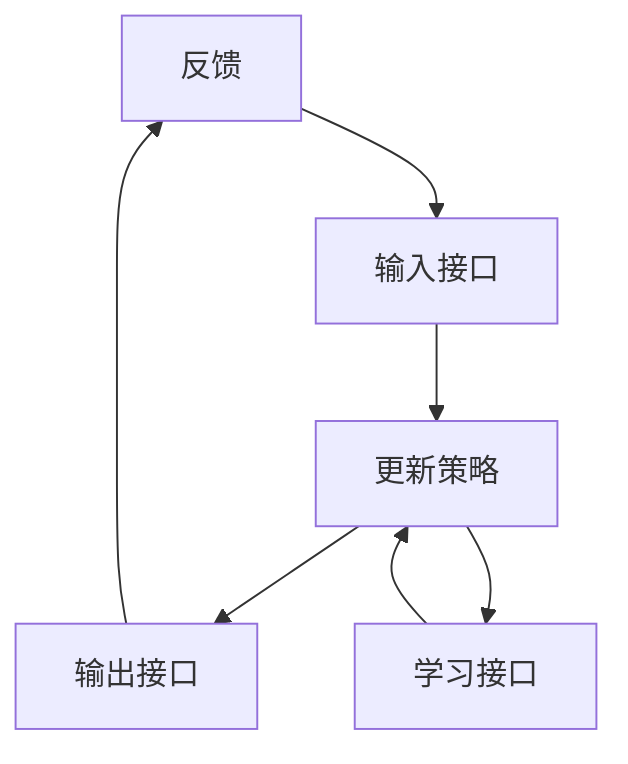

                 


# AI Agent的强化学习在智能控制中的应用

---

## 关键词：AI Agent，强化学习，智能控制，Q-learning，Deep Q-Network（DQN），系统架构设计

---

## 摘要：

本文探讨AI Agent在智能控制中的强化学习应用，详细分析了强化学习的核心算法及其在智能控制系统中的实现。通过理论与实践结合，从算法原理到系统架构设计，再到项目实战，全面解析强化学习在智能控制中的应用潜力与挑战。

---

# 第一部分: AI Agent与强化学习基础

---

# 第1章: AI Agent与强化学习概述

## 1.1 AI Agent的基本概念

### 1.1.1 AI Agent的定义

AI Agent（人工智能代理）是指在环境中能够感知并自主行动以实现目标的智能实体。它可以是一个软件程序、机器人或其他智能系统，具备以下核心特征：

- **自主性**：能够在没有外部干预的情况下自主决策。
- **反应性**：能够根据环境反馈实时调整行为。
- **目标导向性**：具备明确的目标，并采取行动以最大化目标的实现。

### 1.1.2 AI Agent的核心特征

- **智能性**：通过学习和推理，适应复杂环境。
- **交互性**：与环境和其他Agent交互，获取信息并采取行动。
- **适应性**：能够根据环境变化调整策略。

### 1.1.3 AI Agent的分类与应用场景

AI Agent可以根据智能水平分为：
1. **反应式Agent**：基于当前感知做出反应，如PID控制器。
2. **认知式Agent**：具备复杂推理和规划能力，如自动驾驶系统。

应用场景包括：
- 智能机器人
- 自动驾驶
- 智能助手（如Siri、Alexa）

---

## 1.2 强化学习的基本概念

### 1.2.1 强化学习的定义

强化学习（Reinforcement Learning，RL）是一种机器学习方法，通过智能体与环境的交互，学习采取最优动作以最大化累积奖励。

### 1.2.2 强化学习的核心要素

- **状态（State）**：环境中的情况，如机器人当前的位置。
- **动作（Action）**：智能体采取的行动，如“向右转”。
- **奖励（Reward）**：环境对动作的反馈，指导智能体的行为。
- **策略（Policy）**：智能体选择动作的规则，记为$\pi(a|s)$。
- **值函数（Value Function）**：评估状态或动作奖励的期望值，如Q值。

### 1.2.3 强化学习与监督学习的区别

| **方面** | **监督学习** | **强化学习** |
|----------|--------------|--------------|
| 数据来源 | 标签数据      | 环境反馈      |
| 目标     | 最小化误差    | 最大化累积奖励  |
| 决策权   | 模型决定      | 智能体决定     |

---

## 1.3 强化学习在智能控制中的应用背景

### 1.3.1 智能控制的基本概念

智能控制是通过人工智能技术实现的自动化控制，能够适应复杂动态环境。

### 1.3.2 强化学习在智能控制中的优势

- **自适应性**：无需精确的数学模型，适应动态环境。
- **经验驱动**：通过试错学习，适合复杂任务。
- **实时决策**：快速响应环境变化。

### 1.3.3 当前研究与应用现状

- **研究热点**：多智能体强化学习、高维状态空间处理。
- **应用场景**：智能机器人、自动驾驶、游戏AI。

---

## 1.4 本章小结

本章介绍了AI Agent和强化学习的基本概念，并分析了强化学习在智能控制中的优势和应用前景，为后续内容奠定了基础。

---

# 第二部分: 强化学习算法原理

---

# 第2章: 强化学习算法基础

## 2.1 Q-learning算法

### 2.1.1 Q-learning的基本原理

Q-learning是一种基于值函数的强化学习算法，通过更新Q表（Q-value table）记录状态-动作对的期望奖励。

### 2.1.2 Q-learning的数学模型

Q值更新公式：
$$ Q(s,a) = Q(s,a) + \alpha [r + \gamma \max_{a'} Q(s',a') - Q(s,a)] $$

其中：
- $\alpha$：学习率（$0 < \alpha \leq 1$）
- $\gamma$：折扣因子（$0 \leq \gamma \leq 1$）

### 2.1.3 Q-learning的收敛性分析

- **收敛性**：在离散状态空间下，Q-learning算法在探索率$\epsilon$逐渐减小的情况下，Q值会收敛到最优值。
- **应用场景**：适用于离散状态和动作空间的简单环境，如棋类游戏。

### 2.1.4 Q-learning的优缺点

| **优点** | **缺点** |
|----------|----------|
| 简单易实现 | 适用于离散状态空间 |
| 不需要环境模型 | 无法处理高维状态空间 |
| 离线学习 | 对策略空间不适用 |

---

## 2.2 Deep Q-Network (DQN)算法

### 2.2.1 DQN算法的基本原理

DQN通过神经网络近似Q值函数，解决了高维状态空间的计算难题。

### 2.2.2 DQN的网络结构与训练流程

- **网络结构**：双网络（主网络和目标网络）。
- **训练流程**：
  1. 从经验回放中采样经验。
  2. 更新目标网络权重。
  3. 训练主网络最小化预测Q值与目标Q值的差值。

### 2.2.3 DQN的优缺点

| **优点** | **缺点** |
|----------|----------|
| 处理高维状态空间 | 训练不稳定 |
| 使用经验回放 | 需要大量计算资源 |
| 离线学习 | 收敛较慢 |

---

## 2.3 算法流程图

Q-learning流程图：


DQN流程图：


---

## 2.4 本章小结

本章介绍了Q-learning和DQN两种经典算法，分析了它们的优缺点及应用场景，为后续章节的实现奠定了算法基础。

---

# 第三部分: AI Agent的强化学习实现

---

# 第3章: AI Agent的强化学习实现

## 3.1 环境与状态空间定义

### 3.1.1 状态空间的构建

- **状态定义**：将环境中的关键因素抽象为状态。
- **状态表示**：使用向量或其他数据结构表示状态。

### 3.1.2 动作空间的定义

- **动作定义**：明确智能体可执行的动作。
- **动作表示**：使用枚举或向量表示动作。

### 3.1.3 奖励函数设计

- **设计原则**：奖励应明确引导智能体向目标方向行动。
- **示例**：在机器人导航中，到达目标点奖励+1，碰撞障碍物奖励-1。

---

## 3.2 系统架构设计

### 3.2.1 系统功能模块

- **感知模块**：接收环境反馈。
- **决策模块**：执行强化学习算法，选择动作。
- **执行模块**：将动作转化为实际操作。
- **学习模块**：更新模型参数，提升策略。

### 3.2.2 系统架构图



---

## 3.3 系统实现代码

### 3.3.1 环境定义

```python
class Environment:
    def __init__(self):
        self.state = 0  # 初始状态
        self.done = False  # 是否完成

    def step(self, action):
        # 根据动作更新状态
        pass

    def reset(self):
        # 重置环境
        self.state = 0
        self.done = False
```

### 3.3.2 强化学习算法实现

```python
class DQN:
    def __init__(self, state_space, action_space):
        self.state_space = state_space
        self.action_space = action_space
        self.model = self.build_model()

    def build_model(self):
        # 构建神经网络模型
        pass

    def remember(self, state, action, reward, next_state, done):
        # 存储经验
        pass

    def act(self, state):
        # 选择动作
        pass

    def train(self):
        # 训练网络
        pass
```

---

## 3.4 本章小结

本章详细讲解了AI Agent的强化学习实现过程，从环境定义到算法实现，为后续系统设计和项目实战奠定了基础。

---

# 第四部分: 系统分析与架构设计

---

# 第4章: 系统分析与架构设计

## 4.1 系统功能设计

### 4.1.1 功能模块

- **感知模块**：接收环境输入。
- **决策模块**：执行强化学习算法。
- **执行模块**：输出控制指令。
- **学习模块**：更新模型参数。

### 4.1.2 系统功能流程图


---

## 4.2 系统架构设计

### 4.2.1 分层架构

- **感知层**：处理环境输入。
- **决策层**：执行强化学习算法。
- **执行层**：输出控制指令。

### 4.2.2 系统架构图



---

## 4.3 接口设计与交互流程

### 4.3.1 系统接口

- **输入接口**：接收环境状态。
- **输出接口**：发送控制指令。
- **学习接口**：更新模型参数。

### 4.3.2 交互流程图



---

## 4.4 本章小结

本章分析了智能控制系统的功能模块和架构设计，为后续项目实施提供了指导。

---

# 第五部分: 项目实战

---

# 第5章: 项目实战

## 5.1 项目背景

### 5.1.1 项目介绍

以智能机器人导航为例，设计一个基于强化学习的控制系统。

## 5.2 环境搭建

### 5.2.1 安装必要的库

```bash
pip install gym numpy tensorflow
```

## 5.3 代码实现

### 5.3.1 环境类实现

```python
class NavigationEnvironment:
    def __init__(self):
        self.position = (0, 0)
        self.goal = (5, 5)
        self.obstacles = [(2, 2), (3, 3)]

    def step(self, action):
        # 更新状态
        pass

    def reset(self):
        self.position = (0, 0)
```

### 5.3.2 DQN算法实现

```python
class DQN:
    def __init__(self, state_dim, action_dim):
        self.state_dim = state_dim
        self.action_dim = action_dim
        self.model = self.build_model()

    def build_model(self):
        # 构建神经网络模型
        pass

    def remember(self, state, action, reward, next_state, done):
        # 存储经验
        pass

    def act(self, state):
        # 选择动作
        pass

    def train(self):
        # 训练网络
        pass
```

### 5.3.3 训练与测试

```python
env = NavigationEnvironment()
dqn = DQN(state_dim=2, action_dim=4)
for episode in range(1000):
    state = env.reset()
    while not done:
        action = dqn.act(state)
        next_state, reward, done, _ = env.step(action)
        dqn.remember(state, action, reward, next_state, done)
        dqn.train()
```

## 5.4 案例分析与结果展示

### 5.4.1 训练过程

- **训练曲线**：展示奖励随训练步数的变化。
- **路径规划**：显示机器人在不同训练阶段的导航路径。

## 5.5 本章小结

本章通过实际项目展示了AI Agent的强化学习在智能控制中的应用，验证了算法的有效性和系统的可行性。

---

# 第六部分: 最佳实践与总结

---

# 第6章: 最佳实践与总结

## 6.1 最佳实践

### 6.1.1 算法选择

- 根据问题规模选择合适算法：简单环境选择Q-learning，复杂环境选择DQN。
- 调参技巧：合理设置学习率和折扣因子。

### 6.1.2 系统设计

- 明确系统模块划分，确保各模块职责清晰。
- 使用经验回放机制，提高训练效率。

## 6.2 未来研究方向

- **多智能体强化学习**：研究多个智能体协作的控制策略。
- **复杂环境建模**：开发更高效的环境模拟方法。
- **实时决策优化**：提升算法在动态环境下的实时性。

## 6.3 总结

本文系统介绍了AI Agent的强化学习在智能控制中的应用，从理论到实践，详细讲解了算法实现和系统设计，为后续研究提供了参考。

---

# 结语

通过本文的探讨，读者可以深入了解AI Agent的强化学习在智能控制中的应用，掌握核心算法和系统设计方法，为实际应用提供了理论支持和实践指导。

