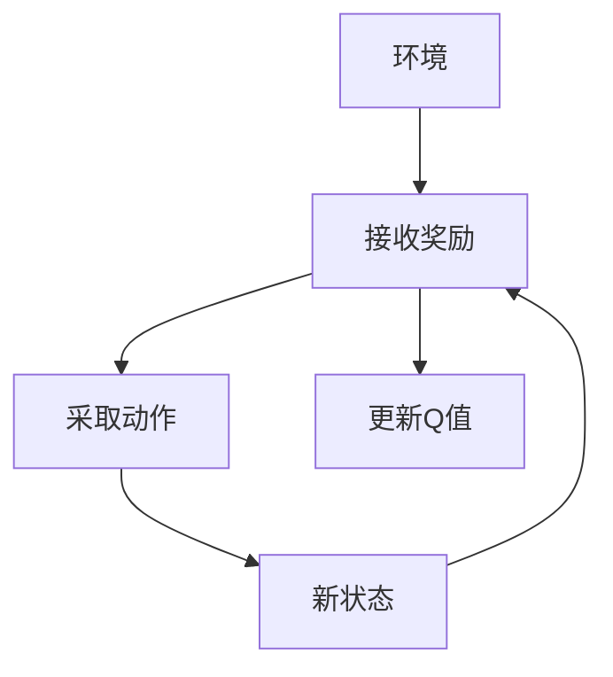
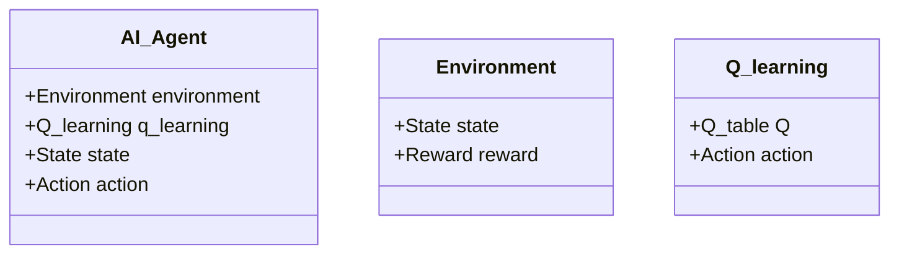
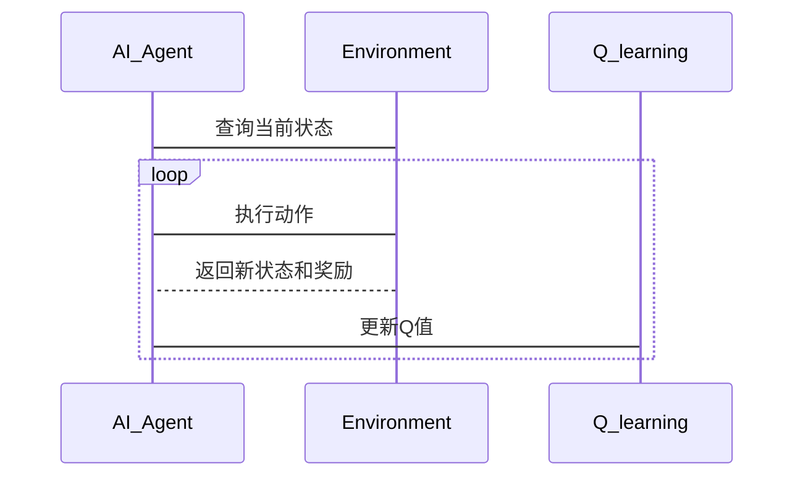

                 


# AI Agent的强化学习在智能控制中的应用

## 关键词：AI Agent, 强化学习, 智能控制, 深度强化学习, 系统架构设计

## 摘要：本文深入探讨AI Agent在智能控制中的应用，结合强化学习的理论基础与实际案例，分析强化学习在智能控制系统中的实现方法和优化策略。通过详细阐述强化学习算法、系统架构设计、项目实战等内容，帮助读者全面理解AI Agent在智能控制中的应用潜力与实现细节。

---

## 第1章: AI Agent与强化学习概述

### 1.1 AI Agent的基本概念

#### 1.1.1 AI Agent的定义
AI Agent（人工智能代理）是指在计算机系统中，能够感知环境、自主决策并执行任务的智能体。AI Agent的核心目标是通过感知环境信息，采取合理行动以实现预定目标。

#### 1.1.2 AI Agent的核心特征
AI Agent具有以下核心特征：
1. **自主性**：能够自主决策，无需外部干预。
2. **反应性**：能够实时感知环境并做出反应。
3. **主动性**：主动采取行动以实现目标。
4. **学习能力**：能够通过经验优化决策策略。

#### 1.1.3 AI Agent的分类与应用场景
AI Agent可以分为以下几类：
1. **简单反射型AI Agent**：基于当前状态做出反应，如PID控制器。
2. **基于模型的反应型AI Agent**：维护环境模型，基于模型做出决策。
3. **目标驱动型AI Agent**：基于目标驱动行为，如路径规划。
4. **效用驱动型AI Agent**：基于效用函数优化决策，如机器人优化控制。

应用场景包括自动驾驶、智能机器人、智能家居控制、工业自动化等。

---

### 1.2 强化学习的基本概念

#### 1.2.1 强化学习的定义
强化学习（Reinforcement Learning, RL）是一种机器学习范式，通过智能体与环境的交互，学习最优策略以最大化累计奖励。

#### 1.2.2 强化学习的核心要素
强化学习的核心要素包括：
1. **环境**：智能体所处的环境。
2. **状态**：环境中的当前情况。
3. **动作**：智能体采取的行动。
4. **奖励**：环境对智能体行为的反馈。
5. **策略**：智能体选择动作的规则。

#### 1.2.3 强化学习与监督学习的区别
| 特性 | 监督学习 | 强化学习 |
|------|----------|----------|
| 数据 | 标签数据 | 状态、动作、奖励 |
| 目标 | 最小化误差 | 最大化累计奖励 |
| 决策 | 确定性 | 非确定性 |

---

### 1.3 强化学习在智能控制中的应用背景

#### 1.3.1 智能控制的基本概念
智能控制是一种基于人工智能技术的控制方法，通过感知、决策和执行实现对系统的智能调控。

#### 1.3.2 强化学习在智能控制中的优势
1. **自适应性**：能够根据环境变化自适应优化控制策略。
2. **全局优化**：通过强化学习算法，可以找到全局最优控制策略。
3. **复杂环境处理**：适用于非线性、不确定的复杂环境。

#### 1.3.3 当前研究与应用现状
当前，强化学习在智能控制中的应用研究主要集中在以下方面：
1. **自动驾驶**：路径规划、避障控制。
2. **机器人控制**：自适应抓取、动态平衡。
3. **工业自动化**：优化生产流程、设备协同控制。

---

### 1.4 本章小结
本章介绍了AI Agent的基本概念、强化学习的核心要素及其在智能控制中的应用背景，为后续章节的深入探讨奠定了基础。

---

## 第2章: 强化学习算法原理

### 2.1 Q-learning算法

#### 2.1.1 Q-learning的基本原理
Q-learning是一种基于值函数的强化学习算法，通过学习状态-动作值函数（Q值）来优化决策策略。

#### 2.1.2 Q-learning的数学模型
$$ Q(s,a) = r + \gamma \max_{a'} Q(s',a') $$
其中：
- \( Q(s,a) \)：状态 \( s \) 下采取动作 \( a \) 的期望奖励。
- \( r \)：当前动作带来的即时奖励。
- \( \gamma \)：折扣因子，表示未来奖励的现值权重。
- \( s' \)：采取动作 \( a \) 后的新状态。

#### 2.1.3 Q-learning的收敛性分析
Q-learning算法通过迭代更新Q值，最终收敛于最优策略。其收敛性依赖于马尔可夫决策过程（MDP）的假设。

---

### 2.2 Deep Q-Network (DQN)算法

#### 2.2.1 DQN算法的基本原理
DQN是一种基于深度学习的强化学习算法，通过神经网络近似Q值函数，解决高维状态空间的计算问题。

#### 2.2.2 DQN的网络结构与训练流程
DQN算法包括两个神经网络：主网络和目标网络。主网络用于评估当前策略，目标网络用于稳定训练过程。

#### 2.2.3 DQN的优缺点分析
优点：
- 能够处理高维状态空间。
- 通过经验回放减少样本偏差。
缺点：
- 训练过程可能不稳定。
- 需要大量计算资源。

---

### 2.3 算法流程图



---

### 2.4 本章小结
本章详细介绍了Q-learning和DQN算法的基本原理及其数学模型，为后续章节的系统实现奠定了理论基础。

---

## 第3章: AI Agent的强化学习实现

### 3.1 环境与状态空间定义

#### 3.1.1 状态空间的构建
状态空间是智能体所处环境的所有可能状态的集合。在智能控制中，状态通常包括系统的输入、传感器数据等。

#### 3.1.2 动作空间的设计
动作空间是智能体能够采取的所有动作的集合。在智能控制中，动作通常包括输出信号、控制指令等。

---

### 3.2 强化学习算法实现

#### 3.2.1 Q-learning算法实现
以下是一个简单的Q-learning算法实现代码：

```python
import numpy as np

# 初始化Q表
Q = np.zeros([state_space_size, action_space_size])

# 参数设置
alpha = 0.1
gamma = 0.9

# Q-learning算法
for episode in range(num_episodes):
    state = env.reset()
    while True:
        action = np.argmax(Q[state, :])
        next_state, reward, done = env.step(action)
        Q[state, action] += alpha * (reward + gamma * np.max(Q[next_state, :]) - Q[state, action])
        state = next_state
        if done:
            break
```

---

### 3.3 系统架构设计

#### 3.3.1 系统功能设计
以下是AI Agent的系统功能设计类图：



---

### 3.4 本章小结
本章通过实现Q-learning算法，详细介绍了AI Agent的强化学习实现过程，包括环境定义、状态空间构建、动作空间设计等。

---

## 第4章: 智能控制系统架构设计与实现

### 4.1 系统架构设计

#### 4.1.1 系统组成模块
智能控制系统主要包括以下几个模块：
1. **环境感知模块**：负责感知环境信息。
2. **状态识别模块**：将环境信息转换为状态。
3. **策略选择模块**：基于Q值选择动作。
4. **动作执行模块**：将动作转化为实际操作。

#### 4.1.2 系统交互流程
以下是系统交互流程的序列图：



---

### 4.2 项目实战

#### 4.2.1 环境搭建
在Python中使用OpenAI Gym库搭建强化学习环境。

#### 4.2.2 代码实现
以下是智能控制系统的代码实现：

```python
import gym
import numpy as np

# 初始化环境
env = gym.make('CartPole-v0')
state_space_size = env.observation_space.shape[0]
action_space_size = env.action_space.n

# 初始化Q表
Q = np.zeros([state_space_size, action_space_size])

# 参数设置
alpha = 0.1
gamma = 0.9

# Q-learning算法
for episode in range(1000):
    state = env.reset()
    while True:
        # 选择动作
        action = np.argmax(Q[state, :])
        # 执行动作
        next_state, reward, done, _ = env.step(action)
        # 更新Q值
        Q[state, action] += alpha * (reward + gamma * np.max(Q[next_state, :]) - Q[state, action])
        state = next_state
        if done:
            break
        # 渲染环境
        env.render()
    print(f"Episode {episode} completed.")

# 关闭环境
env.close()
```

---

### 4.3 实际案例分析

#### 4.3.1 案例选择
以经典控制问题CartPole为例，展示强化学习在智能控制中的应用。

#### 4.3.2 案例分析
通过Q-learning算法训练AI Agent控制小车保持平衡，最终实现稳定控制。

---

### 4.4 本章小结
本章通过实际案例分析，详细展示了强化学习在智能控制系统中的实现过程，包括环境搭建、算法实现、系统测试等。

---

## 第5章: 总结与展望

### 5.1 总结
本文详细探讨了AI Agent的强化学习在智能控制中的应用，从理论基础到实际案例，全面分析了强化学习在智能控制中的实现方法和优化策略。

### 5.2 展望
未来的研究方向包括：
1. **多智能体强化学习**：研究多个AI Agent协同工作的强化学习方法。
2. **实时应用优化**：优化强化学习算法，提升在实时控制系统中的应用效率。
3. **复杂环境适应**：研究强化学习在更复杂、动态环境中的应用。

---

## 关键词
AI Agent, 强化学习, 智能控制, 深度强化学习, 系统架构设计

---

## 结语
通过本文的探讨，读者可以全面理解AI Agent的强化学习在智能控制中的应用潜力与实现细节，为后续的研究和实践提供有益的参考。

