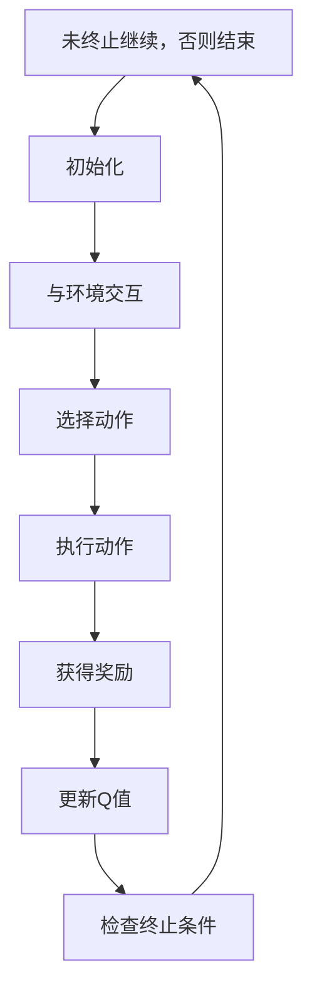
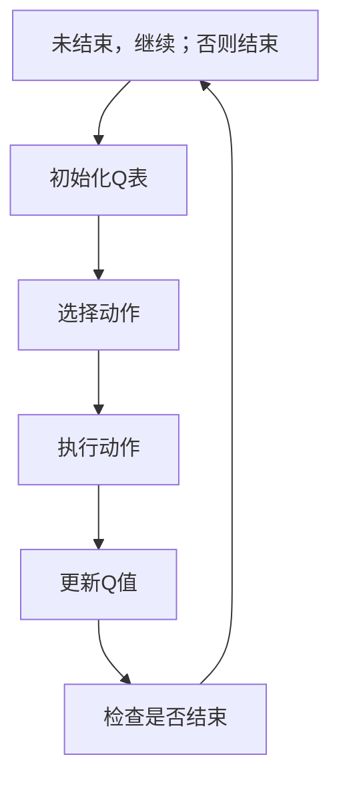

                 


# AI Agent的强化学习在智能调度中的应用

**关键词**：AI Agent、强化学习、智能调度、Q-learning算法、系统架构

**摘要**：本文深入探讨了AI Agent结合强化学习在智能调度中的应用。首先介绍了强化学习和AI Agent的基本概念，接着分析了强化学习的数学模型与算法原理，详细讲解了AI Agent的结构与功能。然后从系统需求分析、架构设计、接口设计等方面详细阐述了智能调度系统的构建过程。通过Q-learning算法实现了一个智能调度案例，并提供了Python代码实现。最后总结了项目经验，给出了优化建议和未来研究方向。

---

# 第1章 强化学习与AI Agent概述

## 1.1 强化学习的基本概念

### 1.1.1 强化学习的定义

强化学习（Reinforcement Learning，RL）是一种机器学习范式，其中智能体通过与环境交互来学习策略。智能体通过执行动作来获得奖励或惩罚，从而优化其行为以最大化累积奖励。

### 1.1.2 强化学习的核心要素

| 核心要素 | 描述 |
|----------|------|
| 状态 (State) | 智能体所处的环境情况。 |
| 动作 (Action) | 智能体可以执行的操作。 |
| 奖励 (Reward) | 执行动作后获得的反馈，用于指导学习。 |
| 策略 (Policy) | 定义智能体在状态下的动作选择概率。 |
| 值函数 (Value Function) | 预测状态或状态-动作对的未来累积奖励。 |

### 1.1.3 强化学习与监督学习的区别

| 方面 | 监督学习 | 强化学习 |
|------|----------|----------|
| 数据 | 标签数据 | 奖励信号 |
| 目标 | 最小化预测误差 | 最大化累积奖励 |
| 交互 | 无交互 | 有交互 |

## 1.2 AI Agent的定义与特点

### 1.2.1 AI Agent的定义

AI Agent（智能体）是能够感知环境并采取行动以实现目标的实体。它具备自主性、反应性、社交性和持续性的特点。

### 1.2.2 AI Agent的核心特点

| 特点 | 描述 |
|------|------|
| 自主性 | 能够自主决策，无需外部干预。 |
| 反应性 | 能够实时感知环境并做出反应。 |
| 社交性 | 能够与其他智能体或人类进行交互。 |
| 持续性 | 能够持续运行并适应环境变化。 |

### 1.2.3 AI Agent与传统AI的区别

| 方面 | 传统AI | AI Agent |
|------|--------|----------|
| 行为 | 静态计算 | 动态交互 |
| 目标 | 解决特定问题 | 实现长期目标 |
| 环境 | 离线处理 | 在线处理 |

## 1.3 强化学习在AI Agent中的应用

### 1.3.1 强化学习在AI Agent中的作用

强化学习为AI Agent提供了自适应和自优化的能力，使其能够通过与环境的交互不断改进行为策略。

### 1.3.2 强化学习与AI Agent的结合方式

通过强化学习，AI Agent能够学习到最优策略，从而在智能调度中实现资源分配、任务调度等复杂任务。

### 1.3.3 强化学习在智能调度中的潜力

强化学习能够处理动态变化的环境，适合应用于智能调度中的资源分配、负载均衡等问题。

## 1.4 本章小结

本章介绍了强化学习的基本概念、核心要素以及AI Agent的定义与特点，重点阐述了强化学习在AI Agent中的应用及其在智能调度中的潜力。

---

# 第2章 强化学习的数学模型与算法原理

## 2.1 强化学习的核心算法

### 2.1.1 Q-learning算法

Q-learning是一种基于值函数的强化学习算法，通过更新Q值表来学习最优策略。

### 2.1.2 Deep Q-Networks (DQN)算法

DQN通过深度神经网络近似Q值函数，解决了传统Q-learning的高维状态和动作空间问题。

### 2.1.3 Policy Gradient方法

Policy Gradient方法直接优化策略，通过梯度上升方法最大化累积奖励。

## 2.2 强化学习的数学模型

### 2.2.1 状态空间与动作空间

状态空间表示所有可能的状态，动作空间表示所有可能的动作。

### 2.2.2 Q值的更新公式

Q值更新公式为：
$$ Q(s, a) \leftarrow Q(s, a) + \alpha [r + \gamma \max Q(s', a') - Q(s, a)] $$

其中，$\alpha$是学习率，$\gamma$是折扣因子。

### 2.2.3 动作选择的概率分布

在策略中，动作选择的概率分布可以用Softmax函数表示：
$$ P(a|s) = \frac{e^{\theta \cdot Q(s,a)}}{\sum_{a'} e^{\theta \cdot Q(s,a')}} $$

## 2.3 强化学习的算法流程图



## 2.4 本章小结

本章详细介绍了强化学习的核心算法及其数学模型，重点讲解了Q-learning算法的原理和实现。

---

# 第3章 AI Agent的强化学习实现

## 3.1 AI Agent的结构与功能

### 3.1.1 状态感知模块

通过传感器或接口获取环境状态信息。

### 3.1.2 动作选择模块

基于当前状态和训练好的策略选择最优动作。

### 3.1.3 奖励机制模块

根据动作执行的结果生成奖励信号。

## 3.2 强化学习在AI Agent中的实现

### 3.2.1 状态表示方法

使用向量或特征编码表示状态。

### 3.2.2 动作选择策略

基于Q值或策略网络选择动作。

### 3.2.3 奖励函数设计

定义奖励函数以指导学习方向。

## 3.3 AI Agent的训练过程

### 3.3.1 离线训练与在线训练

离线训练在历史数据上进行，在线训练在实时环境中进行。

### 3.3.2 网络结构设计

使用卷积神经网络或循环神经网络处理状态信息。

### 3.3.3 超参数调整

调整学习率、折扣因子等参数以优化性能。

## 3.4 本章小结

本章详细讲解了AI Agent的结构与功能，并介绍了强化学习在其中的实现过程。

---

# 第4章 智能调度系统的需求分析与设计

## 4.1 智能调度系统的定义

智能调度系统是一种利用AI技术优化资源分配和任务调度的系统。

## 4.2 智能调度系统的功能需求

### 4.2.1 资源分配功能

根据资源使用情况动态分配任务。

### 4.2.2 调度优化功能

优化调度策略以提高效率。

### 4.2.3 状态监控功能

实时监控系统运行状态。

## 4.3 智能调度系统的架构设计

### 4.3.1 分层架构设计

分为感知层、调度层和执行层。

### 4.3.2 模块化设计

包括状态感知模块、调度算法模块和执行模块。

### 4.3.3 接口设计

定义模块之间的交互接口。

## 4.4 本章小结

本章分析了智能调度系统的需求，并设计了系统的架构和功能模块。

---

# 第5章 基于强化学习的智能调度实现

## 5.1 项目环境安装

安装Python、TensorFlow和OpenAI Gym等库。

## 5.2 核心代码实现

### 5.2.1 Q-learning算法实现

```python
import gym
import numpy as np

env = gym.make('CartPole-v1')
state_space = env.observation_space.shape[0]
action_space = env.action_space.n

Q = np.zeros((state_space, action_space))

alpha = 0.1
gamma = 0.99

def q_learning(state):
    if np.random.random() > 0.999:
        action = env.action_space.sample()
    else:
        action = np.argmax(Q[state])
    return action

for episode in range(1000):
    state = env.reset()
    while True:
        action = q_learning(state)
        next_state, reward, done, _ = env.step(action)
        Q[state][action] = Q[state][action] + alpha * (reward + gamma * np.max(Q[next_state]) - Q[state][action])
        state = next_state
        if done:
            break
```

### 5.2.2 系统交互流程



## 5.3 代码解读与分析

### 5.3.1 环境初始化

使用OpenAI Gym的CartPole环境进行训练。

### 5.3.2 动作选择

基于Q值表选择动作，探索与利用结合。

### 5.3.3 Q值更新

根据奖励和下一状态的Q值更新当前状态的动作Q值。

## 5.4 案例分析

通过训练Q-learning算法，实现了CartPole的平衡控制，验证了算法的有效性。

## 5.5 项目小结

本章通过实际案例展示了强化学习在智能调度中的应用，并提供了完整的代码实现。

---

# 第6章 最佳实践与优化建议

## 6.1 小结

强化学习在智能调度中的应用前景广阔，但仍需解决收敛速度和样本效率等问题。

## 6.2 注意事项

- 确保奖励函数设计合理。
- 避免过高的探索或利用。
- 定期更新模型参数。

## 6.3 拓展阅读

建议阅读《Deep Reinforcement Learning》和《Reinforcement Learning: Theory and Algorithms》等书籍。

---

# 附录

## 附录A 代码库与工具

- OpenAI Gym
- TensorFlow
- PyTorch

## 附录B 术语表

- 强化学习（Reinforcement Learning）
- Q值（Q-value）
- 策略（Policy）

---

# 结语

本文全面介绍了AI Agent的强化学习在智能调度中的应用，通过理论分析和实践案例，展示了其在资源分配和任务调度中的潜力。未来，随着算法的优化和计算能力的提升，强化学习将在智能调度中发挥更大的作用。

