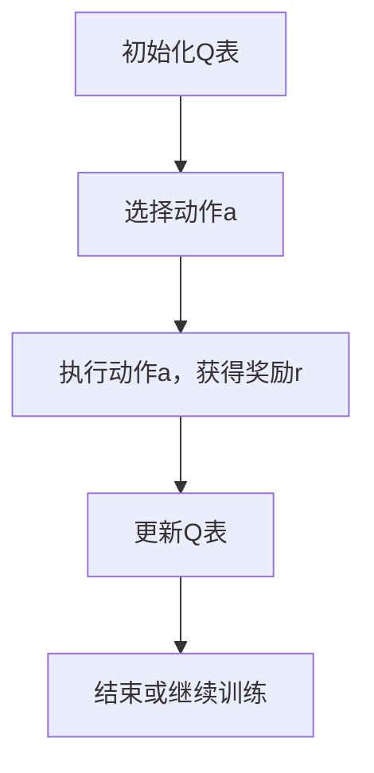
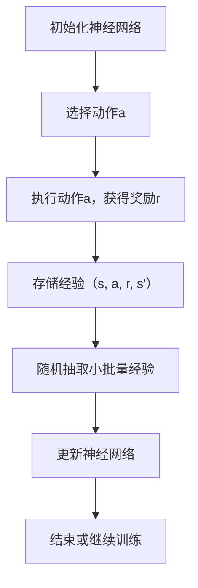
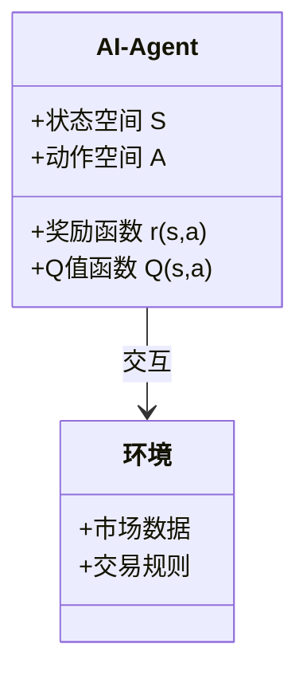
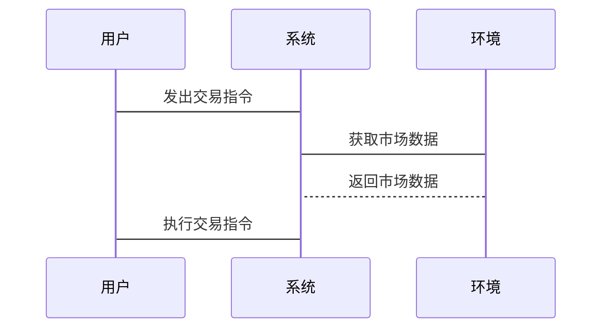

                 


```markdown
# AI Agent的强化学习在自动化交易中的应用

> 关键词：AI Agent，强化学习，自动化交易，金融，数学模型，算法，系统架构，项目实战

> 摘要：本文系统地探讨了AI Agent在自动化交易中的应用，从强化学习的基本原理到实际系统架构设计，再到项目实战，全面分析了AI Agent在金融交易中的优势与挑战。通过详细讲解强化学习算法、系统架构设计和项目实现，展示了如何利用AI Agent优化交易策略，提升交易效率和收益。本文还探讨了实际应用中的挑战及解决方案，并展望了未来的发展方向。

---

## 第1章: AI Agent与强化学习概述

### 1.1 AI Agent的基本概念

#### 1.1.1 AI Agent的定义
AI Agent（人工智能代理）是指能够感知环境、自主决策并采取行动以实现目标的智能实体。AI Agent可以是软件程序、机器人或其他智能系统，具备以下核心特征：

- **自主性**：能够在没有外部干预的情况下独立运作。
- **反应性**：能够感知环境并实时调整行为。
- **目标导向**：行动基于明确的目标。

#### 1.1.2 AI Agent的核心特性
| 特性 | 描述 |
|------|------|
| 自主性 | 能够自主决策，无需外部控制 |
| 反应性 | 能够感知环境变化并实时调整行为 |
| 目标导向 | 行动基于明确的目标 |
| 学习能力 | 能够通过经验改进性能 |

#### 1.1.3 强化学习与AI Agent的关系
强化学习是一种机器学习范式，通过智能体与环境交互，学习采取最优动作以最大化累积奖励。AI Agent结合强化学习，能够实现自主决策和优化，广泛应用于自动化交易、游戏AI、机器人控制等领域。

### 1.2 强化学习的基本原理

#### 1.2.1 强化学习的定义
强化学习（Reinforcement Learning, RL）是一种机器学习方法，通过智能体与环境的交互，学习采取最优动作以最大化累积奖励。智能体通过观察环境状态、选择动作并接收奖励，逐步优化策略。

#### 1.2.2 强化学习的核心要素
| 要素 | 描述 |
|------|------|
| 状态 (State) | 智能体所处的环境状况 |
| 动作 (Action) | 智能体采取的行为 |
| 奖励 (Reward) | 对智能体行为的反馈，指导学习方向 |
| 策略 (Policy) | 状态到动作的映射，表示智能体如何选择动作 |

#### 1.2.3 强化学习与监督学习的区别
| 方面 | 监督学习 | 强化学习 |
|------|---------|----------|
| 数据来源 | 标签数据 | 环境反馈 |
| 反馈机制 | 确定性标签 | 延迟奖励 |
| 目标 | 最小化预测误差 | 最大化累积奖励 |

### 1.3 本章小结
本章介绍了AI Agent的基本概念及其核心特性，详细阐述了强化学习的基本原理和核心要素，为后续章节奠定了理论基础。

---

## 第2章: 强化学习的数学模型

### 2.1 状态空间与动作空间

#### 2.1.1 状态空间的定义
状态空间（State Space）是所有可能状态的集合。在自动化交易中，状态可以是当前的市场数据，如股票价格、交易量等。

#### 2.1.2 动作空间的定义
动作空间（Action Space）是智能体所有可能动作的集合。在交易中，动作可以是买入、卖出或持有。

#### 2.1.3 状态与动作的数学表示
假设市场有n只股票，状态空间S可以表示为：

$$ S = \{s_1, s_2, \ldots, s_n\} $$

其中，$s_i$ 表示第i只股票的状态。

动作空间A可以表示为：

$$ A = \{a_1, a_2, a_3\} $$

其中，$a_1$ 表示买入，$a_2$ 表示卖出，$a_3$ 表示持有。

### 2.2 奖励函数与价值函数

#### 2.2.1 奖励函数的定义
奖励函数r(s, a)表示在状态s下采取动作a所获得的奖励。例如，在股票交易中，如果卖出股票获得收益，奖励函数将返回正值。

#### 2.2.2 价值函数的定义
价值函数V(s)表示在状态s下采取最优策略的期望奖励。数学上，可以表示为：

$$ V(s) = \max_a Q(s, a) $$

其中，Q(s, a)是Q值函数。

#### 2.2.3 奖励函数与价值函数的关系
奖励函数是价值函数的基础，价值函数通过最大化Q值来优化决策。

### 2.3 策略与策略评估

#### 2.3.1 策略的定义
策略π(s)表示在状态s下选择动作a的概率分布。例如：

$$ \pi(a|s) = P(\text{选择动作 } a \text{ 在状态 } s) $$

#### 2.3.2 策略评估的定义
策略评估是计算策略π下的价值函数Vπ(s)。数学上，可以表示为：

$$ V^\pi(s) = \sum_{a} \pi(a|s) Q^\pi(s, a) $$

### 2.4 算法对比与选择

#### 2.4.1 Q-learning与Deep Q-learning的对比
| 方面 | Q-learning | Deep Q-learning |
|------|------------|----------------|
| 适用场景 | 小规模状态空间 | 大规模状态空间 |
| 计算复杂度 | 低 | 高 |
| 学习能力 | 弱 | 强 |

#### 2.4.2 算法选择的考虑因素
- 状态空间规模
- 计算资源
- 数据量

---

## 第3章: 强化学习的核心算法

### 3.1 Q-learning算法

#### 3.1.1 Q-learning的定义
Q-learning是一种基于值函数的强化学习算法，通过更新Q表来学习最优策略。

#### 3.1.2 Q-learning的数学公式
Q值更新公式：

$$ Q(s, a) = Q(s, a) + \alpha (r + \gamma \max_{a'} Q(s', a') - Q(s, a)) $$

其中：
- α是学习率
- γ是折扣因子
- r是奖励

#### 3.1.3 Q-learning的算法流程图


### 3.2 Deep Q-learning算法

#### 3.2.1 Deep Q-learning的定义
Deep Q-learning通过神经网络近似Q函数，适用于大规模状态空间。

#### 3.2.2 Deep Q-learning的数学模型
神经网络结构：

$$ Q(s, a) = \sigma(w_2 \sigma(w_1 s + b_1) + b_2) $$

其中，σ是激活函数，w是权重，b是偏置。

#### 3.2.3 Deep Q-learning的算法流程图


---

## 第4章: AI Agent在金融中的应用

### 4.1 自动化交易的背景

#### 4.1.1 自动化交易的定义
自动化交易是指通过算法和计算机系统自动执行交易决策，减少人为干预。

#### 4.1.2 自动化交易的类型
| 类型 | 描述 |
|------|------|
| 算法交易 | 基于数学模型的交易 |
| 高频交易 | 高频执行交易策略 |
| 统计套利 | 利用资产价格差异进行套利 |

#### 4.1.3 AI Agent在金融中的应用
AI Agent可以用于实时市场监控、交易决策优化、风险控制等领域。

### 4.2 AI Agent的特性

#### 4.2.1 自主决策
AI Agent能够在没有人类干预的情况下独立决策。

#### 4.2.2 自适应能力
AI Agent能够根据市场变化动态调整策略。

#### 4.2.3 学习能力
AI Agent能够通过历史数据优化交易策略。

### 4.3 实际应用

#### 4.3.1 高频交易中的应用
高频交易需要快速决策，AI Agent能够实时分析市场数据，优化订单执行策略。

#### 4.3.2 统计套利中的应用
AI Agent可以通过分析市场数据，识别资产价格差异，进行统计套利。

---

## 第5章: 自动化交易的系统架构设计

### 5.1 系统模块划分

| 模块 | 功能 |
|------|------|
| 数据获取 | 从数据源获取市场数据 |
| 策略执行 | 根据AI Agent决策执行交易 |
| 风险控制 | 监控和管理交易风险 |

### 5.2 系统架构图


### 5.3 系统接口设计
- 数据接口：获取市场数据
- 交易接口：执行交易指令
- 日志接口：记录交易日志

### 5.4 系统交互流程


---

## 第6章: 项目实战

### 6.1 环境安装
安装所需的库：

```bash
pip install numpy pandas scikit-learn tensorflow keras matplotlib
```

### 6.2 代码实现
```python
import numpy as np
import tensorflow as tf
from tensorflow.keras import layers

# 定义神经网络结构
model = tf.keras.Sequential([
    layers.Dense(64, activation='relu', input_shape=(input_dim,)),
    layers.Dense(64, activation='relu'),
    layers.Dense(3, activation='linear')  # 动作空间：买入、卖出、持有
])

# 编译模型
model.compile(optimizer='adam', loss='mean_squared_error')

# 训练模型
model.fit(X_train, y_train, epochs=100, batch_size=32)
```

### 6.3 测试与优化
- 回测策略：在历史数据上测试策略，计算收益和风险指标。
- 参数调整：优化学习率、批量大小、网络结构等。

### 6.4 结果分析
- 绩效评估：计算夏普比率、最大回撤等指标。
- 比较不同策略的收益和风险。

---

## 第7章: 挑战与解决方案

### 7.1 数据质量问题
解决方案：
- 数据清洗：去除噪声数据，处理缺失值。
- 特征工程：提取有用的特征，如技术指标、市场情绪等。

### 7.2 模型过拟合
解决方案：
- 正则化：在损失函数中添加L2正则化项。
- Dropout：在神经网络中添加Dropout层，防止过拟合。

### 7.3 计算资源限制
解决方案：
- 分布式训练：利用多台机器并行训练。
- 使用云计算：租用云服务器进行训练。

### 7.4 监管合规性
解决方案：
- 遵守交易规则，避免市场操纵，确保透明度。

---

## 第8章: 未来展望

### 8.1 技术趋势
- 多智能体协作：多个AI Agent协同工作，优化交易策略。
- 强化学习与NLP结合：利用自然语言处理技术分析市场新闻。

### 8.2 研究热点
- 跨模态学习：结合图像、文本等多种数据源进行交易决策。
- 自适应策略：根据市场变化动态调整策略。

### 8.3 行业影响
- 更高效的交易系统：AI Agent能够快速决策，捕捉市场机会。
- 更智能的风险控制：通过实时监控和学习，降低交易风险。

---

## 附录

### 附录A: 代码实现细节
详细代码实现，包括数据获取、策略实现、网络结构等。

### 附录B: 项目部署与扩展
如何将模型部署到生产环境，使用云服务或本地服务器。扩展功能：多资产交易、多目标优化、实时监控。

---

## 总结

本文全面探讨了AI Agent在自动化交易中的应用，从强化学习的理论基础到实际系统架构设计，再到项目实战，详细分析了AI Agent的优势与挑战。通过具体案例和详细代码实现，展示了如何利用AI Agent优化交易策略，提升交易效率和收益。未来，随着技术的进步，AI Agent在金融领域的应用将更加广泛和深入。
```

