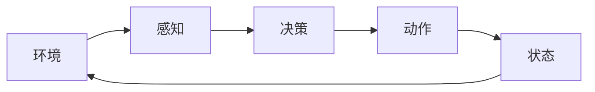
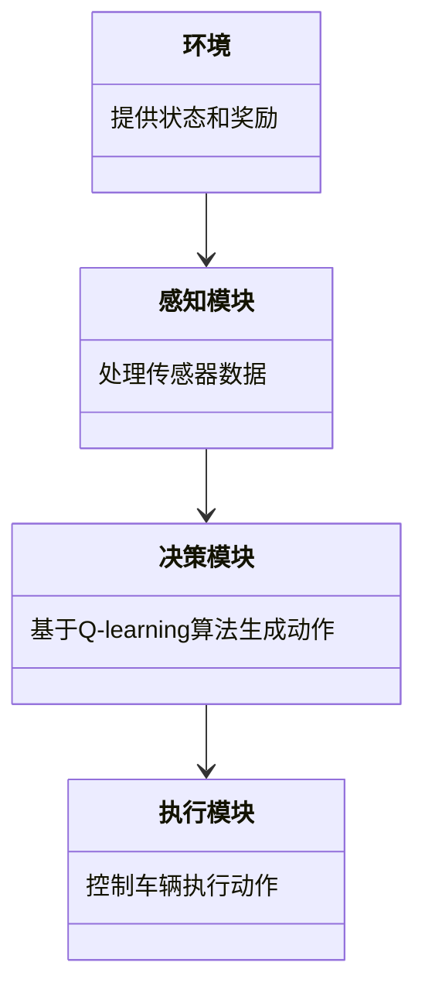

                 


# AI Agent的强化学习在自动驾驶中的应用

> 关键词：强化学习，AI Agent，自动驾驶，深度学习，系统架构，算法实现

> 摘要：本文深入探讨了AI Agent在自动驾驶中的应用，特别是强化学习在其中的关键作用。通过分析强化学习算法、AI Agent的设计实现、系统架构以及实际项目案例，本文为读者提供了从理论到实践的全面指南，帮助理解并掌握AI Agent在自动驾驶中的应用。

---

## 第一部分: AI Agent与强化学习基础

### 第1章: 强化学习与AI Agent概述

#### 1.1 强化学习的基本概念

- **强化学习的定义**：强化学习是一种机器学习范式，通过智能体与环境的交互，学习策略以最大化累计奖励。智能体通过试错学习，逐步优化其行为策略。
  
- **强化学习的核心要素**：
  - **环境（Environment）**：智能体所处的外部世界，提供状态和奖励。
  - **状态（State）**：环境在某一时刻的描述，例如车速、距离、障碍物等。
  - **动作（Action）**：智能体在给定状态下采取的行为，例如加速、刹车、转向。
  - **奖励（Reward）**：智能体行为的反馈，用于指导学习。
  - **策略（Policy）**：决定智能体在某一状态下采取什么动作的规则。

- **AI Agent的定义与特点**：
  - AI Agent是一个智能实体，能够感知环境并采取行动以实现目标。
  - AI Agent具有自主性、反应性、目标导向性和社会性等特点。

#### 1.2 强化学习与自动驾驶的关联

- **自动驾驶的定义与分类**：
  - 自动驾驶技术分为L0到L5五个级别，从无自动化（L0）到完全自动化（L5）。
  - 强化学习主要应用于L4和L5级别的自动驾驶，涉及复杂的决策和环境交互。

- **强化学习在自动驾驶中的作用**：
  - 用于训练自动驾驶系统的决策模块，使其能够在复杂交通环境中做出最优决策。
  - 通过模拟真实场景，降低实际道路测试的风险和成本。

- **AI Agent在自动驾驶中的应用场景**：
  - 路径规划：根据环境信息生成最优行驶路径。
  - 决策优化：在复杂交通情况下做出决策，例如变道、超车。
  - 行为预测：预测其他交通参与者的行为，提前规划行驶策略。

#### 1.3 自动驾驶中的强化学习挑战

- **环境复杂性**：
  - 自动驾驶系统需要处理多样化的交通场景，包括不同类型的车辆、行人、障碍物等。
  - 复杂的交通规则和动态变化的环境增加了决策的难度。

- **动作空间与状态空间的复杂性**：
  - 状态空间可能包含数百个维度，包括车辆的位置、速度、加速度，以及其他交通参与者的信息。
  - 动作空间可能包括数百种可能的动作，例如转向的角度和加速度的大小。

- **训练效率与实时性要求**：
  - 强化学习需要大量的训练数据和计算资源，如何在有限的时间内完成高效的训练是一个挑战。
  - 自动驾驶系统需要在实时环境中做出快速决策，对算法的计算效率提出高要求。

#### 1.4 本章小结

本章介绍了强化学习的基本概念和AI Agent的定义，分析了强化学习在自动驾驶中的应用和挑战。理解这些内容对于后续章节的学习至关重要。

---

### 第2章: 强化学习算法原理

#### 2.1 基础强化学习算法

- **Q-learning算法**：
  - Q-learning是一种基于值函数的强化学习算法，通过更新Q值函数来学习最优策略。
  - Q值函数表示在给定状态下采取某个动作后的预期回报。

- **Deep Q-Network (DQN)算法**：
  - DQN通过深度神经网络近似Q值函数，解决了传统Q-learning在处理高维状态空间时的局限性。
  - 使用经验回放机制和目标网络来稳定训练过程。

- **Policy Gradient方法**：
  - Policy Gradient直接优化策略，通过梯度上升方法最大化累积奖励。
  - 适用于动作空间离散或连续的情况。

#### 2.2 强化学习算法的数学模型

- **Q值函数的数学表达**：
  $$ Q(s, a) = r + \gamma \max_{a'} Q(s', a') $$
  - 其中，$s$是当前状态，$a$是动作，$r$是奖励，$\gamma$是折扣因子，$s'$是下一个状态。

- **损失函数的数学表达**：
  $$ \text{损失} = \frac{1}{2} (r + \gamma Q(s', a') - Q(s, a))^2 $$
  - 这是均方误差损失函数，用于衡量预测值与实际值之间的差异。

#### 2.3 算法流程图（使用mermaid）



#### 2.4 本章小结

本章详细介绍了强化学习的几种基础算法，包括Q-learning、DQN和Policy Gradient方法，并通过数学公式和流程图帮助读者理解其工作原理。

---

## 第二部分: AI Agent的设计与实现

### 第3章: AI Agent的设计与实现

#### 3.1 AI Agent的感知模块

- **感知模块的核心功能**：
  - 从环境中获取感知数据，例如来自摄像头、激光雷达、雷达等传感器的数据。
  - 对感知数据进行处理，识别障碍物、道路标志、行人等。

- **常用传感器与数据处理**：
  - **摄像头**：用于视觉感知，识别交通信号灯、车道线、行人等。
  - **激光雷达**：用于高精度的障碍物检测和距离测量。
  - **雷达**：用于检测车辆周围环境的速度和距离信息。

- **感知算法的实现**：
  - 使用深度学习模型，如卷积神经网络（CNN）进行图像识别。
  - 使用点云处理算法，如K-D树进行障碍物检测。

#### 3.2 AI Agent的决策模块

- **决策模块的核心逻辑**：
  - 根据感知数据和当前状态，结合强化学习算法，生成最优动作。
  - 优化路径规划，确保安全性和效率。

- **基于强化学习的决策算法**：
  - 使用DQN算法进行决策，通过不断试错学习最优策略。
  - 使用策略梯度方法，直接优化策略以最大化累积奖励。

#### 3.3 AI Agent的执行模块

- **执行模块的核心功能**：
  - 根据决策模块生成的动作，控制车辆的执行机构，例如转向、加速、刹车等。
  - 确保动作执行的准确性和实时性。

- **执行模块的实现**：
  - 使用控制器进行动作的精确执行，例如PID控制器。
  - 通过CAN总线或其他通信协议与车辆执行机构进行交互。

#### 3.4 AI Agent的系统架构图（使用mermaid）



#### 3.5 本章小结

本章详细介绍了AI Agent的感知、决策和执行模块的设计与实现，通过系统架构图展示了各模块之间的关系和协同工作方式。

---

## 第三部分: 强化学习在自动驾驶中的应用

### 第4章: 强化学习在自动驾驶中的应用

#### 4.1 强化学习在路径规划中的应用

- **路径规划的定义**：
  - 路径规划是自动驾驶系统的重要组成部分，旨在找到从起点到终点的最优路径。
  - 考虑交通规则、障碍物、道路限制等因素，确保路径的安全性和效率。

- **基于强化学习的路径规划算法**：
  - 使用DQN算法，通过模拟环境训练智能体在不同场景下生成最优路径。
  - 使用策略梯度方法，优化路径规划策略，使其在复杂环境中表现更好。

#### 4.2 强化学习在决策优化中的应用

- **决策优化的定义**：
  - 在复杂的交通环境中，智能体需要做出最优决策，例如在多辆车争抢车道时选择最佳动作。
  - 考虑其他交通参与者的动作预测，优化自身的决策策略。

- **基于强化学习的决策优化算法**：
  - 使用多智能体强化学习（MARL），模拟多个交通参与者的交互，优化智能体的决策策略。
  - 使用深度强化学习（Deep RL）处理高维状态空间，提高决策的效率和准确性。

#### 4.3 强化学习在行为预测中的应用

- **行为预测的定义**：
  - 预测其他交通参与者（如车辆、行人）的行为，帮助自动驾驶系统做出更安全的决策。
  - 通过历史数据和当前状态，预测其他参与者的下一步动作。

- **基于强化学习的行为预测算法**：
  - 使用强化学习模型预测其他参与者的动作，例如使用DQN算法进行动作预测。
  - 通过模拟训练，优化预测模型的准确性。

#### 4.4 应用场景分析

- **场景1：城市道路驾驶**：
  - 在复杂的城市交通中，智能体需要处理多样化的交通场景，例如变道、红绿灯、行人穿越等。
  - 使用强化学习优化路径规划和决策策略，确保安全和效率。

- **场景2：高速公路驾驶**：
  - 在高速公路上，智能体需要处理快速行驶的车辆和复杂的交通流。
  - 使用强化学习优化超车和变道策略，提高行驶效率。

#### 4.5 应用流程图（使用mermaid）


#### 4.6 本章小结

本章分析了强化学习在自动驾驶中的具体应用，包括路径规划、决策优化和行为预测，并通过流程图展示了应用的逻辑。

---

## 第四部分: 系统架构与项目实战

### 第5章: 系统架构设计

#### 5.1 系统架构设计概述

- **自动驾驶系统整体架构**：
  - 包括感知模块、决策模块、执行模块和通信模块。
  - 各模块协同工作，确保系统的整体性能和稳定性。

- **系统功能设计**：
  - 感知模块负责处理多源传感器数据，提供环境信息。
  - 决策模块基于强化学习算法，生成最优动作。
  - 执行模块负责控制车辆的执行机构，实现动作的执行。

#### 5.2 系统架构图（使用mermaid）


#### 5.3 系统交互设计

- **系统交互设计概述**：
  - 各模块之间通过通信协议进行交互，例如CAN总线、ROS消息等。
  - 系统需要处理高频率的交互，确保实时性。

- **系统接口设计**：
  - 感知模块与决策模块之间的接口：传递感知数据和状态信息。
  - 决策模块与执行模块之间的接口：传递动作指令和状态反馈。

#### 5.4 本章小结

本章详细介绍了自动驾驶系统的整体架构设计，包括各模块的功能和交互方式，并通过系统架构图展示了系统的结构。

---

### 第6章: 项目实战

#### 6.1 项目环境搭建

- **开发环境的选择**：
  - 建议使用Ubuntu操作系统，安装必要的开发工具，例如ROS（Robot Operating System）。
  - 安装Python、TensorFlow、Keras等深度学习框架。

- **硬件配置要求**：
  - CPU：建议使用多核CPU，例如8核及以上。
  - GPU：使用NVIDIA GPU，安装CUDA和cuDNN，加速深度学习模型的训练。

- **软件安装与配置**：
  - 安装ROS，配置虚拟环境，安装强化学习库，例如OpenAI Gym、TensorFlow等。

#### 6.2 系统核心实现源代码

- **强化学习算法实现**：
  - 使用Python编写DQN算法，实现Q值函数的更新和经验回放。
  - 代码示例：

```python
import numpy as np
import random
from collections import deque

class DQN:
    def __init__(self, state_space, action_space, gamma=0.99, epsilon=1.0, epsilon_min=0.01, epsilon_decay=0.995):
        self.state_space = state_space
        self.action_space = action_space
        self.gamma = gamma
        self.epsilon = epsilon
        self.epsilon_min = epsilon_min
        self.epsilon_decay = epsilon_decay
        self.memory = deque(maxlen=1000)
        self.model = self.build_model()

    def build_model(self):
        # 使用Keras构建DQN模型
        from tensorflow.keras.models import Sequential
        from tensorflow.keras.layers import Dense, Dropout
        model = Sequential()
        model.add(Dense(24, activation='relu', input_dim=self.state_space))
        model.add(Dropout(0.2))
        model.add(Dense(24, activation='relu'))
        model.add(Dropout(0.2))
        model.add(Dense(self.action_space, activation='linear'))
        model.compile(optimizer='adam', loss='mse')
        return model

    def remember(self, state, action, reward, next_state):
        self.memory.append((state, action, reward, next_state))

    def act(self, state):
        if random.random() < self.epsilon:
            return random.randint(0, self.action_space - 1)
        return self.model.predict(np.array(state).reshape(1, -1))[0].argmax()

    def replay(self, batch_size):
        if len(self.memory) < batch_size:
            return
        minibatch = random.sample(self.memory, batch_size)
        states = np.array([t[0] for t in minibatch])
        actions = np.array([t[1] for t in minibatch])
        rewards = np.array([t[2] for t in minibatch])
        next_states = np.array([t[3] for t in minibatch])
        
        target = rewards + self.gamma * np.amax(self.model.predict(next_states), axis=1)
        target = np.clip(target, -1, 1)
        
        y = self.model.predict(states)
        y[np.arange(batch_size), actions] = target
        self.model.fit(states, y, epochs=1, verbose=0)
        
        if self.epsilon > self.epsilon_min:
            self.epsilon *= self.epsilon_decay
```

- **AI Agent实现代码**：
  - 使用上述DQN算法实现AI Agent的决策模块，与感知模块和执行模块协同工作。

#### 6.3 代码应用解读与分析

- **代码解读**：
  - `DQN`类实现了DQN算法，包括记忆库、模型构建、动作选择和经验回放。
  - `act`方法根据当前状态选择动作，`replay`方法通过经验回放更新模型。

- **代码分析**：
  - 使用Keras构建深度神经网络模型，训练模型以优化Q值函数。
  - 经验回放机制用于稳定训练过程，减少样本偏差。

#### 6.4 实际案例分析

- **案例1：城市道路驾驶**：
  - 在模拟的城市道路上训练AI Agent，使其能够安全地进行变道、超车和避让行人。
  - 使用DQN算法训练模型，测试其在复杂环境中的表现。

- **案例2：高速公路驾驶**：
  - 在模拟的高速公路上训练AI Agent，优化超车和变道策略。
  - 使用强化学习模型预测其他车辆的行为，优化决策过程。

#### 6.5 项目小结

本章通过实际项目案例，展示了如何在自动驾驶系统中应用强化学习算法。通过代码实现和案例分析，帮助读者理解强化学习在实际中的应用。

---

## 第五部分: 总结与展望

### 第7章: 总结与展望

#### 7.1 全文总结

- 本文详细探讨了AI Agent在自动驾驶中的应用，特别是强化学习在其中的关键作用。
- 介绍了强化学习的基本概念和算法原理，分析了AI Agent的设计与实现。
- 展示了强化学习在自动驾驶中的具体应用，包括路径规划、决策优化和行为预测。
- 通过实际项目案例，帮助读者理解强化学习在自动驾驶中的实践应用。

#### 7.2 未来展望

- **算法优化**：进一步优化强化学习算法，提高训练效率和决策准确性。
- **多智能体协同**：研究多智能体强化学习（MARL），模拟多个交通参与者的交互，优化整体决策策略。
- **实时性提升**：通过硬件加速和算法优化，提高自动驾驶系统的实时性。
- **安全性增强**：加强安全性的设计，确保自动驾驶系统在复杂环境中的稳定性和可靠性。

#### 7.3 最佳实践 tips

- 在实际应用中，建议结合仿真环境进行训练，降低实际道路测试的风险。
- 使用高效的训练策略，例如分布式训练和经验回放，提高训练效率。
- 注重系统的实时性和安全性设计，确保自动驾驶系统的稳定运行。

#### 7.4 本章小结

本文总结了强化学习在自动驾驶中的应用，并展望了未来的研究方向和发展趋势。

---

## 参考文献

- Mnih, V., et al. "Human-level control through deep reinforcement learning." Nature, 2015.
- Lillicrap, T. P., et al. "Continuous control with deep reinforcement learning." arXiv preprint arXiv:1509.02906, 2015.
- Sutton, R. S., and A. G. Barto. "Reinforcement learning: An introduction." MIT press, 2018.

---

# 结束语

通过本文的学习，读者可以深入了解强化学习在自动驾驶中的应用，掌握AI Agent的设计与实现方法，并通过实际项目案例理解强化学习在自动驾驶中的实践应用。希望本文能够为读者提供有价值的知识和启发，进一步推动自动驾驶技术的发展。

