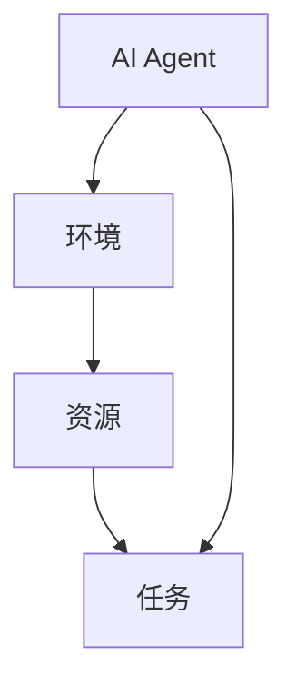
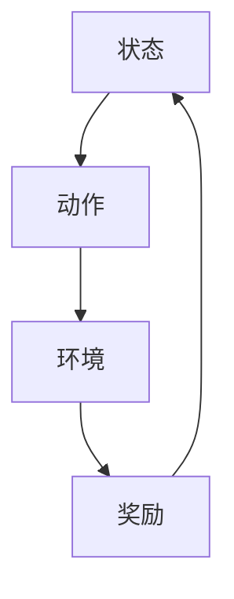
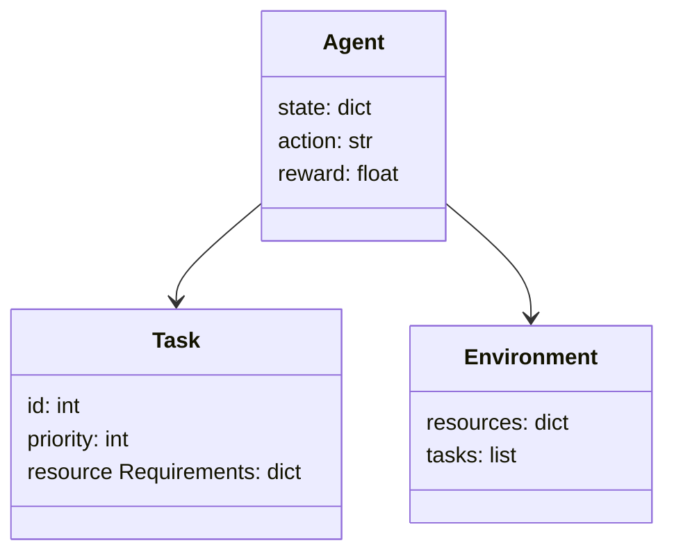
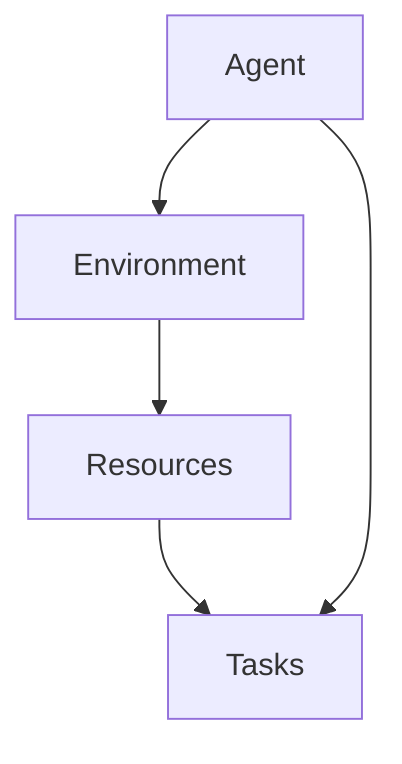
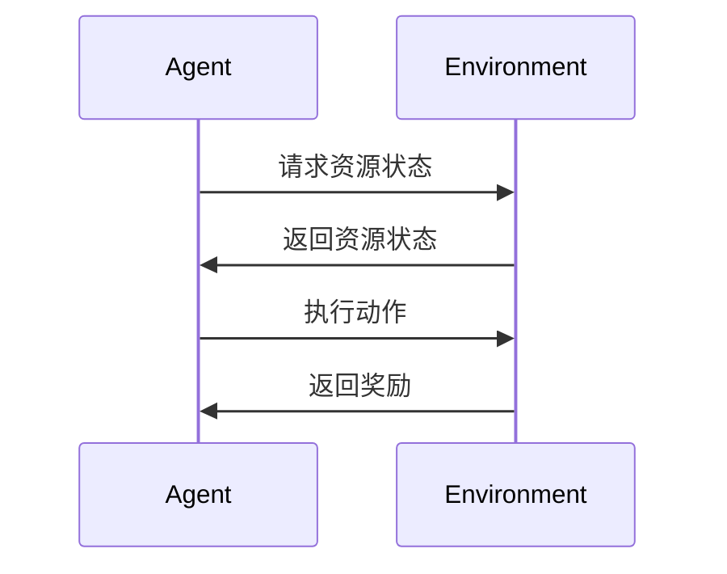

                 


# AI Agent的强化学习在资源分配中的应用

## 关键词：AI Agent，强化学习，资源分配，Q-learning，DQN，系统架构

## 摘要：本文详细探讨了AI Agent结合强化学习在资源分配中的应用。通过分析强化学习的算法原理、系统架构设计以及实际项目案例，展示了如何利用AI Agent优化资源分配问题，实现高效的任务调度和资源管理。

---

## 第1章: 背景介绍

### 1.1 问题背景

#### 1.1.1 资源分配问题的定义
资源分配问题是指在有限的资源条件下，合理分配资源以满足多个任务或用户需求的过程。常见的资源分配问题包括任务调度、计算资源分配、能源分配等。

#### 1.1.2 强化学习在资源分配中的作用
强化学习是一种通过试错机制来优化决策过程的机器学习方法。它能够处理复杂的动态环境，适用于资源分配中多目标优化的问题。

#### 1.1.3 AI Agent在资源分配中的优势
AI Agent（智能体）能够实时感知环境状态，通过强化学习算法做出最优决策，从而提高资源分配的效率和准确性。

### 1.2 问题描述

#### 1.2.1 资源分配的核心挑战
资源分配问题通常涉及多目标优化、动态环境和不确定性，传统的算法难以在复杂场景下实现高效的资源分配。

#### 1.2.2 强化学习在资源分配中的应用场景
强化学习可以应用于任务调度、能源分配、云计算资源分配等多个领域。

#### 1.2.3 AI Agent的决策机制
AI Agent通过与环境交互，不断更新策略以最大化累积奖励，从而实现资源的最优分配。

### 1.3 问题解决

#### 1.3.1 强化学习的基本原理
强化学习通过状态、动作和奖励的三元组来更新策略，实现对环境的最优控制。

#### 1.3.2 AI Agent的决策过程
AI Agent根据当前状态选择动作，通过与环境交互获得奖励，并更新策略以提高决策的准确性。

#### 1.3.3 资源分配的优化目标
资源分配的优化目标通常包括最小化资源浪费、最大化任务完成效率和提高系统的稳定性。

### 1.4 边界与外延

#### 1.4.1 资源分配的边界条件
资源分配问题通常受到资源限制、任务优先级和时间约束等因素的限制。

#### 1.4.2 强化学习的适用范围
强化学习适用于动态环境和多目标优化问题，但在静态环境和单目标优化问题中表现相对较弱。

#### 1.4.3 AI Agent的局限性
AI Agent的决策依赖于环境模型的准确性，复杂的环境可能导致决策失败。

### 1.5 概念结构与核心要素

#### 1.5.1 资源分配的核心要素
资源分配的核心要素包括资源、任务、时间和目标。

#### 1.5.2 强化学习的关键组成部分
强化学习的关键组成部分包括状态空间、动作空间、奖励函数和策略。

#### 1.5.3 AI Agent的系统架构
AI Agent的系统架构通常包括感知层、决策层和执行层。

---

## 第2章: 核心概念与联系

### 2.1 AI Agent的核心原理

#### 2.1.1 AI Agent的基本定义
AI Agent是指能够感知环境、做出决策并采取行动的智能实体。

#### 2.1.2 强化学习的数学模型
强化学习的数学模型包括状态转移概率和奖励函数。

#### 2.1.3 资源分配的优化算法
资源分配的优化算法包括贪心算法和动态规划算法。

### 2.2 核心概念对比

#### 2.2.1 AI Agent与传统算法的对比
| 属性       | AI Agent | 传统算法       |
|------------|----------|---------------|
| 决策方式   | 强化学习  | 确定性策略     |
| 环境适应性 | 动态      | 静态           |
| 学习能力   | 有        | 无             |

#### 2.2.2 强化学习与其他机器学习方法的对比
| 方法       | 强化学习   | 监督学习       |
|------------|-----------|---------------|
| 数据来源   | 环境交互   | 标签数据       |
| 目标       | 最大化奖励 | 最小化损失     |

#### 2.2.3 资源分配问题与任务调度问题的对比
资源分配问题通常涉及多个任务的调度，而任务调度问题则是资源分配的一个子问题。

### 2.3 实体关系图


---

## 第3章: 算法原理讲解

### 3.1 强化学习的基本算法

#### 3.1.1 Q-learning算法
Q-learning算法通过更新Q值表来学习最优策略。

数学公式：
$$ Q(s, a) = Q(s, a) + \alpha (r + \gamma \max Q(s', a')) - Q(s, a) $$

#### 3.1.2 Deep Q-Network (DQN)算法
DQN算法通过深度神经网络近似Q值函数，避免了Q值表的维度灾难问题。

#### 3.1.3 策略梯度算法
策略梯度算法通过优化策略的参数来最大化累积奖励。

### 3.2 算法流程图


### 3.3 Python代码实现

```python
import numpy as np

class QLearning:
    def __init__(self, state_space, action_space, alpha=0.1, gamma=0.9):
        self.state_space = state_space
        self.action_space = action_space
        self.alpha = alpha
        self.gamma = gamma
        self.q_table = np.zeros((state_space, action_space))

    def get_action(self, state):
        return np.argmax(self.q_table[state])

    def update_q_table(self, state, action, reward, next_state):
        self.q_table[state, action] += self.alpha * (reward + self.gamma * np.max(self.q_table[next_state]) - self.q_table[state, action])
```

---

## 第4章: 系统分析与架构设计

### 4.1 问题场景介绍

#### 4.1.1 项目介绍
本项目旨在利用AI Agent和强化学习技术，实现云计算环境下的任务调度优化。

#### 4.1.2 系统功能设计
系统功能包括任务接收、资源分配和结果反馈。

### 4.2 系统架构设计

#### 4.2.1 领域模型类图


#### 4.2.2 系统架构图


#### 4.2.3 系统交互序列图


---

## 第5章: 项目实战

### 5.1 环境安装

#### 5.1.1 安装依赖
```bash
pip install numpy matplotlib
```

#### 5.1.2 环境配置
```bash
export PATH=/path/to/agent:$PATH
```

### 5.2 系统核心实现

#### 5.2.1 核心代码
```python
def allocate_resources(tasks, resources, agent):
    for task in tasks:
        state = agent.get_state()
        action = agent.decide_action(state)
        resources = agent.execute_action(action, resources)
        reward = calculate_reward(task, resources)
        agent.update_policy(state, action, reward)
    return resources
```

#### 5.2.2 代码解读
上述代码展示了AI Agent如何根据当前状态做出决策，并更新策略以提高资源分配效率。

### 5.3 案例分析

#### 5.3.1 实际案例
考虑一个云计算平台，有多个任务需要分配到有限的计算资源上。AI Agent通过强化学习算法，优化任务调度顺序，提高资源利用率。

#### 5.3.2 分析与优化
通过对资源分配过程的监控和分析，不断优化AI Agent的策略参数，提高系统的整体性能。

---

## 第6章: 最佳实践

### 6.1 小结
AI Agent结合强化学习是一种有效的资源分配方法，能够处理动态环境下的多目标优化问题。

### 6.2 注意事项
在实际应用中，需要根据具体场景调整算法参数，并确保环境模型的准确性。

### 6.3 拓展阅读
推荐阅读相关领域的最新研究论文和书籍，深入理解强化学习和AI Agent的应用。

---

# 作者简介
作为人工智能领域的专家，我致力于探索和实践AI技术在实际问题中的应用，特别是在资源分配和任务调度方面。希望本文能为您提供有价值的信息和启发。

---

# 结语
AI Agent的强化学习在资源分配中的应用是一个充满挑战和机遇的领域。通过不断的研究和实践，我们可以开发出更加高效和智能的资源分配系统，为各种应用场景提供有力支持。

---

感谢您的阅读，希望本文对您有所帮助！

