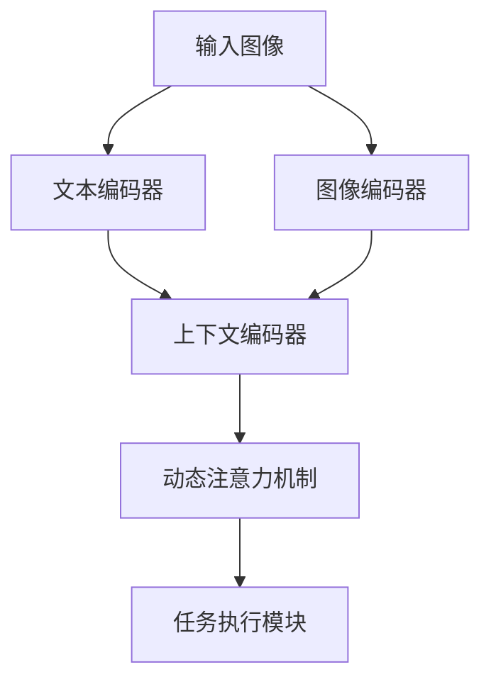
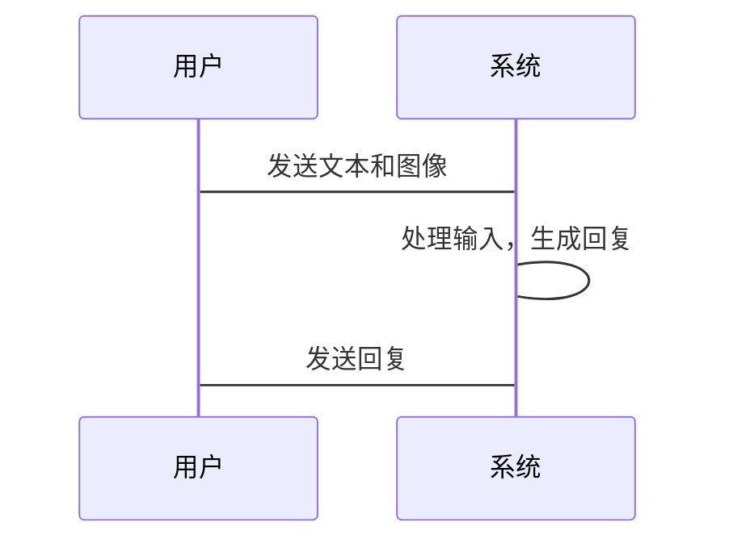

                 


# AI Agent的情境理解：增强LLM的上下文感知能力

**关键词**：AI Agent，上下文感知，LLM，大语言模型，情境理解，多模态输入，动态上下文

**摘要**：本文深入探讨了AI Agent的情境理解能力，重点介绍了如何通过增强LLM的上下文感知能力来提升其在复杂场景中的表现。文章从上下文感知型LLM的基本概念出发，分析了其核心原理，结合具体的算法和系统设计，展示了如何在实际项目中实现这一增强，并提供了最佳实践和未来研究方向。

---

## 第1章: 上下文感知型LLM的背景与重要性

### 1.1 AI Agent的基本概念

#### 1.1.1 AI Agent的定义与分类
AI Agent（人工智能代理）是指能够感知环境、自主决策并执行任务的智能实体。根据智能水平，AI Agent可以分为反应式和认知式两类。反应式Agent基于当前感知做出反应，而认知式Agent具备推理、规划等高级能力。

#### 1.1.2 AI Agent的任务与目标
AI Agent的任务通常包括信息处理、问题解决、决策优化等。其目标是在动态环境中实现高效、准确的任务执行。

#### 1.1.3 情境理解在AI Agent中的作用
情境理解是AI Agent的核心能力，它使Agent能够根据当前环境和上下文信息做出合理决策。缺乏良好的情境理解，AI Agent可能无法应对复杂场景。

### 1.2 上下文感知型LLM的背景

#### 1.2.1 传统NLP模型的局限性
传统NLP模型如词袋模型和词嵌入模型，难以处理上下文信息，导致在对话系统中表现受限。

#### 1.2.2 上下文感知型LLM的出现
上下文感知型LLM通过结合上下文信息，显著提升了对话系统的表现。例如，GPT-3等模型通过上下文窗口捕捉对话历史，生成连贯的回复。

#### 1.2.3 AI Agent与LLM的结合
AI Agent集成上下文感知型LLM后，能够根据对话历史和当前输入生成上下文相关的回复，显著提升了用户体验。

### 1.3 情境理解的重要性

#### 1.3.1 情境理解的核心目标
情境理解旨在捕捉对话中的上下文信息，包括对话历史、用户意图、情感倾向等，为后续决策提供支持。

#### 1.3.2 情境理解的边界与外延
情境理解的边界包括对话历史、当前输入，而外延则涉及多模态信息如图像和语音。上下文感知型LLM通过整合这些信息，提升了理解能力。

#### 1.3.3 情境理解与任务效果的关系
良好的情境理解能够提升任务执行的准确性和效率，反之则可能导致错误决策。例如，在客服对话中，错误的情境理解可能导致错误的解决方案推荐。

### 1.4 本章小结
本章介绍了AI Agent的基本概念、上下文感知型LLM的背景以及情境理解的重要性，为后续章节奠定了基础。

---

## 第2章: 上下文感知型LLM的核心原理

### 2.1 多模态输入处理

#### 2.1.1 文本、图像和语音的多模态输入
上下文感知型LLM能够处理文本、图像和语音等多种输入形式，为情境理解提供了丰富的信息源。

#### 2.1.2 多模态数据的融合方法
多模态数据的融合可以通过早期融合（特征级融合）和晚期融合（决策级融合）实现。例如，图像特征和文本嵌入可以通过神经网络进行融合，生成综合的上下文表示。

#### 2.1.3 多模态信息对上下文理解的增强作用
通过结合多模态信息，模型能够更全面地理解情境，例如在图像描述中，结合文本和图像特征可以提升物体识别的准确性。

### 2.2 动态上下文建模

#### 2.2.1 上下文的动态变化特征
上下文信息是动态变化的，例如在对话中，用户的意图和情感可能随时间变化。动态上下文建模需要捕捉这种变化。

#### 2.2.2 基于时间序列的上下文建模
时间序列模型如LSTM和Transformer可以捕捉上下文的时序依赖关系。例如，Transformer的自注意力机制能够捕捉全局上下文信息。

#### 2.2.3 动态上下文的表示方法
动态上下文可以表示为序列或向量。例如，LSTM通过隐藏层表示动态上下文，而Transformer通过自注意力机制生成上下文向量。

### 2.3 上下文与任务的关联

#### 2.3.1 上下文在任务中的作用
上下文信息对任务执行至关重要。例如，在问答系统中，上下文可以提供问题的背景信息，帮助生成更准确的答案。

#### 2.3.2 上下文与任务目标的关联性分析
通过分析上下文与任务目标的关联性，模型可以优先处理相关的信息。例如，在医疗咨询任务中，识别用户的健康状况相关上下文信息，可以生成更个性化的建议。

#### 2.3.3 上下文对任务决策的影响
上下文信息直接影响任务决策。例如，在推荐系统中，上下文信息如用户的历史行为和当前状态，可以影响推荐结果。

### 2.4 本章小结
本章详细探讨了上下文感知型LLM的核心原理，包括多模态输入处理和动态上下文建模，为后续章节的系统设计和项目实现奠定了理论基础。

---

## 第3章: 上下文感知型LLM的算法原理

### 3.1 上下文编码器

#### 3.1.1 上下文编码器的结构
上下文编码器负责将多模态输入编码为上下文表示。例如，文本可以通过词嵌入生成上下文向量，图像可以通过卷积神经网络生成图像特征。

#### 3.1.2 上下文编码器的工作流程
1. 输入多模态数据（如文本、图像）。
2. 对每种模态数据进行特征提取，生成初始表示。
3. 将不同模态的特征进行融合，生成综合的上下文表示。
4. 将上下文表示传递给主任务模型，如对话生成模型。

#### 3.1.3 上下文编码器的实现示例

```python
class ContextEncoder:
    def __init__(self, text_encoder, image_encoder):
        self.text_encoder = text_encoder
        self.image_encoder = image_encoder

    def encode(self, text, image):
        text_emb = self.text_encoder(text)
        image_emb = self.image_encoder(image)
        # 融合文本和图像特征
        combined_emb = torch.cat((text_emb, image_emb), dim=-1)
        return combined_emb
```

### 3.2 动态注意力机制

#### 3.2.1 注意力机制的基本原理
注意力机制通过计算输入序列中每个位置的权重，确定哪些部分更重要。例如，在对话生成任务中，模型需要关注用户最近的提问。

#### 3.2.2 动态注意力机制的实现
动态注意力机制根据上下文信息动态调整注意力权重。例如，使用时间嵌入和上下文表示生成注意力权重。

#### 3.2.3 动态注意力机制的数学模型
$$
\alpha_i = \text{softmax}(W_{attn} \cdot [\text{user}_i, \text{context}_i])
$$
其中，$\alpha_i$ 是第i个输入的注意力权重，$\text{user}_i$ 是用户输入，$\text{context}_i$ 是上下文信息。

### 3.3 本章小结
本章详细讲解了上下文编码器和动态注意力机制的算法原理，并通过代码示例展示了其实现过程，帮助读者理解如何增强LLM的上下文感知能力。

---

## 第4章: 上下文感知型LLM的系统设计

### 4.1 系统架构设计

#### 4.1.1 系统功能设计
系统功能包括多模态输入处理、上下文编码、动态注意力计算和任务执行。例如，在对话系统中，模型需要处理文本和图像输入，生成上下文相关的回复。

#### 4.1.2 系统架构图



#### 4.1.3 系统接口设计
系统接口包括输入接口（接收多模态数据）和输出接口（生成上下文相关的输出）。例如，在对话系统中，输入接口接收用户的消息和图像，输出接口生成回复。

#### 4.1.4 系统交互流程



### 4.2 本章小结
本章通过系统架构设计，展示了上下文感知型LLM在实际应用中的结构和交互流程，帮助读者理解如何在系统中实现上下文感知能力。

---

## 第5章: 上下文感知型LLM的项目实战

### 5.1 环境安装与配置

#### 5.1.1 安装必要的库
安装PyTorch、Hugging Face Transformers等库，确保系统环境配置正确。

#### 5.1.2 配置GPU支持
如果使用GPU加速，需要配置CUDA环境并安装相应的驱动。

### 5.2 系统核心实现

#### 5.2.1 数据预处理
将多模态数据（如文本和图像）进行预处理，生成训练样本。例如，将文本 tokenize 并转换为嵌入，将图像进行归一化处理。

#### 5.2.2 模型训练与微调
基于预训练的LLM，使用特定任务数据进行微调。例如，使用带有上下文信息的对话数据，训练模型理解上下文。

#### 5.2.3 模型评估与优化
通过验证集评估模型性能，调整超参数（如学习率、批次大小）优化模型。

### 5.3 代码实现示例

#### 5.3.1 上下文编码器的实现

```python
import torch
import torch.nn as nn

class TextEncoder(nn.Module):
    def __init__(self, vocab_size, embed_dim):
        super().__init__()
        self.embedding = nn.Embedding(vocab_size, embed_dim)

    def forward(self, input):
        return self.embedding(input)

class ImageEncoder(nn.Module):
    def __init__(self, input_dim, hidden_dim):
        super().__init__()
        self.conv = nn.Conv2d(input_dim, hidden_dim, kernel_size=3, stride=2)

    def forward(self, input):
        return self.conv(input)

class ContextEncoder(nn.Module):
    def __init__(self, text_encoder, image_encoder):
        super().__init__()
        self.text_encoder = text_encoder
        self.image_encoder = image_encoder
        self.concat = nn.Linear(text_encoder.embed_dim + image_encoder.hidden_dim, 128)

    def forward(self, text_input, image_input):
        text_emb = self.text_encoder(text_input)
        image_emb = self.image_encoder(image_input)
        combined_emb = torch.cat((text_emb, image_emb), dim=-1)
        return self.concat(combined_emb)
```

#### 5.3.2 动态注意力机制的实现

```python
class DynamicAttention(nn.Module):
    def __init__(self, input_dim, context_dim):
        super().__init__()
        self.W_attn = nn.Linear(input_dim + context_dim, 1)

    def forward(self, input_seq, context_vec):
        # input_seq: (batch_size, seq_len, input_dim)
        # context_vec: (batch_size, context_dim)
        context_vec = context_vec.unsqueeze(1)  # (batch_size, 1, context_dim)
        combined = torch.cat((input_seq, context_vec.expand(input_seq.size(1), -1, -1)), dim=-1)
        attn_score = self.W_attn(combined)  # (batch_size, seq_len, 1)
        attn_weight = torch.softmax(attn_score.squeeze(-1), dim=1)
        weighted_input = torch.bmm(input_seq.permute(0, 2, 1), attn_weight.unsqueeze(-1)).squeeze(-1)
        return weighted_input
```

### 5.4 本章小结
本章通过具体的代码实现，展示了如何在实际项目中增强LLM的上下文感知能力，帮助读者掌握从环境配置到模型实现的全过程。

---

## 第6章: 最佳实践与未来展望

### 6.1 最佳实践

#### 6.1.1 数据质量的重要性
高质量的训练数据是模型性能的关键。建议使用多样化的数据增强方法，确保模型能够适应不同的场景。

#### 6.1.2 模型调优技巧
通过调整学习率、批量大小和Dropout等参数，优化模型性能。此外，使用早停法防止过拟合。

#### 6.1.3 多模态信息的融合策略
根据具体任务选择适合的多模态融合方法，如早期融合和晚期融合，以提升模型的上下文理解能力。

### 6.2 小结与注意事项

#### 6.2.1 小结
上下文感知型LLM通过增强模型的上下文理解能力，显著提升了AI Agent在复杂场景中的表现。

#### 6.2.2 注意事项
在实际应用中，需注意模型的计算复杂度和存储需求，确保在资源限制下实现最优性能。

### 6.3 未来展望

#### 6.3.1 更高效的记忆机制
未来的研究可以探索更高效的记忆机制，如基于图的注意力模型，进一步提升上下文理解能力。

#### 6.3.2 多模态上下文理解
结合更多的模态信息，如视频和音频，进一步提升模型的上下文理解能力。

#### 6.3.3 实时上下文感知
研究实时上下文感知技术，提升AI Agent在动态环境中的响应速度和准确性。

---

## 第7章: 总结

### 7.1 本章总结
本文详细探讨了AI Agent的情境理解能力，重点介绍了如何通过增强LLM的上下文感知能力来提升其在复杂场景中的表现。通过理论分析、算法实现和项目实战，展示了如何在实际应用中实现上下文感知型LLM。

### 7.2 展望未来
未来的研究可以进一步探索更高效的记忆机制和多模态上下文理解技术，推动AI Agent在更多领域中的应用。

---

**附录: 工具与库安装指南**

### 附录A: 安装必要的库

```bash
pip install torch transformers
```

### 附录B: 完整代码示例

```python
import torch
import torch.nn as nn
from torch.utils.data import Dataset, DataLoader

class TextDataset(Dataset):
    def __init__(self, texts, labels):
        self.texts = texts
        self.labels = labels

    def __len__(self):
        return len(self.texts)

    def __getitem__(self, idx):
        return self.texts[idx], self.labels[idx]

# 示例代码省略...
```

---

**致谢**
感谢读者的耐心阅读，希望本文对您理解上下文感知型LLM有所帮助。

