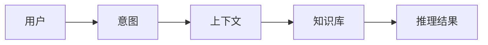
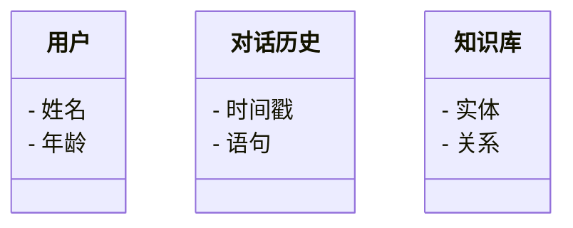
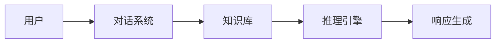
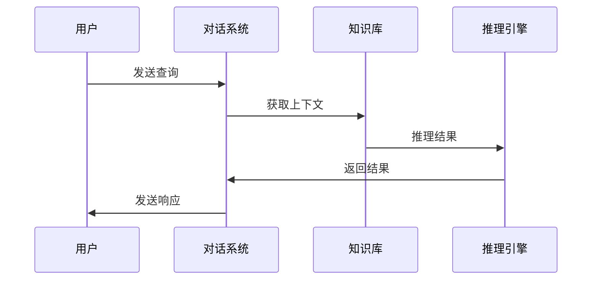

                 


# AI Agent的情境理解：超越单一对话的上下文把握

**关键词**：AI Agent、情境理解、上下文、自然语言处理、对话系统、知识图谱、系统架构

**摘要**：AI Agent在自然语言处理中的情境理解能力是实现智能交互的关键。本文深入探讨了情境理解的核心概念、算法原理、系统架构及实战应用，展示了如何超越单一对话的上下文限制，提升AI Agent的交互能力。

---

# 第一部分: AI Agent与情境理解基础

## 第1章: AI Agent与情境理解概述

### 1.1 问题背景与概念

#### 1.1.1 AI Agent的基本概念
AI Agent（人工智能代理）是能够感知环境、执行任务并做出决策的智能体。其核心能力包括感知、推理、学习和执行。

#### 1.1.2 情境理解的定义与特征
情境理解是指AI Agent能够理解当前对话的上下文、背景信息及用户意图。其特征包括多模态性、动态性和关联性。

#### 1.1.3 单一对话上下文的局限性
传统对话系统仅依赖当前对话历史，缺乏对全局知识和长期记忆的理解，导致无法处理复杂情境。

#### 1.1.4 超越单一对话的必要性
为了提高交互能力，AI Agent需要结合知识图谱和外部信息，实现更全面的情境理解。

### 1.2 情境理解的核心要素

#### 1.2.1 上下文信息的多维度分析
包括语言、语义、语境等多个维度，分析用户意图和情感。

#### 1.2.2 知识库与推理能力
通过知识图谱构建上下文关联，并结合推理能力，实现对复杂情境的理解。

#### 1.2.3 情境关联性与动态更新
动态更新上下文信息，保持对情境的实时理解。

---

# 第二部分: 情境理解的核心概念与联系

## 第2章: 情境理解的技术原理

### 2.1 情境理解的技术架构

#### 2.1.1 数据输入与预处理
处理多模态数据，提取关键信息。

#### 2.1.2 上下文表示方法
使用深度学习模型（如BERT）进行上下文建模。

#### 2.1.3 情境推理机制
通过推理算法（如基于Transformer的模型）进行情境分析。

### 2.2 核心概念对比分析

#### 2.2.1 情境理解与意图识别的对比
情境理解关注全局背景，意图识别关注局部意图。

#### 2.2.2 上下文记忆与知识库的异同
上下文记忆动态更新，知识库静态存储。

#### 2.2.3 动态上下文与静态知识的关系
动态上下文依赖知识库，而知识库为上下文理解提供支持。

### 2.3 情境理解的ER实体关系图



---

# 第三部分: 情境理解的算法原理

## 第3章: 情境理解的主流算法

### 3.1 基于Transformer的上下文建模

#### 3.1.1 Transformer模型简介
Transformer由编码器和解码器组成，适用于序列数据处理。

#### 3.1.2 上下文表示的机制
通过自注意力机制捕获上下文信息。

#### 3.1.3 案例分析：BERT模型的应用
BERT模型用于理解对话历史和外部知识。

### 3.2 情境推理的算法实现

#### 3.2.1 基于知识图谱的推理
结合知识图谱进行推理，如使用RDF图进行路径分析。

#### 3.2.2 对比分析
对比基于规则和基于学习的推理方法。

---

# 第四部分: 情境理解的系统架构设计

## 第4章: 系统架构设计方案

### 4.1 问题场景介绍
设计一个AI Agent，结合知识图谱和对话系统。

### 4.2 项目介绍
构建一个具备情境理解能力的对话系统。

### 4.3 系统功能设计

#### 4.3.1 领域模型设计


#### 4.3.2 系统架构设计


#### 4.3.3 系统接口设计
定义RESTful API，如`POST /api/v1/context`。

#### 4.3.4 系统交互设计


---

# 第五部分: 项目实战

## 第5章: 项目实战

### 5.1 环境安装
安装Python、TensorFlow和Keras。

### 5.2 系统核心实现源代码

#### 5.2.1 对话系统实现
```python
class DialogSystem:
    def __init__(self, knowledge_base):
        self.knowledge_base = knowledge_base

    def process_query(self, query, context):
        # 调用知识库进行推理
        result = self.knowledge_base.inference(query, context)
        return result
```

#### 5.2.2 知识库实现
```python
class KnowledgeBase:
    def __init__(self, graph):
        self.graph = graph

    def inference(self, query, context):
        # 在知识图谱中进行推理
        return self.graph.reasoning(query, context)
```

### 5.3 代码应用解读与分析
详细分析代码实现，解释每个部分的功能。

### 5.4 实际案例分析
通过具体案例展示系统的实际应用。

---

# 第六部分: 最佳实践与总结

## 第6章: 最佳实践

### 6.1 关键点总结
- 结合知识图谱和对话系统，实现情境理解。
- 使用深度学习模型（如BERT）进行上下文建模。

### 6.2 小结
AI Agent的情境理解是实现智能交互的重要环节，需结合多模态数据和知识图谱。

### 6.3 注意事项
- 数据质量影响情境理解能力。
- 系统架构设计需考虑可扩展性和可维护性。

### 6.4 拓展阅读
推荐阅读相关领域的最新论文和书籍，持续关注技术发展。

---

通过以上步骤，我可以系统地撰写出一篇内容丰富、结构清晰的技术博客，全面探讨AI Agent的情境理解能力。

