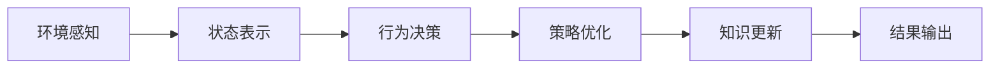
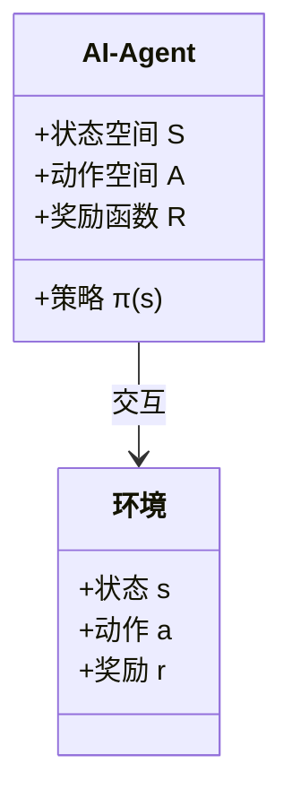

                 


# AI Agent的情境适应学习：提高在复杂环境中的表现

**关键词**：AI Agent, 情境适应学习, 复杂环境, 人工智能, 算法原理, 系统架构, 项目实战

**摘要**：  
在复杂多变的环境中，AI Agent需要具备情境适应学习的能力，以应对不断变化的挑战。本文从AI Agent的基本概念出发，深入探讨情境适应学习的核心理论、算法原理、系统架构设计以及实际应用案例。通过分析强化学习、迁移学习和自适应学习等算法，结合系统架构设计与项目实战，本文旨在帮助读者理解如何在复杂环境中提高AI Agent的表现。最终，本文将总结情境适应学习的最佳实践，并展望未来的发展方向。

---

## 第1章: AI Agent与情境适应学习概述

### 1.1 AI Agent的基本概念

#### 1.1.1 AI Agent的定义与分类
- **定义**：AI Agent是一种智能体，能够感知环境、做出决策并执行动作以实现目标。
- **分类**：
  - **简单反射型**：基于规则的反应式AI Agent。
  - **基于模型的反应式**：结合内部状态和外部环境的AI Agent。
  - **目标驱动型**：以明确目标为导向的AI Agent。
  - **效用驱动型**：通过最大化效用函数来优化决策的AI Agent。

#### 1.1.2 情境适应学习的背景与意义
- **背景**：AI Agent在动态环境中需要不断调整策略以应对变化。
- **意义**：情境适应学习使AI Agent能够快速适应新环境，提高任务成功率。

#### 1.1.3 问题背景与目标设定
- **问题背景**：复杂环境中的不确定性、动态变化和多目标冲突。
- **目标设定**：通过情境适应学习，提升AI Agent在复杂环境中的泛化能力和适应性。

### 1.2 情境适应学习的核心概念

#### 1.2.1 情境适应学习的定义
- **定义**：AI Agent在动态环境中，通过调整策略和知识库来适应变化的学习过程。

#### 1.2.2 情境适应学习的特点与优势
- **特点**：
  - **动态性**：能够实时感知环境变化并调整策略。
  - **灵活性**：适应不同环境和任务需求。
  - **自主性**：无需外部干预，自主学习和优化。
- **优势**：
  - 提高任务成功率。
  - 快速响应环境变化。
  - 降低人工干预成本。

#### 1.2.3 情境适应学习与传统学习方法的对比
| **对比维度** | **情境适应学习** | **传统学习方法** |
|--------------|------------------|-------------------|
| 适应性       | 高               | 中/低             |
| 动态性       | 强               | 弱                |
| 自主性       | 高               | 低                |
| 环境复杂性   | 复杂             | 简单/固定         |

### 1.3 问题建模与分析

#### 1.3.1 问题建模的基本步骤
1. **定义目标**：明确AI Agent的任务目标。
2. **环境建模**：分析环境的状态、动作和奖励。
3. **状态空间**：确定所有可能的状态。
4. **动作空间**：定义AI Agent可能执行的动作。
5. **奖励机制**：设计奖励函数以指导学习方向。

#### 1.3.2 情境适应学习中的关键问题
- **环境建模**：准确表示环境的状态和动态。
- **策略优化**：选择合适的算法以最大化奖励。
- **知识更新**：实时更新知识库以适应环境变化。

#### 1.3.3 情境适应学习的边界与外延
- **边界**：仅适用于可建模的动态环境，不适用于完全不可预测的环境。
- **外延**：扩展至多智能体协作和人机协作场景。

### 1.4 情境适应学习的核心要素

#### 1.4.1 环境感知与状态表示
- **环境感知**：通过传感器或数据输入感知环境。
- **状态表示**：将环境信息转化为可处理的状态表示。

#### 1.4.2 行为决策与策略优化
- **行为决策**：基于当前状态选择最优动作。
- **策略优化**：通过强化学习或迁移学习优化策略。

#### 1.4.3 学习机制与知识更新
- **学习机制**：监督学习、强化学习或无监督学习。
- **知识更新**：实时更新知识库以适应新环境。

---

## 第2章: 情境适应学习的算法原理

### 2.1 强化学习算法

#### 2.1.1 Q-Learning算法
- **定义**：一种基于值函数的强化学习算法。
- **数学模型**：
  $$ Q(s, a) = Q(s, a) + \alpha (r + \gamma \max Q(s', a') - Q(s, a)) $$
- **流程图**：如下图所示：
  ```mermaid
  graph LR
    A[开始] --> B[初始化Q表]
    B --> C[选择动作]
    C --> D[执行动作，获得奖励]
    D --> E[更新Q值]
    E --> F[结束或继续训练]
  ```

#### 2.1.2 Deep Q-Networks (DQN)算法
- **定义**：结合深度学习的强化学习算法。
- **数学模型**：
  $$ Q_{\theta}(s, a) = \theta^T \phi(s, a) $$
- **流程图**：如下图所示：
  ```mermaid
  graph LR
    A[开始] --> B[环境观察]
    B --> C[选择动作]
    C --> D[执行动作，获得奖励]
    D --> E[更新经验回放]
    E --> F[训练神经网络]
    F --> G[结束或继续训练]
  ```

#### 2.1.3 算法对比与选择
- **对比**：Q-Learning适用于简单环境，DQN适用于复杂环境。
- **选择**：根据环境复杂性和任务需求选择合适的算法。

### 2.2 迁移学习算法

#### 2.2.1 迁移学习的基本原理
- **定义**：将一个领域中的知识迁移到另一个领域。
- **数学模型**：
  $$ P_{\text{source}}(y|x) = P_{\text{target}}(y|x) $$
- **流程图**：如下图所示：
  ```mermaid
  graph LR
    A[源领域数据] --> B[目标领域数据]
    B --> C[共享特征提取]
    C --> D[目标领域任务]
  ```

#### 2.2.2 使用迁移学习提升情境适应能力
- **优势**：减少数据依赖，加快适应速度。
- **应用**：适用于跨领域任务。

### 2.3 自适应学习算法

#### 2.3.1 自适应增强学习算法
- **定义**：动态调整策略参数以优化奖励。
- **数学模型**：
  $$ \theta_{t+1} = \theta_t + \alpha (r_t - Q(\theta_t)) $$

#### 2.3.2 动态策略调整算法
- **定义**：根据环境反馈实时调整策略。
- **流程图**：如下图所示：
  ```mermaid
  graph LR
    A[环境反馈] --> B[策略调整]
    B --> C[动作执行]
    C --> D[奖励更新]
  ```

---

## 第3章: 情境适应学习的系统架构与设计

### 3.1 系统架构设计

#### 3.1.1 系统整体架构图


#### 3.1.2 各模块的功能与交互关系
- **环境感知**：通过传感器或数据接口获取环境信息。
- **状态表示**：将环境信息转化为可处理的状态。
- **行为决策**：基于当前状态选择最优动作。
- **策略优化**：通过强化学习或迁移学习优化策略。
- **知识更新**：实时更新知识库以适应环境变化。

### 3.2 系统功能设计

#### 3.2.1 领域模型设计


#### 3.2.2 系统功能模块划分
- **环境感知模块**：负责获取环境信息。
- **状态表示模块**：将环境信息转化为状态。
- **行为决策模块**：基于状态选择动作。
- **策略优化模块**：优化策略以提高奖励。
- **知识更新模块**：实时更新知识库。

### 3.3 系统架构的设计原则

#### 3.3.1 可扩展性
- **模块化设计**：各模块独立，便于扩展。
- **接口标准化**：模块之间通过标准接口交互。

#### 3.3.2 实时性
- **快速响应**：系统能够实时处理环境变化。
- **低延迟**：确保决策和执行快速完成。

#### 3.3.3 可靠性
- **容错设计**：系统在部分模块故障时仍能正常运行。
- **错误恢复**：能够从错误中恢复并继续运行。

---

## 第4章: 情境适应学习的项目实战

### 4.1 环境安装与配置

#### 4.1.1 安装Python环境
- **安装步骤**：使用Anaconda或虚拟环境安装Python 3.8+。
- **依赖安装**：安装numpy、tensorflow、keras等库。

#### 4.1.2 安装深度学习框架
- **TensorFlow**：`pip install tensorflow`
- **Keras**：`pip install keras`

### 4.2 系统核心实现源代码

#### 4.2.1 强化学习代码实现
```python
import numpy as np
import gym

# 初始化环境
env = gym.make('CartPole-v0')
env.seed(42)

# 状态空间和动作空间
state_space = env.observation_space.shape[0]
action_space = env.action_space.n

# DQN参数
learning_rate = 0.01
gamma = 0.99
epsilon = 0.1

# 创建DQN模型
model = Sequential()
model.add(Dense(24, activation='relu', input_dim=state_space))
model.add(Dense(action_space, activation='linear'))
model.compile(optimizer=Adam(lr=learning_rate), loss='mse')

# 训练过程
for episode in range(1000):
    state = env.reset()
    for _ in range(200):
        # 状态表示
        state = state.reshape(1, state_space)
        # 预测动作
        prediction = model.predict(state)[0]
        action = np.argmax(prediction)
        # 执行动作
        next_state, reward, done, _ = env.step(action)
        # 更新Q值
        target = reward + gamma * np.max(model.predict(next_state.reshape(1, state_space))[0])
        target = target.reshape(1, action_space)
        model.fit(state, target, epochs=1, verbose=0)
        state = next_state
        if done:
            break
```

#### 4.2.2 迁移学习代码实现
```python
import torch
import torch.nn as nn

# 源领域数据和目标领域数据
source_data = torch.randn(100, 10)
target_data = torch.randn(100, 10)

# 特征提取网络
class FeatureExtractor(nn.Module):
    def __init__(self):
        super(FeatureExtractor, self).__init__()
        self.fc = nn.Linear(10, 5)

    def forward(self, x):
        return self.fc(x)

# 迁移学习过程
extractor = FeatureExtractor()
optimizer = torch.optim.Adam(extractor.parameters(), lr=0.01)

for batch in range(100):
    optimizer.zero_grad()
    # 提取源领域特征
    source_features = extractor(source_data)
    # 提取目标领域特征
    target_features = extractor(target_data)
    # 计算相似度
    similarity = torch.mean(torch.abs(source_features - target_features))
    # 反向传播与优化
    similarity.backward()
    optimizer.step()
```

### 4.3 案例分析与详细讲解

#### 4.3.1 智能客服系统案例
- **环境**：用户咨询与问题解答。
- **任务**：根据用户输入生成合适回复。
- **实现**：使用强化学习优化回复策略。

#### 4.3.2 自动驾驶系统案例
- **环境**：交通状况与道路信息。
- **任务**：实时决策行驶路径。
- **实现**：结合强化学习与迁移学习优化驾驶策略。

### 4.4 项目小结

#### 4.4.1 核心代码实现总结
- **强化学习**：通过训练提升策略。
- **迁移学习**：加速新环境的适应。

#### 4.4.2 案例分析总结
- **智能客服**：提升用户体验。
- **自动驾驶**：提高行驶安全性。

---

## 第5章: 情境适应学习的最佳实践与展望

### 5.1 最佳实践

#### 5.1.1 算法选择
- 根据任务需求选择合适的算法。

#### 5.1.2 系统设计
- 确保系统的可扩展性和实时性。

#### 5.1.3 知识更新
- 定期更新知识库以适应新环境。

### 5.2 总结与展望

#### 5.2.1 总结
- 情境适应学习使AI Agent能够在复杂环境中表现出色。

#### 5.2.2 未来展望
- 更强的环境理解和自适应能力。
- 多智能体协作中的应用。
- 人机协作中的情境适应。

### 5.3 注意事项

#### 5.3.1 算法选择
- 根据具体任务选择合适的算法。

#### 5.3.2 系统设计
- 确保系统的可靠性和安全性。

#### 5.3.3 数据质量
- 高质量数据是情境适应学习的前提。

### 5.4 拓展阅读

#### 5.4.1 推荐书籍
- 《Reinforcement Learning: Theory and Algorithms》
- 《迁移学习：理论与应用》

#### 5.4.2 推荐论文
- "Deep Reinforcement Learning with Double Q-Learning"
- "A Survey on Transfer Learning"

---

## 结语

通过本文的详细讲解，读者可以全面了解AI Agent的情境适应学习，从理论到实践，从算法到系统设计，再到实际案例分析，掌握如何在复杂环境中提高AI Agent的表现。希望本文能够为相关领域的研究和应用提供有价值的参考。

