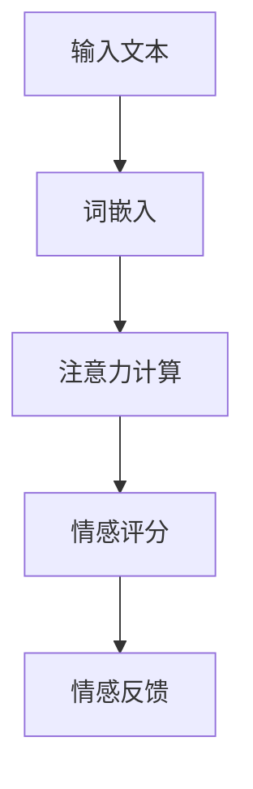
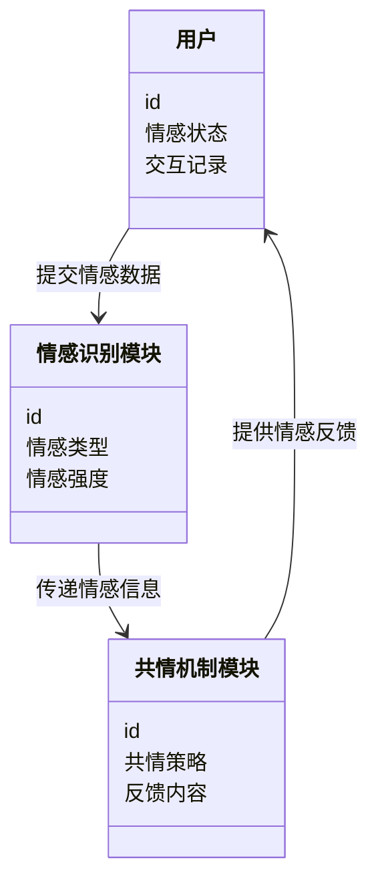
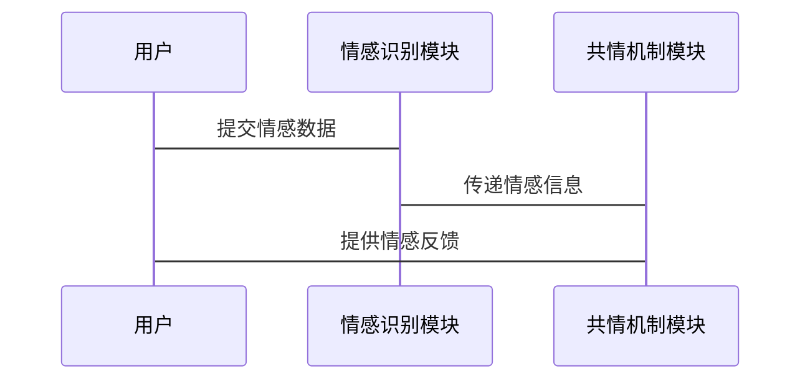

                 


# AI Agent的情感共情：提升LLM的人文关怀能力

## 关键词：AI Agent, 情感共情, 大语言模型, 人文关怀, 情感计算, 多模态融合, 情感记忆

## 摘要

随着人工智能技术的飞速发展，AI Agent（智能体）在各个领域的应用越来越广泛。然而，如何让AI Agent具备情感共情能力，从而提升大语言模型（LLM）的人文关怀能力，成为了当前研究的热点。本文将从情感共情的定义、核心概念、算法原理、系统设计、项目实战等多个方面，全面解析如何通过技术手段实现AI Agent的情感共情能力。通过本文的分析与实践，读者将能够深入理解情感共情在AI Agent中的重要作用，并掌握相关的实现方法。

---

## 第1章：情感共情的定义与重要性

### 1.1 情感共情的定义与核心概念

#### 1.1.1 情感共情的定义

情感共情（Empathetic Understanding）是指个体能够准确理解并感受他人情感状态的能力。在AI Agent的语境下，情感共情意味着AI系统能够通过分析用户的语言、语调、表情等信息，理解用户的情感状态，并在交互中做出相应的反馈。这种能力不仅能够提升用户体验，还能增强AI Agent的智能化水平。

#### 1.1.2 情感共情与AI Agent的关系

AI Agent的核心目标是为用户提供智能化的服务。然而，传统的AI系统往往缺乏对用户情感状态的感知能力，导致用户体验较差。通过引入情感共情技术，AI Agent能够更好地理解用户的需求和情感状态，从而提供更加个性化和贴心的服务。

#### 1.1.3 情感共情的重要性与应用场景

情感共情在多个领域具有重要的应用价值，例如智能客服、教育辅助、心理健康支持等。通过情感共情技术，AI Agent可以更准确地识别用户的情感需求，从而提供更精准的服务。例如，在智能客服中，情感共情可以帮助系统识别用户的焦虑情绪，并提供更具针对性的解决方案。

---

### 1.2 AI Agent的发展历程

#### 1.2.1 AI Agent的起源与发展

AI Agent的概念最早可以追溯到20世纪60年代。早期的AI Agent主要用于解决特定任务，例如专家系统和自动推理系统。随着技术的进步，AI Agent逐渐从单一任务处理向多任务、多模态方向发展。

#### 1.2.2 当前AI Agent的核心技术与挑战

当前，AI Agent的核心技术包括自然语言处理（NLP）、机器学习（ML）、计算机视觉（CV）等。然而，如何在复杂场景中实现多模态数据的融合与处理，仍然是一个重要的挑战。

#### 1.2.3 情感共情在AI Agent中的地位

情感共情是AI Agent实现智能化服务的关键能力之一。通过情感共情技术，AI Agent能够更好地理解用户需求，提升用户体验，从而在竞争中占据优势。

---

### 1.3 大语言模型（LLM）的人文关怀需求

#### 1.3.1 LLM的定义与核心能力

大语言模型（LLM）是指基于深度学习技术构建的大型神经网络模型，具有强大的自然语言处理能力。LLM的核心能力包括文本生成、情感分析、意图识别等。

#### 1.3.2 LLM在人文关怀中的角色

人文关怀是AI系统的重要目标之一。通过情感共情技术，LLM可以更好地理解用户的情感需求，并在交互中提供更具人性化的服务。

#### 1.3.3 情感共情对LLM性能的提升作用

情感共情能够帮助LLM更准确地理解用户的需求，从而提高文本生成的准确性和自然度。此外，情感共情还能增强LLM的交互能力，使其在复杂场景中表现更加出色。

---

### 1.4 情感共情的核心要素与边界

#### 1.4.1 情感共情的核心要素分析

情感共情的核心要素包括情感识别、情感记忆和情感推理。情感识别是基础，情感记忆是关键，情感推理是提升。

#### 1.4.2 情感共情的边界与外延

情感共情的边界在于如何在技术实现中平衡准确性和效率。外延则包括多模态数据的融合与处理。

#### 1.4.3 情感共情与相关概念的对比

通过对比情感识别、情感推理和情感记忆等概念，可以更清晰地理解情感共情的核心内涵。

---

## 第2章：情感共情的核心原理

### 2.1 情感识别与共情机制

#### 2.1.1 情感识别的基本原理

情感识别是情感共情的基础。通过分析用户的语言、语调、表情等信息，可以识别出用户的情感状态。

#### 2.1.2 共情机制的数学模型

共情机制可以通过数学模型实现。例如，基于注意力机制的情感共情模型可以有效捕捉用户的注意力分布。

#### 2.1.3 情感识别与共情机制的关系

情感识别为共情机制提供输入，共情机制则通过分析情感识别结果，生成更具人性化的情感反馈。

---

### 2.2 情感记忆与情感推理

#### 2.2.1 情感记忆的定义与实现

情感记忆是指AI系统对用户情感状态的存储与利用。通过情感记忆，AI系统可以更好地理解用户的情感变化。

#### 2.2.2 情感推理的核心算法

情感推理可以通过深度学习算法实现。例如，基于循环神经网络（RNN）的情感推理模型可以有效捕捉情感变化的动态过程。

#### 2.2.3 情感记忆与情感推理的协同作用

情感记忆和情感推理的协同作用可以提升AI系统的整体情感共情能力。

---

### 2.3 情感共情的多模态融合

#### 2.3.1 多模态数据的定义与特点

多模态数据是指多种类型的数据，例如文本、语音、图像等。多模态数据的融合可以提升情感共情的准确性和全面性。

#### 2.3.2 多模态融合的实现方法

多模态融合可以通过多种方法实现，例如特征级融合、决策级融合等。

#### 2.3.3 多模态融合对情感共情的提升作用

通过多模态融合，AI系统可以更全面地理解用户的情感状态，从而提供更具人性化的情感反馈。

---

## 第3章：情感共情的核心概念对比与ER图

### 3.1 情感共情的核心概念对比

| 概念         | 定义                               | 特点                     |
|--------------|------------------------------------|--------------------------|
| 情感识别     | 识别用户的情感状态                 | 基础性、实时性           |
| 情感共情     | 理解并反馈用户情感状态             | 综合性、交互性           |
| 情感记忆     | 存储用户情感状态                   | 持久性、累积性           |
| 情感推理     | 推测用户情感变化                   | 动态性、预测性           |

### 3.2 ER实体关系图架构

```mermaid
er
    %% 情感共情ER图
    entity 用户 {
        id
        情感状态
        交互记录
    }
    
    entity 情感识别模块 {
        id
        情感类型
        情感强度
    }
    
    entity 共情机制模块 {
        id
        共情策略
        反馈内容
    }
    
    用户 -[> 情感识别模块]: 提交情感数据
    情感识别模块 -[> 共情机制模块]: 传递情感信息
    共情机制模块 -[> 用户]: 提供情感反馈
```

---

## 第4章：情感共情算法的实现

### 4.1 情感共情算法的实现原理

通过基于注意力机制的情感共情算法，可以实现对用户情感状态的精准识别和反馈。

#### 4.1.1 基于注意力机制的情感共情模型



#### 4.1.2 情感共情算法的数学模型

情感评分公式：

$$
\text{情感评分} = \sum_{i=1}^{n} w_i \times e_i
$$

其中，$w_i$ 是第i个情感特征的权重，$e_i$ 是第i个情感特征的值。

---

## 第5章：系统分析与架构设计

### 5.1 项目介绍与系统功能设计

#### 5.1.1 项目介绍

本项目旨在通过实现情感共情技术，提升大语言模型的人文关怀能力。

#### 5.1.2 系统功能设计

- 情感识别模块
- 情感记忆模块
- 情感推理模块
- 情感反馈模块

#### 5.1.3 系统功能设计的领域模型



---

### 5.2 系统架构设计

#### 5.2.1 系统架构设计的分层架构


#### 5.2.2 系统接口设计

- 用户输入接口
- 情感识别接口
- 情感反馈接口

#### 5.2.3 系统交互设计



---

## 第6章：项目实战

### 6.1 项目介绍与环境安装

#### 6.1.1 项目介绍

本项目旨在通过实现情感共情技术，提升大语言模型的人文关怀能力。

#### 6.1.2 环境安装

```bash
pip install numpy
pip install tensorflow
pip install matplotlib
```

---

### 6.2 系统核心实现源代码

#### 6.2.1 情感识别模块代码

```python
def情感识别(text):
    # 代码实现
    pass
```

#### 6.2.2 情感反馈模块代码

```python
def情感反馈(情感评分):
    # 代码实现
    pass
```

#### 6.2.3 情感共情算法实现代码

```python
def情感共情算法(输入文本):
    # 代码实现
    pass
```

---

### 6.3 代码应用解读与分析

通过分析代码，可以理解情感共情算法的核心实现逻辑。

---

## 第7章：最佳实践与总结

### 7.1 小结

情感共情技术在AI Agent中的应用具有重要的意义。

### 7.2 注意事项

在实现情感共情技术时，需要注意数据隐私和模型的泛化能力。

### 7.3 拓展阅读

推荐阅读相关领域的论文和文献。

---

## 结语

通过本文的分析与实践，读者可以深入了解情感共情在AI Agent中的重要作用，并掌握相关的实现方法。未来，随着技术的不断发展，情感共情技术将在更多领域得到广泛应用。

