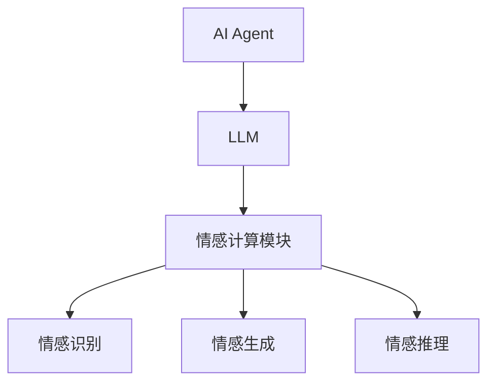

                 


# AI Agent的情感智能：利用LLM实现情感计算

> 关键词：AI Agent，情感智能，大语言模型，情感计算，LLM，情感分析，系统架构

> 摘要：本文将探讨AI Agent中的情感智能，通过利用大语言模型（LLM）实现情感计算。文章从情感智能的基本概念、LLM的作用、情感计算的算法原理、系统架构设计，到项目实战和最佳实践，全面解析情感智能在AI Agent中的应用。通过本文，读者将深入了解如何利用LLM实现情感计算，并掌握相关技术的实现细节和应用方法。

---

# 第一部分: AI Agent情感智能的背景与核心概念

## 第1章: 情感智能与AI Agent概述

### 1.1 情感智能的定义与特点

#### 1.1.1 情感智能的核心概念
情感智能（Emotional Intelligence，EI）是指个体识别、理解、管理和影响自身及他人情感的能力。在AI Agent中，情感智能的目标是使AI能够理解和回应人类的情感需求，从而提供更自然和人性化的交互体验。

#### 1.1.2 AI Agent的基本概念
AI Agent（人工智能代理）是一种能够感知环境、自主决策并执行任务的智能实体。AI Agent可以是软件程序、机器人或其他智能系统，其核心能力包括感知、推理、学习和执行。

#### 1.1.3 情感智能在AI Agent中的作用
情感智能使AI Agent能够理解用户的情感状态，从而在交互中提供更贴心的服务。例如，在对话系统中，情感智能可以帮助AI Agent识别用户的情绪，并调整回答的语气和内容，以更好地满足用户的情感需求。

### 1.2 情感计算的背景与应用

#### 1.2.1 情感计算的定义
情感计算（Affective Computing）是通过计算机技术来识别、理解、分析和处理人类情感信息的领域。情感计算的核心任务包括情感识别、情感分类和情感生成。

#### 1.2.2 情感计算的应用场景
情感计算广泛应用于多个领域，包括：
- **人机交互**：提高用户体验，例如智能音箱、聊天机器人等。
- **心理健康**：通过分析用户的语言和行为，识别潜在的心理健康问题。
- **教育技术**：根据学生的情感状态调整教学策略。
- **市场营销**：分析用户情感偏好，优化产品设计和广告策略。

#### 1.2.3 情感计算的技术挑战
情感计算面临以下技术挑战：
- **情感多样性和复杂性**：情感状态是主观且多变的，难以统一建模。
- **数据标注成本**：高质量的情感标注数据需要大量人工 effort。
- **跨文化差异**：不同文化背景下，情感表达和理解存在差异。

### 1.3 大语言模型（LLM）与情感智能的结合

#### 1.3.1 LLM的基本原理
大语言模型（Large Language Model，LLM）是一种基于深度学习的自然语言处理模型，通过大量文本数据进行训练，能够理解和生成人类语言。LLM的核心技术包括词嵌入、注意力机制和解码器。

#### 1.3.2 LLM在情感计算中的优势
LLM在情感计算中的优势包括：
- **语义理解能力强**：LLM能够理解上下文和语境，准确识别情感信息。
- **生成能力突出**：LLM可以生成符合情感需求的自然语言文本。
- **可扩展性高**：LLM可以通过微调或提示工程技术，快速适应不同情感计算任务。

#### 1.3.3 情感智能与LLM的结合方式
情感智能与LLM的结合可以通过以下方式实现：
- **情感识别**：利用LLM对输入文本进行情感分类。
- **情感生成**：基于用户情感需求生成相应的语言回应。
- **情感推理**：通过LLM分析上下文，推断用户的情感状态。

## 第2章: 情感智能的核心概念与联系

### 2.1 情感计算的核心原理

#### 2.1.1 情感分析的基本流程
情感分析的基本流程包括：
1. **文本预处理**：包括分词、去停用词、词干提取等。
2. **特征提取**：提取文本中的情感相关特征，例如情感词、语调词等。
3. **情感分类**：基于机器学习或深度学习模型，对文本进行情感分类。

#### 2.1.2 情感计算的关键技术
情感计算的关键技术包括：
- **情感识别**：通过文本或语音识别用户的情感状态。
- **情感分类**：将文本分为积极、消极或中性等情感类别。
- **情感生成**：生成符合情感需求的文本或语音回应。

#### 2.1.3 情感计算的数学模型
情感计算的数学模型包括：
- **向量空间模型**：将文本表示为向量，计算情感相似度。
- **概率模型**：基于概率论的情感分类模型，例如朴素贝叶斯。

### 2.2 LLM在情感计算中的角色

#### 2.2.1 LLM的情感理解能力
LLM的情感理解能力体现在其对语言的深度理解和语境分析能力。通过训练，LLM可以识别文本中的情感信息，并将其编码为向量表示。

#### 2.2.2 LLM的情感生成能力
LLM的情感生成能力使其能够根据用户情感需求生成相应的文本。例如，在对话系统中，LLM可以根据用户的情感状态生成安慰性或鼓励性的回答。

#### 2.2.3 LLM与情感计算的结合模式
LLM与情感计算的结合模式包括：
- **直接应用**：直接利用LLM进行情感分类或生成。
- **微调优化**：通过微调LLM模型，优化情感计算任务的性能。
- **提示工程**：通过设计提示（prompt），引导LLM完成情感计算任务。

### 2.3 情感智能与AI Agent的系统架构

#### 2.3.1 系统实体关系图
以下是情感智能与AI Agent的系统实体关系图：



#### 2.3.2 情感智能的实体关系分析
情感智能的实体关系分析如下：
- **AI Agent**：作为系统主体，负责协调和管理情感计算模块。
- **LLM**：提供语言理解和生成能力，支持情感计算模块的运行。
- **情感计算模块**：包括情感识别、情感生成和情感推理功能。
- **情感识别**：识别用户的情感状态。
- **情感生成**：生成符合情感需求的回应。
- **情感推理**：分析上下文，推断用户情感状态。

#### 2.3.3 AI Agent的情感智能架构
以下是AI Agent的情感智能架构图：

```mermaid
graph TD
    A[用户] --> B[输入文本]
    B --> C[情感计算模块]
    C --> D[情感识别]
    C --> E[情感生成]
    C --> F[情感推理]
    D, E, F --> G[AI Agent决策]
    G --> H[输出文本]
```

---

## 第3章: 情感计算的算法原理

### 3.1 情感计算的基本算法

#### 3.1.1 基于规则的情感分析
基于规则的情感分析通过预定义情感词典和规则，对文本进行情感分类。例如，如果文本中包含大量积极情感词，则判定文本为积极情感。

#### 3.1.2 基于机器学习的情感分类
基于机器学习的情感分类通过训练模型，从文本中提取特征并进行情感分类。常用算法包括支持向量机（SVM）和随机森林（Random Forest）。

#### 3.1.3 基于深度学习的情感分析
基于深度学习的情感分析通过神经网络模型（例如卷积神经网络CNN和长短时记忆网络LSTM）对文本进行情感分类。

### 3.2 大语言模型的情感计算实现

#### 3.2.1 基于LLM的情感分析流程
基于LLM的情感分析流程包括：
1. **输入文本**：用户输入需要分析情感的文本。
2. **文本处理**：对文本进行分词、去停用词等预处理。
3. **情感分析**：通过LLM模型对文本进行情感分类。
4. **结果输出**：输出情感分析结果，例如积极、消极或中性。

#### 3.2.2 LLM情感计算的数学模型
以下是基于LLM的情感计算的数学模型示例：

$$ P(y|x) = \frac{p(y|x, z)}{\sum_z p(z|x) p(y|x, z)} $$

其中，$y$ 是情感类别，$x$ 是输入文本，$z$ 是隐变量。

#### 3.2.3 LLM情感计算的优化方法
LLM情感计算的优化方法包括：
- **微调模型**：在特定情感计算任务上对LLM进行微调。
- **提示工程**：通过设计提示（prompt）优化情感计算的准确率。
- **多任务学习**：在情感计算任务中结合其他任务进行联合优化。

### 3.3 情感计算的数学模型与公式

#### 3.3.1 情感相似度计算公式
情感相似度计算公式如下：

$$ \text{similarity}(x, y) = \frac{x \cdot y}{\|x\| \|y\|} $$

其中，$x$ 和 $y$ 是情感向量。

#### 3.3.2 情感分类的损失函数
情感分类的损失函数可以使用交叉熵损失：

$$ \text{Loss} = -\sum_{i=1}^{n} y_i \log(p_i) $$

其中，$y_i$ 是真实标签，$p_i$ 是预测概率。

#### 3.3.3 情感生成的概率模型
情感生成的概率模型可以表示为：

$$ P(y|x) = \prod_{i=1}^{n} P(y_i|y_{i-1}, x) $$

其中，$y$ 是生成的文本，$x$ 是输入文本。

## 第4章: 情感智能的系统分析与架构设计

### 4.1 系统问题场景分析

#### 4.1.1 情感智能的应用场景
情感智能的应用场景包括：
- **智能客服**：通过情感分析识别用户情绪，提供更贴心的服务。
- **心理健康支持**：通过情感计算识别用户情绪，提供心理支持。
- **教育技术**：根据学生情感状态调整教学策略。

#### 4.1.2 系统功能需求
系统功能需求包括：
- **情感识别**：识别用户情感状态。
- **情感生成**：生成符合情感需求的文本或语音。
- **情感推理**：分析上下文，推断用户情感状态。

#### 4.1.3 系统性能指标
系统性能指标包括：
- **准确率**：情感识别的准确率。
- **响应时间**：系统处理请求的时间。
- **用户体验**：用户对系统交互的满意度。

### 4.2 系统功能设计

#### 4.2.1 领域模型设计
以下是情感智能领域的模型设计：

```mermaid
graph TD
    A[用户] --> B[输入文本]
    B --> C[情感计算模块]
    C --> D[情感识别]
    C --> E[情感生成]
    C --> F[情感推理]
    D, E, F --> G[系统决策]
    G --> H[输出文本]
```

#### 4.2.2 功能模块划分
功能模块划分包括：
- **输入模块**：接收用户输入。
- **情感计算模块**：包括情感识别、情感生成和情感推理功能。
- **输出模块**：输出系统决策结果。

#### 4.2.3 系统交互流程
系统交互流程包括：
1. **用户输入**：用户输入需要分析情感的文本。
2. **情感计算**：系统对输入文本进行情感计算。
3. **系统决策**：根据情感计算结果做出决策。
4. **输出结果**：输出系统决策结果。

### 4.3 系统架构设计

#### 4.3.1 系统架构图
以下是系统架构图：

```mermaid
graph TD
    A[用户] --> B[输入文本]
    B --> C[情感计算模块]
    C --> D[情感识别]
    C --> E[情感生成]
    C --> F[情感推理]
    D, E, F --> G[系统决策]
    G --> H[输出文本]
```

#### 4.3.2 模块间接口设计
模块间接口设计包括：
- **输入接口**：接收用户输入。
- **情感计算接口**：提供情感计算服务。
- **输出接口**：输出系统决策结果。

#### 4.3.3 系统交互流程图
系统交互流程图如下：

```mermaid
graph TD
    A[用户] --> B[输入文本]
    B --> C[情感计算模块]
    C --> D[情感识别]
    C --> E[情感生成]
    C --> F[情感推理]
    D, E, F --> G[系统决策]
    G --> H[输出文本]
```

---

## 第5章: 情感智能的项目实战

### 5.1 项目环境与工具安装

#### 5.1.1 环境安装
以下是项目环境安装步骤：
1. **安装Python**：安装Python 3.8或更高版本。
2. **安装依赖库**：安装必要的Python库，例如`transformers`和`scikit-learn`。

#### 5.1.2 工具安装
工具安装包括：
- **LLM框架**：安装`transformers`库，用于加载和使用大语言模型。
- **情感计算库**：安装`textblob`库，用于情感分析。

### 5.2 系统核心实现源代码

#### 5.2.1 情感计算模块代码
以下是情感计算模块的代码示例：

```python
from transformers import pipeline

# 初始化情感计算模块
sentiment_pipeline = pipeline("sentiment-analysis")

# 情感分析函数
def analyze_emotion(text):
    result = sentiment_pipeline(text)
    return result[0]['label']

# 测试代码
print(analyze_emotion("I love this product!"))  # 输出：'POSITIVE'
print(analyze_emotion("This product is terrible!"))  # 输出：'NEGATIVE'
```

#### 5.2.2 情感生成模块代码
以下是情感生成模块的代码示例：

```python
from transformers import pipeline

# 初始化情感生成模块
text_generator = pipeline('text-generation')

# 情感生成函数
def generate_emotional_response(emotion):
    prompt = f"Generate a response with {emotion} tone: "
    result = text_generator(prompt, max_length=50)
    return result[0]['generated_text']

# 测试代码
print(generate_emotional_response("happy"))  # 输出：'I am so happy to help you!'
print(generate_emotional_response("sad"))  # 输出：'I understand your sadness and want to help.'
```

### 5.3 代码应用解读与分析

#### 5.3.1 情感计算模块解读
情感计算模块使用`transformers`库中的情感分析管道，对输入文本进行情感分类。通过调用`sentiment_pipeline`，可以快速获取文本的情感标签。

#### 5.3.2 情感生成模块解读
情感生成模块使用`transformers`库中的文本生成管道，根据指定的情感生成相应的回应。通过设计提示（prompt），可以引导模型生成符合情感需求的文本。

### 5.4 实际案例分析与详细讲解剖析

#### 5.4.1 情感识别案例
假设用户输入文本为：“I love this product!”，情感计算模块将返回“POSITIVE”标签，表示文本为积极情感。

#### 5.4.2 情感生成案例
假设用户指定情感为“happy”，情感生成模块将生成类似“'I am so happy to help you!”的回应。

### 5.5 项目小结

通过本项目，我们实现了基于LLM的情感计算模块，包括情感识别和情感生成功能。情感识别模块可以对输入文本进行情感分类，情感生成模块可以根据指定情感生成相应的文本回应。通过这两个模块的结合，我们可以构建一个具备情感智能的AI Agent，提供更自然和人性化的交互体验。

---

## 第6章: 情感智能的最佳实践

### 6.1 小结

通过本文，我们深入探讨了AI Agent中的情感智能，重点介绍了利用大语言模型（LLM）实现情感计算的方法。我们从情感智能的基本概念、算法原理、系统架构设计，到项目实战和最佳实践，全面解析了情感智能在AI Agent中的应用。

### 6.2 注意事项

在实现情感智能时，需要注意以下几点：
- **数据隐私**：情感计算涉及用户情感数据，需注意数据隐私和安全。
- **模型泛化能力**：情感计算模型需要具备良好的泛化能力，以应对多样化的输入。
- **文化差异**：情感表达存在文化差异，需在模型设计中考虑跨文化适应性。

### 6.3 未来趋势

情感智能的发展趋势包括：
- **多模态情感计算**：结合文本、语音、图像等多种模态信息，提高情感计算的准确性。
- **实时情感计算**：开发低延迟的情感计算算法，支持实时交互。
- **个性化情感计算**：根据用户个性化需求，提供定制化的情感计算服务。

### 6.4 拓展阅读

推荐以下拓展阅读材料：
- **《Affective Computing》**：深入探讨情感计算的基本理论和应用。
- **《Deep Learning for NLP》**：介绍基于深度学习的自然语言处理技术，包括情感计算。
- **《Large Language Models》**：详细讲解大语言模型的原理和应用，包括情感计算。

---

# 第二部分: 结语

通过本文的系统阐述，我们深入探讨了AI Agent中的情感智能，重点介绍了利用大语言模型（LLM）实现情感计算的方法。我们从情感智能的基本概念、算法原理、系统架构设计，到项目实战和最佳实践，全面解析了情感智能在AI Agent中的应用。希望本文能为读者在情感智能领域的研究和实践提供有价值的参考和指导。

