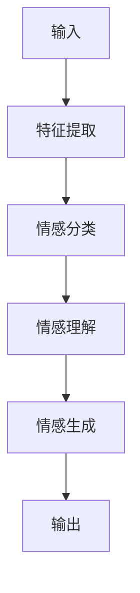
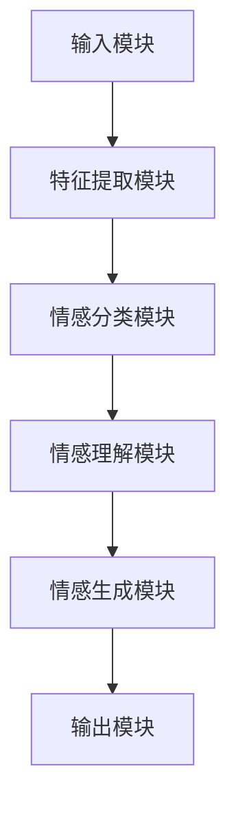
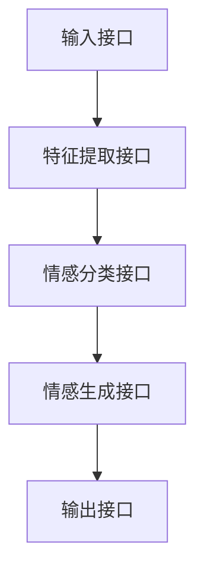
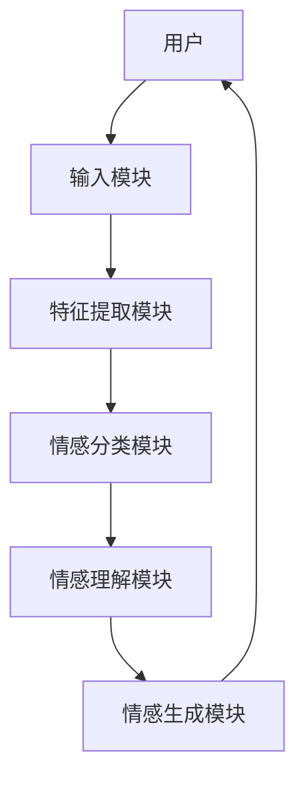

                 


```markdown
# AI Agent的情感计算：识别、理解和生成情感反应

## 关键词
AI Agent、情感计算、情感识别、情感理解、情感生成、人机交互

## 摘要
本文系统性地探讨了AI Agent在情感计算中的应用，从情感识别到情感生成，详细分析了相关技术原理，并通过实例展示了如何实现情感计算。文章内容涵盖了情感计算的核心概念、算法原理、系统架构设计以及实际项目案例，最后提出了未来的研究方向。

---

### 第一部分: AI Agent情感计算的背景与概念

#### 第1章: AI Agent与情感计算概述

##### 1.1 情感计算的基本概念

###### 1.1.1 什么是情感计算
情感计算（Affective Computing）是研究如何通过计算机技术来识别、理解和模拟人类情感的一门学科。它涉及对人类情感状态的感知、分析和响应，从而使得计算机能够像人类一样具备情感智能。

###### 1.1.2 情感计算的核心目标
情感计算的核心目标是让计算机能够理解和处理人类的情感信息，从而实现更自然、更智能的人机交互。这包括情感识别、情感理解和情感生成等方面。

###### 1.1.3 情感计算与AI Agent的关系
AI Agent（智能体）是能够感知环境、自主决策并执行任务的实体。情感计算为AI Agent提供了处理情感信息的能力，使其能够更好地理解和响应用户的情感需求。

##### 1.2 AI Agent的定义与特点

###### 1.2.1 AI Agent的基本定义
AI Agent是指在计算机系统中，能够感知环境、自主决策并执行任务的智能实体。它可以是一个软件程序，也可以是一个物理设备。

###### 1.2.2 AI Agent的核心特点
- **自主性**：AI Agent能够自主决策，无需外部干预。
- **反应性**：AI Agent能够实时感知环境并做出响应。
- **主动性**：AI Agent能够主动采取行动以实现目标。
- **社会性**：AI Agent能够与其他Agent或人类进行交互和协作。

###### 1.2.3 AI Agent与传统计算的区别
传统的计算程序是基于规则的、被动的，而AI Agent则是主动的、自主的，并且能够感知和理解环境。

##### 1.3 情感计算的重要性

###### 1.3.1 情感计算在人机交互中的作用
情感计算使得人机交互更加自然和人性化。通过识别用户的情感状态，系统能够提供更个性化的服务和反馈。

###### 1.3.2 情感计算对AI Agent的影响
情感计算增强了AI Agent的智能性，使其能够理解和处理情感信息，从而提供更智能的服务。

###### 1.3.3 情感计算的未来发展
随着技术的进步，情感计算将在教育、医疗、娱乐等领域发挥越来越重要的作用，推动人机交互的智能化和人性化。

#### 第2章: 情感计算的核心概念与联系

##### 2.1 情感计算的原理

###### 2.1.1 情感识别的原理
情感识别是通过分析用户的语言、语音、面部表情和行为等多模态数据，来判断用户的情感状态。

###### 2.1.2 情感理解的机制
情感理解是对情感信息进行分析和解释，理解情感背后的意义和意图。

###### 2.1.3 情感生成的原理
情感生成是基于对情感信息的理解，生成相应的情感反馈或响应。

##### 2.2 情感计算的核心要素

###### 2.2.1 情感特征提取
情感特征提取是从多模态数据中提取与情感相关特征的过程，例如从语音中提取音调、语速等特征。

###### 2.2.2 情感分类与预测
情感分类是将情感信息归类到特定的情感类别中，例如快乐、悲伤、愤怒等。情感预测是对未来情感状态的预测。

###### 2.2.3 情感反馈与优化
情感反馈是系统对用户情感状态的响应，优化是根据反馈调整系统的行为以更好地满足用户情感需求。

##### 2.3 情感计算的流程图



#### 第3章: 情感计算的关键技术

##### 3.1 情感识别技术

###### 3.1.1 基于规则的情感识别
基于规则的情感识别方法是通过预定义的规则和模式匹配来识别情感信息。例如，可以通过关键词匹配来判断文本中的情感倾向。

###### 3.1.2 基于机器学习的情感识别
基于机器学习的情感识别方法利用训练好的模型来自动学习情感特征。例如，使用支持向量机（SVM）或随机森林（Random Forest）进行情感分类。

###### 3.1.3 基于深度学习的情感识别
基于深度学习的情感识别方法利用神经网络模型，如卷积神经网络（CNN）或循环神经网络（RNN），来自动提取和学习情感特征。

##### 3.2 情感理解技术

###### 3.2.1 情感分析模型
情感分析模型是对文本进行情感分类的模型，例如判断一段文本是正面、负面还是中性。

###### 3.2.2 情感推理机制
情感推理机制是通过逻辑推理来理解情感信息背后的含义和意图。

###### 3.2.3 情感记忆与关联
情感记忆与关联是将情感信息与上下文或其他信息进行关联，以便更好地理解和记忆情感状态。

---

### 第二部分: 情感计算的算法与系统架构

#### 第4章: 情感计算的算法原理

##### 4.1 基于规则的情感识别算法

###### 4.1.1 算法步骤
1. 预定义情感关键词列表。
2. 通过关键词匹配来判断文本的情感倾向。

###### 4.1.2 代码实现
```python
def情感识别_基于规则(text):
    正向词汇 = {'快乐', '开心', '满意'}
    负向词汇 = {'悲伤', '愤怒', '不满'}
    正向计数 = 0
    负向计数 = 0
    for 词 in text.split():
        if 词 in 正向词汇:
            正向计数 += 1
        elif 词 in 负向词汇:
            负向计数 -= 1
    if 正向计数 > 负向计数:
        return '正面'
    elif 正向计数 < 负向计数:
        return '负面'
    else:
        return '中性'
```

###### 4.1.3 优缺点分析
- 优点：简单易实现，适用于特定场景。
- 缺点：灵活性差，难以处理复杂的情感表达。

##### 4.2 基于机器学习的情感识别算法

###### 4.2.1 算法步骤
1. 数据预处理：文本分词、去除停用词。
2. 特征提取：使用TF-IDF提取关键词特征。
3. 训练模型：使用SVM或随机森林进行训练。
4. 模型预测：对新文本进行情感分类。

###### 4.2.2 代码实现
```python
from sklearn.feature_extraction.text import TfidfVectorizer
from sklearn.svm import SVC

训练数据 = ['这是一个好用的产品', '这个服务很糟糕']
标签 = ['正面', '负面']

向量器 = TfidfVectorizer()
特征矩阵 =向量器.fit_transform(训练数据)

模型 = SVC()
模型.fit(特征矩阵.toarray(), 标签)

测试文本 = '这个功能很实用'
测试特征 =向量器.transform([测试文本])
预测结果 = 模型.predict(testing_features.toarray())
print(预测结果)
```

###### 4.2.3 优缺点分析
- 优点：能够处理复杂的文本数据，准确性较高。
- 缺点：需要大量标注数据，计算复杂度高。

##### 4.3 基于深度学习的情感识别算法

###### 4.3.1 算法步骤
1. 数据预处理：文本分词、去除停用词。
2. 特征提取：使用词嵌入（如Word2Vec）生成词向量。
3. 构建模型：使用LSTM或CNN进行训练。
4. 模型预测：对新文本进行情感分类。

###### 4.3.2 代码实现
```python
import tensorflow as tf
from tensorflow.keras import layers

模型 = tf.keras.Sequential()
模型.add(layers.Embedding(input_dim=10000, output_dim=16))
模型.add(layers.LSTM(64))
模型.add(layers.Dense(3, activation='softmax'))

模型.compile(optimizer='adam', loss='sparse_categorical_crossentropy', metrics=['accuracy'])
模型.fit(训练数据, 标签, epochs=5, batch_size=32)
```

###### 4.3.3 优缺点分析
- 优点：能够捕捉复杂的语义信息，准确性高。
- 缺点：需要大量计算资源，训练时间长。

#### 第5章: 情感计算的系统架构设计

##### 5.1 系统功能设计

###### 5.1.1 系统功能模块
- **输入模块**：接收用户输入（文本、语音、面部表情等）。
- **特征提取模块**：提取情感相关特征。
- **情感分类模块**：对情感特征进行分类。
- **情感理解模块**：理解情感背后的意义。
- **情感生成模块**：生成情感反馈或响应。
- **输出模块**：将情感反馈输出给用户。

###### 5.1.2 功能流程图



##### 5.2 系统架构设计

###### 5.2.1 系统架构图


##### 5.3 系统接口设计

###### 5.3.1 接口定义
- **输入接口**：接收用户输入的多种数据类型。
- **特征提取接口**：返回提取的情感特征。
- **情感分类接口**：返回情感类别。
- **情感生成接口**：返回情感反馈或响应。

###### 5.3.2 接口流程图



##### 5.4 系统交互设计

###### 5.4.1 交互流程图



---

### 第三部分: 项目实战与未来展望

#### 第6章: 情感计算的项目实战

##### 6.1 项目介绍
本项目旨在实现一个基于文本的情感计算系统，能够识别和理解用户的情感，并生成相应的反馈。

##### 6.2 环境安装
- Python 3.8+
- scikit-learn
- TensorFlow
- Mermaid

##### 6.3 核心实现

###### 6.3.1 情感识别模块
```python
from sklearn.feature_extraction.text import TfidfVectorizer
from sklearn.svm import SVC

训练数据 = ['这是一个好用的产品', '这个服务很糟糕']
标签 = ['正面', '负面']

向量器 = TfidfVectorizer()
特征矩阵 = 向量器.fit_transform(训练数据)

模型 = SVC()
模型.fit(特征矩阵.toarray(), 标签)

测试文本 = '这个功能很实用'
测试特征 = 向量器.transform([测试文本])
预测结果 = 模型.predict(testing_features.toarray())
print(预测结果)
```

###### 6.3.2 情感理解模块
```python
import tensorflow as tf
from tensorflow.keras import layers

模型 = tf.keras.Sequential()
模型.add(layers.Embedding(input_dim=10000, output_dim=16))
模型.add(layers.LSTM(64))
模型.add(layers.Dense(3, activation='softmax'))

模型.compile(optimizer='adam', loss='sparse_categorical_crossentropy', metrics=['accuracy'])
模型.fit(训练数据, 标签, epochs=5, batch_size=32)
```

###### 6.3.3 情感生成模块
```python
def生成情感反馈(情感类别):
    if 情感类别 == '正面':
        return '谢谢您的鼓励，我会继续努力!'
    elif 情感类别 == '负面':
        return '非常抱歉给您带来了不愉快的体验，我们会改进的!'
    else:
        return '您的反馈对我们非常重要，我们会认真考虑!'
```

##### 6.4 实际案例分析
以一个具体的场景为例，展示如何使用上述代码实现情感计算。

##### 6.5 项目小结
通过本项目，我们实现了情感识别、情感理解和情感生成的全过程，验证了情感计算在实际应用中的可行性。

#### 第7章: 情感计算的未来展望

##### 7.1 高级应用

###### 7.1.1 教育领域
情感计算可以用于教育领域的学生情感分析，帮助教师更好地理解学生的学习状态。

###### 7.1.2 医疗领域
情感计算可以帮助医生更好地理解患者的情感状态，提供更个性化的医疗服务。

###### 7.1.3 娱乐领域
情感计算可以用于游戏和虚拟现实中的情感反馈，提升用户体验。

##### 7.2 技术挑战

###### 7.2.1 多模态情感计算
结合文本、语音、面部表情等多种模态数据，提高情感计算的准确性。

###### 7.2.2 实时性与效率
在实时应用中，如何提高情感计算的速度和效率是一个重要的挑战。

###### 7.2.3 跨文化差异
不同文化背景下，情感表达方式不同，如何处理跨文化情感计算问题是一个挑战。

##### 7.3 未来研究方向

###### 7.3.1 情感记忆与关联
研究如何将情感信息与上下文进行关联，实现情感记忆。

###### 7.3.2 情感推理与决策
研究如何基于情感信息进行推理和决策，提升AI Agent的智能性。

###### 7.3.3 情感生成与反馈
研究如何生成更自然、更人性化的的情感反馈，增强人机交互的体验。

---

### 第四部分: 最佳实践与小结

#### 第8章: 最佳实践与小结

##### 8.1 小结
本文系统性地探讨了AI Agent在情感计算中的应用，从情感识别到情感生成，详细分析了相关技术原理，并通过实例展示了如何实现情感计算。

##### 8.2 注意事项
在实际应用中，需要注意数据的多样性和代表性，避免模型过拟合，同时要关注用户隐私和数据安全。

##### 8.3 最佳实践
- 在情感计算中，结合多模态数据可以提高准确性。
- 在实际项目中，选择合适的算法和技术方案，确保系统的效率和性能。
- 在设计系统时，注重模块化和可扩展性，便于后续优化和维护。

##### 8.4 拓展阅读
- 情感计算相关的学术论文和书籍。
- 机器学习和深度学习在情感计算中的应用案例。
- 多模态情感计算的研究进展。

---

通过以上章节的详细讲解，我们系统性地探讨了AI Agent在情感计算中的应用，从理论到实践，从算法到系统架构，为读者提供了一个全面的视角。希望本文能够为相关领域的研究和应用提供有价值的参考。
</think>

```markdown
# AI Agent的情感计算：识别、理解和生成情感反应

## 关键词
AI Agent、情感计算、情感识别、情感理解、情感生成、人机交互

## 摘要
本文系统性地探讨了AI Agent在情感计算中的应用，从情感识别到情感生成，详细分析了相关技术原理，并通过实例展示了如何实现情感计算。文章内容涵盖了情感计算的核心概念、算法原理、系统架构设计以及实际项目案例，最后提出了未来的研究方向。

---

### 第一部分: AI Agent情感计算的背景与概念

#### 第1章: AI Agent与情感计算概述

##### 1.1 情感计算的基本概念

###### 1.1.1 什么是情感计算
情感计算（Affective Computing）是研究如何通过计算机技术来识别、理解和模拟人类情感的一门学科。它涉及对人类情感状态的感知、分析和响应，从而使得计算机能够像人类一样具备情感智能。

###### 1.1.2 情感计算的核心目标
情感计算的核心目标是让计算机能够理解和处理人类的情感信息，从而实现更自然、更智能的人机交互。这包括情感识别、情感理解和情感生成等方面。

###### 1.1.3 情感计算与AI Agent的关系
AI Agent（智能体）是能够感知环境、自主决策并执行任务的实体。情感计算为AI Agent提供了处理情感信息的能力，使其能够更好地理解和响应用户的情感需求。

##### 1.2 AI Agent的定义与特点

###### 1.2.1 AI Agent的基本定义
AI Agent是指在计算机系统中，能够感知环境、自主决策并执行任务的智能实体。它可以是一个软件程序，也可以是一个物理设备。

###### 1.2.2 AI Agent的核心特点
- **自主性**：AI Agent能够自主决策，无需外部干预。
- **反应性**：AI Agent能够实时感知环境并做出响应。
- **主动性**：AI Agent能够主动采取行动以实现目标。
- **社会性**：AI Agent能够与其他Agent或人类进行交互和协作。

###### 1.2.3 AI Agent与传统计算的区别
传统的计算程序是基于规则的、被动的，而AI Agent则是主动的、自主的，并且能够感知和理解环境。

##### 1.3 情感计算的重要性

###### 1.3.1 情感计算在人机交互中的作用
情感计算使得人机交互更加自然和人性化。通过识别用户的情感状态，系统能够提供更个性化的服务和反馈。

###### 1.3.2 情感计算对AI Agent的影响
情感计算增强了AI Agent的智能性，使其能够理解和处理情感信息，从而提供更智能的服务。

###### 1.3.3 情感计算的未来发展
随着技术的进步，情感计算将在教育、医疗、娱乐等领域发挥越来越重要的作用，推动人机交互的智能化和人性化。

#### 第2章: 情感计算的核心概念与联系

##### 2.1 情感计算的原理

###### 2.1.1 情感识别的原理
情感识别是通过分析用户的语言、语音、面部表情和行为等多模态数据，来判断用户的情感状态。

###### 2.1.2 情感理解的机制
情感理解是对情感信息进行分析和解释，理解情感背后的意义和意图。

###### 2.1.3 情感生成的原理
情感生成是基于对情感信息的理解，生成相应的情感反馈或响应。

##### 2.2 情感计算的核心要素

###### 2.2.1 情感特征提取
情感特征提取是从多模态数据中提取与情感相关特征的过程，例如从语音中提取音调、语速等特征。

###### 2.2.2 情感分类与预测
情感分类是将情感信息归类到特定的情感类别中，例如快乐、悲伤、愤怒等。情感预测是对未来情感状态的预测。

###### 2.2.3 情感反馈与优化
情感反馈是系统对用户情感状态的响应，优化是根据反馈调整系统的行为以更好地满足用户情感需求。

##### 2.3 情感计算的流程图


#### 第3章: 情感计算的关键技术

##### 3.1 情感识别技术

###### 3.1.1 基于规则的情感识别
基于规则的情感识别方法是通过预定义的规则和模式匹配来识别情感信息。例如，可以通过关键词匹配来判断文本中的情感倾向。

###### 3.1.2 基于机器学习的情感识别
基于机器学习的情感识别方法利用训练好的模型来自动学习情感特征。例如，使用支持向量机（SVM）或随机森林（Random Forest）进行情感分类。

###### 3.1.3 基于深度学习的情感识别
基于深度学习的情感识别方法利用神经网络模型，如卷积神经网络（CNN）或循环神经网络（RNN），来自动提取和学习情感特征。

##### 3.2 情感理解技术

###### 3.2.1 情感分析模型
情感分析模型是对文本进行情感分类的模型，例如判断一段文本是正面、负面还是中性。

###### 3.2.2 情感推理机制
情感推理机制是通过逻辑推理来理解情感信息背后的含义和意图。

###### 3.2.3 情感记忆与关联
情感记忆与关联是将情感信息与上下文或其他信息进行关联，以便更好地理解和记忆情感状态。

---

### 第二部分: 情感计算的算法与系统架构

#### 第4章: 情感计算的算法原理

##### 4.1 基于规则的情感识别算法

###### 4.1.1 算法步骤
1. 预定义情感关键词列表。
2. 通过关键词匹配来判断文本的情感倾向。

###### 4.1.2 代码实现
```python
def情感识别_基于规则(text):
    正向词汇 = {'快乐', '开心', '满意'}
    负向词汇 = {'悲伤', '愤怒', '不满'}
    正向计数 = 0
    负向计数 = 0
    for 词 in text.split():
        if 词 in 正向词汇:
            正向计数 += 1
        elif 词 in 负向词汇:
            负向计数 -= 1
    if 正向计数 > 负向计数:
        return '正面'
    elif 正向计数 < 负向计数:
        return '负面'
    else:
        return '中性'
```

###### 4.1.3 优缺点分析
- 优点：简单易实现，适用于特定场景。
- 缺点：灵活性差，难以处理复杂的情感表达。

##### 4.2 基于机器学习的情感识别算法

###### 4.2.1 算法步骤
1. 数据预处理：文本分词、去除停用词。
2. 特征提取：使用TF-IDF提取关键词特征。
3. 训练模型：使用SVM或随机森林进行训练。
4. 模型预测：对新文本进行情感分类。

###### 4.2.2 代码实现
```python
from sklearn.feature_extraction.text import TfidfVectorizer
from sklearn.svm import SVC

训练数据 = ['这是一个好用的产品', '这个服务很糟糕']
标签 = ['正面', '负面']

向量器 = TfidfVectorizer()
特征矩阵 =向量器.fit_transform(训练数据)

模型 = SVC()
模型.fit(特征矩阵.toarray(), 标签)

测试文本 = '这个功能很实用'
测试特征 =向量器.transform([测试文本])
预测结果 = 模型.predict(testing_features.toarray())
print(预测结果)
```

###### 4.2.3 优缺点分析
- 优点：能够处理复杂的文本数据，准确性较高。
- 缺点：需要大量标注数据，计算复杂度高。

##### 4.3 基于深度学习的情感识别算法

###### 4.3.1 算法步骤
1. 数据预处理：文本分词、去除停用词。
2. 特征提取：使用词嵌入（如Word2Vec）生成词向量。
3. 构建模型：使用LSTM或CNN进行训练。
4. 模型预测：对新文本进行情感分类。

###### 4.3.2 代码实现
```python
import tensorflow as tf
from tensorflow.keras import layers

模型 = tf.keras.Sequential()
模型.add(layers.Embedding(input_dim=10000, output_dim=16))
模型.add(layers.LSTM(64))
模型.add(layers.Dense(3, activation='softmax'))

模型.compile(optimizer='adam', loss='sparse_categorical_crossentropy', metrics=['accuracy'])
模型.fit(训练数据, 标签, epochs=5, batch_size=32)
```

###### 4.3.3 优缺点分析
- 优点：能够捕捉复杂的语义信息，准确性高。
- 缺点：需要大量计算资源，训练时间长。

#### 第5章: 情感计算的系统架构设计

##### 5.1 系统功能设计

###### 5.1.1 系统功能模块
- **输入模块**：接收用户输入（文本、语音、面部表情等）。
- **特征提取模块**：提取情感相关特征。
- **情感分类模块**：对情感特征进行分类。
- **情感理解模块**：理解情感背后的意义。
- **情感生成模块**：生成情感反馈或响应。
- **输出模块**：将情感反馈输出给用户。

###### 5.1.2 功能流程图


##### 5.2 系统架构设计

###### 5.2.1 系统架构图


##### 5.3 系统接口设计

###### 5.3.1 接口定义
- **输入接口**：接收用户输入的多种数据类型。
- **特征提取接口**：返回提取的情感特征。
- **情感分类接口**：返回情感类别。
- **情感生成接口**：返回情感反馈或响应。

###### 5.3.2 接口流程图


##### 5.4 系统交互设计

###### 5.4.1 交互流程图


---

### 第三部分: 项目实战与未来展望

#### 第6章: 情感计算的项目实战

##### 6.1 项目介绍
本项目旨在实现一个基于文本的情感计算系统，能够识别和理解用户的情感，并生成相应的反馈。

##### 6.2 环境安装
- Python 3.8+
- scikit-learn
- TensorFlow
- Mermaid

##### 6.3 核心实现

###### 6.3.1 情感识别模块
```python
from sklearn.feature_extraction.text import TfidfVectorizer
from sklearn.svm import SVC

训练数据 = ['这是一个好用的产品', '这个服务很糟糕']
标签 = ['正面', '负面']

向量器 = TfidfVectorizer()
特征矩阵 = 向量器.fit_transform(训练数据)

模型 = SVC()
模型.fit(特征矩阵.toarray(), 标签)

测试文本 = '这个功能很实用'
测试特征 = 向量器.transform([测试文本])
预测结果 = 模型.predict(testing_features.toarray())
print(预测结果)
```

###### 6.3.2 情感理解模块
```python
import tensorflow as tf
from tensorflow.keras import layers

模型 = tf.keras.Sequential()
模型.add(layers.Embedding(input_dim=10000, output_dim=16))
模型.add(layers.LSTM(64))
模型.add(layers.Dense(3, activation='softmax'))

模型.compile(optimizer='adam', loss='sparse_categorical_crossentropy', metrics=['accuracy'])
模型.fit(训练数据, 标签, epochs=5, batch_size=32)
```

###### 6.3.3 情感生成模块
```python
def生成情感反馈(情感类别):
    if 情感类别 == '正面':
        return '谢谢您的鼓励，我会继续努力!'
    elif 情感类别 == '负面':
        return '非常抱歉给您带来了不愉快的体验，我们会改进的!'
    else:
        return '您的反馈对我们非常重要，我们会认真考虑!'
```

##### 6.4 实际案例分析
以一个具体的场景为例，展示如何使用上述代码实现情感计算。

##### 6.5 项目小结
通过本项目，我们实现了情感识别、情感理解和情感生成的全过程，验证了情感计算在实际应用中的可行性。

#### 第7章: 情感计算的未来展望

##### 7.1 高级应用

###### 7.1.1 教育领域
情感计算可以用于教育领域的学生情感分析，帮助教师更好地理解学生的学习状态。

###### 7.1.2 医疗领域
情感计算可以帮助医生更好地理解患者的情感状态，提供更个性化的医疗服务。

###### 7.1.3 娱乐领域
情感计算可以用于游戏和虚拟现实中的情感反馈，提升用户体验。

##### 7.2 技术挑战

###### 7.2.1 多模态情感计算
结合文本、语音、面部表情等多种模态数据，提高情感计算的准确性。

###### 7.2.2 实时性与效率
在实时应用中，如何提高情感计算的速度和效率是一个重要的挑战。

###### 7.2.3 跨文化差异
不同文化背景下，情感表达方式不同，如何处理跨文化情感计算问题是一个挑战。

##### 7.3 未来研究方向

###### 7.3.1 情感记忆与关联
研究如何将情感信息与上下文进行关联，实现情感记忆。

###### 7.3.2 情感推理与决策
研究如何基于情感信息进行推理和决策，提升AI Agent的智能性。

###### 7.3.3 情感生成与反馈
研究如何生成更自然、更人性化的的情感反馈，增强人机交互的体验。

---

### 第四部分: 最佳实践与小结

#### 第8章: 最佳实践与小结

##### 8.1 小结
本文系统性地探讨了AI Agent在情感计算中的应用，从情感识别到情感生成，详细分析了相关技术原理，并通过实例展示了如何实现情感计算。

##### 8.2 注意事项
在实际应用中，需要注意数据的多样性和代表性，避免模型过拟合，同时要关注用户隐私和数据安全。

##### 8.3 最佳实践
- 在情感计算中，结合多模态数据可以提高准确性。
- 在实际项目中，选择合适的算法和技术方案，确保系统的效率和性能。
- 在设计系统时，注重模块化和可扩展性，便于后续优化和维护。

##### 8.4 拓展阅读
- 情感计算相关的学术论文和书籍。
- 机器学习和深度学习在情感计算中的应用案例。
- 多模态情感计算的研究进展。

---

通过以上章节的详细讲解，我们系统性地探讨了AI Agent在情感计算中的应用，从理论到实践，从算法到系统架构，为读者提供了一个全面的视角。希望本文能够为相关领域的研究和应用提供有价值的参考。
```

