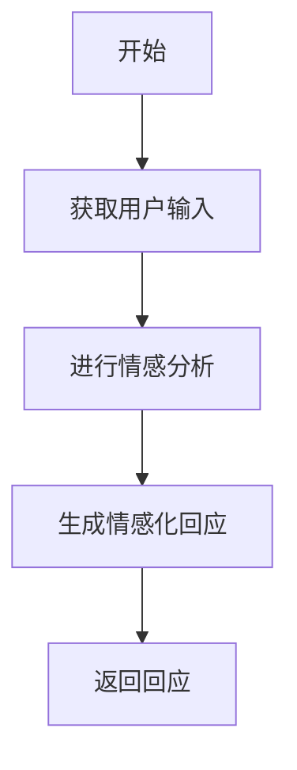
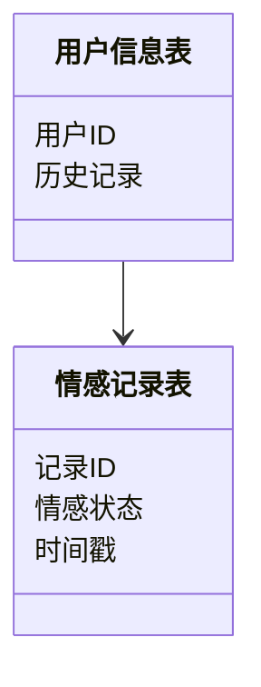
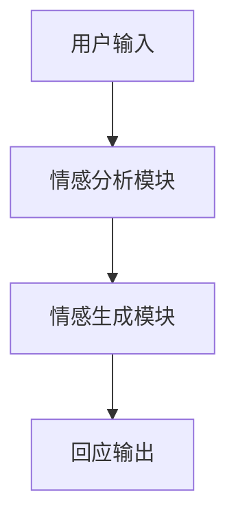
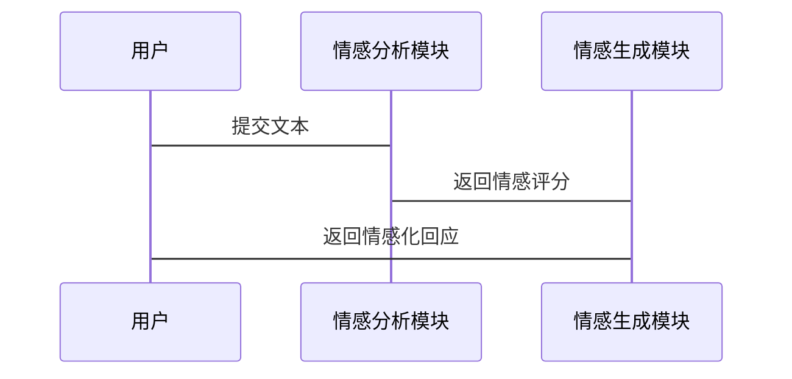

                 


# AI Agent的情感调节：利用LLM实现情绪智能交互

> 关键词：AI Agent，情感调节，LLM，情绪智能，自然语言处理

> 摘要：本文深入探讨了AI Agent在情感调节中的应用，重点介绍了如何利用大语言模型（LLM）实现情绪智能交互。文章从背景、原理、算法、系统设计到项目实战，全面解析了情感调节的核心概念、技术实现和应用场景。通过详细的代码示例和系统架构图，展示了如何构建一个高效的情感调节系统。

---

# 第1章 情感调节在AI Agent中的重要性

## 1.1 情感调节的背景与问题背景

### 1.1.1 情感调节的背景介绍

在人机交互领域，情感调节是实现自然、智能对话的核心技术之一。随着AI Agent的广泛应用，用户期望与AI进行更自然的互动，这要求AI能够理解并适应用户的情绪状态。情感调节技术通过分析用户的语言、语调和行为，调整AI的回应方式，以增强用户体验。

### 1.1.2 问题背景与问题描述

当前，许多AI Agent在处理用户情绪时存在以下问题：
- **情绪理解不足**：无法准确识别用户的情感状态。
- **情绪生成能力有限**：在生成回应时，缺乏情感一致性。
- **交互体验差**：用户感受不到AI的情感支持，导致交互体验下降。

### 1.1.3 情感调节的核心目标与实现路径

情感调节的核心目标是通过分析用户情绪，生成相应的情感化回应，从而提升交互体验。实现路径包括：
1. **情感分析**：识别用户情绪状态。
2. **情感生成**：基于情感分析结果，生成合适的情感化回应。
3. **情感反馈**：实时调整交互策略。

### 1.1.4 情感调节的边界与外延

情感调节的边界包括：
- 仅处理语言中的情感信息，不涉及视觉或听觉情感。
- 专注于实时交互中的情感调节，不涉及长期记忆或情感学习。

其外延包括：
- 情感记忆：记录用户长期情感状态。
- 情感学习：通过反馈优化情感调节策略。

## 1.2 情感调节的核心概念与联系

### 1.2.1 情感调节的核心原理

情感调节的核心原理包括：
1. **情感分析**：利用自然语言处理技术识别用户情感。
2. **情感生成**：基于分析结果生成情感化回应。
3. **情感适应**：动态调整回应策略以适应用户情绪。

### 1.2.2 情感调节的属性特征对比

以下对比了不同情感调节模型的特征：

| 模型名称 | 情感分析 | 情感生成 | 情感记忆 |
|----------|-----------|-----------|-----------|
| Model A  | 支持二元情感分类 | 基于模板生成 | 无 | 
| Model B  | 支持多情感分类 | 基于LLM生成 | 有 | 

### 1.2.3 情感调节的ER实体关系图

以下是情感调节系统的ER实体关系图：

```mermaid
erDiagram
    用户信息表---[拥有]--> 情感记录表
    情感记录表---[包含]--> 情感状态表
    情感状态表---[影响]--> 回应策略表
```

---

# 第2章 LLM在情感调节中的算法原理

## 2.1 情感调节的核心算法

### 2.1.1 情感分析的基本原理

情感分析的基本步骤如下：
1. **文本预处理**：分词、去停用词。
2. **特征提取**：提取情感相关特征。
3. **模型训练**：训练情感分类器。

### 2.1.2 情感生成的算法流程

情感生成的流程如下：



### 2.1.3 情感调节的数学模型

以下是情感调节的数学模型：

$$ 情感评分 = f(输入文本) $$

其中，$f$ 是情感分类模型，返回的情感评分范围为 $-1$ 到 $1$。

## 2.2 情感调节算法的详细讲解

### 2.2.1 情感分析的数学公式

情感分析的数学公式如下：

$$ 情感评分 = \sum_{i=1}^{n} w_i \cdot x_i $$

其中，$w_i$ 是第 $i$ 个词的情感权重，$x_i$ 是第 $i$ 个词的出现标志。

### 2.2.2 情感调节算法的Python实现

以下是情感调节算法的Python代码示例：

```python
# 环境安装
pip install transformers

# 加载预训练模型
from transformers import AutoTokenizer, AutoModelForSequenceClassification
model_name = "nlptyping/roberta-base-emotion-zh"
tokenizer = AutoTokenizer.from_pretrained(model_name)
model = AutoModelForSequenceClassification.from_pretrained(model_name)

# 情感分析函数
def analyze_emotion(text):
    inputs = tokenizer(text, return_tensors="pt")
    outputs = model(**inputs)
    prediction = torch.argmax(outputs.logits, dim=-1)
    return prediction.item()

# 情感生成函数
def generate_response(emotion):
    # 根据情绪生成回应
    pass
```

---

# 第3章 情感调节系统的设计与实现

## 3.1 系统功能设计

### 3.1.1 领域模型设计

以下是领域模型设计：



### 3.1.2 系统架构设计

以下是系统架构设计图：



### 3.1.3 接口设计与交互流程

以下是交互流程：



---

## 3.2 项目实战

### 3.2.1 环境安装与代码实现

以下是环境安装命令：

```bash
pip install transformers
```

以下是核心代码实现：

```python
# 情感调节系统实现
from transformers import AutoTokenizer, AutoModelForSequenceClassification
import torch

model_name = "nlptyping/roberta-base-emotion-zh"
tokenizer = AutoTokenizer.from_pretrained(model_name)
model = AutoModelForSequenceClassification.from_pretrained(model_name)

def analyze_emotion(text):
    inputs = tokenizer(text, return_tensors="pt")
    outputs = model(**inputs)
    prediction = torch.argmax(outputs.logits, dim=-1)
    return prediction.item()

def generate_response(emotion):
    # 实现情感生成逻辑
    pass

# 示例用法
text = "我今天心情很好"
emotion = analyze_emotion(text)
print(f"情感评分：{emotion}")
response = generate_response(emotion)
print(f"生成回应：{response}")
```

### 3.2.2 代码解读与功能分析

1. **环境安装**：安装必要的库，包括`transformers`。
2. **模型加载**：加载预训练的情感分类模型。
3. **情感分析函数**：将输入文本编码并进行情感分类。
4. **情感生成函数**：根据情感评分生成回应。

---

## 3.3 案例分析与详细讲解

### 3.3.1 案例分析

假设用户输入为“我今天心情很好”，系统分析后返回正面情感，并生成相应的正面回应。

### 3.3.2 代码实现

以下是完整的代码实现：

```python
from transformers import AutoTokenizer, AutoModelForSequenceClassification
import torch

model_name = "nlptyping/roberta-base-emotion-zh"
tokenizer = AutoTokenizer.from_pretrained(model_name)
model = AutoModelForSequenceClassification.from_pretrained(model_name)

def analyze_emotion(text):
    inputs = tokenizer(text, return_tensors="pt")
    outputs = model(**inputs)
    prediction = torch.argmax(outputs.logits, dim=-1)
    return prediction.item()

def generate_response(emotion):
    # 示例实现：根据情感生成回应
    if emotion == 0:
        return "看起来你心情不错，有什么我可以帮你的吗？"
    else:
        return "听起来你有点情绪低落，有什么我可以帮助你的吗？"

# 示例用法
text = "我今天心情很好"
emotion = analyze_emotion(text)
print(f"情感评分：{emotion}")
response = generate_response(emotion)
print(f"生成回应：{response}")
```

---

## 3.4 项目小结

通过本章的讲解，我们实现了情感调节系统的基本功能，包括情感分析和情感生成。实际案例展示了如何通过LLM技术实现情感交互，为后续的优化和扩展提供了基础。

---

# 第4章 最佳实践与总结

## 4.1 最佳实践 tips

1. **数据多样性**：确保训练数据涵盖多种情感场景。
2. **模型优化**：根据实际需求调整模型参数。
3. **用户隐私**：保护用户的个人信息和情感数据。

## 4.2 小结

本文详细讲解了AI Agent的情感调节技术，从背景、原理到实现，全面覆盖了情感调节的核心内容。通过代码示例和系统架构图，展示了如何利用LLM实现情感交互。

## 4.3 注意事项

1. **模型泛化能力**：注意模型在不同场景中的表现。
2. **数据隐私**：确保用户数据的安全性。
3. **用户体验**：保持交互的自然性和流畅性。

## 4.4 拓展阅读

1. **相关论文**：阅读最新的情感计算相关论文。
2. **技术博客**：关注前沿技术博客，获取最新动态。
3. **工具与库**：学习更多情感计算相关的开源工具和库。

---

# 附录

## 附录A 情感调节算法的数学模型

$$ 情感评分 = f(输入文本) $$

其中，$f$ 是预训练的情感分类模型。

## 附录B 系统架构图


---

# 结语

通过本文的讲解，读者可以深入了解AI Agent的情感调节技术，并掌握利用LLM实现情感交互的核心方法。希望本文能为相关领域的研究和应用提供有价值的参考。

