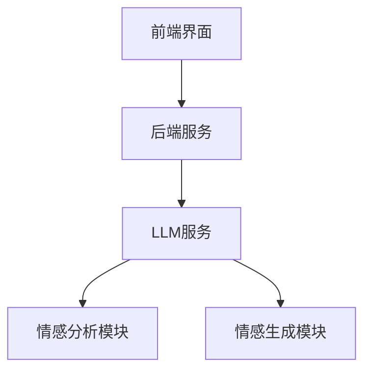
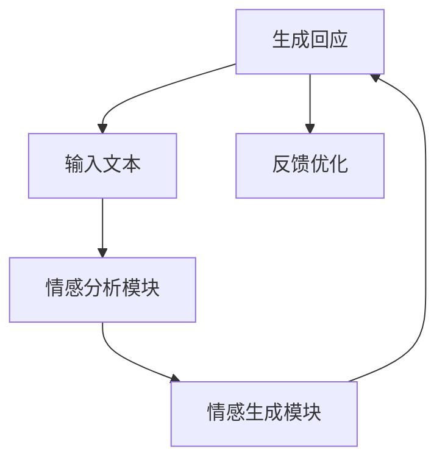

                 


# AI Agent的情感调节：利用LLM进行情绪管理

---

## 关键词
AI Agent, 情感调节, LLM, 情绪识别, 自然语言处理

---

## 摘要
随着人工智能技术的不断发展，AI Agent在各个领域的应用越来越广泛。然而，如何让AI Agent具备情感调节的能力，使其能够理解和管理情绪，成为一个重要的研究方向。本文将深入探讨如何利用大语言模型（LLM）进行情感调节，从理论到实践，详细分析其工作原理、实现方法及实际应用案例。通过本文的阅读，读者将能够理解AI Agent情感调节的核心概念，并掌握利用LLM进行情绪管理的技术要点。

---

## 目录
1. [AI Agent与情感调节概述](#ai-agent与情感调节概述)
   - 1.1 AI Agent的基本概念
   - 1.2 情感调节的重要性
   - 1.3 LLM在情感调节中的应用
2. [情感调节的核心概念](#情感调节的核心概念)
   - 2.1 情感分析与情绪识别
   - 2.2 情感调节的理论基础
   - 2.3 LLM与情感调节的结合
3. [基于LLM的情感调节算法实现](#基于llm的情感调节算法实现)
   - 3.1 情感分析的算法原理
   - 3.2 LLM驱动的情感调节模型
   - 3.3 算法实现与优化
4. [系统设计与实现](#系统设计与实现)
   - 4.1 系统架构设计
   - 4.2 系统功能设计
   - 4.3 系统接口与交互设计
5. [项目实战：利用LLM实现情感调节](#项目实战利用llm实现情感调节)
   - 5.1 项目背景与目标
   - 5.2 核心代码实现
   - 5.3 案例分析与解读
6. [最佳实践、小结与展望](#最佳实践小结与展望)
   - 6.1 最佳实践
   - 6.2 项目小结
   - 6.3 未来展望

---

## 第一部分: AI Agent与情感调节概述

### 第1章: AI Agent的基本概念

#### 1.1 什么是AI Agent
AI Agent（人工智能代理）是指能够感知环境、自主决策并采取行动以实现特定目标的智能实体。AI Agent可以是软件程序、机器人或其他智能系统，其核心目标是通过智能算法和数据处理能力，为用户提供高效、智能的服务。

#### 1.2 AI Agent的分类
AI Agent可以根据功能和应用场景分为以下几类：
- **知识型AI Agent**：基于知识库提供信息查询和决策支持，例如智能助手。
- **行为型AI Agent**：通过感知环境并执行具体动作，例如自动驾驶汽车。
- **社交型AI Agent**：用于社交互动和情感交流，例如情感陪聊机器人。

#### 1.3 AI Agent的应用场景
AI Agent广泛应用于多个领域：
- **智能助手**：如Siri、Alexa，帮助用户完成日常任务。
- **推荐系统**：根据用户行为推荐个性化内容。
- **情感陪聊**：通过情感识别和生成，提供情感支持。

---

### 第2章: 情感调节的重要性

#### 2.1 情感调节的定义
情感调节是指个体通过调整自身情绪状态，以适应环境变化或应对压力的过程。情感调节能力是人类心理健康的重要组成部分。

#### 2.2 情感调节的作用
情感调节在个人和社会层面具有重要意义：
- **心理健康**：帮助个体管理情绪，预防心理疾病。
- **人际关系**：促进有效沟通，提升社交能力。
- **工作效率**：提高职场中的情绪管理能力，增强工作表现。

#### 2.3 情感调节的挑战
实现AI Agent的情感调节面临以下挑战：
- **复杂性**：情绪是多维度的，涉及认知、行为和生理等多个层面。
- **动态性**：情绪状态会随着环境和个体差异而变化。
- **准确性**：情感识别和生成需要高精度的自然语言处理技术。

---

### 第3章: LLM在情感调节中的应用

#### 3.1 LLM的基本原理
大语言模型（LLM）是一种基于深度学习的自然语言处理模型，能够理解和生成人类语言。其核心是通过大量数据训练，学习语言的结构和语义，从而实现文本生成、情感分析等功能。

#### 3.2 LLM在情感调节中的优势
LLM在情感调节中的优势体现在：
- **强大的语言理解能力**：能够准确识别用户的情感状态。
- **生成能力**：可以根据情感需求生成相应的回应。
- **可扩展性**：可以通过微调和迁移学习适应不同场景。

---

## 第二部分: 情感调节的核心概念

### 第4章: 情感分析与情绪识别

#### 4.1 情感分析的基本原理
情感分析是通过自然语言处理技术，对文本的情感倾向进行分类的过程。情感分析可以分为以下步骤：
1. **文本预处理**：包括分词、去停用词等。
2. **特征提取**：提取文本中的情感相关特征。
3. **模型训练**：使用机器学习或深度学习模型进行分类。

#### 4.2 常见的情感分析方法
- **基于词典的方法**：利用情感词典对文本进行情感评分。
- **机器学习方法**：使用SVM、随机森林等模型进行情感分类。
- **深度学习方法**：使用RNN、LSTM等模型进行情感分析。

#### 4.3 情感分析的挑战
- **数据偏差**：训练数据可能存在情感倾向，导致模型偏见。
- **语境理解**：情感表达可能受到语境影响，难以准确识别。
- **多语言支持**：跨语言情感分析面临更多挑战。

---

### 第5章: 情感调节的理论基础

#### 5.1 情感调节的理论模型
- **层级模型**：将情感调节分为多个层次，包括注意、认知重评等。
- **过程模型**：强调情感调节的动态性和过程性。
- **神经机制**：研究大脑如何处理情感信息。

#### 5.2 情感调节的核心要素
- **情感识别**：准确识别用户情感状态。
- **情感生成**：生成符合情感需求的回应。
- **情感反馈**：根据用户反馈调整情感调节策略。

---

### 第6章: LLM与情感调节的结合

#### 6.1 LLM在情感调节中的作用
- **情感识别**：利用LLM的强大语言模型，准确识别用户情感。
- **情感生成**：生成情感化的文本回应，满足用户情感需求。
- **动态调整**：根据用户反馈动态优化情感调节策略。

#### 6.2 LLM驱动的情感调节模型
- **输入阶段**：用户输入情感相关文本。
- **情感分析阶段**：LLM分析文本情感。
- **生成阶段**：LLM生成情感化回应。
- **反馈阶段**：根据用户反馈调整模型参数。

---

## 第三部分: 基于LLM的情感调节算法实现

### 第7章: 情感分析的算法原理

#### 7.1 情感分析的数学模型
情感分析可以使用逻辑回归、支持向量机（SVM）或深度学习模型。以下是一个简单的逻辑回归模型：

$$ P(y=1|x) = \frac{1}{1 + e^{-\beta x}} $$

其中，$\beta$ 是模型参数，$x$ 是输入特征。

#### 7.2 情感分析的实现步骤
1. **数据预处理**：分词、去停用词。
2. **特征提取**：提取文本特征，如TF-IDF。
3. **模型训练**：使用训练数据训练情感分类模型。
4. **模型评估**：通过准确率、召回率等指标评估模型性能。

---

### 第8章: LLM驱动的情感调节模型

#### 8.1 情感调节模型的构建
- **输入处理**：将用户输入的文本转化为模型可处理的格式。
- **情感分析**：使用LLM进行情感分类。
- **情感生成**：根据情感分析结果生成回应文本。
- **反馈优化**：根据用户反馈优化模型参数。

#### 8.2 情感调节模型的优化
- **数据增强**：通过数据增强技术增加训练数据的多样性。
- **模型调参**：优化模型超参数，提高情感分类的准确性。
- **多任务学习**：结合其他任务（如意图识别）提升模型性能。

---

### 第9章: 算法实现与优化

#### 9.1 算法实现步骤
1. **数据准备**：收集和整理情感相关数据。
2. **模型选择**：选择合适的模型架构。
3. **模型训练**：使用训练数据训练模型。
4. **模型评估**：评估模型性能并进行优化。

#### 9.2 算法优化策略
- **数据预处理**：使用更高效的分词工具和特征提取方法。
- **模型优化**：尝试不同的模型架构，如BERT、GPT等。
- **训练技巧**：使用学习率衰减、早停等训练技巧。

---

## 第四部分: 系统设计与实现

### 第10章: 系统架构设计

#### 10.1 系统架构概述
- **前端界面**：用户与AI Agent交互的界面。
- **后端服务**：处理用户输入并返回情感调节结果。
- **LLM服务**：提供情感分析和生成功能。

#### 10.2 系统架构图


---

### 第11章: 系统功能设计

#### 11.1 功能模块设计
- **情感分析模块**：分析用户输入的情感。
- **情感生成模块**：生成情感化回应。
- **用户反馈模块**：收集用户反馈并优化模型。

#### 11.2 功能流程图


---

### 第12章: 系统接口与交互设计

#### 12.1 系统接口设计
- **API接口**：提供RESTful API，供前端调用。
- **数据格式**：使用JSON格式传输数据。

#### 12.2 交互设计
- **用户输入**：通过文本框输入情感相关文本。
- **系统输出**：生成情感化回应并展示在界面上。

---

## 第五部分: 项目实战：利用LLM实现情感调节

### 第13章: 项目背景与目标

#### 13.1 项目背景
随着AI技术的发展，情感陪聊机器人越来越受欢迎。本项目旨在开发一个基于LLM的情感调节系统，帮助用户管理情绪。

#### 13.2 项目目标
- 实现情感分析功能。
- 实现情感生成功能。
- 提供用户友好的交互界面。

---

### 第14章: 核心代码实现

#### 14.1 环境安装
```bash
pip install transformers
pip install torch
```

#### 14.2 核心代码
```python
from transformers import pipeline

# 初始化情感分析pipeline
sentiment_analyzer = pipeline("sentiment-analysis")

# 情感分析函数
def analyze_sentiment(text):
    result = sentiment_analyzer(text)
    return result[0]['label']

# 情感生成函数
def generate_response(text):
    # 使用生成模型生成回应
    generator = pipeline('text-generation')
    response = generator(text, max_length=50, num_return_sequences=1)
    return response[0]['generated_text']
```

---

### 第15章: 案例分析与解读

#### 15.1 案例分析
假设用户输入：“我感到非常难过。”
系统分析情感为“negative”，然后生成回应：“我很抱歉你现在感到难过，有什么我可以帮助你的吗？”

#### 15.2 代码解读
- **情感分析**：使用预训练的情感分析模型，快速识别用户情感。
- **情感生成**：通过生成模型，生成符合情感需求的回应。

---

## 第六部分: 最佳实践、小结与展望

### 第16章: 最佳实践

#### 16.1 数据预处理
- 使用高质量的情感标注数据，确保模型训练效果。
- 进行数据清洗和增强，提升模型泛化能力。

#### 16.2 模型优化
- 选择合适的模型架构，如BERT、GPT等。
- 使用迁移学习，减少训练数据量。

---

### 第17章: 项目小结

#### 17.1 核心成果
- 成功实现了基于LLM的情感调节系统。
- 提供了情感分析和生成功能，满足用户情感需求。

#### 17.2 经验总结
- 数据质量对模型性能影响重大。
- 模型调参和优化是关键。

---

### 第18章: 未来展望

#### 18.1 技术发展
- 更先进的LLM模型，如GPT-4，将提供更强的情感处理能力。
- 多模态情感分析将成为研究热点。

#### 18.2 应用场景扩展
- 情感调节技术将应用于更多领域，如教育、医疗等。
- 情感陪聊机器人将更加智能化和个性化。

---

## 结语
通过本文的详细讲解，读者可以全面了解AI Agent情感调节的核心概念、实现方法及实际应用。未来，随着技术的不断进步，情感调节将变得更加智能化和个性化，为人类带来更高效、更贴心的体验。

---

