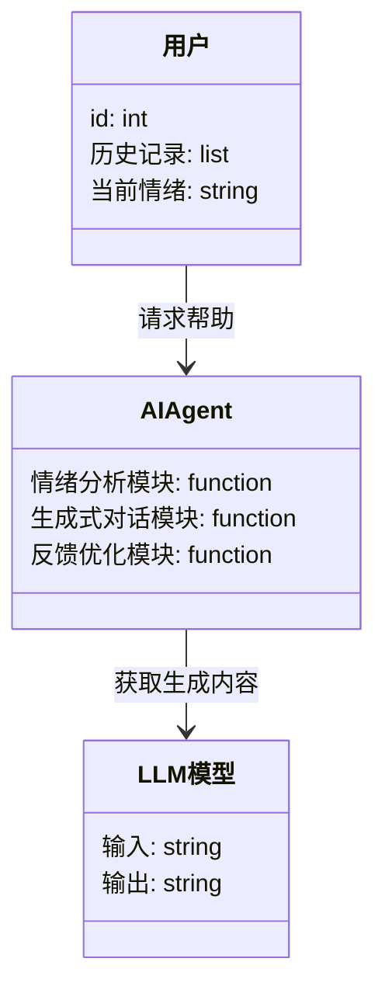
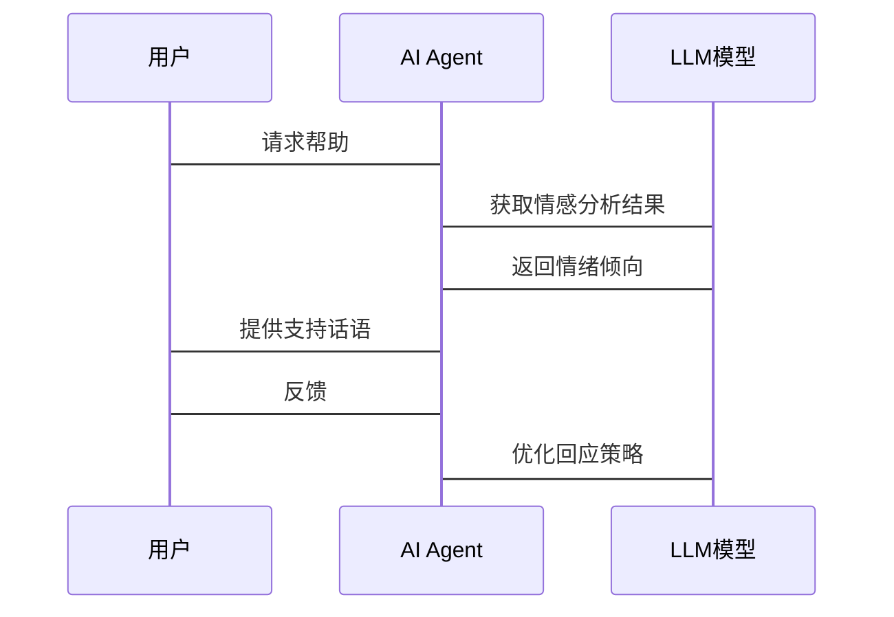

                 


# AI Agent的情绪调节功能：LLM驱动的心理健康助手

> 关键词：AI Agent, 情绪调节, LLM, 心理健康, 自然语言处理

> 摘要：本文探讨了AI Agent在情绪调节中的应用，特别是通过大语言模型（LLM）实现心理健康支持。从背景介绍到算法原理，再到系统设计和项目实战，本文详细分析了如何利用AI技术帮助人们维护心理健康。

---

# 第一部分: AI Agent的情绪调节功能概述

## 第1章: 问题背景与目标

### 1.1 问题背景

#### 1.1.1 AI Agent的定义与特点
AI Agent是一种智能体，能够感知环境并执行任务以满足目标。其特点包括自主性、反应性、目标导向和社交能力。AI Agent可以通过自然语言处理（NLP）与用户交互，理解情感并提供反馈。

#### 1.1.2 情绪调节功能的必要性
在现代社会中，心理健康问题日益突出。AI Agent通过情绪调节功能，可以帮助用户缓解压力、焦虑等情绪问题，提供实时支持。

#### 1.1.3 LLM在心理健康领域的应用潜力
大语言模型（LLM）具有强大的文本生成和理解能力，能够模拟人类对话，提供情感支持。LLM可以用于识别情绪、生成安慰话语，并提供建议。

### 1.2 问题描述

#### 1.2.1 当前心理健康问题的现状
现代社会压力大，心理健康问题普遍。传统心理健康服务资源有限，无法满足需求。

#### 1.2.2 AI在心理健康服务中的角色
AI Agent可以作为辅助工具，提供即时、个性化的支持，减轻专业心理师的负担。

#### 1.2.3 LLM驱动的AI Agent的优势与局限
优势：24/7可用、隐私保护、可扩展性。局限：情感理解深度有限、缺乏同理心。

### 1.3 问题解决

#### 1.3.1 AI Agent如何实现情绪调节
通过自然语言处理识别用户情绪，结合预设策略生成回应。

#### 1.3.2 LLM在情绪调节中的具体应用
生成安慰话语、提供建议、识别情绪倾向。

#### 1.3.3 系统设计的目标与核心功能
目标：提供实时、个性化的心理健康支持。核心功能：情绪识别、生成式对话、反馈优化。

## 第2章: 核心概念与联系

### 2.1 AI Agent与LLM的关系

#### 2.1.1 AI Agent的构成要素
感知模块、推理模块、行动模块、学习模块。

#### 2.1.2 LLM在AI Agent中的作用
作为感知和行动模块的核心，负责理解和生成文本。

#### 2.1.3 两者协同工作的原理
AI Agent通过LLM进行情感分析，生成回应，形成闭环。

### 2.2 情绪调节功能的实现机制

#### 2.2.1 情绪识别与分析
技术：情感分析、关键词提取。方法：基于规则、统计学习、深度学习。

#### 2.2.2 情绪生成与反馈
生成式对话：基于LLM的文本生成。反馈优化：根据用户反应调整回应策略。

#### 2.2.3 情绪调节策略的制定
个性化策略：根据用户情绪状态制定不同策略。实时调整：动态优化回应。

### 2.3 ER实体关系图

```mermaid
er
  actor: 用户
  agent: AI Agent
  model: LLM模型
  emotion_data: 情绪数据
  interaction: 交互记录
  relation: 用户与AI Agent的交互
  relation: AI Agent与LLM模型的数据传输
```

---

# 第3章: 算法原理与数学模型

## 3.1 LLM的训练与优化

### 3.1.1 监督微调
- 目的：适应特定任务。
- 方法：使用标记数据进行微调。
- 示例：在心理健康场景下，微调LLM使其更擅长情感支持。

### 3.1.2 强化学习
- 目的：优化生成质量。
- 方法：使用奖励机制，根据用户反馈调整生成策略。

### 3.1.3 惩罚函数的使用
- 示例：交叉熵损失函数用于分类任务。

## 3.2 情感分析算法

### 3.2.1 情感分类流程
1. 文本预处理：分词、去除停用词。
2. 特征提取：使用词袋模型或词嵌入。
3. 分类器训练：使用SVM、随机森林或深度学习模型。

### 3.2.2 情感分类的数学模型

$$
\text{损失函数} = -\frac{1}{N}\sum_{i=1}^{N} \log(P(y_i|X_i))
$$

其中，$P(y_i|X_i)$ 是模型预测的概率。

---

# 第4章: 系统分析与架构设计

## 4.1 问题场景介绍

### 4.1.1 用户需求
- 实时情感支持
- 个性化建议
- 隐私保护

### 4.1.2 系统目标
- 提供高效的情绪调节服务
- 保证数据安全

## 4.2 系统功能设计

### 4.2.1 领域模型



### 4.2.2 系统架构设计


## 4.3 接口设计与交互流程图

### 4.3.1 API接口

```json
{
    "intent": "请求帮助",
    "input": "我感到很焦虑",
    "response": "我可以帮助你缓解焦虑。请告诉我更多关于你的感受。"
}
```

### 4.3.2 交互流程



---

# 第5章: 项目实战

## 5.1 环境安装

### 5.1.1 安装Python和相关库
```bash
pip install python
pip install transformers
pip install torch
```

### 5.1.2 下载LLM模型
```bash
git clone https://github.com/facebookresearch/pytorch-transformers.git
```

## 5.2 核心代码实现

### 5.2.1 情感分析模块

```python
from transformers import pipeline

def analyze_emotion(text):
    emotion_pipeline = pipeline("sentiment-analysis")
    return emotion_pipeline(text)
```

### 5.2.2 生成式对话模块

```python
from transformers import AutoModelForCausalLM, AutoTokenizer

def generate_response(text):
    model_name = "gpt2"
    tokenizer = AutoTokenizer.from_pretrained(model_name)
    model = AutoModelForCausalLM.from_pretrained(model_name)
    inputs = tokenizer(text, return_tensors="pt")
    outputs = model.generate(inputs.input_ids, max_length=50)
    return tokenizer.decode(outputs[0], skip_special_tokens=True)
```

### 5.2.3 反馈优化模块

```python
def optimize_response(feedback):
    # 根据反馈调整生成策略
    pass
```

## 5.3 代码解读与分析

### 5.3.1 情感分析模块
- 使用预训练的情感分析模型，返回情绪倾向。

### 5.3.2 生成式对话模块
- 使用GPT-2生成回复，限制长度为50个token。

## 5.4 实际案例分析

### 5.4.1 用户输入
"我感到很焦虑。"

### 5.4.2 情感分析结果
情绪倾向：消极。

### 5.4.3 生成回应
"我很抱歉你感到焦虑。我们可以一起探讨一下问题的根源。"

## 5.5 项目小结

### 5.5.1 成功经验
- 系统实现了基本的情绪调节功能。
- 用户反馈积极。

### 5.5.2 经验教训
- 情感理解深度有限。
- 回应策略需要优化。

---

# 第6章: 总结与展望

## 6.1 全文总结

### 6.1.1 核心内容回顾
- AI Agent通过LLM实现情绪调节。
- 系统设计与实现细节。

### 6.1.2 重要结论
- AI Agent可以作为心理健康的重要工具。
- 技术仍在发展中。

## 6.2 未来展望

### 6.2.1 技术发展
- 更先进的LLM模型。
- 更精准的情感理解。

### 6.2.2 应用领域
- 教育、医疗、企业等领域。

## 6.3 最佳实践 Tips

### 6.3.1 数据隐私
- 保护用户隐私，避免数据泄露。

### 6.3.2 模型可解释性
- 提供透明的解释，增强用户信任。

---

# 结语

通过本文的详细分析，我们了解了AI Agent在情绪调节中的潜力和实现方式。未来，随着技术进步，AI在心理健康领域的应用将更加广泛和深入。

--- 

感谢您的阅读！如果有任何问题或建议，请随时与我联系。

