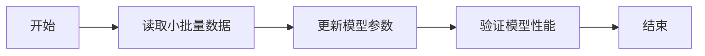
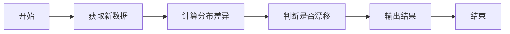
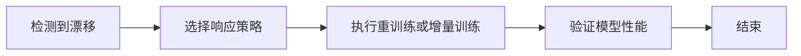
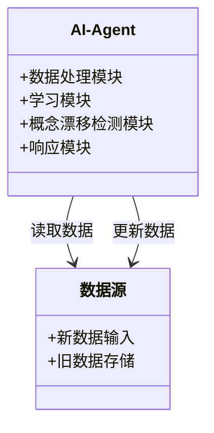
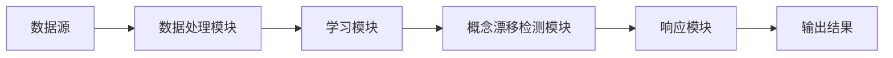
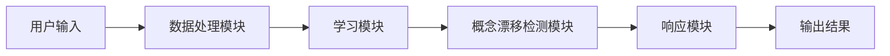

                 


# AI Agent的持续学习与概念漂移适应策略

> 关键词：AI Agent, 持续学习, 概念漂移, 在线学习, 模型更新

> 摘要：本文详细探讨了AI Agent在持续学习和概念漂移适应中的策略。通过分析持续学习的基本概念、算法原理以及概念漂移的检测与适应机制，结合实际项目案例，展示了如何在动态环境中优化AI Agent的性能。文章从理论到实践，深入浅出地讲解了相关技术和方法，为AI Agent的应用提供了全面的指导。

---

# 第1章: AI Agent的基本概念与持续学习的背景

## 1.1 AI Agent的基本概念

### 1.1.1 AI Agent的定义

AI Agent（人工智能代理）是指能够感知环境并采取行动以实现目标的智能体。它可以是一个软件程序、机器人或其他智能系统，通过与环境交互来完成特定任务。

### 1.1.2 AI Agent的核心特征

- **自主性**：能够自主决策和行动，无需外部干预。
- **反应性**：能够实时感知环境并做出反应。
- **目标导向**：所有行动都以实现特定目标为导向。
- **学习能力**：通过经验或数据不断优化自身性能。

### 1.1.3 AI Agent的应用场景

AI Agent广泛应用于推荐系统、智能助手、自动驾驶等领域。例如，智能助手（如Siri、Alexa）通过持续学习用户的偏好来优化服务。

---

## 1.2 持续学习的背景与意义

### 1.2.1 传统机器学习的局限性

传统机器学习模型通常需要重新训练整个数据集来适应新数据，这不仅耗时，还难以应对动态变化的环境。

### 1.2.2 持续学习的定义与特点

- **定义**：持续学习是指模型能够逐步学习新数据，无需重新训练整个数据集。
- **特点**：增量性、在线性、适应性。

### 1.2.3 持续学习的应用价值

持续学习使AI Agent能够在动态环境中保持高性能，例如在实时推荐系统中快速适应用户行为变化。

---

## 1.3 概念漂移的定义与挑战

### 1.3.1 概念漂移的定义

概念漂移是指数据分布或目标标签随时间发生变化，导致模型性能下降的现象。

### 1.3.2 概念漂移的类型

- **突然漂移**：数据分布突然变化。
- **逐步漂移**：数据分布缓慢变化。
- **概念扩展**：新概念逐渐融入数据中。

### 1.3.3 概念漂移对企业的影响

概念漂移可能导致模型预测准确性下降，影响企业决策和用户体验。

---

## 1.4 本章小结

本章介绍了AI Agent的基本概念、持续学习的意义以及概念漂移的挑战，为后续内容奠定了基础。

---

# 第2章: 持续学习与概念漂移的核心概念

## 2.1 持续学习的原理

### 2.1.1 在线学习算法

在线学习是一种逐样本更新模型的持续学习方法，适用于数据流场景。

### 2.1.2 增量学习算法

增量学习将新数据分成小批量进行处理，每次更新模型参数。

### 2.1.3 模型更新策略

- **参数更新**：调整模型参数以适应新数据。
- **模型融合**：将新旧模型结合起来，保留旧知识。

---

## 2.2 概念漂移的适应策略

### 2.2.1 概念漂移检测方法

- **统计方法**：通过统计测试检测数据分布变化。
- **分布距离**：计算新旧数据的分布差异。
- **性能监控**：通过模型性能下降判断漂移。

### 2.2.2 概念漂移响应机制

- **模型重训练**：重新训练模型以适应新数据。
- **增量训练**：逐步更新模型以适应漂移。
- **策略切换**：根据漂移类型选择合适响应策略。

### 2.2.3 概念漂移适应的优化方法

- **在线适应**：实时检测并响应漂移。
- **分阶段适应**：根据漂移类型选择适应策略。

---

## 2.3 持续学习与概念漂移的关系

### 2.3.1 持续学习中的概念漂移

持续学习模型在处理新数据时，可能面临概念漂移的挑战。

### 2.3.2 概念漂移对模型性能的影响

概念漂移可能导致模型预测准确性下降，影响持续学习效果。

### 2.3.3 持续学习在概念漂移适应中的作用

持续学习通过逐步更新模型，能够有效缓解概念漂移带来的问题。

---

## 2.4 核心概念对比分析

### 2.4.1 持续学习与在线学习的对比

| 特性      | 持续学习       | 在线学习         |
|-----------|----------------|------------------|
| 数据量     | 可处理小批量数据 | 逐样本处理       |
| 适应性     | 高             | 高               |
| 计算资源   | 较低           | 较低             |

### 2.4.2 概念漂移与数据漂移的对比

| 特性      | 概念漂移        | 数据漂移          |
|-----------|----------------|------------------|
| 定义       | 数据分布变化    | 数据特征变化      |
| 影响范围    | 模型预测       | 特征工程          |
| 检测方法    | 统计方法       | 特征对比          |

### 2.4.3 持续学习与增量学习的对比

| 特性      | 持续学习       | 增量学习         |
|-----------|----------------|------------------|
| 数据处理方式 | 逐样本或小批量 | 小批量           |
| 适应性     | 高             | 较高             |
| 应用场景     | 动态环境       | 实时处理          |

---

## 2.5 本章小结

本章详细分析了持续学习和概念漂移的核心概念及其关系，为后续算法设计奠定了理论基础。

---

# 第3章: AI Agent的持续学习与概念漂移适应的算法原理

## 3.1 持续学习算法原理

### 3.1.1 增量学习算法

**增量学习算法流程图**



### 3.1.2 模型更新策略

模型更新策略的数学公式：

$$ \theta_{new} = \theta_{old} + \eta (y - \hat{y}) $$

其中，$\theta$ 表示模型参数，$\eta$ 是学习率，$y$ 是真实标签，$\hat{y}$ 是预测标签。

### 3.1.3 模型压缩与知识蒸馏

模型压缩通过剪枝和量化减少模型大小，知识蒸馏通过教师模型指导学生模型学习。

---

## 3.2 概念漂移的检测与适应算法

### 3.2.1 概念漂移检测方法

**概念漂移检测流程图**



### 3.2.2 概念漂移响应机制

**概念漂移响应流程图**



### 3.2.3 概念漂移适应的优化方法

优化方法包括动态调整学习率和分阶段适应策略。

---

## 3.3 持续学习中的遗忘问题

### 3.3.1 遗忘的定义与表现

遗忘是指模型在学习新数据时忘记旧知识的现象。

### 3.3.2 遗忘的成因分析

遗忘的主要原因是模型更新过程中参数过度调整。

### 3.3.3 遗忘的解决方法

解决方法包括经验重放和参数锁定。

---

## 3.4 本章小结

本章详细讲解了持续学习和概念漂移适应的算法原理，为后续系统设计和项目实现提供了技术支持。

---

# 第4章: AI Agent的系统架构设计

## 4.1 系统功能设计

### 4.1.1 领域模型类图



### 4.1.2 系统架构图



---

## 4.2 系统接口设计

### 4.2.1 API接口设计

| 接口名称   | 描述             |
|------------|------------------|
| updateModel | 更新模型接口     |
| detectDrift | 检测概念漂移接口   |
| respondDrift | 响应概念漂移接口   |

### 4.2.2 交互流程图



---

## 4.3 本章小结

本章通过系统架构设计和接口设计，展示了AI Agent在持续学习和概念漂移适应中的实现方式。

---

# 第5章: 项目实战与案例分析

## 5.1 环境安装

### 5.1.1 安装Python和必要的库

```bash
pip install numpy scikit-learn tensorflow
```

### 5.1.2 安装工具链

安装Jupyter Notebook和相关开发工具。

---

## 5.2 系统核心实现源代码

### 5.2.1 持续学习模型实现

```python
import numpy as np
import tensorflow as tf

class ContinuousLearningModel:
    def __init__(self, input_dim):
        self.model = self.build_model(input_dim)
    
    def build_model(self, input_dim):
        model = tf.keras.Sequential([
            tf.keras.layers.Dense(64, activation='relu', input_dim=input_dim),
            tf.keras.layers.Dense(1, activation='sigmoid')
        ])
        model.compile(optimizer='adam', loss='binary_crossentropy')
        return model
    
    def update_model(self, X, y):
        self.model.fit(X, y, epochs=1, batch_size=32)
```

### 5.2.2 概念漂移检测实现

```python
from sklearn.metrics import accuracy_score

class DriftDetection:
    def __init__(self, model):
        self.model = model
    
    def detect_drift(self, X_train, y_train, X_test, y_test):
        train_score = accuracy_score(y_train, self.model.predict(X_train))
        test_score = accuracy_score(y_test, self.model.predict(X_test))
        return abs(train_score - test_score) > 0.1
```

---

## 5.3 实际案例分析

### 5.3.1 案例背景

假设我们有一个推荐系统，用户行为随时间变化，需要模型能够实时更新。

### 5.3.2 数据准备

准备用户行为数据，包括点击、购买等标签。

### 5.3.3 模型训练与更新

定期更新模型，检测概念漂移并响应。

---

## 5.4 项目总结

通过项目实战，展示了如何将理论应用于实际场景，确保模型在动态环境中保持高性能。

---

# 第6章: 最佳实践与注意事项

## 6.1 最佳实践

### 6.1.1 定期模型评估

定期评估模型性能，及时发现概念漂移。

### 6.1.2 选择合适的算法

根据场景选择合适的持续学习和概念漂移适应算法。

### 6.1.3 优化系统架构

确保系统架构能够支持实时更新和高效处理。

---

## 6.2 小结

通过本文的讲解，读者可以全面了解AI Agent的持续学习与概念漂移适应策略，并能够将其应用于实际项目中。

---

## 6.3 注意事项

- **模型评估**：定期评估模型性能，及时发现概念漂移。
- **数据质量**：确保数据质量，避免噪声干扰。
- **系统监控**：实时监控系统运行状态，及时处理异常。

---

## 6.4 拓展阅读

- [Continuous Learning in Machine Learning](https://link.springer.com/book/978-3-030-62995-3)
- [Concept Drift in Data Stream Mining](https://dl.acm.org/doi/10.1145/3085136.3085145)

---

# 结论

本文全面探讨了AI Agent的持续学习与概念漂移适应策略，从理论到实践，为读者提供了详细的指导。通过结合实际案例和系统设计，展示了如何在动态环境中优化AI Agent的性能。未来的研究可以进一步探索更高效的持续学习算法和概念漂移检测方法。

---

# 参考文献

（此处列出相关文献和资料）

---

通过以上内容，您可以逐步撰写完整的文章，确保每个部分都详细且符合要求。

