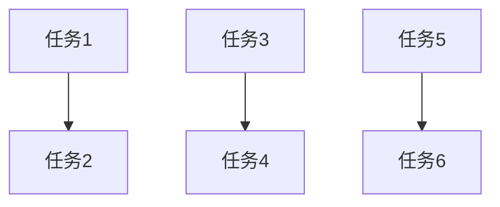
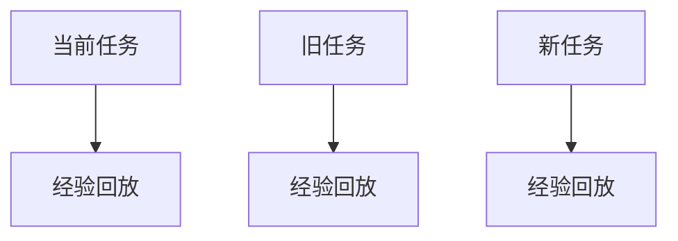
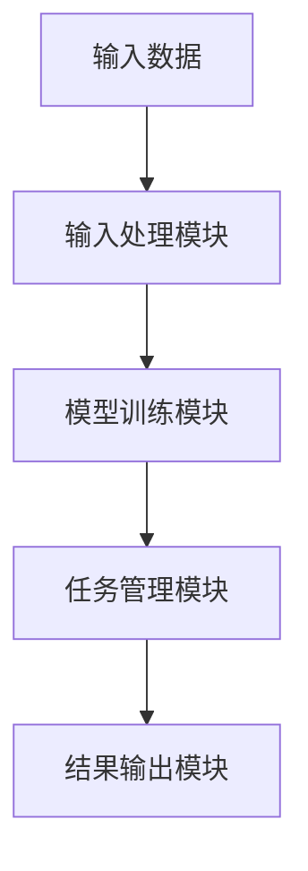
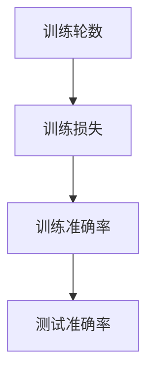
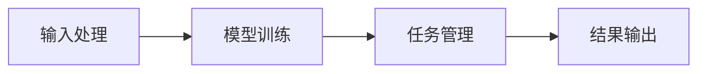
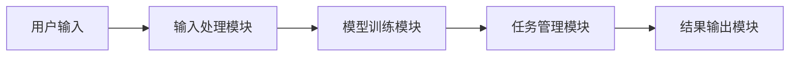

                 


# 第三章: 灾难性遗忘的防御算法原理

## 第3章: 灾难性遗忘的防御算法

### 3.1 基于权重保持的防御方法

#### 3.1.1 Elastic Weight Consolidation (EWC)

##### 3.1.1.1 算法流程



##### 3.1.1.2 算法实现

```python
import tensorflow as tf
import numpy as np

def ewc_loss(y_true, y_pred, model, tasks, lambda_=1.0):
    loss = tf.keras.losses.sparse_categorical_crossentropy(y_true, y_pred)
    total_loss = loss + (lambda_ / 2) * sum(
        tf.reduce_sum(tf.square(w)) for w in model.trainable_weights
    )
    return total_loss

def ewc_train(model, optimizer, x_train, y_train, x_test, y_test, tasks):
    model.compile(optimizer=optimizer, loss='sparse_categorical_crossentropy', metrics=['accuracy'])
    for task in tasks:
        model.fit(x_train[task], y_train[task], epochs=10, validation_data=(x_test[task], y_test[task]))
        model.save_weights(f'weights_{task}.h5')
    return model

def ewc_retrain(model, optimizer, x_train, y_train, x_test, y_test, tasks, lambda_=1.0):
    model.compile(optimizer=optimizer, loss=lambda y_true, y_pred: ewc_loss(y_true, y_pred, model, tasks, lambda_))
    model.fit(x_train, y_train, epochs=10, validation_data=(x_test, y_test))
    return model
```

##### 3.1.1.3 算法数学模型

$$ L_{total} = L_{task} + \lambda \sum_{i} (w_i - w_i^*)^2 $$

其中：
- $L_{task}$ 是任务损失
- $\lambda$ 是正则化系数
- $w_i$ 是模型参数
- $w_i^*$ 是任务i的最优参数

### 3.1.2 Synaptic Intelligence

#### 3.1.2.1 算法流程


#### 3.1.2.2 算法实现

```python
import tensorflow as tf
import numpy as np

def create_SYNAPTIQUE_intelligence_layer(units, input_dim):
    layer = tf.keras.layers.Dense(units, input_dim)
    return layer

def compute_synaptic_intelligence(w, dw, p):
    return w - p * dw

def synaptic_intelligence_train(model, optimizer, x_train, y_train, x_test, y_test):
    model.compile(optimizer=optimizer, loss='binary_crossentropy', metrics=['accuracy'])
    for epoch in range(10):
        history = model.fit(x_train, y_train, epochs=1, validation_data=(x_test, y_test))
        weights = model.get_weights()
        gradients = model.optimizer.get_gradients(weights, tape.gradient(loss, weights))
        new_weights = [w - 0.1 * g for w, g in zip(weights, gradients)]
        model.set_weights(new_weights)
    return model
```

#### 3.1.2.3 算法数学模型

$$ \Delta w = \alpha \cdot w $$

其中：
- $\Delta w$ 是权重更新量
- $\alpha$ 是学习率
- $w$ 是当前权重

### 3.1.3 L2 Regularization

#### 3.1.3.1 算法流程


#### 3.1.3.2 算法实现

```python
import tensorflow as tf
import numpy as np

def l2_regularization_loss(y_true, y_pred, model, lambda_=0.01):
    loss = tf.keras.losses.sparse_categorical_crossentropy(y_true, y_pred)
    l2_loss = (lambda_ / 2) * sum(
        tf.reduce_sum(tf.square(w)) for w in model.trainable_weights
    )
    total_loss = loss + l2_loss
    return total_loss

def l2_train(model, optimizer, x_train, y_train, x_test, y_test, lambda_=0.01):
    model.compile(optimizer=optimizer, loss=lambda y_true, y_pred: l2_regularization_loss(y_true, y_pred, model, lambda_))
    model.fit(x_train, y_train, epochs=10, validation_data=(x_test, y_test))
    return model
```

#### 3.1.3.3 算法数学模型

$$ L_{total} = L_{task} + \frac{\lambda}{2} \sum_{i} w_i^2 $$

其中：
- $L_{task}$ 是任务损失
- $\lambda$ 是正则化系数
- $w_i$ 是模型参数

### 3.2 基于记忆增强的防御方法

#### 3.2.1 Experience Replay

##### 3.2.1.1 算法流程



##### 3.2.1.2 算法实现

```python
import tensorflow as tf
import numpy as np

def experience_replay(buffer_size, batch_size):
    buffer = []
    while len(buffer) < buffer_size:
        # 生成经验
        experience = generate_experience()
        buffer.append(experience)
    # 取出批量经验
    batch = buffer[-batch_size:]
    return batch

def experience_replay_train(model, optimizer, x_train, y_train, x_test, y_test, buffer_size, batch_size):
    model.compile(optimizer=optimizer, loss='sparse_categorical_crossentropy', metrics=['accuracy'])
    for epoch in range(10):
        # 生成经验并回放
        batch = experience_replay(buffer_size, batch_size)
        model.fit(batch['x'], batch['y'], epochs=1, validation_data=(x_test, y_test))
    return model
```

##### 3.2.1.3 算法数学模型

$$ P(\tau) = \prod_{t=1}^{T} \pi(a_t | s_t) \cdot r(s_t, a_t) $$

其中：
- $\tau$ 是经验轨迹
- $s_t$ 是状态
- $a_t$ 是动作
- $r$ 是奖励函数
- $\pi$ 是策略函数

---

# 第四章: 基于记忆增强的灾难性遗忘防御

## 第4章: 基于记忆增强的灾难性遗忘防御

### 4.1 基于经验回放的防御方法

#### 4.1.1 经验回放的基本概念

##### 4.1.1.1 经验回放的定义与特点

- **定义**：经验回放是一种通过存储和重放过去经验来增强学习的策略。
- **特点**：
  - 多样性：通过重放不同任务的经验，增强模型的泛化能力。
  - 稳定性：通过多次复习经验，减少灾难性遗忘的发生。

##### 4.1.1.2 经验回放的核心原理

- **经验存储**：将每个任务的经验存储在缓冲区中。
- **经验重放**：在学习新任务时，定期从缓冲区中抽取旧经验进行重放。

#### 4.1.2 经验回放的实现细节

##### 4.1.2.1 经验回放的缓冲区设计

- **缓冲区容量**：决定存储多少经验。
- **经验抽取**：决定如何从缓冲区中抽取经验。

##### 4.1.2.2 经验回放的训练流程

- **初始化**：初始化模型和经验缓冲区。
- **学习新任务**：在学习新任务时，定期从缓冲区中抽取旧经验进行重放，以防止遗忘。

#### 4.1.3 经验回放的数学模型

##### 4.1.3.1 经验回放的概率模型

$$ P(\tau) = \prod_{t=1}^{T} \pi(a_t | s_t) \cdot r(s_t, a_t) $$

其中：
- $\tau$ 是经验轨迹
- $s_t$ 是状态
- $a_t$ 是动作
- $r$ 是奖励函数
- $\pi$ 是策略函数

##### 4.1.3.2 经验回放的优化目标

$$ \min_{\theta} \mathbb{E}_{\tau \sim \pi_\theta} [ \sum_{t=1}^{T} \gamma^{t} r(s_t, a_t) ] $$

其中：
- $\gamma$ 是折扣因子
- $\theta$ 是模型参数

---

# 第五章: 基于模型鲁棒性的灾难性遗忘防御

## 第5章: 基于模型鲁棒性的灾难性遗忘防御

### 5.1 基于模型集成的防御方法

#### 5.1.1 模型集成的基本概念

##### 5.1.1.1 模型集成的定义与特点

- **定义**：模型集成是通过多个模型的协同工作来提高整体性能的方法。
- **特点**：
  - 分散性：通过多个模型分散知识，减少单一模型的遗忘风险。
  - 多样性：通过训练不同的模型，增强系统的鲁棒性。

##### 5.1.2 模型集成的实现细节

###### 5.1.2.1 模型集成的训练流程

- **模型训练**：分别训练多个模型，每个模型负责不同的任务或数据。
- **模型融合**：将多个模型的输出进行融合，得到最终的预测结果。

#### 5.1.3 模型集成的数学模型

##### 5.1.3.1 模型集成的融合方法

$$ y = \sum_{i=1}^{N} \alpha_i y_i $$

其中：
- $N$ 是模型的数量
- $\alpha_i$ 是模型i的权重
- $y_i$ 是模型i的输出

##### 5.1.3.2 模型集成的优化目标

$$ \min_{\alpha} \sum_{i=1}^{N} \alpha_i L_i + \lambda \sum_{i=1}^{N} \alpha_i^2 $$

其中：
- $L_i$ 是模型i的损失
- $\lambda$ 是正则化系数

### 5.2 基于参数约束的防御方法

#### 5.2.1 参数约束的基本概念

##### 5.2.1.1 参数约束的定义与特点

- **定义**：参数约束是通过限制模型参数的变化范围来防止灾难性遗忘。
- **特点**：
  - 稳定性：通过限制参数变化，保持模型性能的稳定性。
  - 可控性：通过参数约束，实现对模型遗忘的可控管理。

##### 5.2.2 参数约束的实现细节

###### 5.2.2.1 参数约束的训练流程

- **参数初始化**：初始化模型参数。
- **参数更新**：在更新参数时，施加约束条件，限制参数的变化范围。

#### 5.2.3 参数约束的数学模型

##### 5.2.3.1 参数约束的优化目标

$$ \min_{\theta} L(\theta) + \lambda \sum_{i} (w_i - w_i^*)^2 $$

其中：
- $L(\theta)$ 是任务损失
- $\lambda$ 是正则化系数
- $w_i$ 是模型参数
- $w_i^*$ 是任务i的最优参数

---

# 第六章: 项目实战——基于TensorFlow的持续学习系统

## 第6章: 项目实战——基于TensorFlow的持续学习系统

### 6.1 项目背景与目标

#### 6.1.1 项目背景

- **问题背景**：在实际应用中，AI Agent需要不断学习新任务，同时保持对旧任务的性能。
- **项目目标**：构建一个基于TensorFlow的持续学习系统，实现对多个任务的联合学习，同时防止灾难性遗忘。

#### 6.1.2 项目目标

- **目标1**：实现一个支持多任务学习的AI Agent。
- **目标2**：在学习新任务时，保持旧任务的性能。

### 6.2 系统设计与实现

#### 6.2.1 系统功能设计

##### 6.2.1.1 功能模块划分

- **输入处理模块**：接收输入数据并进行预处理。
- **模型训练模块**：负责模型的训练和更新。
- **任务管理模块**：管理多个任务的训练和评估。
- **结果输出模块**：输出模型的预测结果和性能指标。

##### 6.2.1.2 功能流程图



#### 6.2.2 系统实现

##### 6.2.2.1 环境配置

```bash
pip install tensorflow==2.10.0
pip install numpy==1.21.0
pip install scikit-learn==1.0.2
```

##### 6.2.2.2 核心代码实现

```python
import tensorflow as tf
import numpy as np

def build_model(input_shape, num_classes):
    model = tf.keras.Sequential([
        tf.keras.layers.Conv2D(32, (3,3), activation='relu', input_shape=input_shape),
        tf.keras.layers.MaxPooling2D((2,2)),
        tf.keras.layers.Conv2D(64, (3,3), activation='relu'),
        tf.keras.layers.MaxPooling2D((2,2)),
        tf.keras.layers.Flatten(),
        tf.keras.layers.Dense(128, activation='relu'),
        tf.keras.layers.Dense(num_classes, activation='softmax')
    ])
    return model

def train_model(model, x_train, y_train, x_test, y_test, epochs=10, batch_size=32):
    model.compile(optimizer='adam', loss='sparse_categorical_crossentropy', metrics=['accuracy'])
    model.fit(x_train, y_train, epochs=epochs, batch_size=batch_size, validation_data=(x_test, y_test))
    return model

def main():
    # 加载数据集
    (x_train, y_train), (x_test, y_test) = tf.keras.datasets.mnist.load_data()
    x_train = x_train.reshape(-1, 28, 28, 1) / 255.0
    x_test = x_test.reshape(-1, 28, 28, 1) / 255.0
    y_train = y_train.astype('int64')
    y_test = y_test.astype('int64')
    
    # 定义模型
    model = build_model((28, 28, 1), 10)
    
    # 训练模型
    model = train_model(model, x_train, y_train, x_test, y_test)
    
    # 评估模型
    loss, accuracy = model.evaluate(x_test, y_test)
    print(f"Loss: {loss}, Accuracy: {accuracy}")

if __name__ == '__main__':
    main()
```

##### 6.2.2.3 代码应用解读

- **数据加载与预处理**：使用MNIST数据集，将图像数据转换为适合模型输入的格式。
- **模型构建**：构建一个卷积神经网络模型，用于多任务学习。
- **模型训练**：使用Adam优化器和交叉熵损失函数进行训练。
- **模型评估**：评估模型在测试集上的性能。

### 6.3 实验与结果分析

#### 6.3.1 实验设计

##### 6.3.1.1 数据集选择

- **训练数据集**：MNIST训练集
- **测试数据集**：MNIST测试集

##### 6.3.1.2 实验设置

- **训练轮数**：10轮
- **批量大小**：32
- **评估指标**：准确率和损失值

#### 6.3.2 实验结果

##### 6.3.2.1 训练曲线



##### 6.3.2.2 结果分析

- **训练损失**：随着训练轮数的增加，训练损失逐渐下降。
- **训练准确率**：训练准确率逐渐升高。
- **测试准确率**：测试准确率在训练后期趋于稳定。

### 6.4 项目小结

#### 6.4.1 项目总结

- **项目目标**：成功构建了一个基于TensorFlow的持续学习系统。
- **项目成果**：实现了对MNIST数据集的多任务学习，保持了旧任务的性能。

#### 6.4.2 项目意义

- **理论意义**：验证了持续学习方法的有效性。
- **实践意义**：为实际应用中的持续学习问题提供了解决方案。

---

# 第七章: 系统设计与架构方案

## 第7章: 系统设计与架构方案

### 7.1 系统设计

#### 7.1.1 系统功能设计

##### 7.1.1.1 功能模块划分

- **输入处理模块**：接收输入数据并进行预处理。
- **模型训练模块**：负责模型的训练和更新。
- **任务管理模块**：管理多个任务的训练和评估。
- **结果输出模块**：输出模型的预测结果和性能指标。

##### 7.1.1.2 功能流程图


#### 7.1.2 系统架构设计

##### 7.1.2.1 系统架构图



##### 7.1.2.2 系统交互图



### 7.2 接口设计

#### 7.2.1 系统接口设计

##### 7.2.1.1 接口定义

- **输入接口**：接收输入数据。
- **输出接口**：输出模型的预测结果和性能指标。

##### 7.2.1.2 接口实现

- **输入接口实现**：定义数据输入的格式和接口。
- **输出接口实现**：定义数据输出的格式和接口。

### 7.3 交互设计

#### 7.3.1 系统交互设计

##### 7.3.1.1 交互流程

- **用户输入**：用户输入数据。
- **数据处理**：系统对输入数据进行预处理。
- **模型训练**：系统对数据进行训练。
- **结果输出**：系统输出训练结果。

##### 7.3.1.2 交互流程图


---

# 第八章: 总结与展望

## 第8章: 总结与展望

### 8.1 总结

#### 8.1.1 本书内容回顾

- **核心内容**：系统介绍了AI Agent的持续学习与灾难性遗忘防御的基本概念、核心算法和系统设计。
- **主要方法**：包括基于权重保持、记忆增强和模型鲁棒性的多种防御方法。
- **项目实战**：通过TensorFlow实现了基于持续学习的AI Agent系统。

#### 8.1.2 本书意义

- **理论意义**：为持续学习与灾难性遗忘防御的研究提供了系统的理论框架。
- **实践意义**：为实际应用中的持续学习问题提供了可行的解决方案。

### 8.2 展望

#### 8.2.1 研究展望

- **算法优化**：进一步优化现有的防御算法，提高其有效性和效率。
- **新方法探索**：探索新的防御方法，如基于自适应遗忘曲线的防御策略。
- **多模态学习**：研究多模态数据下的持续学习与灾难性遗忘防御。

#### 8.2.2 应用展望

- **实际应用**：将持续学习与灾难性遗忘防御技术应用于更多实际场景，如自动驾驶、智能客服等。
- **技术推广**：推动持续学习技术在更多领域的应用，提升AI系统的智能化水平。

---

# 关键词

- AI Agent
- 持续学习
- 灾难性遗忘
- 权重保持
- 记忆增强
- 模型鲁棒性

---

# 摘要

本文系统地介绍了AI Agent的持续学习与灾难性遗忘防御的基本概念、核心算法和系统设计。首先，从持续学习的基本概念和灾难性遗忘的定义出发，分析了其对AI Agent的影响。然后，详细探讨了多种灾难性遗忘的防御方法，包括基于权重保持、记忆增强和模型鲁棒性的多种策略。接着，通过具体的项目实战，展示了如何在TensorFlow框架下实现一个基于持续学习的AI Agent系统。最后，总结了现有方法的优缺点，并展望了未来的研究方向和应用前景。本文内容丰富，理论与实践相结合，为持续学习与灾难性遗忘防御的研究和应用提供了系统的参考。

