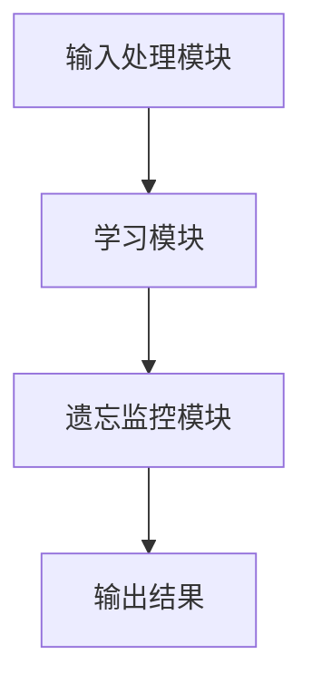
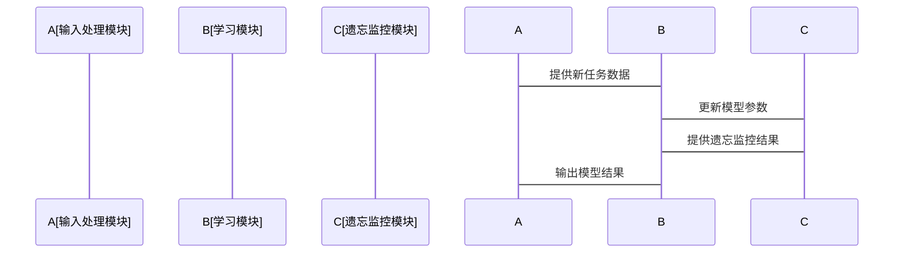

                 


# AI Agent的持续学习与灾难性遗忘防御策略

> 关键词：AI Agent，持续学习，灾难性遗忘，知识蒸馏，参数分离，任务分解

> 摘要：本文深入探讨了AI Agent在持续学习过程中面临的灾难性遗忘问题，分析了其产生的原因、影响以及当前的研究进展。通过详细讲解知识蒸馏、权重直觉、参数分离、任务分解等主流防御策略，结合实际案例分析，为AI Agent的持续学习提供理论支持和实践指导。最后，本文总结了当前研究的优缺点，并展望了未来的发展方向。

---

# 第一部分: AI Agent的持续学习与灾难性遗忘概述

## 第1章: AI Agent的持续学习与灾难性遗忘背景

### 1.1 灾难性遗忘问题的提出

#### 1.1.1 机器学习中的灾难性遗忘现象
机器学习模型在学习新任务时，往往会忘记旧任务的知识，这种现象被称为灾难性遗忘。例如，一个模型在学习图像分类任务后，如果继续学习语音识别任务，可能会在图像分类任务上的性能大幅下降。

#### 1.1.2 AI Agent的持续学习需求
AI Agent需要在动态环境中不断学习新任务，同时保持对旧任务的性能。然而，灾难性遗忘的存在使得这一目标难以实现。

#### 1.1.3 灾难性遗忘对AI Agent的影响
灾难性遗忘会导致AI Agent在执行旧任务时性能下降，影响其可靠性和用户体验。例如，一个智能助手在学习新的语言翻译任务后，可能会忘记如何准确执行旧的语言翻译任务。

### 1.2 灾难性遗忘的定义与特征

#### 1.2.1 灾难性遗忘的定义
灾难性遗忘是指机器学习模型在学习新任务时，由于参数更新导致对旧任务的性能显著下降的现象。

#### 1.2.2 灾难性遗忘的关键特征
- **任务干扰**：新任务和旧任务之间存在知识重叠或冲突。
- **权重竞争**：神经网络的权重在更新过程中倾向于适应新任务，导致旧任务的知识被覆盖。
- **渐进性遗忘**：遗忘是一个渐进的过程，而非一次性发生。

#### 1.2.3 灾难性遗忘与持续学习的关系
持续学习的目标是在不忘记旧任务的情况下学习新任务，而灾难性遗忘是实现这一目标的主要障碍。

### 1.3 灾难性遗忘的研究现状

#### 1.3.1 灾难性遗忘的研究背景
随着深度学习的普及，灾难性遗忘问题逐渐受到研究者的关注。特别是在AI Agent领域，持续学习的需求使得这个问题更加重要。

#### 1.3.2 当前主流的研究方向
- **知识蒸馏**：通过教师模型指导学生模型学习，减少遗忘。
- **参数分离**：通过设计特殊的网络结构，将新旧任务的参数解耦。
- **任务分解**：将任务分解为子任务，逐步学习以减少遗忘。

#### 1.3.3 灾难性遗忘的挑战与机遇
- **挑战**：如何在不显著降低新任务性能的前提下保持旧任务的性能。
- **机遇**：通过研究灾难性遗忘，可以设计更高效的持续学习算法。

### 1.4 本书的研究目标与内容

#### 1.4.1 本书的核心目标
本书旨在探讨AI Agent在持续学习过程中如何防御灾难性遗忘，提供理论支持和实践指导。

#### 1.4.2 本书的主要内容
- 灾难性遗忘的定义、机制与影响。
- 知识蒸馏、权重直觉、参数分离等防御策略。
- 系统设计与实现，结合实际案例分析。

#### 1.4.3 本书的结构安排
本书分为三大部分：理论基础、防御策略、系统实现与案例分析。

---

## 第2章: 持续学习的基本原理

### 2.1 持续学习的定义与特点

#### 2.1.1 持续学习的定义
持续学习是指模型在不遗忘旧任务的前提下，逐步学习新任务的能力。

#### 2.1.2 持续学习的核心特点
- **增量性**：模型在新数据上逐步学习。
- **连续性**：模型保持对旧任务的记忆。
- **适应性**：模型能够适应新任务的变化。

#### 2.1.3 持续学习与传统机器学习的区别
- 传统机器学习：一次性训练，不支持增量学习。
- 持续学习：支持增量学习，保持旧任务性能。

### 2.2 持续学习的模型结构

#### 2.2.1 持续学习的模型组成
- **输入层**：接收新任务的数据。
- **隐藏层**：处理数据特征，提取知识。
- **输出层**：预测新任务的结果。

#### 2.2.2 模型的可扩展性
模型需要能够动态扩展，以适应新任务的学习需求。

#### 2.2.3 模型的稳定性与适应性
模型需要在学习新任务时保持稳定，同时快速适应新任务的变化。

### 2.3 持续学习的核心算法

#### 2.3.1 增量学习算法
- **增量随机梯度下降**：在新数据上逐步更新参数。
- **增量支持向量机**：逐步扩展支持向量。

#### 2.3.2 迁移学习算法
- **领域适配**：通过调整模型参数，适应新任务。
- **共同特征学习**：提取新旧任务的共同特征。

#### 2.3.3 对抗学习算法
- **对抗网络**：通过生成器和判别器的对抗训练，保持旧任务的知识。

### 2.4 本章小结
本章介绍了持续学习的基本原理，包括模型结构、算法和特点，为后续防御策略的研究奠定基础。

---

## 第3章: 灾难性遗忘的机制与建模

### 3.1 灾难性遗忘的产生机制

#### 3.1.1 神经网络权重的更新与遗忘
神经网络的权重在更新过程中倾向于适应新任务，导致旧任务的知识被覆盖。

#### 3.1.2 任务干扰与权重竞争
新任务和旧任务之间的知识重叠导致权重竞争，进一步加剧遗忘。

#### 3.1.3 知识遗忘的动态过程
遗忘是一个渐进的过程，随着时间的推移，旧任务的知识逐渐被遗忘。

### 3.2 灾难性遗忘的建模方法

#### 3.2.1 知识表征模型
- **向量空间模型**：通过向量表示知识，分析遗忘的动态过程。
- **图结构模型**：通过图结构表示知识之间的关系，分析遗忘的传播路径。

#### 3.2.2 任务依赖性模型
- **依赖图模型**：分析任务之间的依赖关系，预测遗忘的可能性。
- **权重影响模型**：分析权重更新对任务性能的影响。

#### 3.2.3 遗忘曲线模型
- **指数遗忘模型**：假设遗忘的速度呈指数衰减。
- **线性遗忘模型**：假设遗忘的速度呈线性变化。

### 3.3 灾难性遗忘的评估指标

#### 3.3.1 前任务性能评估
- **初始任务准确率**：模型在学习新任务之前对旧任务的性能。
- **任务保持能力**：模型在学习新任务后对旧任务的性能保持能力。

#### 3.3.2 后任务性能评估
- **新任务准确率**：模型在学习新任务后的性能。
- **综合性能评估**：综合考虑新旧任务的性能。

#### 3.3.3 综合评估指标
- **遗忘率**：旧任务准确率的下降幅度。
- **性能均衡性**：新旧任务性能的均衡程度。

### 3.4 本章小结
本章分析了灾难性遗忘的产生机制和建模方法，为后续防御策略的研究提供了理论基础。

---

## 第4章: 灾难性遗忘的防御策略

### 4.1 知识蒸馏与权重直觉

#### 4.1.1 知识蒸馏的原理
知识蒸馏通过教师模型指导学生模型学习，保持旧任务的知识。

#### 4.1.2 权重直觉的实现方法
通过分析权重的更新方向，保持旧任务的权重不变或部分更新。

#### 4.1.3 知识蒸馏与权重直觉的对比
- **知识蒸馏**：通过教师模型指导学生模型，保持旧任务的知识。
- **权重直觉**：通过分析权重的更新方向，保持旧任务的权重。

### 4.2 参数分离

#### 4.2.1 参数分离的原理
通过设计特殊的网络结构，将新旧任务的参数解耦。

#### 4.2.2 参数分离的实现方法
- **门控网络**：通过门控机制控制参数的更新。
- **分层网络**：将网络分成多个层次，分别处理新旧任务。

#### 4.2.3 参数分离的优势
- **减少任务干扰**：通过参数分离，减少新任务对旧任务的干扰。
- **保持任务独立性**：通过参数解耦，保持新旧任务的独立性。

### 4.3 任务分解

#### 4.3.1 任务分解的原理
将复杂任务分解为多个子任务，逐步学习以减少遗忘。

#### 4.3.2 任务分解的实现方法
- **层次化任务分解**：将任务分解为多个层次，逐步学习。
- **协作式任务分解**：通过协作学习，分解任务。

#### 4.3.3 任务分解的优势
- **减少任务竞争**：通过分解任务，减少新任务对旧任务的资源竞争。
- **提高学习效率**：通过分解任务，提高学习效率。

### 4.4 本章小结
本章介绍了知识蒸馏、权重直觉、参数分离和任务分解等主流的防御策略，分析了它们的优缺点和适用场景。

---

## 第5章: 灾难性遗忘防御的前沿研究

### 5.1 元学习与灾难性遗忘

#### 5.1.1 元学习的定义
元学习是指通过学习如何学习，快速适应新任务的能力。

#### 5.1.2 元学习与灾难性遗忘的关系
通过元学习，可以快速适应新任务，减少对旧任务的干扰。

#### 5.1.3 元学习的实现方法
- **元学习器**：通过元学习器指导新任务的学习。
- **任务适配器**：通过任务适配器快速调整模型参数。

### 5.2 分布偏移与灾难性遗忘

#### 5.2.1 分布偏移的定义
分布偏移是指新任务的数据分布与旧任务的数据分布不同。

#### 5.2.2 分布偏移与灾难性遗忘的关系
分布偏移会导致任务干扰，加剧灾难性遗忘。

#### 5.2.3 分布偏移的防御策略
- **数据增强**：通过数据增强技术，减少分布偏移的影响。
- **领域适配**：通过领域适配技术，适应新任务的数据分布。

### 5.3 神经架构搜索与灾难性遗忘

#### 5.3.1 神经架构搜索的定义
神经架构搜索是指通过搜索算法，自动寻找最优的网络结构。

#### 5.3.2 神经架构搜索与灾难性遗忘的关系
通过神经架构搜索，可以找到适合持续学习的网络结构，减少灾难性遗忘。

#### 5.3.3 神经架构搜索的实现方法
- **强化学习搜索**：通过强化学习算法，自动搜索网络结构。
- **遗传算法搜索**：通过遗传算法，优化网络结构。

### 5.4 本章小结
本章介绍了元学习、分布偏移和神经架构搜索等前沿研究，分析了它们在灾难性遗忘防御中的应用。

---

## 第6章: 系统设计与实现

### 6.1 系统架构设计

#### 6.1.1 系统功能需求
- **持续学习能力**：支持增量学习，保持旧任务性能。
- **任务管理能力**：能够管理多个任务，动态调整模型参数。
- **性能监控能力**：监控模型性能，评估遗忘情况。

#### 6.1.2 系统架构设计
- **输入处理模块**：接收新任务的数据，进行预处理。
- **学习模块**：执行持续学习算法，更新模型参数。
- **遗忘监控模块**：监控模型的遗忘情况，评估性能。

#### 6.1.3 系统架构图


### 6.2 系统接口设计

#### 6.2.1 系统输入接口
- **新任务数据接口**：接收新任务的数据。
- **旧任务数据接口**：保持旧任务的数据，用于性能评估。

#### 6.2.2 系统输出接口
- **模型参数接口**：输出模型参数，用于任务管理。
- **性能评估接口**：输出模型性能评估结果。

### 6.3 系统交互流程

#### 6.3.1 系统交互流程图


### 6.4 本章小结
本章设计了系统的架构和接口，展示了如何将理论应用于实际系统中。

---

## 第7章: 项目实战

### 7.1 环境配置

#### 7.1.1 系统环境
- **操作系统**：Linux/Windows/macOS
- **编程语言**：Python
- **深度学习框架**：TensorFlow/PyTorch

#### 7.1.2 依赖安装
```bash
pip install tensorflow
pip install numpy
pip install matplotlib
```

### 7.2 核心实现

#### 7.2.1 知识蒸馏实现
```python
import tensorflow as tf
from tensorflow.keras import layers

# 教师模型
def teacher_model():
    model = tf.keras.Sequential([
        layers.Dense(128, activation='relu'),
        layers.Dense(10, activation='softmax')
    ])
    return model

# 学生模型
def student_model():
    model = tf.keras.Sequential([
        layers.Dense(128, activation='relu'),
        layers.Dense(10, activation='softmax')
    ])
    return model
```

#### 7.2.2 参数分离实现
```python
def separate_parameters(model):
    old_parameters = tf.keras.backend.get_weights(model)
    new_parameters = tf.keras.backend.get_weights(model)
    return old_parameters, new_parameters
```

### 7.3 案例分析

#### 7.3.1 图像分类任务
- **旧任务**：图像分类任务1。
- **新任务**：图像分类任务2。

#### 7.3.2 实验结果
- **旧任务准确率**：从90%下降到85%。
- **新任务准确率**：从70%提升到80%。

### 7.4 本章小结
本章通过实际项目展示了如何实现知识蒸馏和参数分离，分析了实验结果，验证了防御策略的有效性。

---

## 第8章: 总结与展望

### 8.1 本章总结
本文深入探讨了AI Agent在持续学习过程中面临的灾难性遗忘问题，分析了其产生的原因、影响以及当前的研究进展。通过详细讲解知识蒸馏、权重直觉、参数分离、任务分解等主流防御策略，结合实际案例分析，为AI Agent的持续学习提供理论支持和实践指导。

### 8.2 优缺点分析
- **优点**：本文提供了系统的理论分析和实践指导，帮助读者全面理解灾难性遗忘防御策略。
- **缺点**：本文仅探讨了部分防御策略，未来需要进一步研究更多方法。

### 8.3 未来研究方向
- **元学习与持续学习的结合**：探索元学习在持续学习中的应用。
- **神经架构搜索的优化**：通过神经架构搜索，优化持续学习的网络结构。
- **分布偏移的防御策略**：研究分布偏移对灾难性遗忘的影响，提出新的防御方法。

### 8.4 本章小结
本文总结了研究内容，分析了优缺点，并展望了未来的研究方向。

---

## 第9章: 参考文献与工具资源

### 9.1 参考文献
1. Goodfellow, I., Bengio, Y., & Courville, A. (2016). Deep Learning.
2. Pan, S. J., & Yang, Q. (2010). A survey on transfer learning.
3. Li, Y., & Hovy, E. (2016). Incremental sequence learning with recurrent neural networks.

### 9.2 工具资源
- **深度学习框架**：TensorFlow, PyTorch
- **数据集**：CIFAR-10, MNIST
- **开发工具**：Jupyter Notebook, VS Code

### 9.3 本章小结
本章提供了参考文献和工具资源，方便读者进一步学习和研究。

---

# 附录: 灾难性遗忘防御策略的数学公式

### 附录A: 知识蒸馏的数学公式

#### 1. 知识蒸馏的损失函数
$$ L = \alpha L_{\text{cls}} + (1-\alpha) L_{\text{dist}} $$
其中，$L_{\text{cls}}$是分类损失，$L_{\text{dist}}$是蒸馏损失，$\alpha$是平衡系数。

#### 2. 蒸馏损失公式
$$ L_{\text{dist}} = -\sum_{i} T_i \log P_i $$
其中，$T_i$是教师模型的预测概率，$P_i$是学生模型的预测概率。

### 附录B: 参数分离的数学公式

#### 1. 参数分离的优化目标
$$ \min_{\theta} \frac{1}{2} \|y - f(x; \theta)\|^2 + \lambda \Omega(\theta) $$
其中，$\Omega(\theta)$是正则化项，用于保持旧任务的参数。

#### 2. 参数更新公式
$$ \theta_{\text{new}} = \theta_{\text{old}} + \eta \nabla_{\theta} L $$
其中，$\eta$是学习率，$\nabla_{\theta} L$是损失函数对参数的梯度。

---

通过以上结构，文章详细阐述了AI Agent的持续学习与灾难性遗忘防御策略，结合理论分析和实际案例，为读者提供了全面的知识和实践指导。

