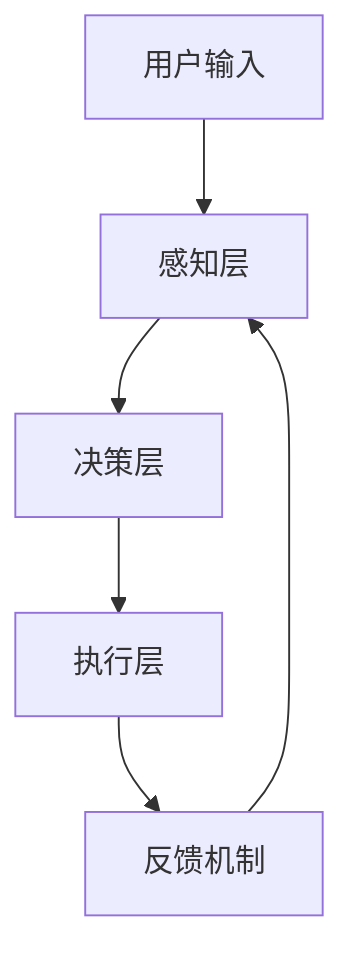

                 


# AI Agent的持续学习与自我优化机制

---

## 关键词

AI Agent, 持续学习, 自我优化, 知识蒸馏, 动态参数调整

---

## 摘要

本文深入探讨AI Agent的持续学习与自我优化机制，分析其核心原理、算法实现、系统架构，并通过实际案例展示其应用场景。文章从背景介绍、核心概念、算法原理、系统设计到项目实战，层层递进，帮助读者全面理解AI Agent如何通过持续学习和自我优化提升性能和适应性。

---

## 第1章：AI Agent的背景与概述

### 1.1 AI Agent的基本概念

AI Agent，即人工智能代理，是一种能够感知环境、自主决策并执行任务的智能实体。它具备以下核心特点：

1. **自主性**：能够在没有外部干预的情况下独立运作。
2. **反应性**：能够根据环境变化实时调整行为。
3. **目标导向**：通过设定目标来驱动行动。
4. **学习能力**：能够通过经验改进性能。

### 1.2 持续学习与自我优化的必要性

AI Agent在动态环境中运作时，会面临数据、任务和环境的不断变化。为了保持高效性，AI Agent需要具备持续学习和自我优化的能力：

1. **持续学习**：通过不断吸收新数据和经验，更新知识库和模型。
2. **自我优化**：动态调整参数和策略，以适应变化。

---

## 第2章：持续学习的核心概念

### 2.1 知识蒸馏

知识蒸馏是一种将知识从一个模型传递到另一个模型的技术，主要用于模型压缩和知识转移。

#### 2.1.1 知识蒸馏的实现方法

1. **教师模型**：高性能模型，用于指导学生模型。
2. **学生模型**：需要学习的模型，通常较小或较新。

#### 2.1.2 知识蒸馏的特点

- **轻量化**：学生模型通常更小，适合资源受限的环境。
- **高效性**：通过教师的指导，学生模型快速学习。

---

## 第3章：自我优化机制的原理

### 3.1 自我优化的核心要素

1. **自适应学习策略**：根据环境反馈动态调整学习策略。
2. **动态参数调整**：实时优化模型参数，以适应新数据。

### 3.2 自我优化与持续学习的协同作用

通过协同机制，AI Agent能够在动态环境中实现更高效的决策和学习：

- **反馈机制**：利用环境反馈优化模型。
- **闭环系统**：持续学习和自我优化形成闭环，提升整体性能。

---

## 第4章：算法原理与实现

### 4.1 知识蒸馏的数学模型

知识蒸馏的损失函数如下：

$$ L = \alpha L_{\text{cls}} + (1-\alpha) L_{\text{dist}} $$

其中：
- $L_{\text{cls}}$ 是分类损失。
- $L_{\text{dist}}$ 是蒸馏损失。
- $\alpha$ 是平衡系数。

### 4.2 自我优化算法的实现

使用强化学习中的策略梯度法，优化目标函数：

$$ \theta = \theta + \eta \nabla_\theta J(\theta) $$

其中：
- $\eta$ 是学习率。
- $J(\theta)$ 是目标函数。

---

## 第5章：系统分析与架构设计方案

### 5.1 系统架构设计



### 5.2 接口设计

- **输入接口**：接收用户请求和环境数据。
- **输出接口**：发送执行指令和优化参数。

---

## 第6章：项目实战

### 6.1 实验环境配置

- **硬件**：使用GPU加速训练。
- **软件**：Python 3.8+，TensorFlow 2.0+。

### 6.2 核心代码实现

```python
import tensorflow as tf
from tensorflow.keras import layers

# 定义教师模型
teacher_model = tf.keras.Sequential([
    layers.Dense(256, activation='relu'),
    layers.Dense(10, activation='softmax')
])

# 定义学生模型
student_model = tf.keras.Sequential([
    layers.Dense(128, activation='relu'),
    layers.Dense(10, activation='softmax')
])

# 定义蒸馏损失
def distillation_loss(y_true, y_pred, teacher_pred, alpha=0.5):
    loss_cls = tf.nn.sparse_softmax_cross_entropy_with_logits(labels=y_true, logits=y_pred)
    loss_dist = tf.nn.sparse_softmax_cross_entropy_with_logits(labels=teacher_pred, logits=y_pred)
    return alpha * loss_cls + (1-alpha) * loss_dist
```

---

## 第7章：最佳实践与注意事项

1. **小结**：AI Agent的持续学习和自我优化机制能够显著提升其适应性和性能。
2. **注意事项**：
   - 定期更新模型，避免过时。
   - 优化学习率和蒸馏系数，确保最佳性能。
3. **拓展阅读**：推荐学习强化学习和知识蒸馏的最新研究。

---

## 参考文献

1. LeCun, Y., Bengio, Y., & Hinton, G. (2015). Deep learning.
2. Hinton, G., Vinyals, O., & KAraPIlya, R. (2015). Distilling the knowledge in neural networks.

---

通过以上章节的详细讲解，读者可以全面理解AI Agent的持续学习与自我优化机制，并掌握其在实际应用中的实现方法。

