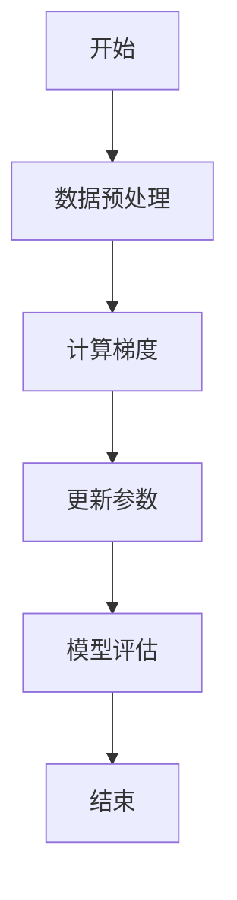
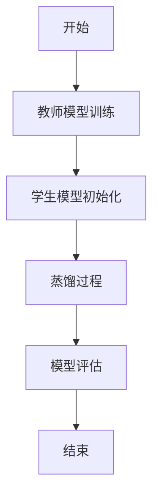
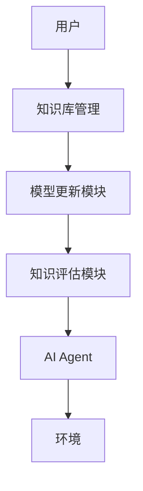

                 


# AI Agent的持续学习：利用LLM进行在线知识更新

> **关键词**：AI Agent，持续学习，大语言模型，知识更新，在线学习

> **摘要**：本文深入探讨了AI Agent的持续学习机制，重点分析了如何利用大语言模型（LLM）进行在线知识更新。文章从AI Agent的基本概念出发，详细阐述了持续学习的背景、核心概念、算法原理、系统架构设计以及实际项目实现，最后总结了最佳实践和未来发展方向。

---

## 第1章: AI Agent与持续学习概述

### 1.1 AI Agent的基本概念

#### 1.1.1 AI Agent的定义
AI Agent（人工智能代理）是一种能够感知环境、执行任务并做出决策的智能体。它可以自主行动，通过与环境的交互来优化目标函数，实现特定目标。

#### 1.1.2 AI Agent的核心特征
- **自主性**：AI Agent能够自主决策，无需外部干预。
- **反应性**：能够实时感知环境变化并做出反应。
- **目标导向**：所有行动均以实现特定目标为导向。
- **学习能力**：通过经验或数据不断优化自身能力。

#### 1.1.3 AI Agent的应用场景
- **智能客服**：通过对话理解客户需求，提供个性化服务。
- **自动驾驶**：实时感知环境，做出驾驶决策。
- **智能助手**：帮助用户完成日常任务，如日程管理、信息查询等。

### 1.2 持续学习的定义与重要性

#### 1.2.1 持续学习的定义
持续学习（Continuous Learning）是指模型在不断变化的环境中，通过在线数据流实时更新自身知识库的过程。与传统机器学习不同，持续学习强调动态性和适应性。

#### 1.2.2 持续学习的核心目标
- **适应动态环境**：快速响应环境变化，保持模型性能。
- **知识增量更新**：逐步积累新知识，避免模型过时。
- **在线更新**：实时处理数据，无需离线训练。

#### 1.2.3 持续学习在AI Agent中的作用
- **提升决策能力**：通过持续学习，AI Agent能够更准确地理解用户需求，做出更优决策。
- **增强适应性**：在复杂环境中，持续学习使AI Agent能够灵活应对各种挑战。
- **优化用户体验**：通过实时更新知识库，提供更个性化的服务。

### 1.3 大语言模型（LLM）的概述

#### 1.3.1 LLM的基本概念
大语言模型（Large Language Model, LLM）是一种基于深度学习的自然语言处理模型，具有强大的文本理解和生成能力。其核心是通过大量数据训练得到的参数化模型，能够捕捉语言的复杂模式。

#### 1.3.2 LLM的核心优势
- **强大的语义理解**：能够理解上下文，捕捉语言的细微差别。
- **生成能力强**：可以生成自然流畅的文本，适用于多种任务。
- **可扩展性**：通过微调或提示工程技术，可以轻松应用于不同领域。

#### 1.3.3 LLM在持续学习中的应用潜力
- **知识表示**：LLM可以作为知识库，存储和更新信息。
- **实时推理**：通过LLM的生成能力，快速推理出新的知识。
- **在线更新**：通过在线微调技术，实时更新模型参数，保持知识的准确性。

---

## 第2章: 持续学习的背景与挑战

### 2.1 传统机器学习的局限性

#### 2.1.1 数据驱动的局限性
- **数据依赖性**：传统机器学习模型依赖于大量的标注数据，数据获取成本高。
- **模型固定性**：一旦训练完成，模型无法适应新数据或环境变化。

#### 2.1.2 模型固定化的挑战
- **静态知识库**：传统模型的知识是固定的，无法实时更新。
- **适应性差**：在动态环境中，模型性能会迅速下降。

#### 2.1.3 知识更新的困难
- **更新成本高**：重新训练模型需要大量时间和计算资源。
- **知识遗忘**：在线更新过程中，旧知识容易被遗忘，导致性能下降。

### 2.2 AI Agent持续学习的背景

#### 2.2.1 AI Agent的动态环境需求
- **实时决策**：AI Agent需要在动态环境中实时做出决策。
- **知识更新**：面对新信息，AI Agent需要快速更新知识库。

#### 2.2.2 知识更新的必要性
- **保持准确性**：实时更新知识库，确保决策的准确性。
- **提升用户体验**：通过持续更新，提供更优质的服务。

#### 2.2.3 LLM在持续学习中的角色
- **知识存储**：LLM作为知识库，存储和更新信息。
- **推理引擎**：通过LLM的生成能力，快速推理出新的知识。
- **更新机制**：通过微调或提示技术，实时更新模型参数。

### 2.3 持续学习的核心问题

#### 2.3.1 知识表示的挑战
- **表示形式**：如何有效地表示知识，使其易于更新和推理。
- **知识融合**：如何将新知识与旧知识有机结合，避免冲突。

#### 2.3.2 模型更新的效率问题
- **计算资源**：在线更新需要大量的计算资源，如何优化资源利用。
- **更新频率**：如何确定更新频率，平衡准确性和效率。

#### 2.3.3 知识遗忘与知识融合的平衡
- **知识遗忘**：在线更新过程中，旧知识容易被遗忘，如何防止知识遗忘。
- **知识融合**：如何将新知识与旧知识有机结合，提升模型的整体性能。

---

## 第3章: 核心概念与联系

### 3.1 AI Agent的持续学习模型

#### 3.1.1 模型更新的原理
AI Agent的持续学习模型通过在线数据流更新知识库，利用LLM的生成能力和微调技术，实时更新模型参数，提升模型的适应性和准确性。

#### 3.1.2 模型表示的动态性
- **动态表示**：模型的表示随时间变化，反映最新的知识和环境状态。
- **知识图谱**：通过知识图谱的形式，动态表示知识库，支持实时更新。

#### 3.1.3 模型与环境的交互
- **环境感知**：AI Agent通过感知环境变化，触发知识更新。
- **反馈机制**：通过用户反馈，优化知识更新策略。

### 3.2 LLM在持续学习中的角色

#### 3.2.1 LLM作为知识库
- **知识存储**：LLM可以作为知识库，存储大量的文本信息。
- **动态更新**：通过在线微调技术，实时更新知识库内容。

#### 3.2.2 LLM作为推理引擎
- **实时推理**：通过LLM的生成能力，快速推理出新的知识。
- **多任务处理**：LLM可以同时处理多种任务，提升AI Agent的多功能性。

#### 3.2.3 LLM作为更新机制
- **微调技术**：通过微调LLM，快速适应新的任务或数据。
- **提示工程技术**：通过设计提示词，引导LLM生成所需的知识。

### 3.3 持续学习与在线知识更新的关系

#### 3.3.1 在线知识更新的定义
- **在线更新**：实时处理数据流，更新知识库。
- **增量学习**：逐步积累新知识，避免模型过时。

#### 3.3.2 持续学习的核心要素
- **知识表示**：如何有效地表示知识，使其易于更新和推理。
- **模型更新**：如何实时更新模型参数，保持模型性能。
- **知识融合**：如何将新知识与旧知识有机结合，提升整体性能。

---

## 第4章: 算法原理

### 4.1 在线微调算法

#### 4.1.1 算法原理
在线微调是一种通过小批量数据实时更新模型参数的技术。其核心思想是通过梯度下降优化模型参数，使得模型在新数据上的表现更好。

#### 4.1.2 算法步骤
1. **数据预处理**：将新数据转换为适合模型输入的形式。
2. **计算梯度**：通过反向传播计算模型参数的梯度。
3. **更新参数**：根据梯度更新模型参数，使得模型在新数据上的损失函数最小化。
4. **模型评估**：通过验证集评估模型的性能，确保更新后的模型表现良好。

#### 4.1.3 算法流程图


#### 4.1.4 数学公式
损失函数的计算公式为：
$$ L = \frac{1}{N} \sum_{i=1}^{N} (y_i - \hat{y_i})^2 $$
其中，\( y_i \) 是真实值，\( \hat{y_i} \) 是预测值，\( N \) 是样本数量。

更新参数的公式为：
$$ \theta_{new} = \theta_{old} - \eta \cdot \nabla L $$
其中，\( \theta \) 是模型参数，\( \eta \) 是学习率，\( \nabla L \) 是损失函数的梯度。

### 4.2 知识蒸馏算法

#### 4.2.1 算法原理
知识蒸馏是一种通过教师模型指导学生模型学习知识的技术。教师模型通常是一个较大的模型，学生模型是一个较小的模型。通过蒸馏过程，学生模型可以继承教师模型的知识。

#### 4.2.2 算法步骤
1. **教师模型训练**：通过大量数据训练教师模型，得到其概率分布。
2. **学生模型初始化**：初始化学生模型参数。
3. **蒸馏过程**：通过最小化学生模型和教师模型的概率分布差异，更新学生模型参数。
4. **模型评估**：通过验证集评估学生模型的性能，确保蒸馏过程有效。

#### 4.2.3 算法流程图


#### 4.2.4 数学公式
蒸馏损失函数的计算公式为：
$$ L_{distill} = -\sum_{i=1}^{N} p_i \log q_i $$
其中，\( p_i \) 是教师模型的预测概率，\( q_i \) 是学生模型的预测概率。

最终损失函数为：
$$ L = \alpha L_{ce} + (1-\alpha) L_{distill} $$
其中，\( L_{ce} \) 是交叉熵损失，\( \alpha \) 是平衡系数。

---

## 第5章: 系统分析与架构设计

### 5.1 应用场景介绍

#### 5.1.1 智能客服
- **场景描述**：AI Agent作为智能客服，实时处理用户的咨询。
- **知识更新需求**：需要实时更新产品信息、用户反馈等知识。

#### 5.1.2 教育辅助
- **场景描述**：AI Agent作为教育辅助工具，帮助学生学习。
- **知识更新需求**：需要实时更新课程内容、知识点等信息。

### 5.2 系统功能设计

#### 5.2.1 知识库管理
- **功能描述**：管理AI Agent的知识库，包括知识的存储、更新和检索。
- **核心功能**：
  - 知识存储：将知识以结构化或非结构化的形式存储。
  - 知识更新：通过在线微调或蒸馏技术，实时更新知识库。
  - 知识检索：根据用户需求，快速检索相关知识。

#### 5.2.2 模型更新模块
- **功能描述**：负责模型的实时更新，确保模型性能。
- **核心功能**：
  - 在线微调：实时更新模型参数，适应新数据。
  - 知识蒸馏：通过教师模型指导学生模型学习，提升模型性能。

#### 5.2.3 知识评估模块
- **功能描述**：评估知识更新的效果，确保知识的准确性和完整性。
- **核心功能**：
  - 知识准确性评估：通过验证集评估更新后的知识准确性。
  - 知识完整性评估：确保知识库覆盖所有相关领域。

### 5.3 系统架构设计

#### 5.3.1 系统架构图


#### 5.3.2 接口设计
- **输入接口**：接收用户的查询或指令。
- **输出接口**：返回处理结果或反馈信息。
- **知识库接口**：与知识库管理系统交互，获取或更新知识。

#### 5.3.3 交互流程图


---

## 第6章: 项目实战

### 6.1 环境配置

#### 6.1.1 安装依赖
```bash
pip install transformers torch datasets
```

#### 6.1.2 环境配置
```bash
export PYTHONPATH=$PYTHONPATH:./
```

### 6.2 核心代码实现

#### 6.2.1 知识库管理
```python
class KnowledgeBase:
    def __init__(self):
        self.knowledge = {}

    def store(self, key, value):
        self.knowledge[key] = value

    def retrieve(self, key):
        return self.knowledge.get(key, None)
```

#### 6.2.2 模型更新模块
```python
class ModelUpdater:
    def __init__(self, model):
        self.model = model

    def update(self, data):
        # 微调模型
        optimizer = torch.optim.Adam(self.model.parameters(), lr=1e-4)
        criterion = nn.CrossEntropyLoss()
        for batch in data:
            outputs = self.model(batch['input'])
            loss = criterion(outputs, batch['label'])
            optimizer.zero_grad()
            loss.backward()
            optimizer.step()
```

#### 6.2.3 知识评估模块
```python
class KnowledgeEvaluator:
    def __init__(self, model):
        self.model = model

    def evaluate(self, test_data):
        correct = 0
        total = 0
        for batch in test_data:
            outputs = self.model(batch['input'])
            predicted = torch.argmax(outputs, dim=1)
            correct += (predicted == batch['label']).sum().item()
            total += len(batch['label'])
        accuracy = correct / total
        return accuracy
```

### 6.3 案例分析与详细解读

#### 6.3.1 实际案例
- **案例描述**：AI Agent作为智能客服，实时更新产品信息。
- **数据准备**：收集用户咨询记录和产品信息，构建训练数据集。
- **模型训练**：通过微调技术，训练AI Agent理解并回答用户问题。
- **知识更新**：实时更新产品信息，确保AI Agent的回答准确无误。

#### 6.3.2 代码应用解读
- **知识库管理**：通过`KnowledgeBase`类存储和检索知识。
- **模型更新**：通过`ModelUpdater`类实时更新模型参数。
- **知识评估**：通过`KnowledgeEvaluator`类评估知识更新效果。

---

## 第7章: 最佳实践与总结

### 7.1 最佳实践

#### 7.1.1 数据质量
- **数据清洗**：确保数据的准确性和完整性。
- **数据多样性**：涵盖各种可能的场景，避免模型过拟合。

#### 7.1.2 模型选择
- **模型可解释性**：选择易于解释的模型，便于调试和优化。
- **模型鲁棒性**：选择鲁棒性较强的模型，确保在动态环境中表现稳定。

#### 7.1.3 知识更新策略
- **渐进式更新**：逐步更新知识，避免模型性能剧烈波动。
- **增量学习**：通过增量学习技术，提升模型更新效率。

### 7.2 总结

#### 7.2.1 核心内容回顾
- AI Agent的持续学习机制通过在线知识更新，实时适应环境变化。
- 大语言模型（LLM）在持续学习中扮演着关键角色，通过微调和蒸馏技术，实现知识的动态更新。
- 系统设计需要综合考虑知识表示、模型更新和知识评估等多个方面。

#### 7.2.2 未来展望
- **多模态模型**：结合视觉、听觉等多种模态信息，提升AI Agent的感知能力。
- **自适应学习**：通过自适应学习技术，进一步提升模型的动态适应能力。
- **人机协作**：通过人机协作，充分发挥人类专家和AI Agent的优势，共同完成复杂任务。

#### 7.2.3 注意事项
- **数据隐私**：在知识更新过程中，需要注意数据隐私问题，确保用户信息的安全。
- **模型稳定性**：通过合理设计知识更新策略，确保模型的稳定性和可靠性。
- **用户体验**：通过优化知识更新流程，提升用户体验，确保AI Agent的服务质量。

---

## 参考文献
1. Brown, T., & al. (2020). Language Models at Your Service: Leveraging SuperSloMo for Text Generation.
2. Liu, Y., & al. (2020). Pretrained Large Language Models for Question Answering.
3. Vaswani, A., & al. (2017). Attention Is All You Need.

---

**感谢阅读！希望这篇文章能为您提供有价值的见解和启发！**

