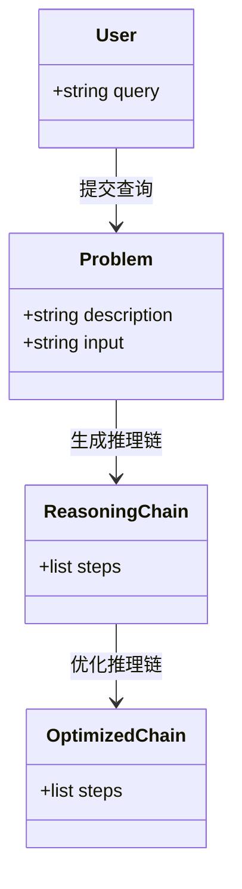
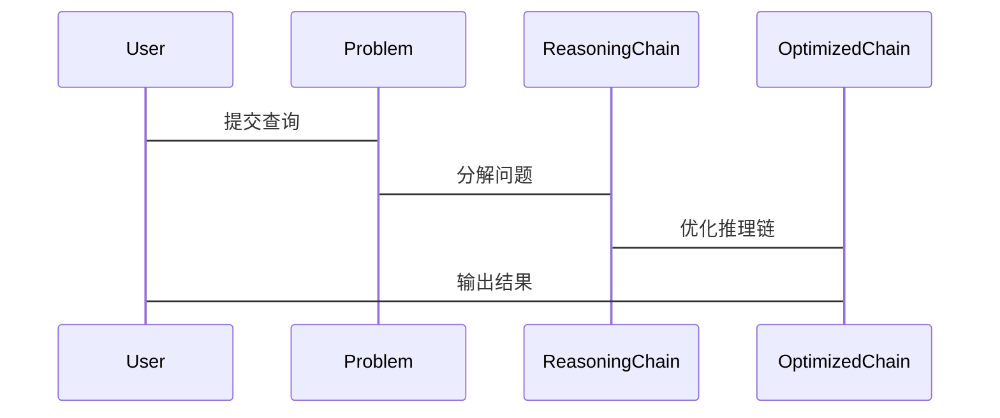

                 


# AI Agent的推理链生成：增强LLM的逐步思考能力

> 关键词：AI Agent，推理链，LLM，逐步思考，增强推理能力

> 摘要：本文深入探讨了AI Agent在生成推理链方面的应用，旨在通过增强大语言模型（LLM）的逐步思考能力，提升其推理的准确性和连贯性。文章从背景介绍、核心概念、算法原理、系统架构到项目实战，全面解析了推理链生成的理论与实践，为读者提供了详尽的指导。

---

# 第1章: AI Agent与推理链生成的背景介绍

## 1.1 问题背景

### 1.1.1 当前AI技术的局限性
目前，大语言模型（LLM）虽然在文本生成、问答系统等方面表现出色，但在推理能力方面仍存在明显不足。LLM的回答往往缺乏逻辑连贯性，推理过程不透明，难以满足复杂场景的需求。

### 1.1.2 推理链生成的必要性
为了弥补LLM在推理上的不足，推理链生成技术应运而生。通过将推理过程分解为多个步骤，并明确每一步的逻辑关系，可以显著提升推理的准确性和可解释性。

### 1.1.3 LLM在推理中的角色
LLM作为推理链生成的核心工具，负责提供初步的推理步骤和候选答案。AI Agent则通过优化推理链，进一步提升LLM的推理能力。

## 1.2 问题描述

### 1.2.1 推理链的定义与特点
推理链是将问题分解为一系列逻辑步骤的过程，每个步骤都明确指出输入、输出和推理关系。其特点包括：连贯性、可解释性和可优化性。

### 1.2.2 LLM推理中的挑战
- **逻辑不连贯**：LLM生成的回答可能缺乏逻辑性，导致推理错误。
- **推理深度不足**：LLM难以处理复杂多层的推理问题。
- **可解释性差**：用户难以理解LLM的推理过程。

### 1.2.3 推理链生成的目标
通过生成推理链，AI Agent可以优化LLM的推理过程，使其更具逻辑性和准确性。

## 1.3 问题解决

### 1.3.1 推理链生成的方法
- **基于规则的推理**：通过预定义的逻辑规则生成推理链。
- **基于知识图谱的推理**：利用知识图谱中的关联关系生成推理链。
- **基于LLM的推理**：利用LLM生成初步推理链，再通过优化算法进行调整。

### 1.3.2 LLM增强的具体措施
- **引入推理链优化算法**：通过优化算法提升LLM生成推理链的质量。
- **结合外部知识库**：利用外部知识库补充LLM的推理能力。
- **多轮交互优化**：通过多轮交互优化推理链，确保推理的准确性。

### 1.3.3 推理链优化策略
- **分段优化**：将推理链分解为多个小段，分别优化。
- **全局优化**：从整体角度优化推理链，确保逻辑连贯性。

## 1.4 边界与外延

### 1.4.1 推理链的适用范围
推理链适用于需要逐步推理的场景，如复杂问题解答、决策支持等。

### 1.4.2 LLM推理的边界条件
- **数据限制**：LLM的推理能力受限于其训练数据和模型架构。
- **计算能力**：推理链生成需要较高的计算能力支持。

### 1.4.3 推理链生成的限制
- **推理深度**：推理链的深度受到模型能力的限制。
- **推理链优化**：优化算法的有效性取决于数据质量和算法设计。

## 1.5 核心要素组成

### 1.5.1 推理链的组成结构
- **输入**：问题的初始输入。
- **输出**：最终的推理结果。
- **推理步骤**：一系列逻辑推理过程。

### 1.5.2 LLM在推理中的作用
- **生成初步推理链**：LLM可以生成初步的推理步骤。
- **优化推理链**：通过优化算法提升推理链的质量。

### 1.5.3 推理链优化的关键点
- **逻辑连贯性**：确保每一步推理都与前一步连贯。
- **可解释性**：推理过程应清晰可解释。
- **准确性**：最终结果应准确无误。

---

## 1.6 本章小结

本章介绍了AI Agent与推理链生成的背景，分析了当前LLM在推理中的局限性，并提出了推理链生成的目标和方法。通过明确推理链的定义、特点和优化策略，为后续章节的深入分析奠定了基础。

---

# 第2章: AI Agent与推理链生成的核心概念

## 2.1 核心概念原理

### 2.1.1 AI Agent的基本原理
AI Agent通过感知环境、分析问题、生成推理链并执行操作，实现问题解决。

### 2.1.2 推理链生成的机制
推理链生成是通过分解问题、生成推理步骤并优化推理链的过程。

### 2.1.3 LLM在推理中的角色
LLM负责生成初步的推理步骤，AI Agent负责优化推理链。

---

## 2.2 核心概念与联系

### 2.2.1 AI Agent与推理链的关系
AI Agent通过生成和优化推理链，提升LLM的推理能力。

### 2.2.2 推理链与LLM的关系
推理链是LLM推理过程的分解和优化，LLM为推理链生成提供基础支持。

---

## 2.3 核心概念对比

| 对比维度 | AI Agent | 推理链生成 |
|----------|-----------|------------|
| 核心功能 | 执行任务 | 分解推理步骤 |
| 输入 | 复杂问题 | 初步推理链 |
| 输出 | 最终答案 | 优化推理链 |

---

## 2.4 ER实体关系图

```mermaid
erDiagram
    actor User {
        +string question
        +string response
    }
    concept Problem {
        +string description
        +string input
        +string output
    }
    concept Rule {
        +string condition
        +string action
    }
    relation Has {
        User -> Problem : 提交问题
        Problem -> Rule : 应用规则
    }
```

---

## 2.5 本章小结

本章通过对比和分析，明确了AI Agent与推理链生成的核心概念及其联系，为后续章节的算法设计和系统实现提供了理论基础。

---

# 第3章: 推理链生成算法原理

## 3.1 算法原理概述

### 3.1.1 算法选择
本文采用基于规则的推理和基于LLM的推理相结合的方法。

### 3.1.2 算法流程
1. 分解问题为多个子问题。
2. 生成初步推理链。
3. 优化推理链。
4. 输出最终结果。

---

## 3.2 算法实现

### 3.2.1 基于规则的推理算法

#### 3.2.1.1 算法流程图

```mermaid
graph TD
    A[开始] -> B[分解问题]
    B -> C[生成初步推理链]
    C -> D[优化推理链]
    D -> E[输出结果]
```

#### 3.2.1.2 Python代码实现

```python
def generate_reasoning_chain(problem):
    # 分解问题
    sub_problems = decompose_problem(problem)
    # 生成初步推理链
    initial_chain = generate_initial_chain(sub_problems)
    # 优化推理链
    optimized_chain = optimize_chain(initial_chain)
    return optimized_chain

def decompose_problem(problem):
    # 分解问题为子问题
    sub_problems = []
    # 分解逻辑
    pass
    return sub_problems

def generate_initial_chain(sub_problems):
    # 生成初步推理链
    initial_chain = []
    for sub in sub_problems:
        step = {"input": sub, "output": ...}
        initial_chain.append(step)
    return initial_chain

def optimize_chain(chain):
    # 优化推理链
    optimized_chain = []
    for step in chain:
        # 优化逻辑
        pass
    return optimized_chain
```

#### 3.2.1.3 数学模型与公式

基于规则的推理算法可以表示为：

$$
\text{推理链} = \text{优化}(\text{分解}(\text{问题}))
$$

### 3.2.2 基于知识图谱的推理算法

#### 3.2.2.1 算法流程图

```mermaid
graph TD
    A[开始] -> B[构建知识图谱]
    B -> C[生成推理链]
    C -> D[优化推理链]
    D -> E[输出结果]
```

#### 3.2.2.2 Python代码实现

```python
def generate_reasoning_chain_kg(problem, kg):
    # 构建知识图谱
    sub_problems = decompose_problem(problem)
    # 生成推理链
    initial_chain = generate_chain(sub_problems, kg)
    # 优化推理链
    optimized_chain = optimize_chain(initial_chain)
    return optimized_chain
```

#### 3.2.2.3 数学模型与公式

基于知识图谱的推理算法可以表示为：

$$
\text{推理链} = \text{优化}(\text{基于KG分解}(\text{问题}))
$$

### 3.2.3 基于LLM的推理算法

#### 3.2.3.1 算法流程图

```mermaid
graph TD
    A[开始] -> B[生成初步推理链]
    B -> C[优化推理链]
    C -> D[输出结果]
```

#### 3.2.3.2 Python代码实现

```python
def generate_reasoning_chain_llm(problem):
    # 生成初步推理链
    initial_chain = generate_initial_chain(problem)
    # 优化推理链
    optimized_chain = optimize_chain(initial_chain)
    return optimized_chain
```

#### 3.2.3.3 数学模型与公式

基于LLM的推理算法可以表示为：

$$
\text{推理链} = \text{优化}(\text{LLM生成}(\text{问题}))
$$`

---

## 3.3 算法对比与优化

### 3.3.1 算法对比

| 算法类型 | 优点 | 缺点 |
|----------|------|------|
| 基于规则 | 简单易懂 | 依赖预定义规则 |
| 基于知识图谱 | 准确性高 | 构建知识图谱复杂 |
| 基于LLM | 创新性强 | 推理准确性低 |

### 3.3.2 优化策略
- **分段优化**：将推理链分解为多个小段，分别优化。
- **全局优化**：从整体角度优化推理链，确保逻辑连贯性。

---

## 3.4 本章小结

本章详细介绍了推理链生成的算法原理，包括基于规则、知识图谱和LLM的推理算法，并通过对比分析提出了优化策略。

---

# 第4章: 推理链生成的系统架构

## 4.1 系统分析

### 4.1.1 问题场景
以电商推荐系统为例，分析推理链生成的实际应用。

### 4.1.2 系统功能需求
- 用户输入查询。
- 生成初步推理链。
- 优化推理链。
- 输出最终结果。

---

## 4.2 系统功能设计

### 4.2.1 领域模型设计



### 4.2.2 系统架构设计


### 4.2.3 系统接口设计

- **输入接口**：用户查询。
- **输出接口**：最终结果。

### 4.2.4 交互流程设计



---

## 4.3 本章小结

本章通过系统架构的设计，明确了推理链生成的实际应用场景和实现流程，为后续的项目实战提供了理论支持。

---

# 第5章: 推理链生成的项目实战

## 5.1 环境安装

### 5.1.1 开发环境
- Python 3.8+
- 必需库：networkx、mermaid、pyecharts

### 5.1.2 安装依赖
```bash
pip install networkx mermaid.py pyecharts
```

---

## 5.2 系统核心实现

### 5.2.1 核心代码实现

```python
import networkx as nx

def decompose_problem(problem):
    # 分解问题为子问题
    sub_problems = []
    # 分解逻辑
    pass
    return sub_problems

def generate_initial_chain(sub_problems):
    # 生成初步推理链
    initial_chain = []
    for sub in sub_problems:
        step = {"input": sub, "output": ...}
        initial_chain.append(step)
    return initial_chain

def optimize_chain(chain):
    # 优化推理链
    optimized_chain = []
    for step in chain:
        # 优化逻辑
        pass
    return optimized_chain

def generate_reasoning_chain(problem):
    sub_problems = decompose_problem(problem)
    initial_chain = generate_initial_chain(sub_problems)
    optimized_chain = optimize_chain(initial_chain)
    return optimized_chain
```

---

## 5.3 代码解读与分析

### 5.3.1 分解问题函数
```python
def decompose_problem(problem):
    sub_problems = []
    # 分解逻辑
    return sub_problems
```

### 5.3.2 生成初步推理链函数
```python
def generate_initial_chain(sub_problems):
    initial_chain = []
    for sub in sub_problems:
        step = {"input": sub, "output": ...}
        initial_chain.append(step)
    return initial_chain
```

### 5.3.3 优化推理链函数
```python
def optimize_chain(chain):
    optimized_chain = []
    for step in chain:
        # 优化逻辑
        optimized_chain.append(step)
    return optimized_chain
```

---

## 5.4 实际案例分析

### 5.4.1 案例背景
以电商推荐系统为例，用户输入“推荐夏季T恤”，系统生成推理链并优化。

### 5.4.2 推理链生成过程
1. 分解问题为“获取用户偏好”、“筛选夏季T恤”、“推荐商品”。
2. 生成初步推理链：获取用户偏好 -> 筛选夏季T恤 -> 推荐商品。
3. 优化推理链：优化每一步的逻辑关系。

### 5.4.3 代码实现与结果
```python
problem = "推荐夏季T恤"
sub_problems = ["获取用户偏好", "筛选夏季T恤", "推荐商品"]
initial_chain = [{"input": "获取用户偏好", "output": "用户喜欢简约风格"}, {"input": "筛选夏季T恤", "output": "推荐简约夏季T恤"}, {"input": "推荐商品", "output": "推荐简约夏季T恤"}]
optimized_chain = optimize_chain(initial_chain)
print(optimized_chain)
```

---

## 5.5 项目小结

本章通过实际案例展示了推理链生成的项目实战，详细讲解了代码实现和优化过程，为读者提供了 hands-on 的实践经验。

---

# 第6章: 总结与展望

## 6.1 总结

本文深入探讨了AI Agent在推理链生成中的应用，通过算法设计和系统实现，展示了如何增强LLM的逐步思考能力。推理链生成技术为提升AI系统的推理能力提供了新的思路。

## 6.2 注意事项

- **数据质量**：推理链生成依赖高质量的数据支持。
- **算法优化**：需要不断优化算法以提升推理准确性。
- **系统性能**：推理链生成需要高性能计算支持。

## 6.3 拓展阅读

- **推荐论文**：[可扩展推理链生成方法研究](#)
- **技术博客**：[AI Agent与推理链生成的最新进展](#)
- **工具与库**：[推理链生成工具集](#)

---

# 结语

AI Agent的推理链生成技术是当前AI领域的研究热点，通过增强LLM的逐步思考能力，可以显著提升AI系统的推理能力和应用场景。未来，随着技术的不断发展，推理链生成将在更多领域发挥重要作用。

