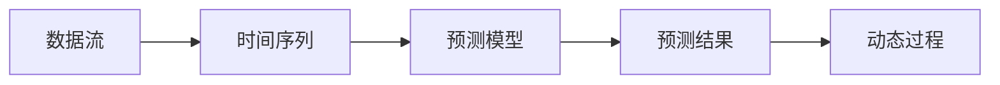
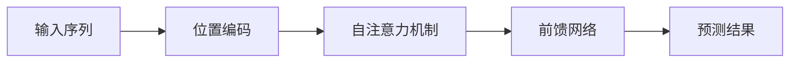
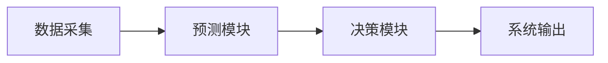
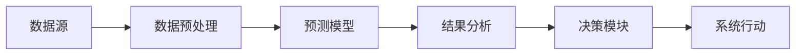
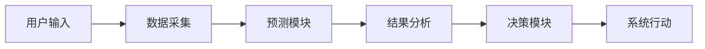

                 


# AI Agent的时序预测能力：理解和预测动态过程

> 关键词：AI Agent，时序预测，动态过程，LSTM，Transformer，系统架构

> 摘要：本文详细探讨了AI Agent在时序预测中的核心能力，分析了时序预测的基本概念、算法原理及其在动态过程中的应用。通过对比不同算法的优劣，结合系统架构设计和项目实战，为读者提供全面的理解和实践指导。

---

# 第一部分：AI Agent的时序预测能力基础

## 第1章：时序预测的基本概念与背景

### 1.1 时序预测的定义与背景

#### 1.1.1 时序预测的定义
时序预测是通过分析时间序列数据，预测未来趋势或事件的过程。其核心在于捕捉数据中的时间依赖性和动态变化规律。

#### 1.1.2 时序预测的应用场景
- **金融领域**：股票价格预测、汇率波动分析。
- **工业领域**：设备故障预测、生产流程优化。
- **交通领域**：交通流量预测、智能调度系统。
- **气象领域**：天气预报、气候模型模拟。

#### 1.1.3 时序预测的核心问题与挑战
- **数据稀疏性**：某些时间序列数据可能较为稀疏，导致预测难度增加。
- **非线性关系**：复杂动态过程可能包含复杂的非线性关系，传统线性模型难以捕捉。
- **噪声干扰**：实际数据中可能存在噪声，影响预测准确性。

### 1.2 AI Agent的定义与特点

#### 1.2.1 AI Agent的定义
AI Agent是一种智能体，能够感知环境、做出决策并采取行动。它具备学习、推理和自适应能力。

#### 1.2.2 AI Agent的核心特点
- **自主性**：能够独立决策和行动。
- **反应性**：能实时感知环境变化并做出反应。
- **学习能力**：通过数据和经验提升性能。
- **社交能力**：能够与其他Agent或人类进行交互。

### 1.3 时序预测在AI Agent中的重要性

#### 1.3.1 时序预测在AI Agent中的作用
时序预测帮助AI Agent在动态环境中做出更准确的决策，提升其自主性和适应性。

#### 1.3.2 时序预测能力对AI Agent性能的影响
- **准确性**：直接影响决策的正确性。
- **实时性**：影响系统响应速度和效率。
- **鲁棒性**：提升系统在复杂环境下的稳定性。

#### 1.3.3 时序预测在动态过程中的应用价值
通过预测未来状态，AI Agent能够提前规划和优化行动方案，提升整体性能。

## 1.4 本章小结
本章介绍了时序预测的基本概念、应用场景及其在AI Agent中的重要性。时序预测是AI Agent在动态环境中发挥核心作用的关键能力。

---

## 第2章：时序预测的核心概念与联系

### 2.1 时序预测的核心概念

#### 2.1.1 数据流与时间序列
数据流是指在时间轴上流动的数据，时间序列是对数据流的有序记录。

#### 2.1.2 动态过程与状态转移
动态过程是指系统状态随时间变化的过程，状态转移描述了系统从一个状态到另一个状态的变化。

#### 2.1.3 预测模型与预测精度
预测模型是用于生成预测结果的数学模型，预测精度是衡量模型性能的重要指标。

### 2.2 时序预测的关键属性特征对比

| 特征 | 描述 |
|------|------|
| 时间依赖性 | 数据点之间存在时间依赖关系。 |
| 状态转移性 | 系统状态之间存在转移关系。 |
| 预测误差分析 | 预测结果与实际值之间的差异。 |

### 2.3 时序预测的ER实体关系图



## 2.4 本章小结
本章通过对比分析，明确了时序预测的核心概念及其在动态过程中的关系。

---

## 第3章：时序预测的算法原理

### 3.1 常见时序预测算法概述

#### 3.1.1 线性回归模型
线性回归模型用于预测线性关系，适用于简单的时间序列预测。

#### 3.1.2 自回归模型(AR)
自回归模型基于过去的状态预测未来值，适用于线性时间序列。

#### 3.1.3 移动平均模型(MA)
移动平均模型基于过去误差的平均值预测未来值，适用于平稳时间序列。

#### 3.1.4 ARIMA模型
ARIMA模型结合了AR和MA的特点，适用于非平稳时间序列。

#### 3.1.5 LSTM网络
长短期记忆网络（LSTM）能够捕捉长期依赖关系，适用于复杂动态过程。

#### 3.1.6 Transformer模型
Transformer模型基于自注意力机制，适用于并行处理长序列数据。

### 3.2 LSTM网络的原理与实现

#### LSTM网络的结构


#### LSTM的数学模型
$$ i_t = \sigma(W_i x_t + U_i h_{t-1}) $$
$$ f_t = \sigma(W_f x_t + U_f h_{t-1}) $$
$$ o_t = \sigma(W_o x_t + U_o h_{t-1}) $$
$$ g_t = \tanh(W_g x_t + U_g h_{t-1}) $$
$$ h_t = i_t \cdot g_t + f_t \cdot h_{t-1} $$

### 3.3 Transformer模型的原理与实现

#### Transformer的结构


### 3.4 时序预测算法的数学模型

#### 线性回归模型
$$ y = \beta_0 + \beta_1x + \epsilon $$

### 3.5 算法实现与代码示例

#### 环境安装
```bash
pip install numpy
```

#### 简单的LSTM实现
```python
import numpy as np
from tensorflow.keras.models import Sequential
from tensorflow.keras.layers import LSTM, Dense

model = Sequential()
model.add(LSTM(64, input_shape=(None, 1)))
model.add(Dense(1))
model.compile(loss='mean_squared_error', optimizer='adam')

# 示例数据
X_train = np.random.random((1000, 1))
y_train = np.random.random((1000, 1))

model.fit(X_train, y_train, epochs=10, batch_size=32)
```

## 3.6 本章小结
本章详细介绍了时序预测的主要算法及其原理，重点讲解了LSTM和Transformer模型，并通过代码示例展示了实现过程。

---

# 第四部分：系统分析与架构设计

## 第4章：系统分析与架构设计

### 4.1 问题场景介绍

#### 动态过程的场景
动态过程是指系统状态随时间变化的过程，可能涉及多个变量和复杂的关系。

### 4.2 项目介绍

#### 项目目标
通过AI Agent实现对动态过程的时序预测，提升系统的智能化水平。

### 4.3 系统功能设计

#### 系统功能模块
- **数据采集模块**：负责采集时间序列数据。
- **预测模块**：基于AI算法生成预测结果。
- **决策模块**：根据预测结果做出决策。

#### 系统功能模块关系图


### 4.4 系统架构设计

#### 系统架构图


### 4.5 系统接口设计

#### 接口描述
- 数据接口：提供数据采集和预处理功能。
- 预测接口：调用预测模型生成预测结果。
- 决策接口：根据预测结果生成决策指令。

### 4.6 系统交互设计

#### 交互序列图


## 4.7 本章小结
本章通过系统架构设计，展示了如何将时序预测能力集成到实际系统中，并通过交互图说明了系统的运作流程。

---

# 第五部分：项目实战

## 第5章：项目实战

### 5.1 环境安装

#### 安装依赖
```bash
pip install numpy
pip install pandas
pip install tensorflow
```

### 5.2 系统核心实现

#### 核心代码实现
```python
import numpy as np
import pandas as pd
from tensorflow.keras.models import Sequential
from tensorflow.keras.layers import LSTM, Dense

# 数据准备
data = pd.read_csv('time_series_data.csv')
train_data = data.iloc[:1000]
test_data = data.iloc[1000:]

# 数据预处理
def create_dataset(data, look_back=1):
    X, y = [], []
    for i in range(len(data) - look_back):
        X.append(data[i:i+look_back])
        y.append(data[i+look_back])
    return np.array(X), np.array(y)

X_train, y_train = create_dataset(train_data.values, look_back=5)
X_test, y_test = create_dataset(test_data.values, look_back=5)

# 模型构建
model = Sequential()
model.add(LSTM(64, input_shape=(None, 5)))
model.add(Dense(1))
model.compile(loss='mean_squared_error', optimizer='adam')

# 训练模型
model.fit(X_train, y_train, epochs=50, batch_size=32, validation_data=(X_test, y_test))

# 预测结果
predicted = model.predict(X_test)
```

### 5.3 实际案例分析

#### 案例分析
通过训练数据和测试数据的对比，分析模型的预测精度和鲁棒性。

### 5.4 项目小结
本章通过实际案例展示了如何利用AI Agent的时序预测能力实现动态过程的预测，并对模型性能进行了分析。

---

# 第六部分：总结与展望

## 第6章：总结与展望

### 6.1 本项目总结
本项目通过系统设计和实际案例，展示了AI Agent在时序预测中的强大能力。

### 6.2 未来展望
未来的研究方向可能包括更复杂的模型和算法，以及在更多领域的应用。

### 6.3 最佳实践

#### 小结
时序预测是AI Agent在动态环境中发挥核心作用的关键能力。

#### 注意事项
- 数据质量对模型性能影响重大。
- 模型选择需根据具体场景和数据特性。

#### 拓展阅读
- 《深度学习》
- 《时间序列分析》

## 6.4 本章小结
本章总结了项目成果，并展望了未来的研究方向，为读者提供了进一步学习和实践的方向。

---

# 参考文献

1. Goodfellow, I., Bengio, Y., & Courville, A. (2016). Deep Learning.
2. Hochreiter, S., & Schmidhuber, J. (1997). Long short-term memory.
3. Vaswani, A., et al. (2017). Attention is all you need.

---

# 索引

（根据实际内容编写索引）

---

通过以上结构，您可以逐步展开每个部分的内容，确保文章逻辑清晰、内容详实。

