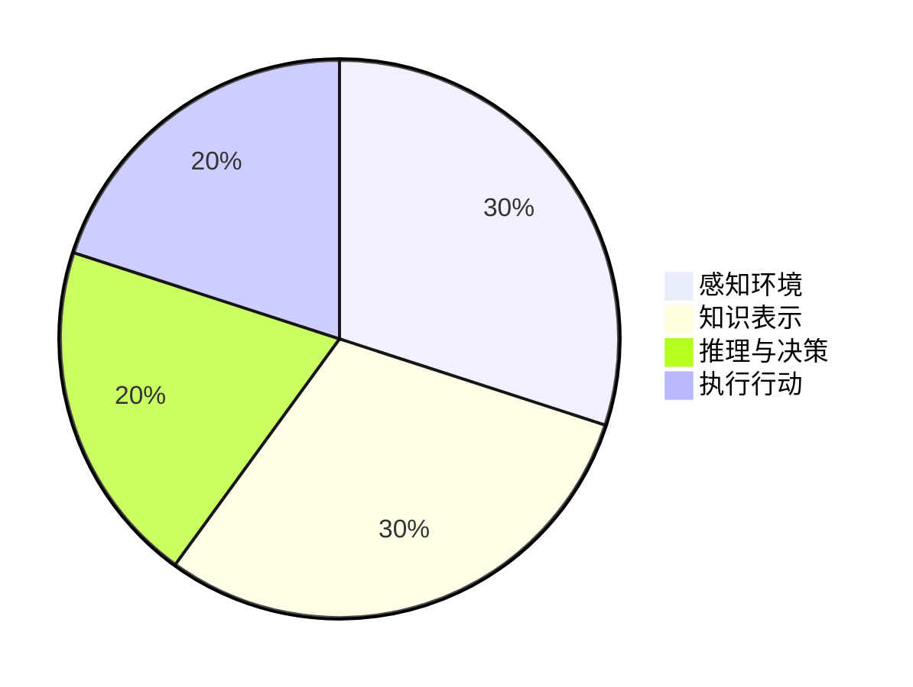
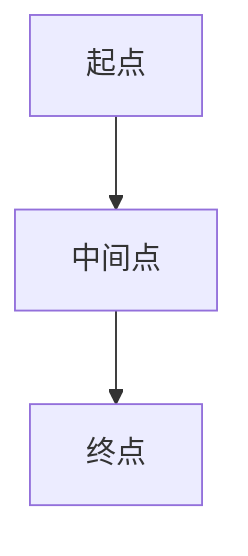
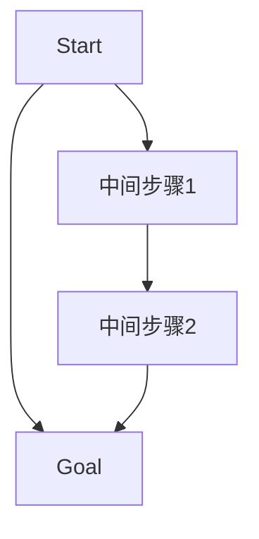
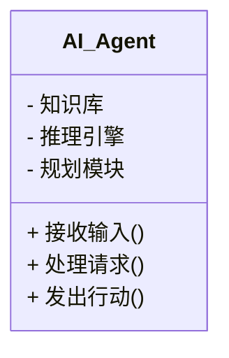
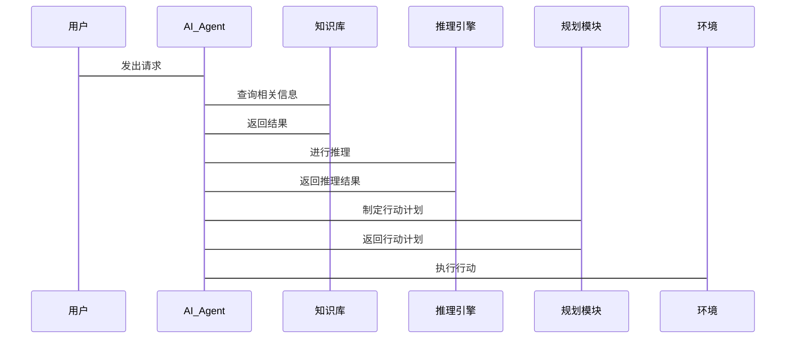

                 


# AI Agent的概念形成：模拟LLM的抽象思维过程

> 关键词：AI Agent, LLM, 抽象思维, 知识表示, 推理, 规划

> 摘要：本文深入探讨AI Agent的概念形成过程，通过模拟LLM的抽象思维，分析其知识表示、推理机制、目标设定与规划算法，以及多智能体协作与通信的实现。文章结合理论与实践，提供详细的算法原理、系统架构设计和项目实战指导，帮助读者全面理解AI Agent的核心概念与应用。

---

# 第一部分：AI Agent的概念形成背景

## 第1章：AI Agent的基本概念与问题背景

### 1.1 AI Agent的定义与核心概念

#### 1.1.1 什么是AI Agent？
AI Agent（人工智能代理）是一种能够感知环境、自主决策并执行任务的智能实体。它能够通过与环境交互，利用感知信息做出决策，并采取行动以实现特定目标。

#### 1.1.2 AI Agent的核心特征
- **自主性**：能够在没有外部干预的情况下自主运作。
- **反应性**：能够实时感知环境变化并做出反应。
- **目标导向**：基于明确的目标进行决策和行动。
- **推理能力**：能够通过逻辑推理解决问题。
- **学习能力**：能够通过经验改进自身性能。

#### 1.1.3 AI Agent与传统程序的区别
AI Agent与传统程序的关键区别在于其自主性和智能性。传统程序通常是响应式程序，而AI Agent具备自主决策的能力，并能够通过学习和推理优化自身行为。

### 1.2 问题背景与需求分析

#### 1.2.1 当前AI技术面临的挑战
随着AI技术的快速发展，传统的基于规则的AI系统已经难以应对复杂多变的环境。AI Agent能够通过自主学习和推理，更好地适应动态环境。

#### 1.2.2 AI Agent在实际应用中的需求
在实际应用中，AI Agent的需求主要体现在以下几个方面：
1. **动态环境适应**：能够实时感知环境变化并做出反应。
2. **复杂决策支持**：能够处理多目标、多约束的复杂决策问题。
3. **人机协作**：能够与人类或其他智能体协同工作，实现高效的人机协作。

#### 1.2.3 AI Agent与人类认知的类比
AI Agent的设计灵感来源于人类的认知过程。人类通过感知环境、记忆存储、逻辑推理和自主决策来应对复杂问题。AI Agent通过模拟这一过程，能够更好地理解和解决复杂问题。

### 1.3 AI Agent的形成过程与抽象思维

#### 1.3.1 从LLM到AI Agent的演进
大型语言模型（LLM）通过文本生成和模式识别，展示了强大的自然语言处理能力。然而，LLM缺乏自主决策和目标导向的能力。AI Agent通过整合LLM的能力，进一步扩展了其功能，使其能够自主决策和执行任务。

#### 1.3.2 模拟人类抽象思维的必要性
AI Agent通过模拟人类的抽象思维，能够更好地理解问题的本质，并制定合理的解决方案。这种模拟不仅体现在逻辑推理上，还体现在目标设定和规划能力上。

#### 1.3.3 AI Agent的思维模型构建
AI Agent的思维模型构建需要综合考虑知识表示、推理机制、目标设定和规划算法。通过构建合理的思维模型，AI Agent能够更好地模拟人类的抽象思维过程。

---

## 第2章：AI Agent的核心概念与联系

### 2.1 AI Agent的核心原理

#### 2.1.1 知识表示与推理机制
知识表示是AI Agent实现推理的基础。通过将知识表示为符号、向量或图结构，AI Agent能够进行逻辑推理和问题解决。

#### 2.1.2 目标设定与规划算法
AI Agent通过设定目标，并基于当前状态和环境信息，制定合理的规划算法，以实现目标。

#### 2.1.3 多智能体协作与通信
在多智能体系统中，AI Agent需要与其他智能体进行协作与通信，以实现共同目标。

### 2.2 核心概念对比与属性分析

#### 2.2.1 AI Agent与传统AI的对比
| 特性                | 传统AI                     | AI Agent                  |
|---------------------|---------------------------|---------------------------|
| 自主性              | 无自主性                   | 高度自主性                |
| 决策能力            | 基于规则                   | 基于推理和目标导向        |
| 适应性              | 适应性有限                 | 高度适应性                |

#### 2.2.2 不同AI Agent模型的特征分析
| 模型类型            | 特征                      |
|---------------------|--------------------------|
| 反应式AI Agent      | 基于实时感知做出反应     |
| 规则式AI Agent      | 基于预定义规则进行决策   |
| 学习式AI Agent      | 基于机器学习模型进行决策 |

#### 2.2.3 AI Agent与人类认知的异同
- **相同点**：AI Agent和人类都具备感知、推理和决策能力。
- **不同点**：AI Agent不具备人类的情感和创造力，决策基于数据和逻辑。

### 2.3 实体关系与系统架构

#### 2.3.1 ER实体关系图
```mermaid
erd
  股东
  竞选人
  选票
  股东 --> 投票给: 竞选人
  竞选人 --> 获得: 选票
```

#### 2.3.2 系统架构的Mermaid流程图


---

## 第3章：AI Agent的基础算法与实现

### 3.1 基础算法原理

#### 3.1.1 知识表示的向量空间模型
知识可以通过向量空间模型表示，其中每个维度对应一个特征。例如，文本可以通过词向量表示。

#### 3.1.2 基于图的推理算法


#### 3.1.3 目标驱动的规划算法


#### 3.1.4 推理机制的数学模型
$$
\text{推理} = \text{知识} \times \text{权重}
$$

### 3.2 算法的数学模型和公式

#### 3.2.1 逻辑推理公式
$$
\text{结论} = \text{前提1} \land \text{前提2}
$$

#### 3.2.2 规划算法的优化公式
$$
\text{最优路径} = \argmin_{\text{路径} \in \text{所有路径}} \text{路径长度}
$$

#### 3.2.3 知识表示的向量空间公式
$$
\text{向量} = [\text{特征1}, \text{特征2}, \ldots, \text{特征n}]
$$

### 3.3 算法实现的Python代码示例

#### 3.3.1 知识表示的向量空间实现
```python
def vector_space_representation(text):
    # 假设text是预处理后的词袋模型
    vector = [1 if word in text else 0 for word in vocabulary]
    return vector
```

#### 3.3.2 基于图的推理实现
```python
def graph_reasoning(graph):
    # 假设graph是图结构，节点为前提，边为推理关系
    result = []
    for node in graph.nodes:
        if graph.has_edge(node, '结论'):
            result.append(node)
    return result
```

#### 3.3.3 目标驱动的规划算法
```python
def goal_driven_planning(start, goal, actions):
    # 假设actions是可用动作列表
    if start == goal:
        return []
    for action in actions:
        new_state = apply_action(start, action)
        if new_state == goal:
            return [action]
        result = goal_driven_planning(new_state, goal, actions)
        if result is not None:
            return [action] + result
    return None
```

---

## 第4章：系统分析与架构设计

### 4.1 系统功能设计

#### 4.1.1 领域模型的Mermaid类图


#### 4.1.2 系统架构的Mermaid架构图


#### 4.1.3 系统接口设计
- **输入接口**：接收环境感知数据和用户请求。
- **输出接口**：发送推理结果和规划行动。

#### 4.1.4 系统交互的Mermaid序列图


---

## 第5章：项目实战

### 5.1 环境安装与配置

#### 5.1.1 开发环境安装
- 安装Python和相关库（如numpy、scipy、networkx、graphviz等）。
- 安装Mermaid和相关工具。

#### 5.1.2 依赖管理
使用虚拟环境管理依赖，确保各个模块的版本兼容。

### 5.2 核心实现

#### 5.2.1 知识表示实现
```python
def vector_space_representation(text):
    vocabulary = text.split()
    vector = {word: index for index, word in enumerate(vocabulary)}
    return vector
```

#### 5.2.2 推理引擎实现
```python
def graph_reasoning(graph, start):
    result = []
    for node in graph.nodes:
        if node == start:
            continue
        if graph.has_edge(start, node):
            result.append(node)
    return result
```

#### 5.2.3 规划模块实现
```python
def goal_driven_planning(start, goal, graph):
    if start == goal:
        return []
    for node in graph.nodes:
        if graph.has_edge(start, node):
            path = [start, node]
            if node == goal:
                return path
            sub_path = goal_driven_planning(node, goal, graph)
            if sub_path is not None:
                return path + sub_path
    return None
```

### 5.3 案例分析与详细解读

#### 5.3.1 案例背景
假设我们有一个AI Agent需要规划从起点到终点的路径。

#### 5.3.2 案例分析
AI Agent通过感知环境，构建知识图谱，并通过推理和规划模块，找到最优路径。

#### 5.3.3 代码实现与解读
```python
def main():
    start = '起点'
    goal = '终点'
    graph = {
        '起点': ['中间点'],
        '中间点': ['终点']
    }
    path = goal_driven_planning(start, goal, graph)
    print(f"最优路径为：{path}")
```

### 5.4 项目小结

#### 5.4.1 项目总结
通过本项目，我们实现了AI Agent的核心功能，包括知识表示、推理和规划。

#### 5.4.2 经验与教训
- **经验**：知识表示和推理算法是AI Agent的核心，需要精心设计。
- **教训**：在实际应用中，环境的动态性和不确定性需要充分考虑。

---

## 第六部分：总结与展望

### 6.1 最佳实践 tips

#### 6.1.1 设计原则
- **模块化设计**：将AI Agent的功能模块化，便于维护和扩展。
- **数据驱动**：利用大量数据进行训练，提高AI Agent的智能水平。
- **人机协作**：在实际应用中，AI Agent应与人类协同工作，实现人机协作。

#### 6.1.2 开发注意事项
- **环境适应性**：确保AI Agent能够适应动态变化的环境。
- **可解释性**：提高AI Agent的决策可解释性，便于用户理解和信任。
- **安全性**：确保AI Agent的安全性，防止恶意攻击和滥用。

### 6.2 小结

通过本文的详细讲解，我们深入探讨了AI Agent的概念形成过程，模拟了LLM的抽象思维，并分析了其实现的关键技术。AI Agent的核心在于其自主性和智能性，通过知识表示、推理和规划，能够实现复杂任务的自主决策。

### 6.3 注意事项

- **数据质量**：AI Agent的性能依赖于数据质量，确保数据的准确性和完整性。
- **算法选择**：根据具体场景选择合适的算法，避免盲目追求复杂性。
- **性能优化**：在实际应用中，需要对AI Agent的性能进行优化，提高运行效率。

### 6.4 拓展阅读

- **推荐书籍**：《AI Agent基础与应用》、《人工智能：现代方法》。
- **推荐文章**：AI Agent在具体领域的应用案例，如医疗、金融、教育等。
- **推荐工具**：Mermaid、Python、TensorFlow、PyTorch等。

---

通过本文的系统讲解，我们希望能够帮助读者全面理解AI Agent的概念形成过程，并为实际应用提供有价值的指导。

