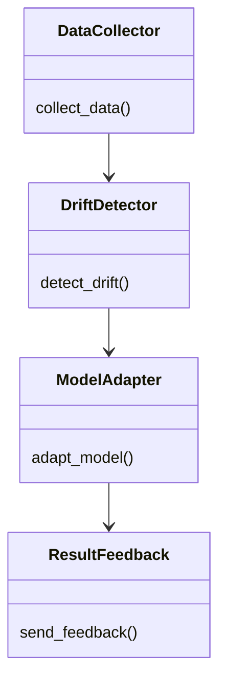

                 


# AI Agent的概念漂移检测与适应策略

> **关键词**：AI Agent，概念漂移，检测算法，适应策略，系统架构
>
> **摘要**：  
> 本文深入探讨了AI Agent在面对数据分布变化时的概念漂移检测与适应策略。首先，我们从概念漂移的定义、类型及其对AI Agent的影响入手，详细分析了概念漂移的核心原理。接着，我们介绍了基于AI Agent的概念漂移检测算法及其适应策略，重点讲解了统计测度、模型更新和在线学习等方法。最后，我们通过实际案例展示了如何设计和实现一个完整的概念漂移检测与适应系统，并提出了优化建议。

---

## 第一章: 概念漂移与AI Agent的背景

### 1.1 概念漂移的定义与类型

概念漂移（Concept Drift）是指在机器学习模型部署后，由于数据分布的变化，导致模型预测性能下降的现象。这种变化可能来自数据源的变化、环境的改变或用户行为的变迁。以下是概念漂移的主要类型：

- **突然漂移（Sudden Drift）**：数据分布的变化是突然且显著的。
- **渐变漂移（Incremental Drift）**：数据分布的变化是渐进且缓慢的。
- **分布漂移（Distributional Drift）**：数据分布的变化主要体现在概率分布的改变。

### 1.2 AI Agent的基本概念

AI Agent是一种智能体，能够感知环境、做出决策并执行动作。AI Agent的核心功能包括感知、推理、学习和执行。根据应用场景的不同，AI Agent可以分为监督式、无监督式和在线式等类型。

### 1.3 概念漂移与AI Agent的关系

概念漂移对AI Agent的影响主要体现在模型性能下降、决策错误增加等方面。AI Agent在概念漂移检测中的作用是实时监控数据变化，及时调整模型以适应新的数据分布。通过概念漂移检测，AI Agent能够实现自我优化和持续进化。

---

## 第二章: 概念漂移检测的核心原理

### 2.1 概念漂移检测的数学模型

概念漂移检测可以通过统计测度和概率模型来实现。以下是几种常用的测度方法：

- **Kullback-Leibler散度（KL散度）**：用于衡量两个概率分布之间的差异。
  $$ D_{KL}(P||Q) = \sum P(i) \log \frac{P(i)}{Q(i)} $$

- **Jensen-Shannon散度**：基于KL散度的一种对称测度。
  $$ D_{JS}(P||Q) = \frac{1}{2} \left( D_{KL}(P||M) + D_{KL}(Q||M) \right) $$
  其中，$M = \frac{P + Q}{2}$。

- **马尔可夫链模型**：通过状态转移矩阵来建模数据分布的变化。

### 2.2 基于AI Agent的概念漂移检测方法

AI Agent可以通过以下方法实现概念漂移检测：

- **基于监督学习的检测方法**：通过训练分类器来识别数据分布的变化。
- **基于无监督学习的检测方法**：通过聚类分析来发现数据分布的异常变化。
- **基于在线学习的检测方法**：通过持续更新模型参数来适应数据分布的变化。

### 2.3 概念漂移检测的算法原理

以下是几种常用的算法：

1. **基于统计检验的漂移检测**：
   - 使用卡方检验（Chi-squared test）或 Kolmogorov-Smirnov 检验来判断数据分布的变化。

2. **基于模型更新的漂移检测**：
   - 定期重新训练模型，并比较新旧模型的性能差异。

3. **基于时间序列分析的漂移检测**：
   - 使用ARIMA（自回归积分滑动平均模型）或 LSTM（长短期记忆网络）来预测数据分布的变化。

---

## 第三章: AI Agent的概念漂移适应策略

### 3.1 概念漂移适应的策略分类

AI Agent可以通过以下策略实现概念漂移的适应：

- **基于模型重训练的适应策略**：定期重新训练模型，以适应新的数据分布。
- **基于特征工程的适应策略**：通过特征选择或特征变换来优化模型性能。
- **基于知识蒸馏的适应策略**：通过教师模型指导学生模型的学习，实现知识转移。

### 3.2 AI Agent的概念漂移适应算法

以下是几种常用的适应算法：

1. **基于增量学习的适应算法**：
   - 在线更新模型参数，适应新的数据分布。

2. **基于迁移学习的适应算法**：
   - 将目标域的数据分布变化作为迁移任务，优化模型的泛化能力。

3. **基于主动学习的适应算法**：
   - 主动选择最具代表性的样本，优化模型的适应能力。

### 3.3 漂移适应的优化与改进

通过优化漂移检测算法和适应策略，可以提高AI Agent的性能。例如：

- **优化漂移检测的阈值**：根据实际需求调整检测的敏感性。
- **结合多种检测方法**：通过多模型融合提高检测的准确率。
- **动态调整适应策略**：根据漂移的类型和程度选择最优的适应方法。

---

## 第四章: 项目实战与系统设计

### 4.1 项目背景与目标

我们以一个电商客户 churn 预测系统为例，展示如何设计一个基于AI Agent的概念漂移检测与适应系统。目标是实时监控客户行为变化，及时调整预测模型。

### 4.2 系统架构设计

系统架构包括数据采集模块、漂移检测模块、模型适应模块和结果反馈模块。以下是系统的领域模型：



### 4.3 系统实现与代码示例

以下是部分核心代码实现：

```python
from sklearn.metrics import accuracy_score
from sklearn.ensemble import RandomForestClassifier

# 数据采集模块
def collect_data(batch_size):
    # 实现数据采集逻辑
    pass

# 漂移检测模块
def detect_drift(X_old, X_new):
    # 使用KL散度检测漂移
    from scipy.special import rel_entr
    P = X_old.mean(axis=0)
    Q = X_new.mean(axis=0)
    kl_div = rel_entr(P, Q).mean()
    return kl_div > threshold

# 模型适应模块
def adapt_model(model, X_new, y_new):
    # 在线更新模型
    model.fit(X_new, y_new)
    return model

# 主程序
def main():
    model = RandomForestClassifier()
    while True:
        X_old, y_old = collect_data(batch_size)
        model.fit(X_old, y_old)
        X_new, y_new = collect_data(batch_size)
        if detect_drift(X_old, X_new):
            model = adapt_model(model, X_new, y_new)
        accuracy = accuracy_score(y_new, model.predict(X_new))
        print(f"Accuracy: {accuracy}")

if __name__ == "__main__":
    main()
```

### 4.4 实际案例分析与总结

通过电商客户 churn 预测系统的案例分析，我们展示了如何实现概念漂移的检测与适应。实践表明，结合统计测度和在线学习的方法，可以有效提高模型的适应能力。

---

## 第五章: 最佳实践与小结

### 5.1 最佳实践 tips

- 定期监控数据分布的变化，及时调整模型。
- 结合多种检测方法，提高检测的准确率。
- 根据漂移的类型和程度选择最优的适应策略。

### 5.2 小结

本文深入探讨了AI Agent在概念漂移检测与适应中的作用。通过理论分析和实际案例，我们展示了如何设计和实现一个完整的概念漂移检测与适应系统。未来的研究方向包括优化漂移检测算法和探索新的适应策略。

---

**结束语**：概念漂移检测与适应是AI Agent技术的重要组成部分。通过持续的研究和实践，我们可以进一步提高AI系统的智能性和适应性，为实际应用提供更强大的支持。

