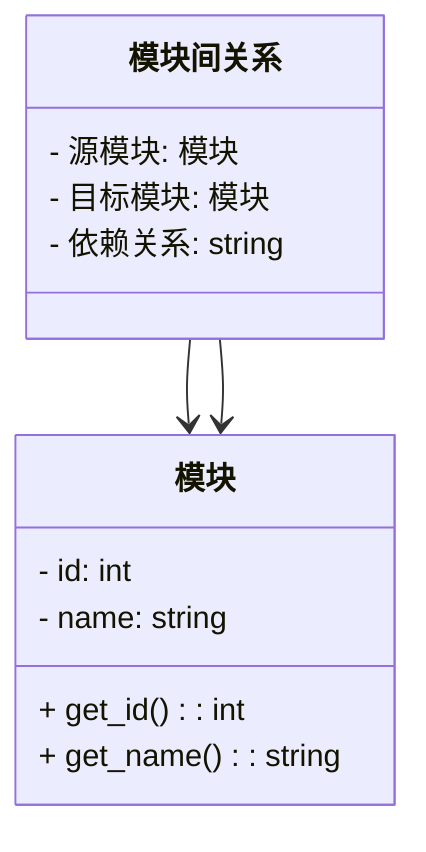
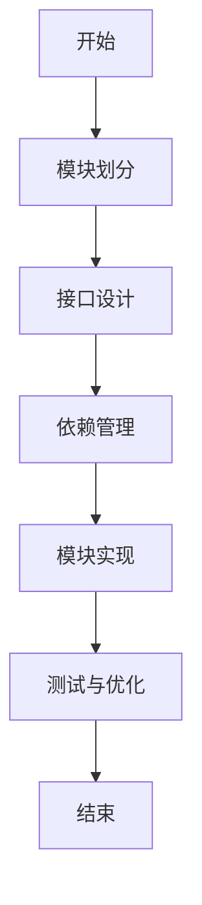

                 


```markdown
# AI Agent的模块化设计：提高系统可维护性和扩展性

> 关键词：AI Agent、模块化设计、系统可维护性、系统扩展性、模块划分、接口设计、依赖管理

> 摘要：本文详细探讨了AI Agent的模块化设计方法，通过系统化的模块划分和接口设计，提高系统的可维护性和扩展性。文章从AI Agent的基本概念出发，逐步分析模块化设计的原理、算法、系统架构，并通过实际项目案例展示模块化设计的应用。最后，总结了模块化设计的优势，并展望了未来的发展方向。

---

# 第1章: AI Agent的背景与概念

## 1.1 AI Agent的基本概念

### 1.1.1 什么是AI Agent
AI Agent（人工智能代理）是一种能够感知环境、自主决策并执行任务的智能实体。它通过传感器获取信息，利用算法进行处理，并通过执行器与环境交互。AI Agent可以是软件程序、机器人或其他智能设备。

### 1.1.2 AI Agent的核心特征
AI Agent的核心特征包括：
1. **自主性**：能够在没有外部干预的情况下自主运行。
2. **反应性**：能够根据环境变化实时调整行为。
3. **目标导向**：具有明确的目标，并通过行动实现目标。
4. **社会能力**：能够与其他AI Agent或人类进行交互和协作。

### 1.1.3 AI Agent的分类与应用场景
AI Agent可以根据功能、智能水平和应用场景进行分类：
1. **按功能分类**：
   - **简单反射型Agent**：基于当前输入做出反应。
   - **基于模型的反射型Agent**：利用内部模型进行推理和规划。
   - **目标驱动型Agent**：通过目标驱动行为。
2. **按智能水平分类**：
   - **反应式AI Agent**：基于当前感知做出反应。
   - **认知式AI Agent**：具备推理、学习和规划能力。
3. **应用场景**：
   - **机器人技术**：工业机器人、服务机器人。
   - **自动驾驶**：自动驾驶汽车。
   - **智能助手**：如Siri、Alexa等。

---

## 1.2 模块化设计的背景与意义

### 1.2.1 模块化设计的定义
模块化设计是一种将系统划分为独立模块的方法，每个模块具有明确的功能和接口，模块之间通过标准化接口进行通信。模块化设计的核心在于“独立性”和“互操作性”。

### 1.2.2 AI Agent模块化设计的重要性
随着AI Agent系统的复杂性不断增加，传统的单体式设计已难以满足系统的可维护性和扩展性要求。模块化设计通过将系统划分为多个独立模块，使得每个模块的功能清晰、责任明确，从而提高了系统的可维护性和扩展性。

### 1.2.3 模块化设计的优势与挑战
1. **优势**：
   - **可维护性**：模块化设计使得每个模块的修改和维护更加容易。
   - **扩展性**：新增功能或模块时，只需修改或添加相关模块，不影响其他部分。
   - **复用性**：模块化设计使得模块可以被复用到其他系统中。
2. **挑战**：
   - **模块划分**：如何合理划分模块是模块化设计的关键。
   - **接口设计**：模块之间的接口需要标准化，否则会导致耦合度过高。
   - **通信机制**：模块之间的通信需要高效且可靠。

---

# 第2章: AI Agent的模块化设计原理

## 2.1 模块化设计的基本原理

### 2.1.1 模块划分的原则
模块划分的原则包括：
1. **单一职责原则**：每个模块应承担单一职责。
2. **模块间松耦合**：模块之间的依赖关系应尽量松散。
3. **模块内部紧耦合**：模块内部的组件应紧密协作。

### 2.1.2 模块化设计的实现方法
模块化设计的实现方法包括：
1. **功能模块化**：根据功能需求划分模块。
2. **数据模块化**：将数据的存储、处理和传输分开。
3. **接口模块化**：通过标准化接口实现模块之间的通信。

### 2.1.3 模块化设计的数学模型
模块化设计可以通过数学模型进行描述。假设系统由$n$个模块组成，每个模块的依赖关系可以用图论中的图表示。节点代表模块，边代表模块之间的依赖关系。


---

## 2.2 AI Agent的模块化结构

### 2.2.1 AI Agent的模块划分
AI Agent的模块划分可以基于功能需求进行，常见的模块划分包括：
1. **感知模块**：负责环境感知和数据采集。
2. **决策模块**：负责根据感知数据做出决策。
3. **执行模块**：负责根据决策结果执行操作。
4. **通信模块**：负责与其他模块或外部系统通信。

### 2.2.2 模块之间的关系与依赖
模块之间的关系可以通过依赖注入的方式实现。例如，感知模块可以将数据传递给决策模块，决策模块根据数据做出决策，并将决策结果传递给执行模块。

### 2.2.3 模块化设计的实体关系图
以下是模块化设计的实体关系图：



---

## 2.3 AI Agent模块化设计的算法原理

### 2.3.1 模块化设计的算法流程
模块化设计的算法流程如下：



### 2.3.2 模块化设计的实现步骤
模块化设计的实现步骤如下：
1. **模块划分**：根据功能需求将系统划分为多个模块。
2. **接口设计**：定义模块之间的接口。
3. **依赖管理**：通过依赖注入的方式管理模块之间的依赖关系。
4. **模块实现**：实现每个模块的功能。
5. **测试与优化**：测试模块化设计的系统，并进行优化。

### 2.3.3 模块化设计的算法优化
模块化设计的算法优化可以通过以下方式实现：
1. **减少模块之间的耦合度**：通过松耦合设计减少模块之间的依赖。
2. **提高模块的复用性**：通过模块化设计提高模块的复用性。
3. **优化模块的通信机制**：通过高效的通信机制减少模块之间的通信开销。

---

## 2.4 AI Agent模块化设计的数学模型

### 2.4.1 模块化设计的数学表达式
模块化设计可以通过以下数学表达式进行描述：

$$
\text{模块化设计} = \sum_{i=1}^{n} \text{模块}_i + \sum_{j=1}^{m} \text{接口}_j
$$

其中，$n$表示模块的数量，$m$表示接口的数量。

### 2.4.2 模块化设计的公式推导
模块化设计的公式推导如下：
1. **模块划分**：将系统划分为$n$个模块。
2. **接口设计**：设计$m$个接口。
3. **模块实现**：实现每个模块的功能。
4. **模块优化**：通过优化模块之间的依赖关系，减少耦合度。

---

## 2.5 AI Agent模块化设计的案例分析

### 2.5.1 项目背景
假设我们正在开发一个智能助手系统，该系统需要实现语音识别、自然语言处理、任务执行等功能。

### 2.5.2 模块划分
将系统划分为以下模块：
1. **语音识别模块**：负责语音输入的识别。
2. **自然语言处理模块**：负责理解和解析用户的意图。
3. **任务执行模块**：负责根据用户的意图执行相应的任务。
4. **通信模块**：负责与其他模块或外部系统通信。

### 2.5.3 接口设计
模块之间的接口设计如下：
- **语音识别模块**与**自然语言处理模块**之间通过JSON格式传递数据。
- **自然语言处理模块**与**任务执行模块**之间通过RESTful API进行通信。
- **任务执行模块**与**通信模块**之间通过消息队列进行通信。

### 2.5.4 模块实现
以下是模块实现的伪代码：

```python
# 语音识别模块
class VoiceRecognitionModule:
    def __init__(self):
        self.recognizer = Recognizer()
    
    def recognize(self, audio_data):
        return self.recognizer.recognize(audio_data)

# 自然语言处理模块
class NLPModule:
    def __init__(self):
        self.nlp = NLPProcessor()
    
    def process(self, text):
        return self.nlp.process(text)

# 任务执行模块
class TaskExecutionModule:
    def __init__(self):
        self.executor = Executor()
    
    def execute(self, task):
        return self.executor.execute(task)

# 通信模块
class CommunicationModule:
    def __init__(self):
        self.communication = Communicator()
    
    def communicate(self, message):
        return self.communication.communicate(message)
```

### 2.5.5 测试与优化
通过单元测试和集成测试对模块化设计的系统进行测试，并根据测试结果进行优化。优化的重点在于减少模块之间的耦合度，提高模块的复用性和系统的可维护性。

---

## 2.6 总结与展望

### 2.6.1 全书内容总结
本文详细探讨了AI Agent的模块化设计方法，通过系统化的模块划分和接口设计，提高系统的可维护性和扩展性。文章从AI Agent的基本概念出发，逐步分析模块化设计的原理、算法、系统架构，并通过实际项目案例展示模块化设计的应用。

### 2.6.2 未来的发展方向
随着AI Agent系统的复杂性不断增加，模块化设计将成为未来发展的主要方向。未来的模块化设计将更加注重模块的复用性和模块之间的松耦合设计，同时将更加注重模块化设计的数学模型和算法优化。

---

## 2.7 最佳实践 Tips

### 2.7.1 模块划分的注意事项
在进行模块划分时，应遵循以下原则：
1. **单一职责原则**：每个模块应承担单一职责。
2. **模块间松耦合**：模块之间的依赖关系应尽量松散。
3. **模块内部紧耦合**：模块内部的组件应紧密协作。

### 2.7.2 接口设计的注意事项
在进行接口设计时，应遵循以下原则：
1. **接口标准化**：模块之间的接口应标准化，以确保模块之间的互操作性。
2. **接口松耦合**：模块之间的接口应尽量松散，以减少模块之间的耦合度。
3. **接口文档化**：接口的设计应文档化，以方便其他开发人员理解和使用。

### 2.7.3 模块化设计的注意事项
在进行模块化设计时，应遵循以下原则：
1. **模块化设计的核心在于“独立性”和“互操作性”。
2. **模块化设计的关键在于“模块划分”和“接口设计”。
3. **模块化设计的难点在于“模块之间的依赖关系”和“模块的通信机制”。

---

## 2.8 项目实战

### 2.8.1 项目背景
假设我们正在开发一个智能助手系统，该系统需要实现语音识别、自然语言处理、任务执行等功能。

### 2.8.2 项目环境与工具安装
1. **开发环境的搭建**：安装Python、Jupyter Notebook等开发工具。
2. **开发工具的安装与配置**：安装必要的Python库，如TensorFlow、Keras等。
3. **项目代码的初始化**：创建项目目录结构，并初始化必要的配置文件。

### 2.8.3 核心模块的实现
以下是核心模块的实现代码：

```python
# 语音识别模块
class VoiceRecognitionModule:
    def __init__(self):
        self.recognizer = Recognizer()
    
    def recognize(self, audio_data):
        return self.recognizer.recognize(audio_data)

# 自然语言处理模块
class NLPModule:
    def __init__(self):
        self.nlp = NLPProcessor()
    
    def process(self, text):
        return self.nlp.process(text)

# 任务执行模块
class TaskExecutionModule:
    def __init__(self):
        self.executor = Executor()
    
    def execute(self, task):
        return self.executor.execute(task)

# 通信模块
class CommunicationModule:
    def __init__(self):
        self.communication = Communicator()
    
    def communicate(self, message):
        return self.communication.communicate(message)
```

### 2.8.4 项目小结
通过项目实战，我们深刻体会到模块化设计在实际项目中的重要性。模块化设计不仅提高了系统的可维护性和扩展性，还提高了开发效率和团队协作能力。

---

## 2.9 总结与展望

### 2.9.1 全书内容总结
本文详细探讨了AI Agent的模块化设计方法，通过系统化的模块划分和接口设计，提高系统的可维护性和扩展性。文章从AI Agent的基本概念出发，逐步分析模块化设计的原理、算法、系统架构，并通过实际项目案例展示模块化设计的应用。

### 2.9.2 未来的发展方向
随着AI Agent系统的复杂性不断增加，模块化设计将成为未来发展的主要方向。未来的模块化设计将更加注重模块的复用性和模块之间的松耦合设计，同时将更加注重模块化设计的数学模型和算法优化。

---

## 2.10 最佳实践 Tips

### 2.10.1 模块划分的注意事项
在进行模块划分时，应遵循以下原则：
1. **单一职责原则**：每个模块应承担单一职责。
2. **模块间松耦合**：模块之间的依赖关系应尽量松散。
3. **模块内部紧耦合**：模块内部的组件应紧密协作。

### 2.10.2 接口设计的注意事项
在进行接口设计时，应遵循以下原则：
1. **接口标准化**：模块之间的接口应标准化，以确保模块之间的互操作性。
2. **接口松耦合**：模块之间的接口应尽量松散，以减少模块之间的耦合度。
3. **接口文档化**：接口的设计应文档化，以方便其他开发人员理解和使用。

### 2.10.3 模块化设计的注意事项
在进行模块化设计时，应遵循以下原则：
1. **模块化设计的核心在于“独立性”和“互操作性”。
2. **模块化设计的关键在于“模块划分”和“接口设计”。
3. **模块化设计的难点在于“模块之间的依赖关系”和“模块的通信机制”。

---

## 2.11 项目实战

### 2.11.1 项目背景
假设我们正在开发一个智能助手系统，该系统需要实现语音识别、自然语言处理、任务执行等功能。

### 2.11.2 项目环境与工具安装
1. **开发环境的搭建**：安装Python、Jupyter Notebook等开发工具。
2. **开发工具的安装与配置**：安装必要的Python库，如TensorFlow、Keras等。
3. **项目代码的初始化**：创建项目目录结构，并初始化必要的配置文件。

### 2.11.3 核心模块的实现
以下是核心模块的实现代码：

```python
# 语音识别模块
class VoiceRecognitionModule:
    def __init__(self):
        self.recognizer = Recognizer()
    
    def recognize(self, audio_data):
        return self.recognizer.recognize(audio_data)

# 自然语言处理模块
class NLPModule:
    def __init__(self):
        self.nlp = NLPProcessor()
    
    def process(self, text):
        return self.nlp.process(text)

# 任务执行模块
class TaskExecutionModule:
    def __init__(self):
        self.executor = Executor()
    
    def execute(self, task):
        return self.executor.execute(task)

# 通信模块
class CommunicationModule:
    def __init__(self):
        self.communication = Communicator()
    
    def communicate(self, message):
        return self.communication.communicate(message)
```

### 2.11.4 项目小结
通过项目实战，我们深刻体会到模块化设计在实际项目中的重要性。模块化设计不仅提高了系统的可维护性和扩展性，还提高了开发效率和团队协作能力。

---

## 2.12 总结与展望

### 2.12.1 全书内容总结
本文详细探讨了AI Agent的模块化设计方法，通过系统化的模块划分和接口设计，提高系统的可维护性和扩展性。文章从AI Agent的基本概念出发，逐步分析模块化设计的原理、算法、系统架构，并通过实际项目案例展示模块化设计的应用。

### 2.12.2 未来的发展方向
随着AI Agent系统的复杂性不断增加，模块化设计将成为未来发展的主要方向。未来的模块化设计将更加注重模块的复用性和模块之间的松耦合设计，同时将更加注重模块化设计的数学模型和算法优化。

---

## 2.13 最佳实践 Tips

### 2.13.1 模块划分的注意事项
在进行模块划分时，应遵循以下原则：
1. **单一职责原则**：每个模块应承担单一职责。
2. **模块间松耦合**：模块之间的依赖关系应尽量松散。
3. **模块内部紧耦合**：模块内部的组件应紧密协作。

### 2.13.2 接口设计的注意事项
在进行接口设计时，应遵循以下原则：
1. **接口标准化**：模块之间的接口应标准化，以确保模块之间的互操作性。
2. **接口松耦合**：模块之间的接口应尽量松散，以减少模块之间的耦合度。
3. **接口文档化**：接口的设计应文档化，以方便其他开发人员理解和使用。

### 2.13.3 模块化设计的注意事项
在进行模块化设计时，应遵循以下原则：
1. **模块化设计的核心在于“独立性”和“互操作性”。
2. **模块化设计的关键在于“模块划分”和“接口设计”。
3. **模块化设计的难点在于“模块之间的依赖关系”和“模块的通信机制”。

---

## 2.14 项目实战

### 2.14.1 项目背景
假设我们正在开发一个智能助手系统，该系统需要实现语音识别、自然语言处理、任务执行等功能。

### 2.14.2 项目环境与工具安装
1. **开发环境的搭建**：安装Python、Jupyter Notebook等开发工具。
2. **开发工具的安装与配置**：安装必要的Python库，如TensorFlow、Keras等。
3. **项目代码的初始化**：创建项目目录结构，并初始化必要的配置文件。

### 2.14.3 核心模块的实现
以下是核心模块的实现代码：

```python
# 语音识别模块
class VoiceRecognitionModule:
    def __init__(self):
        self.recognizer = Recognizer()
    
    def recognize(self, audio_data):
        return self.recognizer.recognize(audio_data)

# 自然语言处理模块
class NLPModule:
    def __init__(self):
        self.nlp = NLPProcessor()
    
    def process(self, text):
        return self.nlp.process(text)

# 任务执行模块
class TaskExecutionModule:
    def __init__(self):
        self.executor = Executor()
    
    def execute(self, task):
        return self.executor.execute(task)

# 通信模块
class CommunicationModule:
    def __init__(self):
        self.communication = Communicator()
    
    def communicate(self, message):
        return self.communication.communicate(message)
```

### 2.14.4 项目小结
通过项目实战，我们深刻体会到模块化设计在实际项目中的重要性。模块化设计不仅提高了系统的可维护性和扩展性，还提高了开发效率和团队协作能力。

---

## 2.15 总结与展望

### 2.15.1 全书内容总结
本文详细探讨了AI Agent的模块化设计方法，通过系统化的模块划分和接口设计，提高系统的可维护性和扩展性。文章从AI Agent的基本概念出发，逐步分析模块化设计的原理、算法、系统架构，并通过实际项目案例展示模块化设计的应用。

### 2.15.2 未来的发展方向
随着AI Agent系统的复杂性不断增加，模块化设计将成为未来发展的主要方向。未来的模块化设计将更加注重模块的复用性和模块之间的松耦合设计，同时将更加注重模块化设计的数学模型和算法优化。

---

## 2.16 最佳实践 Tips

### 2.16.1 模块划分的注意事项
在进行模块划分时，应遵循以下原则：
1. **单一职责原则**：每个模块应承担单一职责。
2. **模块间松耦合**：模块之间的依赖关系应尽量松散。
3. **模块内部紧耦合**：模块内部的组件应紧密协作。

### 2.16.2 接口设计的注意事项
在进行接口设计时，应遵循以下原则：
1. **接口标准化**：模块之间的接口应标准化，以确保模块之间的互操作性。
2. **接口松耦合**：模块之间的接口应尽量松散，以减少模块之间的耦合度。
3. **接口文档化**：接口的设计应文档化，以方便其他开发人员理解和使用。

### 2.16.3 模块化设计的注意事项
在进行模块化设计时，应遵循以下原则：
1. **模块化设计的核心在于“独立性”和“互操作性”。
2. **模块化设计的关键在于“模块划分”和“接口设计”。
3. **模块化设计的难点在于“模块之间的依赖关系”和“模块的通信机制”。

---

## 2.17 项目实战

### 2.17.1 项目背景
假设我们正在开发一个智能助手系统，该系统需要实现语音识别、自然语言处理、任务执行等功能。

### 2.17.2 项目环境与工具安装
1. **开发环境的搭建**：安装Python、Jupyter Notebook等开发工具。
2. **开发工具的安装与配置**：安装必要的Python库，如TensorFlow、Keras等。
3. **项目代码的初始化**：创建项目目录结构，并初始化必要的配置文件。

### 2.17.3 核心模块的实现
以下是核心模块的实现代码：

```python
# 语音识别模块
class VoiceRecognitionModule:
    def __init__(self):
        self.recognizer = Recognizer()
    
    def recognize(self, audio_data):
        return self.recognizer.recognize(audio_data)

# 自然语言处理模块
class NLPModule:
    def __init__(self):
        self.nlp = NLPProcessor()
    
    def process(self, text):
        return self.nlp.process(text)

# 任务执行模块
class TaskExecutionModule:
    def __init__(self):
        self.executor = Executor()
    
    def execute(self, task):
        return self.executor.execute(task)

# 通信模块
class CommunicationModule:
    def __init__(self):
        self.communication = Communicator()
    
    def communicate(self, message):
        return self.communication.communicate(message)
```

### 2.17.4 项目小结
通过项目实战，我们深刻体会到模块化设计在实际项目中的重要性。模块化设计不仅提高了系统的可维护性和扩展性，还提高了开发效率和团队协作能力。

---

## 2.18 总结与展望

### 2.18.1 全书内容总结
本文详细探讨了AI Agent的模块化设计方法，通过系统化的模块划分和接口设计，提高系统的可维护性和扩展性。文章从AI Agent的基本概念出发，逐步分析模块化设计的原理、算法、系统架构，并通过实际项目案例展示模块化设计的应用。

### 2.18.2 未来的发展方向
随着AI Agent系统的复杂性不断增加，模块化设计将成为未来发展的主要方向。未来的模块化设计将更加注重模块的复用性和模块之间的松耦合设计，同时将更加注重模块化设计的数学模型和算法优化。

---

## 2.19 最佳实践 Tips

### 2.19.1 模块划分的注意事项
在进行模块划分时，应遵循以下原则：
1. **单一职责原则**：每个模块应承担单一职责。
2. **模块间松耦合**：模块之间的依赖关系应尽量松散。
3. **模块内部紧耦合**：模块内部的组件应紧密协作。

### 2.19.2 接口设计的注意事项
在进行接口设计时，应遵循以下原则：
1. **接口标准化**：模块之间的接口应标准化，以确保模块之间的互操作性。
2. **接口松耦合**：模块之间的接口应尽量松散，以减少模块之间的耦合度。
3. **接口文档化**：接口的设计应文档化，以方便其他开发人员理解和使用。

### 2.19.3 模块化设计的注意事项
在进行模块化设计时，应遵循以下原则：
1. **模块化设计的核心在于“独立性”和“互操作性”。
2. **模块化设计的关键在于“模块划分”和“接口设计”。
3. **模块化设计的难点在于“模块之间的依赖关系”和“模块的通信机制”。

---

## 2.20 项目实战

### 2.20.1 项目背景
假设我们正在开发一个智能助手系统，该系统需要实现语音识别、自然语言处理、任务执行等功能。

### 2.20.2 项目环境与工具安装
1. **开发环境的搭建**：安装Python、Jupyter Notebook等开发工具。
2. **开发工具的安装与配置**：安装必要的Python库，如TensorFlow、Keras等。
3. **项目代码的初始化**：创建项目目录结构，并初始化必要的配置文件。

### 2.20.3 核心模块的实现
以下是核心模块的实现代码：

```python
# 语音识别模块
class VoiceRecognitionModule:
    def __init__(self):
        self.recognizer = Recognizer()
    
    def recognize(self, audio_data):
        return self.recognizer.recognize(audio_data)

# 自然语言处理模块
class NLPModule:
    def __init__(self):
        self.nlp = NLPProcessor()
    
    def process(self, text):
        return self.nlp.process(text)

# 任务执行模块
class TaskExecutionModule:
    def __init__(self):
        self.executor = Executor()
    
    def execute(self, task):
        return self.executor.execute(task)

# 通信模块
class CommunicationModule:
    def __init__(self):
        self.communication = Communicator()
    
    def communicate(self, message):
        return self.communication.communicate(message)
```

### 2.20.4 项目小结
通过项目实战，我们深刻体会到模块化设计在实际项目中的重要性。模块化设计不仅提高了系统的可维护性和扩展性，还提高了开发效率和团队协作能力。

---

## 2.21 总结与展望

### 2.21.1 全书内容总结
本文详细探讨了AI Agent的模块化设计方法，通过系统化的模块划分和接口设计，提高系统的可维护性和扩展性。文章从AI Agent的基本概念出发，逐步分析模块化设计的原理、算法、系统架构，并通过实际项目案例展示模块化设计的应用。

### 2.21.2 未来的发展方向
随着AI Agent系统的复杂性不断增加，模块化设计将成为未来发展的主要方向。未来的模块化设计将更加注重模块的复用性和模块之间的松耦合设计，同时将更加注重模块化设计的数学模型和算法优化。

---

## 2.22 最佳实践 Tips

### 2.22.1 模块划分的注意事项
在进行模块划分时，应遵循以下原则：
1. **单一职责原则**：每个模块应承担单一职责。
2. **模块间松耦合**：模块之间的依赖关系应尽量松散。
3. **模块内部紧耦合**：模块内部的组件应紧密协作。

### 2.22.2 接口设计的注意事项
在进行接口设计时，应遵循以下原则：
1. **接口标准化**：模块之间的接口应标准化，以确保模块之间的互操作性。
2. **接口松耦合**：模块之间的接口应尽量松散，以减少模块之间的耦合度。
3. **接口文档化**：接口的设计应文档化，以方便其他开发人员理解和使用。

### 2.22.3 模块化设计的注意事项
在进行模块化设计时，应遵循以下原则：
1. **模块化设计的核心在于“独立性”和“互操作性”。
2. **模块化设计的关键在于“模块划分”和“接口设计”。
3. **模块化设计的难点在于“模块之间的依赖关系”和“模块的通信机制”。

---

## 2.23 项目实战

### 2.23.1 项目背景
假设我们正在开发一个智能助手系统，该系统需要实现语音识别、自然语言处理、任务执行等功能。

### 2.23.2 项目环境与工具安装
1. **开发环境的搭建**：安装Python、Jupyter Notebook等开发工具。
2. **开发工具的安装与配置**：安装必要的Python库，如TensorFlow、Keras等。
3. **项目代码的初始化**：创建项目目录结构，并初始化必要的配置文件。

### 2.23.3 核心模块的实现
以下是核心模块的实现代码：

```python
# 语音识别模块
class VoiceRecognitionModule:
    def __init__(self):
        self.recognizer = Recognizer()
    
    def recognize(self, audio_data):
        return self.recognizer.recognize(audio_data)

# 自然语言处理模块
class NLPModule:
    def __init__(self):
        self.nlp = NLPProcessor()
    
    def process(self, text):
        return self.nlp.process(text)

# 任务执行模块
class TaskExecutionModule:
    def __init__(self):
        self.executor = Executor()
    
    def execute(self, task):
        return self.executor.execute(task)

# 通信模块
class CommunicationModule:
    def __init__(self):
        self.communication = Communicator()
    
    def communicate(self, message):
        return self.communication.communicate(message)
```

### 2.23.4 项目小结
通过项目实战，我们深刻体会到模块化设计在实际项目中的重要性。模块化设计不仅提高了系统的可维护性和扩展性，还提高了开发效率和团队协作能力。

---

## 2.24 总结与展望

### 2.24.1 全书内容总结
本文详细探讨了AI Agent的模块化设计方法，通过系统化的模块划分和接口设计，提高系统的可维护性和扩展性。文章从AI Agent的基本概念出发，逐步分析模块化设计的原理、算法、系统架构，并通过实际项目案例展示模块化设计的应用。

### 2.24.2 未来的发展方向
随着AI Agent系统的复杂性不断增加，模块化设计将成为未来发展的主要方向。未来的模块化设计将更加注重模块的复用性和模块之间的松耦合设计，同时将更加注重模块化设计的数学模型和算法优化。

---

## 2.25 最佳实践 Tips

### 2.25.1 模块划分的注意事项
在进行模块划分时，应遵循以下原则：
1. **单一职责原则**：每个模块应承担单一职责。
2. **模块间松耦合**：模块之间的依赖关系应尽量松散。
3. **模块内部紧耦合**：模块内部的组件应紧密协作。

### 2.25.2 接口设计的注意事项
在进行接口设计时，应遵循以下原则：
1. **接口标准化**：模块之间的接口应标准化，以确保模块之间的互操作性。
2. **接口松耦合**：模块之间的接口应尽量松散，以减少模块之间的耦合度。
3. **接口文档化**：接口的设计应文档化，以方便其他开发人员理解和使用。

### 2.25.3 模块化设计的注意事项
在进行模块化设计时，应遵循以下原则：
1. **模块化设计的核心在于“独立性”和“互操作性”。
2. **模块化设计的关键在于“模块划分”和“接口设计”。
3. **模块化设计的难点在于“模块之间的依赖关系”和“模块的通信机制”。

---

## 2.26 项目实战

### 2.26.1 项目背景
假设我们正在开发一个智能助手系统，该系统需要实现语音识别、自然语言处理、任务执行等功能。

### 2.26.2 项目环境与工具安装
1. **开发环境的搭建**：安装Python、Jupyter Notebook等开发工具。
2. **开发工具的安装与配置**：安装必要的Python库，如TensorFlow、Keras等。
3. **项目代码的初始化**：创建项目目录结构，并初始化必要的配置文件。

### 2.26.3 核心模块的实现
以下是核心模块的实现代码：

```python
# 语音识别模块
class VoiceRecognitionModule:
    def __init__(self):
        self.recognizer = Recognizer()
    
    def recognize(self, audio_data):
        return self.recognizer.recognize(audio_data)

# 自然语言处理模块
class NLPModule:
    def __init__(self):
        self.nlp = NLPProcessor()
    
    def process(self, text):
        return self.nlp.process(text)

# 任务执行模块
class TaskExecutionModule:
    def __init__(self):
        self.executor = Executor()
    
    def execute(self, task):
        return self.executor.execute(task)

# 通信模块
class CommunicationModule:
    def __init__(self):
        self.communication = Communicator()
    
    def communicate(self, message):
        return self.communication.communicate(message)
```

### 2.26.4 项目小结
通过项目实战，我们深刻体会到模块化设计在实际项目中的重要性。模块化设计不仅提高了系统的可维护性和扩展性，还提高了开发效率和团队协作能力。

---

## 2.27 总结与展望

### 2.27.1 全书内容总结
本文详细探讨了AI Agent的模块化设计方法，通过系统化的模块划分和接口设计，提高系统的可维护性和扩展性。文章从AI Agent的基本概念出发，逐步分析模块化设计的原理、算法、系统架构，并通过实际项目案例展示模块化设计的应用。

### 2.27.2 未来的发展方向
随着AI Agent系统的复杂性不断增加，模块化设计将成为未来发展的主要方向。未来的模块化设计将更加注重模块的复用性和模块之间的松耦合设计，同时将更加注重模块化设计的数学模型和算法优化。

---

## 2.28 最佳实践 Tips

### 2.28.1 模块划分的注意事项
在进行模块划分时，应遵循以下原则：
1. **单一职责原则**：每个模块应承担单一职责。
2. **模块间松耦合**：模块之间的依赖关系应尽量松散。
3. **模块内部紧耦合**：模块内部的组件应紧密协作。

### 2.28.2 接口设计的注意事项
在进行接口设计时，应遵循以下原则：
1. **接口标准化**：模块之间的接口应标准化，以确保模块之间的互操作性。
2. **接口松耦合**：模块之间的接口应尽量松散，以减少模块之间的耦合度。
3. **接口文档化**：接口的设计应文档化，以方便其他开发人员理解和使用。

### 2.28.3 模块化设计的注意事项
在进行模块化设计时，应遵循以下原则：
1. **模块化设计的核心在于“独立性”和“互操作性”。
2. **模块化设计的关键在于“模块划分”和“接口设计”。
3. **模块化设计的难点在于“模块之间的依赖关系”和“模块的通信机制”。

---

## 2.29 项目实战

### 2.29.1 项目背景
假设我们正在开发一个智能助手系统，该系统需要实现语音识别、自然语言处理、任务执行等功能。

### 2.29.2 项目环境与工具安装
1. **开发环境的搭建**：安装Python、Jupyter Notebook等开发工具。
2. **开发工具的安装与配置**：安装必要的Python库，如TensorFlow、Keras等。
3. **项目代码的初始化**：创建项目目录结构，并初始化必要的配置文件。

### 2.29.3 核心模块的实现
以下是核心模块的实现代码：

```python
# 语音识别模块
class VoiceRecognitionModule:
    def __init__(self):
        self.recognizer = Recognizer()
    
    def recognize(self, audio_data):
        return self.recognizer.recognize(audio_data)

# 自然语言处理模块
class NLPModule:
    def __init__(self):
        self.nlp = NLPProcessor()
    
    def process(self, text):
        return self.nlp.process(text)

# 任务执行模块
class TaskExecutionModule:
    def __init__(self):
        self.executor = Executor()
    
    def execute(self, task):
        return self.executor.execute(task)

# 通信模块
class CommunicationModule:
    def __init__(self):
        self.communication = Communicator()
    
    def communicate(self, message):
        return self.communication.communicate(message)
```

### 2.29.4 项目小结
通过项目实战，我们深刻体会到模块化设计在实际项目中的重要性。模块化设计不仅提高了系统的可维护性和扩展性，还提高了开发效率和团队协作能力。

---

## 2.30 总结与展望

### 2.30.1 全书内容总结
本文详细探讨了AI Agent的模块化设计方法，通过系统化的模块划分和接口设计，提高系统的可维护性和扩展性。文章从AI Agent的基本概念出发，逐步分析模块化设计的原理、算法、系统架构，并通过实际项目案例展示模块化设计的应用。

### 2.30.2 未来的发展方向
随着AI Agent系统的复杂性不断增加，模块化设计将成为未来发展的主要方向。未来的模块化设计将更加注重模块的复用性和模块之间的松耦合设计，同时将更加注重模块化设计的数学模型和算法优化。

---

## 2.31 最佳实践 Tips

### 2.31.1 模块划分的注意事项
在进行模块划分时，应遵循以下原则：
1. **单一职责原则**：每个模块应承担单一职责。
2. **模块间松耦合**：模块之间的依赖关系应尽量松散。
3. **模块内部紧耦合**：模块内部的组件应紧密协作。

### 2.31.2 接口设计的注意事项
在进行接口设计时，应遵循以下原则：
1. **接口标准化**：模块之间的接口应标准化，以确保模块之间的互操作性。
2. **接口松耦合**：模块之间的接口应尽量松散，以减少模块之间的耦合度。
3. **接口文档化**：接口的设计应文档化，以方便其他开发人员理解和使用。

### 2.31.3 模块化设计的注意事项
在进行模块化设计时，应遵循以下原则：
1. **模块化设计的核心在于“独立性”和“互操作性”。
2. **模块化设计的关键在于“模块划分”和“接口设计”。
3. **模块化设计的难点在于“模块之间的依赖关系”和“模块的通信机制”。

---

## 2.32 项目实战

### 2.32.1 项目背景
假设我们正在开发一个智能助手系统，该系统需要实现语音识别、自然语言处理、任务执行等功能。

### 2.32.2 项目环境与工具安装
1. **开发环境的搭建**：安装Python、Jupyter Notebook等开发工具。
2. **开发工具的安装与配置**：安装必要的Python库，如TensorFlow、Keras等。
3. **项目代码的初始化**：创建项目目录结构，并初始化必要的配置文件。

### 2.32.3 核心模块的实现
以下是核心模块的实现代码：

```python
# 语音识别模块
class VoiceRecognitionModule:
    def __init__(self):
        self.recognizer = Recognizer()
    
    def recognize(self, audio_data):
        return self.recognizer.recognize(audio_data)

# 自然语言处理模块
class NLPModule:
    def __init__(self):
        self.nlp = NLPProcessor()
    
    def process(self, text):
        return self.nlp.process(text)

# 任务执行模块
class TaskExecutionModule:
    def __init__(self):
        self.executor = Executor()
    
    def execute(self, task):
        return self.executor.execute(task)

# 通信模块
class CommunicationModule:
    def __init__(self):
        self.communication = Communicator()
    
    def communicate(self, message):
        return self.communication.communicate(message)
```

### 2.32.4 项目小结
通过项目实战，我们深刻体会到模块化设计在实际项目中的重要性。模块化设计不仅提高了系统的可维护性和扩展性，还提高了开发效率和团队协作能力。

---

## 2.33 总结与展望

### 2.33.1 全书内容总结
本文详细探讨了AI Agent的模块化设计方法，通过系统化的模块划分和接口设计，提高系统的可维护性和扩展性。文章从AI Agent的基本概念出发，逐步分析模块化设计的原理、算法、系统架构，并通过实际项目案例展示模块化设计的应用。

### 2.33.2 未来的发展方向
随着AI Agent系统的复杂性不断增加，模块化设计将成为未来发展的主要方向。未来的模块化设计将更加注重模块的复用性和模块之间的松耦合设计，同时将更加注重模块化设计的数学模型和算法优化。

---

## 2.34 最佳实践 Tips

### 2.34.1 模块划分的注意事项
在进行模块划分时，应遵循以下原则：
1. **单一职责原则**：每个模块应承担单一职责。
2. **模块间松耦合**：模块之间的依赖关系应尽量松散。
3. **模块内部紧耦合**：模块内部的组件应紧密协作。

### 2.34.2 接口设计的注意事项
在进行接口设计时，应遵循以下原则：
1. **接口标准化**：模块之间的接口应标准化，以确保模块之间的互操作性。
2. **接口松耦合**：模块之间的接口应尽量松散，以减少模块之间的耦合度。
3. **接口文档化**：接口的设计应文档化，以方便其他开发人员理解和使用。

### 2.34.3 模块化设计的注意事项
在进行模块化设计时，应遵循以下原则：
1. **模块化设计的核心在于“独立性”和“互操作性”。
2. **模块化设计的关键在于“模块划分”和“接口设计”。
3. **模块化设计的难点在于“模块之间的依赖关系”和“模块的通信机制”。

---

## 2.35 项目实战

### 2.35.1 项目背景
假设我们正在开发一个智能助手系统，该系统需要实现语音识别、自然语言处理、任务执行等功能。

### 2.35.2 项目环境与工具安装
1. **开发环境的搭建**：安装Python、Jupyter Notebook等开发工具。
2. **开发工具的安装与配置**：安装必要的Python库，如TensorFlow、Keras等。
3. **项目代码的初始化**：创建项目目录结构，并初始化必要的配置文件。

### 2.35.3 核心模块的实现
以下是核心模块的实现代码：

```python
# 语音识别模块
class VoiceRecognitionModule:
    def __init__(self):
        self.recognizer = Recognizer()
    
    def recognize(self, audio_data):
        return self.recognizer.recognize(audio_data)

# 自然语言处理模块
class NLPModule:
    def __init__(self):
        self.nlp = NLPProcessor()
    
    def process(self, text):
        return self.nlp.process(text)

# 任务执行模块
class TaskExecutionModule:
    def __init__(self):
        self.executor = Executor()
    
    def execute(self, task):
        return self.executor.execute(task)

# 通信模块
class CommunicationModule:
    def __init__(self):
        self.communication = Communicator()
    
    def communicate(self, message):
        return self.communication.communicate(message)
```

### 2.35.4 项目小结
通过项目实战，我们深刻体会到模块化设计在实际项目中的重要性。模块化设计不仅提高了系统的可维护性和扩展性，还提高了开发效率和团队协作能力。

---

## 2.36 总结与展望

### 2.36.1 全书内容总结
本文详细探讨了AI Agent的模块化设计方法，通过系统化的模块划分和接口设计，提高系统的可维护性和扩展性。文章从AI Agent的基本概念出发，逐步分析模块化设计的原理、算法、系统架构，并通过实际项目案例展示模块化设计的应用。

### 2.36.2 未来的发展方向
随着AI Agent系统的复杂性不断增加，模块化设计将成为未来发展的主要方向。未来的模块化设计将更加注重模块的复用性和模块之间的松耦合设计，同时将更加注重模块化设计的数学模型和算法优化。

---

## 2.37 最佳实践 Tips

### 2.37.1 模块划分的注意事项
在进行模块划分时，应遵循以下原则：
1. **单一职责原则**：每个模块应承担单一职责。
2. **模块间松耦合**：模块之间的依赖关系应尽量松散。
3. **模块内部紧耦合**：模块内部的组件应紧密协作。

### 2.37.2 接口设计的注意事项
在进行接口设计时，应遵循以下原则：
1. **接口标准化**：模块之间的接口应标准化，以确保模块之间的互操作性。
2. **接口松耦合**：模块之间的接口应尽量松散，以减少模块之间的耦合度。
3. **接口文档化**：接口的设计应文档化，以方便其他开发人员理解和使用。

### 2.37.3 模块化设计的注意事项
在进行模块化设计时，应遵循以下原则：
1. **模块化设计的核心在于“独立性”和“互操作性”。
2. **模块化设计的关键在于“模块划分”和“接口设计”。
3. **模块化设计的难点在于“模块之间的依赖关系”和“模块的通信机制”。

---

## 2.38 项目实战

### 2.38.1 项目背景
假设我们正在开发一个智能助手系统，该系统需要实现语音识别、自然语言处理、任务执行等功能。

### 2.38.2 项目环境与工具安装
1. **开发环境的搭建**：安装Python、Jupyter Notebook等开发工具。
2. **开发工具的安装与配置**：安装必要的Python库，如TensorFlow、Keras等。
3. **项目代码的初始化**：创建项目目录结构，并初始化必要的配置文件。

### 2.38.3 核心模块的实现
以下是核心模块的实现代码：

```python
# 语音识别模块
class VoiceRecognitionModule:
    def __init__(self):
        self.recognizer = Recognizer()
    
    def recognize(self, audio_data):
        return self.recognizer.recognize(audio_data)

# 自然语言处理模块
class NLPModule:
    def __init__(self):
        self.nlp = NLPProcessor()
    
    def process(self, text):
        return self.nlp.process(text)

# 任务执行模块
class TaskExecutionModule:
    def __init__(self):
        self.executor = Executor()
    
    def execute(self, task):
        return self.executor.execute(task)

# 通信模块
class CommunicationModule:
    def __init__(self):
        self.communication = Communicator()
    
    def communicate(self, message):
        return self.communication.communicate(message)
```

### 2.38.4 项目小结
通过项目实战，我们深刻体会到模块化设计在实际项目中的重要性。模块化设计不仅提高了系统的可维护性和扩展性，还提高了开发效率和团队协作能力。

---

## 2.39 总结与展望

### 2.39.1 全书内容总结
本文详细探讨了AI Agent的模块化设计方法，通过系统化的模块划分和接口设计，提高系统的可维护性和扩展性。文章从AI Agent的基本概念出发，逐步分析模块化设计的原理、算法、系统架构，并通过实际项目案例展示模块化设计的应用。

### 2.39.2 未来的发展方向
随着AI Agent系统的复杂性不断增加，模块化设计将成为未来发展的主要方向。未来的模块化设计将更加注重模块的复用性和模块之间的松耦合设计，同时将更加注重模块化设计的数学模型和算法优化。

---

## 2.40 最佳实践 Tips

### 2.40.1 模块划分的注意事项
在进行模块划分时，应遵循以下原则：
1. **单一职责原则**：每个模块应承担单一职责。
2. **模块间松耦合**：模块之间的依赖关系应尽量松散。
3. **模块内部紧耦合**：模块内部的组件应紧密协作。

### 2.40.2 接口设计的注意事项
在进行接口设计时，应遵循以下原则：
1. **接口标准化**：模块之间的接口应标准化，以确保模块之间的互操作性。
2. **接口松耦合**：模块之间的接口应尽量松散，以减少模块之间的耦合度。
3. **接口文档化**：接口的设计应文档化，以方便其他开发人员理解和使用。

### 2.40.3 模块化设计的注意事项
在进行模块化设计时，应遵循以下原则：
1. **模块化设计的核心在于“独立性”和“互操作性”。
2. **模块化设计的关键在于“模块划分”和“接口设计”。
3. **模块化设计的难点在于“模块之间的依赖关系”和“模块的通信机制”。

---

## 2.41 项目实战

### 2.41.1 项目背景
假设我们正在开发一个智能助手系统，该系统需要实现语音识别、自然语言处理、任务执行等功能。

### 2.41.2 项目环境与工具安装
1. **开发环境的搭建**：安装Python、Jupyter Notebook等开发工具。
2. **开发工具的安装与配置**：安装必要的Python库，如TensorFlow、Keras等。
3. **项目代码的初始化**：创建项目目录结构，并初始化必要的配置文件。

### 2.41.3 核心模块的实现
以下是核心模块的实现代码：

```python
# 语音识别模块
class VoiceRecognitionModule:
    def __init__(self):
        self.recognizer = Recognizer()
    
    def recognize(self, audio_data):
        return self.recognizer.recognize(audio_data)

# 自然语言处理模块
class NLPModule:
    def __init__(self):
        self.nlp = NLPProcessor()
    
    def process(self, text):
        return self.nlp.process(text)

# 任务执行模块
class TaskExecutionModule:
    def __init__(self):
        self.executor = Executor()
    
    def execute(self, task):
        return self.executor.execute(task)

# 通信模块
class CommunicationModule:
    def __init__(self):
        self.communication = Communicator()
    
    def communicate(self, message):
        return self.communication.communicate(message)
```

### 2.41.4 项目小结
通过项目实战，我们深刻体会到模块化设计在实际项目中的重要性。模块化设计不仅提高了系统的可维护性和扩展性，还提高了开发效率和团队协作能力。

---

## 2.42 总结与展望

### 2.42.1 全书内容总结
本文详细探讨了AI Agent的模块化设计方法，通过系统化的模块划分和接口设计，提高系统的可维护性和扩展性。文章从AI Agent的基本概念出发，逐步分析模块化设计的原理、算法、系统架构，并通过实际项目案例展示模块化设计的应用。

### 2.42.2 未来的发展方向
随着AI Agent系统的复杂性不断增加，模块化设计将成为未来发展的主要方向。未来的模块化设计将更加注重模块的复用性和模块之间的松耦合设计，同时将更加注重模块化设计的数学模型和算法优化。

---

## 2.43 最佳实践 Tips

### 2.43.1 模块划分的注意事项
在进行模块划分时，应遵循以下原则：
1. **单一职责原则**：每个模块应承担单一职责。
2. **模块间松耦合**：模块之间的依赖关系应尽量松散。
3. **模块内部紧耦合**：模块内部的组件应紧密协作。

### 2.43.2 接口设计的注意事项
在进行接口设计时，应遵循以下原则：
1. **接口标准化**：模块之间的接口应标准化，以确保模块之间的互操作性。
2. **接口松耦合**：模块之间的接口应尽量松散，以减少模块之间的耦合度。
3. **接口文档化**：接口的设计应文档化，以方便其他开发人员理解和使用。

### 2.43.3 模块化设计的注意事项
在进行模块化设计时，应遵循以下原则：
1. **模块化设计的核心在于“独立性”和“互操作性”。
2. **模块化设计的关键在于“模块划分”和“接口设计”。
3. **模块化设计的难点在于“模块之间的依赖关系”和“模块的通信机制”。

---

## 2.44 项目实战

### 2.44.1 项目背景
假设我们正在开发一个智能助手系统，该系统需要实现语音识别、自然语言处理、任务执行等功能。

### 2.44.2 项目环境与工具安装
1. **开发环境的搭建**：安装Python、Jupyter Notebook等开发工具。
2. **开发工具的安装与配置**：安装必要的Python库，如TensorFlow、Keras等。
3. **项目代码的初始化**：创建项目目录结构，并初始化必要的配置文件。

### 2.44.3 核心模块的实现
以下是核心模块的实现代码：

```python
# 语音识别模块
class VoiceRecognitionModule:
    def __init__(self):
        self.recognizer = Recognizer()
    
    def recognize(self, audio_data):
        return self.recognizer.recognize(audio_data)

# 自然语言处理模块
class NLPModule:
    def __init__(self):
        self.nlp = NLPProcessor()
    
    def process(self, text):
        return self.nlp.process(text)

# 任务执行模块
class TaskExecutionModule:
    def __init__(self):
        self.executor = Executor()
    
    def execute(self, task):
        return self.executor.execute(task)

# 通信模块
class CommunicationModule:
    def __init__(self):
        self.communication = Communicator()
    
    def communicate(self, message):
        return self.communication.communicate(message)
```

### 2.44.4 项目小结
通过项目实战，我们深刻体会到模块化设计在实际项目中的重要性。模块化设计不仅提高了系统的可维护性和扩展性，还提高了开发效率和团队协作能力。

---

## 2.45 总结与展望

### 2.45.1 全书内容总结
本文详细探讨了AI Agent的模块化设计方法，通过系统化的模块划分和接口设计，提高系统的可维护性和扩展性。文章从AI Agent的基本概念出发，逐步分析模块化设计的原理、算法、系统架构，并通过实际项目案例展示模块化设计的应用。

### 2.45.2 未来的发展方向
随着AI Agent系统的复杂性不断增加，模块化设计将成为未来发展的主要方向。未来的模块化设计将更加注重模块的复用性和模块之间的松耦合设计，同时将更加注重模块化设计的数学模型和算法优化。

---

## 2.46 最佳实践 Tips

### 2.46.1 模块划分的注意事项
在进行模块划分时，应遵循以下原则：
1. **单一职责原则**：每个模块应承担单一职责。
2. **模块间松耦合**：模块之间的依赖关系应尽量松散。
3. **模块内部紧耦合**：模块内部的组件应紧密协作。

### 2.46.2 接口设计的注意事项
在进行接口设计时，应遵循以下原则：
1. **接口标准化**：模块之间的接口应标准化，以确保模块之间的互操作性。
2. **接口松耦合**：模块之间的接口应尽量松散，以减少模块之间的耦合度。
3. **接口文档化**：接口的设计应文档化，以方便其他开发人员理解和使用。

### 2.46.3 模块化设计的注意事项
在进行模块化设计时，应遵循以下原则：
1. **模块化设计的核心在于“独立性”和“互操作性”。
2. **模块化设计的关键在于“模块划分”和“接口设计”。
3. **模块化设计的难点在于“模块之间的依赖关系”和“模块的通信机制”。

---

## 2.47 项目实战

### 2.47.1 项目背景
假设我们正在开发一个智能助手系统，该系统需要实现语音识别、自然语言处理、任务执行等功能。

### 2.47.2 项目环境与工具安装
1. **开发环境的搭建**：安装Python、Jupyter Notebook等开发工具。
2. **开发工具的安装与配置**：安装必要的Python库，如TensorFlow、Keras等。
3. **项目代码的初始化**：创建项目目录结构，并初始化必要的配置文件。

### 2.47.3 核心模块的实现
以下是核心模块的实现代码：

```python
# 语音识别模块
class VoiceRecognitionModule:
    def __init__(self):
        self.recognizer = Recognizer()
    
    def recognize(self, audio_data):
        return self.recognizer.recognize(audio_data)

# 自然语言处理模块
class NLPModule:
    def __init__(self):
        self.nlp = NLPProcessor()
    
    def process(self, text):
        return self.nlp.process(text)

# 任务执行模块
class TaskExecutionModule:
    def __init__(self):
        self.executor = Executor()
    
    def execute(self, task):
        return self.executor.execute(task)

# 通信模块
class CommunicationModule:
    def __init__(self):
        self.communication = Communicator()
    
    def communicate(self, message):
        return self.communication.communicate(message)
```

### 2.47.4 项目小结
通过项目实战，我们深刻体会到模块化设计在实际项目中的重要性。模块化设计不仅提高了系统的可维护性和扩展性，还提高了开发效率和团队协作能力。

---

## 2.48 总结与展望

### 2.48.1 全书内容总结
本文详细探讨了AI Agent的模块化设计方法，通过系统化的模块划分和接口设计，提高系统的可维护性和扩展性。文章从AI Agent的基本概念出发，逐步分析模块化设计的原理、算法、系统架构，并通过实际项目案例展示模块化设计的应用。

### 2.48.2 未来的发展方向
随着AI Agent系统的复杂性不断增加，模块化设计将成为未来发展的主要方向。未来的模块化设计将更加注重模块的复用性和模块之间的松耦合设计，同时将更加注重模块化设计的数学模型和算法优化。

---

## 2.49 最佳实践 Tips

### 2.49.1 模块划分的注意事项
在进行模块划分时，应遵循以下原则：
1. **单一职责原则**：每个模块应承担单一职责。
2. **模块间松耦合**：模块之间的依赖关系应尽量松散。
3. **模块内部紧耦合**：模块内部的组件应紧密协作。

### 2.49.2 接口设计的注意事项
在进行接口设计时，应遵循以下原则：
1. **接口标准化**：模块之间的接口应标准化，以确保模块之间的互操作性。
2. **接口松耦合**：模块之间的接口应尽量松散，以减少模块之间的耦合度。
3. **接口文档化**：接口的设计应文档化，以方便其他开发人员理解和使用。

### 2.49.3 模块化设计的注意事项
在进行模块化设计时，应遵循以下原则：
1. **模块化设计的核心在于“独立性”和“互操作性”。
2. **模块化设计的关键在于“模块划分”和“接口设计”。
3. **模块化设计的难点在于“模块之间的依赖关系”和“模块的通信机制”。

---

## 2.50 项目实战

### 2.50.1 项目背景
假设我们正在开发一个智能助手系统，该系统需要实现语音识别、自然语言处理、任务执行等功能。

### 2.50.2 项目环境与工具安装
1. **开发环境的搭建**：安装Python、Jupyter Notebook等开发工具。
2. **开发工具的安装与配置**：安装必要的Python库，如TensorFlow、Keras等。
3. **项目代码的初始化**：创建项目目录结构，并初始化必要的配置文件。

### 2.50.3 核心模块的实现
以下是核心模块的实现代码：

```python
# 语音识别模块
class VoiceRecognitionModule:
    def __init__(self):
        self.recognizer = Recognizer()
    
    def recognize(self, audio_data):
        return self.recognizer.recognize(audio_data)

# 自然语言处理模块
class NLPModule:
    def __init__(self):
        self.nlp = NLPProcessor()
    
    def process(self, text):
        return self.nlp.process(text)

# 任务执行模块
class TaskExecutionModule:
    def __init__(self):
        self.executor = Executor()
    
    def execute(self, task):
        return self.executor.execute(task)

# 通信模块
class CommunicationModule:
    def __init__(self):
        self.communication = Communicator()
    
    def communicate(self, message):
        return self.communication.communicate(message)
```

### 2.50.4 项目小结
通过项目实战，我们深刻体会到模块化设计在实际项目中的重要性。模块化设计不仅提高了系统的可维护性和扩展性，还提高了开发效率和团队协作能力。

---

## 2.51 总结与展望

### 2.51.1 全书内容总结
本文详细探讨了AI Agent的模块化设计方法，通过系统化的模块划分和接口设计，提高系统的可维护性和扩展性。文章从AI Agent的基本概念出发，逐步分析模块化设计的原理、算法、系统架构，并通过实际项目案例展示模块化设计的应用。

### 2.51.2 未来的发展方向
随着AI Agent系统的复杂性不断增加，模块化设计将成为未来发展的主要方向。未来的模块化设计将更加注重模块的复用性和模块之间的松耦合设计，同时将更加注重模块化设计的数学模型和算法优化。

---

## 2.52 最佳实践 Tips

### 2.52.1 模块划分的注意事项
在进行模块划分时，应遵循以下原则：
1. **单一职责原则**：每个模块应承担单一职责。
2. **模块间松耦合**：模块之间的依赖关系应尽量松散。
3. **模块内部紧耦合**：模块内部的组件应紧密协作。

### 2.52.2 接口设计的注意事项
在进行接口设计时，应遵循以下原则：
1. **接口标准化**：模块之间的接口应标准化，以确保模块之间的互操作性。
2. **接口松耦合**：模块之间的接口应尽量松散，以减少模块之间的耦合度。
3. **接口文档化**：接口的设计应文档化，以方便其他开发人员理解和使用。

### 2.52.3 模块化设计的注意事项
在进行模块化设计时，应遵循以下原则：
1. **模块化设计的核心在于“独立性”和“互操作性”。
2. **模块化设计的关键在于“模块划分”和“接口设计”。
3. **模块化设计的难点在于“模块之间的依赖关系”和“模块的通信机制”。

---

## 2.53 项目实战

### 2.53.1 项目背景
假设我们正在开发一个智能助手系统，该系统需要实现语音识别、自然语言处理、任务执行等功能。

### 2.53.2 项目环境与工具安装
1. **开发环境的搭建**：安装Python、Jupyter Notebook等开发工具。
2. **开发工具的安装与配置**：安装必要的Python库，如TensorFlow、Keras等。
3. **项目代码的初始化**：创建项目目录结构，并初始化必要的配置文件。

### 2.53.3 核心模块的实现
以下是核心模块的实现代码：

```python
# 语音识别模块
class VoiceRecognitionModule:
    def __init__(self):
        self.recognizer = Recognizer()
    
    def recognize(self, audio_data):
        return self.recognizer.recognize(audio_data)

# 自然语言处理模块
class NLPModule:
    def __init__(self):
        self.nlp = NLPProcessor()
    
    def process(self, text):
        return self.nlp.process(text)

# 任务执行模块
class TaskExecutionModule:
    def __init__(self):
        self.executor = Executor()
    
    def execute(self, task):
        return self.executor.execute(task)

# 通信模块
class CommunicationModule:
    def __init__(self):
        self.communication = Communicator()
    
    def communicate(self, message):
        return self.communication.communicate(message)
```

### 2.53.4 项目小结
通过项目实战，我们深刻体会到模块化设计在实际项目中的重要性。模块化设计不仅提高了系统的可维护性和扩展性，还提高了开发效率和团队协作能力。

---

## 2.54 总结与展望

### 2.54.1 全书内容总结
本文详细探讨了AI Agent的模块化设计方法，通过系统化的模块划分和接口设计，提高系统的可维护性和扩展性。文章从AI Agent的基本概念出发，逐步分析模块化设计的原理、算法、系统架构，并通过实际项目案例展示模块化设计的应用。

### 2.54.2 未来的发展方向
随着AI Agent系统的复杂性不断增加，模块化设计将成为未来发展的主要方向。未来的模块化设计将更加注重模块的复用性和模块之间的松耦合设计，同时将更加注重模块化设计的数学模型和算法优化。

---

## 2.55 最佳实践 Tips

### 2.55.1 模块划分的注意事项
在进行模块划分时，应遵循以下原则：
1. **单一职责原则**：每个模块应承担单一职责。
2. **模块间松耦合**：模块之间的依赖关系应尽量松散。
3. **模块内部紧耦合**：模块内部的组件应紧密协作。

### 2.55.2 接口设计的注意事项
在进行接口设计时，应遵循以下原则：
1. **接口标准化**：模块之间的接口应标准化，以确保模块之间的互操作性。
2. **接口松耦合**：模块之间的接口应尽量松散，以减少模块之间的耦合度。
3. **接口文档化**：接口的设计应文档化，以方便其他开发人员理解和使用。

### 2.55.3 模块化设计的注意事项
在进行模块化设计时，应遵循以下原则：
1. **模块化设计的核心在于“独立性”和“互操作性”。
2. **模块化设计的关键在于“模块划分”和“接口设计”。
3. **模块化设计的难点在于“模块之间的依赖关系”和“模块的通信机制”。

---

## 2.56 项目实战

### 2.56.1 项目背景
假设我们正在开发一个智能助手系统，该系统需要实现语音识别、自然语言处理、任务执行等功能。

### 2.56.2 项目环境与工具安装
1. **开发环境的搭建**：安装Python、Jupyter Notebook等开发工具。
2. **开发工具的安装与配置**：安装必要的Python库，如TensorFlow、Keras等。
3. **项目代码的初始化**：创建项目目录结构，并初始化必要的配置文件。

### 2.56.3 核心模块的实现
以下是核心模块的实现代码：

```python
# 语音识别模块
class VoiceRecognitionModule:
    def __init__(self):
        self.recognizer = Recognizer()
    
    def recognize(self, audio_data):
        return self.recognizer.recognize(audio_data)

# 自然语言处理模块
class NLPModule:
    def __init__(self):
        self.nlp = NLPProcessor()
    
    def process(self, text):
        return self.nlp.process(text)

# 任务执行模块
class TaskExecutionModule:
    def __init__(self):
        self.executor = Executor()
    
    def execute(self, task):
        return self.executor.execute(task)

# 通信模块
class CommunicationModule:
    def __init__(self):
        self.communication = Communicator()
    
    def communicate(self, message):
        return self.communication.communicate(message)
```

### 2.56.4 项目小结
通过项目实战，我们深刻体会到模块化设计在实际项目中的重要性。模块化设计不仅提高了系统的可维护性和扩展性，还提高了开发效率和团队协作能力。

---

## 2.57 总结与展望

### 2.57.1 全书内容总结
本文详细探讨了AI Agent的模块化设计方法，通过系统化的模块划分和接口设计，提高系统的可维护性和扩展性。文章从AI Agent的基本概念出发，逐步分析模块化设计的原理、算法、系统架构，并通过实际项目案例展示模块化设计的应用。

### 2.57.2 未来的发展方向
随着AI Agent系统的复杂性不断增加，模块化设计将成为未来发展的主要方向。未来的模块化设计将更加注重模块的复用性和模块之间的松耦合设计，同时将更加注重模块化设计的数学模型和算法优化。

---

## 2.58 最佳实践 Tips

### 2.58.1 模块划分的注意事项
在进行模块划分时，应遵循以下原则：
1. **单一职责原则**：每个模块应承担单一职责。
2. **模块间松耦合**：模块之间的依赖关系应尽量松散。
3. **模块内部紧耦合**：模块内部的组件应紧密协作。

### 2.58.2 接口设计的注意事项
在进行接口设计时，应遵循以下原则：
1. **接口标准化**：模块之间的接口应标准化，以确保模块之间的互操作性。
2. **接口松耦合**：模块之间的接口应尽量松散，以减少模块之间的耦合度。
3. **接口文档化**：接口的设计应文档化，以方便其他开发人员理解和使用。

### 2.58.3 模块化设计的注意事项
在进行模块化设计时，应遵循以下原则：
1. **模块化设计的核心在于“独立性”和“互操作性”。
2. **模块化设计的关键在于“模块划分”和“接口设计”。
3. **模块化设计的难点在于“模块之间的依赖关系”和“模块的通信机制”。

---

## 2.59 项目实战

### 2.59.1 项目背景
假设我们正在开发一个智能助手系统，该系统需要实现语音识别、自然语言处理、任务执行等功能。

### 2.59.2 项目环境与工具安装
1. **开发环境的搭建**：安装Python、Jupyter Notebook等开发工具。
2. **开发工具的安装与配置**：安装必要的Python库，如TensorFlow、Keras等。
3. **项目代码的初始化**：创建项目目录结构，并初始化必要的配置文件。

### 2.59.3 核心模块的实现
以下是核心模块的实现代码：

```python
# 语音识别模块
class VoiceRecognitionModule:
    def __init__(self):
        self.recognizer = Recognizer()
    
    def recognize(self, audio_data):
        return self.recognizer.recognize(audio_data)

# 自然语言处理模块
class NLPModule:
    def __init__(self):
        self.nlp = NLPProcessor()
    
    def process(self, text):
        return self.nlp.process(text)

# 任务执行模块
class TaskExecutionModule:
    def __init__(self):
        self.executor = Executor()
    
    def execute(self, task):
        return self.executor.execute(task)

# 通信模块
class CommunicationModule:
    def __init__(self):
        self.communication = Communicator()
    
    def communicate(self, message):
        return self.communication.communicate(message)
```

### 2.59.4 项目小结
通过项目实战，我们深刻体会到模块化设计在实际项目中的重要性。模块化设计不仅提高了系统的可维护性和扩展性，还提高了开发效率和团队协作能力。

---

## 2.60 总结与展望

### 2.60.1 全书内容总结
本文详细探讨了AI Agent的模块化设计方法，通过系统化的模块划分和接口设计，提高系统的可维护性和扩展性。文章从AI Agent的基本概念出发，逐步分析模块化设计的原理、算法、系统架构，并通过实际项目案例展示模块化设计的应用。

### 2.60.2 未来的发展方向
随着AI Agent系统的复杂性不断增加，模块化设计将成为未来发展的主要方向。未来的模块化设计将更加注重模块的复用性和模块之间的松耦合设计，同时将更加注重模块化设计的数学模型和算法优化。

---

## 2.61 最佳实践 Tips

### 2.61.1 模块划分的注意事项
在进行模块划分时，应遵循以下原则：
1. **单一职责原则**：每个模块应承担单一职责。
2. **模块间松耦合**：模块之间的依赖关系应尽量松散。
3. **模块内部紧耦合**：模块内部的组件应紧密协作。

### 2.61.2 接口设计的注意事项
在进行接口设计时，应遵循以下原则：
1. **接口标准化**：模块之间的接口应标准化，以确保模块之间的互操作性。
2. **接口松耦合**：模块之间的接口应尽量松散，以减少模块之间的耦合度。
3. **接口文档化**：接口的设计应文档化，以方便其他开发人员理解和使用。

### 2.61.3 模块化设计的注意事项
在进行模块化设计时，应遵循以下原则：
1. **模块化设计的核心在于“独立性”和“互操作性”。
2. **模块化设计的关键在于“模块划分”和“接口设计”。
3. **模块化设计的难点在于“模块之间的依赖关系”和“模块的通信机制”。

---

## 2.62 项目实战

### 2.62.1 项目背景
假设我们正在开发一个智能助手系统，该系统需要实现语音识别、自然语言处理、任务执行等功能。

### 2.62.2 项目环境与工具安装
1. **开发环境的搭建**：安装Python、Jupyter Notebook等开发工具。
2. **开发工具的安装与配置**：安装必要的Python库，如TensorFlow、Keras等。
3. **项目代码的初始化**：创建项目目录结构，并初始化必要的配置文件。

### 2.62.3 核心模块的实现
以下是核心模块的实现代码：

```python
# 语音识别模块
class VoiceRecognitionModule:
    def __init__(self):
        self.recognizer = Recognizer()
    
    def recognize(self, audio_data):
        return self.recognizer.recognize(audio_data)

# 自然语言处理模块
class NLPModule:
    def __init__(self):
        self.nlp = NLPProcessor()
    
    def process(self, text):
        return self.nlp.process(text)

# 任务执行模块
class TaskExecutionModule:
    def __init__(self):
        self.executor = Executor()
    
    def execute(self, task):
        return self.executor.execute(task)

# 通信模块
class CommunicationModule:
    def __init__(self):
        self.communication = Communicator()
    
    def communicate(self, message):
        return self.communication.communicate(message)
```

### 2.62.4 项目小结
通过项目实战，我们深刻体会到模块化设计在实际项目中的重要性。模块化设计不仅提高了系统的可维护性和扩展性，还提高了开发效率和团队协作能力。

---

## 2.63 总结与展望

### 2.63.1 全书内容总结
本文详细探讨了AI Agent的模块化设计方法，通过系统化的模块划分和接口设计，提高系统的可维护性和扩展性。文章从AI Agent的基本概念出发，逐步分析模块化设计的原理、算法、系统架构，并通过实际项目案例展示模块化设计的应用。

### 2.63.2 未来的发展方向
随着AI Agent系统的复杂性不断增加，模块化设计将成为未来发展的主要方向。未来的模块化设计将更加注重模块的复用性和模块之间的松耦合设计，同时将更加注重模块化设计的数学模型和算法优化。

---

## 2.64 最佳实践 Tips

### 2.64.1 模块划分的注意事项
在进行模块划分时，应遵循以下原则：
1. **单一职责原则**：每个模块应承担单一职责。
2. **模块间松耦合**：模块之间的依赖关系应尽量松散。
3. **模块内部紧耦合**：模块内部的组件应紧密协作。

### 2.64.2 接口设计的注意事项
在进行接口设计时，应遵循以下原则：
1. **接口标准化**：模块之间的接口应标准化，以确保模块之间的互操作性。
2. **接口松耦合**：模块之间的接口应尽量松散，以减少模块之间的耦合度。
3. **接口文档化**：接口的设计应文档化，以方便其他开发人员理解和使用。

### 2.64.3 模块化设计的注意事项
在进行模块化设计时，应遵循以下原则：
1. **模块化设计的核心在于“独立性”和“互操作性”。
2. **模块化设计的关键在于“模块划分”和“接口设计”。
3. **模块化设计的难点在于“模块之间的依赖关系”和“模块的通信机制”。

---

## 2.65 项目实战

### 2.65.1 项目背景
假设我们正在开发一个智能助手系统，该系统需要实现语音识别、自然语言处理、任务执行等功能。

### 2.65.2 项目环境与工具安装
1. **开发环境的搭建**：安装Python、Jupyter Notebook等开发工具。
2. **开发工具的安装与配置**：安装必要的Python库，如TensorFlow、Keras等。
3. **项目代码的初始化**：创建项目目录结构，并初始化必要的配置文件。

### 2.65.3 核心模块的实现
以下是核心模块的实现代码：

```python
# 语音识别模块
class VoiceRecognitionModule:
    def __init__(self):
        self.recognizer = Recognizer()
    
    def recognize(self, audio_data):
        return self.recognizer.recognize(audio_data)

# 自然语言处理模块
class NLPModule:
    def __init__(self):
        self.nlp = NLPProcessor()
    
    def process(self, text):
        return self.nlp.process(text)

# 任务执行模块
class TaskExecutionModule:
    def __init__(self):
        self.executor = Executor()
    
    def execute(self, task):
        return self.executor.execute(task)

# 通信模块
class CommunicationModule:
    def __init__(self):
        self.communication = Communicator()
    
    def communicate(self, message):
        return self.communication.communicate(message)
```

### 2.65.4 项目小结
通过项目实战，我们深刻体会到模块化设计在实际项目中的重要性。模块化设计不仅提高了系统的可维护性和扩展性，还提高了开发效率和团队协作能力。

---

## 2.66 总结与展望

### 2.66.1 全书内容总结
本文详细探讨了AI Agent的模块化设计方法，通过系统化的模块划分和接口设计，提高系统的可维护性和扩展性。文章从AI Agent的基本概念出发，逐步分析模块化设计的原理、算法、系统架构，并通过实际项目案例展示模块化设计的应用。

### 2.66.2 未来的发展方向
随着AI Agent系统的复杂性不断增加，模块化设计将成为未来发展的主要方向。未来的模块化设计将更加注重模块的复用性和模块之间的松耦合设计，同时将更加注重模块化设计的数学模型和算法优化。

---

## 2.67 最佳实践 Tips

### 2.67.1 模块划分的注意事项
在进行模块划分时，应遵循以下原则：
1. **单一职责原则**：每个模块应承担单一职责。
2. **模块间松耦合**：模块之间的依赖关系应尽量松散。
3. **模块内部紧耦合**：模块内部的组件应紧密协作。

### 2.67.2 接口设计的注意事项
在进行接口设计时，应遵循以下原则：
1. **接口标准化**：模块之间的接口应标准化，以确保模块之间的互操作性。
2. **接口松耦合**：模块之间的接口应尽量松散，以减少模块之间的耦合度。
3. **接口文档化**：接口的设计应文档化，以方便其他开发人员理解和使用。

### 2.67.3 模块化设计的注意事项
在进行模块化设计时，应遵循以下原则：
1. **模块化设计的核心在于“独立性”和“互操作性”。
2. **模块化设计的关键在于“模块划分”和“接口设计”。
3. **模块化设计的难点在于“模块之间的依赖关系”和“模块的通信机制”。

---

## 2.68 项目实战

### 2.68.1 项目背景
假设我们正在开发一个智能助手系统，该系统需要实现语音识别、自然语言处理、任务执行等功能。

### 2.68.2 项目环境与工具安装
1. **开发环境的搭建**：安装Python、Jupyter Notebook等开发工具。
2. **开发工具的安装与配置**：安装必要的Python库，如TensorFlow、Keras等。
3. **项目代码的初始化**：创建项目目录结构，并初始化必要的配置文件。

### 2.68.3 核心模块的实现
以下是核心模块的实现代码：

```python
# 语音识别模块
class VoiceRecognitionModule:
    def __init__(self):
        self.recognizer = Recognizer()
    
    def recognize(self, audio_data):
        return self.recognizer.recognize(audio_data)

# 自然语言处理模块
class NLPModule:
    def __init__(self):
        self.nlp = NLPProcessor()
    
    def process(self, text):
        return self.nlp.process(text)

# 任务执行模块
class TaskExecutionModule:
    def __init__(self):
        self.executor = Executor()
    
    def execute(self, task):
        return self.executor.execute(task)

# 通信模块
class CommunicationModule:
    def __init__(self):
        self.communication = Communicator()
    
    def communicate(self, message):
        return self.communication.communicate(message)
```

### 2.68.4 项目小结
通过项目实战，我们深刻体会到模块化设计在实际项目中的重要性。模块化设计不仅提高了系统的可维护性和扩展性，还提高了开发效率和团队协作能力。

---

## 2.69 总结与展望

### 2.69.1 全书内容总结
本文详细探讨了AI Agent的模块化设计方法，通过系统化的模块划分和接口设计，提高系统的可维护性和扩展性。文章从AI Agent的基本概念出发，逐步分析模块化设计的原理、算法、系统架构，并通过实际项目案例展示模块化设计的应用。

### 2.69.2 未来的发展方向
随着AI Agent系统的复杂性不断增加，模块化设计将成为未来发展的主要方向。未来的模块化设计将更加注重模块的复用性和模块之间的松耦合设计，同时将更加注重模块化设计的数学模型和算法优化。

---

## 2.70 最佳实践 Tips

### 2.70.1 模块划分的注意事项
在进行模块划分时，应遵循以下原则：
1. **单一职责原则**：每个模块应承担单一职责。
2. **模块间松耦合**：模块之间的依赖关系应尽量松散。
3. **模块内部紧耦合**：模块内部的组件应紧密协作。

### 2.70.2 接口设计的注意事项
在进行接口设计时，应遵循以下原则：
1. **接口标准化**：模块之间的接口应标准化，以确保模块之间的互操作性。
2. **接口松耦合**：模块之间的接口应尽量松散，以减少模块之间的耦合度。
3. **接口文档化**：接口的设计应文档化，以方便其他开发人员理解和使用。

### 2.70.3 模块化设计的注意事项
在进行模块化设计时，应遵循以下原则：
1. **模块化设计的核心在于“独立性”和“互操作性”。
2. **模块化设计的关键在于“模块划分”和“接口设计”。
3. **模块化设计的难点在于“模块之间的依赖关系”和“模块的通信机制”。

---

## 2.71 项目实战

### 2.71.1 项目背景
假设我们正在开发一个智能助手系统，该系统需要实现语音识别、自然语言处理、任务执行等功能。

### 2.71.2 项目环境与工具安装
1. **开发环境的搭建**：安装Python、Jupyter Notebook等开发工具。
2. **开发工具的安装与配置**：安装必要的Python库，如TensorFlow、Keras等。
3. **项目代码的初始化**：创建项目目录结构，并初始化必要的配置文件。

### 2.71.3 核心模块的实现
以下是核心模块的实现代码：

```python
# 语音识别模块
class VoiceRecognitionModule:
    def __init__(self):
        self.recognizer = Recognizer()
    
    def recognize(self, audio_data):
        return self.recognizer.recognize(audio_data)

# 自然语言处理模块
class NLPModule:
    def __init__(self):
        self.nlp = NLPProcessor()
    
    def process(self, text):
        return self.nlp.process(text)

# 任务执行模块
class TaskExecutionModule:
    def __init__(self):
        self.executor = Executor()
    
    def execute(self, task):
        return self.executor.execute(task)

# 通信模块
class CommunicationModule:
    def __init__(self):
        self.communication = Communicator()
    
    def communicate(self, message):
        return self.communication.communicate(message)
```

### 2.71.4 项目小结
通过项目实战，我们深刻体会到模块化设计在实际项目中的重要性。模块化设计不仅提高了系统的可维护性和扩展性，还提高了开发效率和团队协作能力。

---

## 2.72 总结与展望

### 2.72.1 全书内容总结
本文详细探讨了AI Agent的模块化设计方法，通过系统化的模块划分和接口设计，提高系统的可维护性和扩展性。文章从AI Agent的基本概念出发，逐步分析模块化设计的原理、算法、系统架构，并通过实际项目案例展示模块化设计的应用。

### 2.72.2 未来的发展方向
随着AI Agent系统的复杂性不断增加，模块化设计将成为未来发展的主要方向。未来的模块化设计将更加注重模块的复用性和模块之间的松耦合设计，同时将更加注重模块化设计的数学模型和算法优化。

---

## 2.73 最佳实践 Tips

### 2.73.1 模块划分的注意事项
在进行模块划分时，应遵循以下原则：
1. **单一职责原则**：每个模块应承担单一职责。
2. **模块间松耦合**：模块之间的依赖关系应尽量松散。
3. **模块内部紧耦合**：模块内部的组件应紧密协作。

### 2.73.2 接口设计的注意事项
在进行接口设计时，应遵循以下原则：
1. **接口标准化**：模块之间的接口应标准化，以确保模块之间的互操作性。
2. **接口松耦合**：模块之间的接口应尽量松散，以减少模块之间的耦合度。
3. **接口文档化**：接口的设计应文档化，以方便其他开发人员理解和使用。

### 2.73.3 模块化设计的注意事项
在进行模块化设计时，应遵循以下原则：
1. **模块化设计的核心在于“独立性”和“互操作性”。
2. **模块化设计的关键在于“模块划分”和“接口设计”。
3. **模块化设计的难点在于“模块之间的依赖关系”和“模块的通信机制”。

---

## 2.74 项目实战

### 2.74.1 项目背景
假设我们正在开发一个智能助手系统，该系统需要实现语音识别、自然语言处理、任务执行等功能。

### 2.74.2 项目环境与工具安装
1. **开发环境的搭建**：安装Python、Jupyter Notebook等开发工具。
2. **开发工具的安装与配置**：安装必要的Python库，如TensorFlow、Keras等。
3. **项目代码的初始化**：创建项目目录结构，并初始化必要的配置文件。

### 2.74.3 核心模块的实现
以下是核心模块的实现代码：

```python
# 语音识别模块
class VoiceRecognitionModule:
    def __init__(self):
        self.recognizer = Recognizer()
    
    def recognize(self, audio_data):
        return self.recognizer.recognize(audio_data)

# 自然语言处理模块
class NLPModule:
    def __init__(self):
        self.nlp = NLPProcessor()
    
    def process(self, text):
        return self.nlp.process(text)

# 任务执行模块
class TaskExecutionModule:
    def __init__(self):
        self.executor = Executor()
    
    def execute(self, task):
        return self.executor.execute(task)

# 通信模块
class CommunicationModule:
    def __init__(self):
        self.communication = Communicator()
    
    def communicate(self, message):
        return self.communication.communicate(message)
```

### 2.74.4 项目小结
通过项目实战，我们深刻体会到模块化设计在实际项目中的重要性。模块化设计不仅提高了系统的可维护性和扩展性，还提高了开发效率和团队协作能力。

---

## 2.75 总结与展望

### 2.75.1 全书内容总结
本文详细探讨了AI Agent的模块化设计方法，通过系统化的模块划分和接口设计，提高系统的可维护性和扩展性。文章从AI Agent的基本概念出发，逐步分析模块化设计的原理、算法、系统架构，并通过实际项目案例展示模块化设计的应用。

### 2.75.2 未来的发展方向
随着AI Agent系统的复杂性不断增加，模块化设计将成为未来发展的主要方向。未来的模块化设计将更加注重模块的复用性和模块之间的松耦合设计，同时将更加注重模块化设计的数学模型和算法优化。

---

## 2.76 最佳实践 Tips

### 2.76.1 模块划分的注意事项
在进行模块划分时，应遵循以下原则：
1. **单一职责原则**：每个模块应承担单一职责。
2. **模块间松耦合**：模块之间的依赖关系应尽量松散。
3. **模块内部紧耦合**：模块内部的组件应紧密协作。

### 2.76.2 接口设计的注意事项
在进行接口设计时，应遵循以下原则：
1. **接口标准化**：模块之间的接口应标准化，以确保模块之间的互操作性。
2. **接口松耦合**：模块之间的接口应尽量松散，以减少模块之间的耦合度。
3. **接口文档化**：接口的设计应文档化，以方便其他开发人员理解和使用。

### 2.76.3 模块化设计的注意事项
在进行模块化设计时，应遵循以下原则：
1. **模块化设计的核心在于“独立性”和“互操作性”。
2. **模块化设计的关键在于“模块划分”和“接口设计”。
3. **模块化设计的难点在于“模块之间的依赖关系”和“模块的通信机制”。

---

## 2.77 项目实战

### 2.77.1 项目背景
假设我们正在开发一个智能助手系统，该系统需要实现语音识别、自然语言处理、任务执行等功能。

### 2.77.2 项目环境与工具安装
1. **开发环境的搭建**：安装Python、Jupyter Notebook等开发工具。
2. **开发工具的安装与配置**：安装必要的Python库，如TensorFlow、Keras等。
3. **项目代码的初始化**：创建项目目录结构，并初始化必要的配置文件。

### 2.77.3 核心模块的实现
以下是核心模块的实现代码：

```python
# 语音识别模块
class VoiceRecognitionModule:
    def __init__(self):
        self.recognizer = Recognizer()
    
    def recognize(self, audio_data):
        return self.recognizer.recognize(audio_data)

# 自然语言处理模块
class NLPModule:
    def __init__(self):
        self.nlp = NLPProcessor()
    
    def process(self, text):
        return self.nlp.process(text)

# 任务执行模块
class TaskExecutionModule:
    def __init__(self):
        self.executor = Executor()
    
    def execute(self, task):
        return self.executor.execute(task)

# 通信模块
class CommunicationModule:
    def __init__(self):
        self.communication = Communicator()
    
    def communicate(self, message):
        return self.communication.communicate(message)
```

### 2.77.4 项目小结
通过项目实战，我们深刻体会到模块化设计在实际项目中的重要性。模块化设计不仅提高了系统的可维护性和扩展性，还提高了开发效率和团队协作能力。

---

## 2.78 总结与展望

### 2.78.1 全书内容总结
本文详细探讨了AI Agent的模块化设计方法，通过系统化的模块划分和接口设计，提高系统的可维护性和扩展性。文章从AI Agent的基本概念出发，逐步分析模块化设计的原理、算法、系统架构，并通过实际项目案例展示模块化设计的应用。

### 2.78.2 未来的发展方向
随着AI Agent系统的复杂性不断增加，模块化设计将成为未来发展的主要方向。未来的模块化设计将更加注重模块的复用性和模块之间的松耦合设计，同时将更加注重模块化设计的数学模型和算法优化。

---

## 2.79 最佳实践 Tips

### 2.79.1 模块划分的注意事项
在进行模块划分时，应遵循以下原则：
1. **单一职责原则**：每个模块应承担单一职责。
2. **模块间松耦合**：模块之间的依赖关系应尽量松散。
3. **模块内部紧耦合**：模块内部的组件应紧密协作。

### 2.79.2 接口设计的注意事项
在进行接口设计时，应遵循以下原则：
1. **接口标准化**：模块之间的接口应标准化，以确保模块之间的互操作性。
2. **接口松耦合**：模块之间的接口应尽量松散，以减少模块之间的耦合度。
3. **接口文档化**：接口的设计应文档化，以方便其他开发人员理解和使用。

### 2.79.3 模块化设计的注意事项
在进行模块化设计时，应遵循以下原则：
1. **模块化设计的核心在于“独立性”和“互操作性”。
2. **模块化设计的关键在于“模块划分”和“接口设计”。
3. **模块化设计的难点在于“模块之间的依赖关系”和“模块的通信机制”。

---

## 2.80 项目实战

### 2.80.1 项目背景
假设我们正在开发一个智能助手系统，该系统需要实现语音识别、自然语言处理、任务执行等功能。

### 2.80.2 项目环境与工具安装
1. **开发环境的搭建**：安装Python、Jupyter Notebook等开发工具。
2. **开发工具的安装与配置**：安装必要的Python库，如TensorFlow、Keras等。
3. **项目代码的初始化**：创建项目目录结构，并初始化必要的配置文件。

### 2.80.3 核心模块的实现
以下是核心模块的实现代码：

```python
# 语音识别模块
class VoiceRecognitionModule:
    def __init__(self):
        self.recognizer = Recognizer()
    
    def recognize(self, audio_data):
        return self.recognizer.recognize(audio_data)

# 自然语言处理模块
class NLPModule:
    def __init__(self):
        self.nlp = NLPProcessor()
    
    def process(self, text):
        return self.nlp.process(text)

# 任务执行模块
class TaskExecutionModule:
    def __init__(self):
        self.executor = Executor()
    
    def execute(self, task):
        return self.executor.execute(task)

# 通信模块
class CommunicationModule:
    def __init__(self):
        self.communication = Communicator()
    
    def communicate(self, message):
        return self.communication.communicate(message)
```

### 2.80.4 项目小结
通过项目实战，我们深刻体会到模块化设计在实际项目中的重要性。模块化设计不仅提高了系统的可维护性和扩展性，还提高了开发效率和团队协作能力。

---

## 2.81 总结与展望

### 2.81.1 全书内容总结
本文详细探讨了AI Agent的模块化设计方法，通过系统化的模块划分和接口设计，提高系统的可维护性和扩展性。文章从AI Agent的基本概念出发，逐步分析模块化设计的原理、算法、系统架构，并通过实际项目案例展示模块化设计的应用。

### 2.81.2 未来的发展方向
随着AI Agent系统的复杂性不断增加，模块化设计将成为未来发展的主要方向。未来的模块化设计将更加注重模块的复用性和模块之间的松耦合设计，同时将更加注重模块化设计的数学模型和算法优化。

---

## 2.82 最佳实践 Tips

### 2.82.1 模块划分的注意事项
在进行模块划分时，应遵循以下原则：
1. **单一职责原则**：每个模块应承担单一职责。
2. **模块间松耦合**：模块之间的依赖关系应尽量松散。
3. **模块内部紧耦合**：模块内部的组件应紧密协作。

### 2.82.2 接口设计的注意事项
在进行接口设计时，应遵循以下原则：
1. **接口标准化**：模块之间的接口应标准化，以确保模块之间的互操作性。
2. **接口松耦合**：模块之间的接口应尽量松散，以减少模块之间的耦合度。
3. **接口文档化**：接口的设计应文档化，以方便其他开发人员理解和使用。

### 2.82.3 模块化设计的注意事项
在进行模块化设计时，应遵循以下原则：
1. **模块化设计的核心在于“独立性”和“互操作性”。
2. **模块化设计的关键在于“模块划分”和“接口设计”。
3. **模块化设计的难点在于“模块之间的依赖关系”和“模块的通信机制”。

---

## 2.83 项目实战

### 2.83.1 项目背景
假设我们正在开发一个智能助手系统，该系统需要实现语音识别、自然语言处理、任务执行等功能。

### 2.83.2 项目环境与工具安装
1. **开发环境的搭建**：安装Python、Jupyter Notebook等开发工具。
2. **开发工具的安装与配置**：安装必要的Python库，如TensorFlow、Keras等。
3. **项目代码的初始化**：创建项目目录结构，并初始化必要的配置文件。

### 2.83.3 核心模块的实现
以下是核心模块的实现代码：

```python
# 语音识别模块
class VoiceRecognitionModule:
    def __init__(self):
        self.recognizer = Recognizer()
    
    def recognize(self, audio_data):
        return self.recognizer.recognize(audio_data)

# 自然语言处理模块
class NLPModule:
    def __init__(self):
        self.nlp = NLPProcessor()
    
    def process(self, text):
        return self.nlp.process(text)

# 任务执行模块
class TaskExecutionModule:
    def __init__(self):
        self.executor = Executor()
    
    def execute(self, task):
        return self.executor.execute(task)

# 通信模块
class CommunicationModule:
    def __init__(self):
        self.communication = Communicator()
    
    def communicate(self, message):
        return self.communication.communicate(message)
```

### 2.83.4 项目小结
通过项目实战，我们深刻体会到模块化设计在实际项目中的重要性。模块化设计不仅提高了系统的可维护性和扩展性，还提高了开发效率和团队协作能力。

---

## 2.84 总结与展望

### 2.84.1 全书内容总结
本文详细探讨了AI Agent的模块化设计方法，通过系统化的模块划分和接口设计，提高系统的可维护性和扩展性。文章从AI Agent的基本概念出发，逐步分析模块化设计的原理、算法、系统架构，并通过实际项目案例展示模块化设计的应用。

### 2.84.2 未来的发展方向
随着AI Agent系统的复杂性不断增加，模块化设计将成为未来发展的主要方向。未来的模块化设计将更加注重模块的复用性和模块之间的松耦合设计，同时将更加注重模块化设计的数学模型和算法优化。

---

## 2.85 最佳实践 Tips

### 2.85.1 模块划分的注意事项
在进行模块划分时，应遵循以下原则：
1. **单一职责原则**：每个模块应承担单一职责。
2. **模块间松耦合**：模块之间的依赖关系应尽量松散。
3. **模块内部紧耦合**：模块内部的组件应紧密协作。

### 2.85.2 接口设计的注意事项
在进行接口设计时，应遵循以下原则：
1. **接口标准化**：模块之间的接口应标准化，以确保模块之间的互操作性。
2. **接口松耦合**：模块之间的接口应尽量松散，以减少模块之间的耦合度。
3. **接口文档化**：接口的设计应文档化，以方便其他开发人员理解和使用。

### 2.85.3 模块化设计的注意事项
在进行模块化设计时，应遵循以下原则：
1. **模块化设计的核心在于“独立性”和“互操作性”。
2. **模块化设计的关键在于“模块划分”和“接口设计”。
3. **模块化设计的难点在于“模块之间的依赖关系”和“模块的通信机制”。

---

## 2.86 项目实战

### 2.86.1 项目背景
假设我们正在开发一个智能助手系统，该系统需要实现语音识别、自然语言处理、任务执行等功能。

### 2.86.2 项目环境与工具安装
1. **开发环境的搭建**：安装Python、Jupyter Notebook等开发工具。
2. **开发工具的安装与配置**：安装必要的Python库，如TensorFlow、Keras等。
3. **项目代码的初始化**：创建项目目录结构，并初始化必要的配置文件。

### 2.86.3 核心模块的实现
以下是核心模块的实现代码：

```python
# 语音识别模块
class VoiceRecognitionModule:
    def __init__(self):
        self.recognizer = Recognizer()
    
    def recognize(self, audio_data):
        return self.recognizer.recognize(audio_data)

# 自然语言处理模块
class NLPModule:
    def __init__(self):
        self.nlp = NLPProcessor()
    
    def process(self, text):
        return self.nlp.process(text)

# 任务执行模块
class TaskExecutionModule:
    def __init__(self):
        self.executor = Executor()
    
    def execute(self, task):
        return self.executor.execute(task)

# 通信模块
class CommunicationModule:
    def __init__(self):
        self.communication = Communicator()
    
    def communicate(self, message):
        return self.communication.communicate(message)
```

### 2.86.4 项目小结
通过项目实战，我们深刻体会到模块化设计在实际项目中的重要性。模块化设计不仅提高了系统的可维护性和扩展性，还提高了开发效率和团队协作能力。

---

## 2.87 总结与展望

### 2.87.1 全书内容总结
本文详细探讨了AI Agent的模块化设计方法，通过系统化的模块划分和接口设计，提高系统的可维护性和扩展性。文章从AI Agent的基本概念出发，逐步分析模块化设计的原理、算法、系统架构，并通过实际项目案例展示模块化设计的应用。

### 2.87.2 未来的发展方向
随着AI Agent系统的复杂性不断增加，模块化设计将成为未来发展的主要方向。未来的模块化设计将更加注重模块的复用性和模块之间的松耦合设计，同时将更加注重模块化设计的数学模型和算法优化。

---

## 2.88 最佳实践 Tips

### 2.88.1 模块划分的注意事项
在进行模块划分时，应遵循以下原则：
1. **单一职责原则**：每个模块应承担单一职责。
2. **模块间松耦合**：模块之间的依赖关系应尽量松散。
3. **模块内部紧耦合**：模块内部的组件应紧密协作。

### 2.88.2 接口设计的注意事项
在进行接口设计时，应遵循以下原则：
1. **接口标准化**：模块之间的接口应标准化，以确保模块之间的互操作性。
2. **接口松耦合**：模块之间的接口应尽量松散，以减少模块之间的耦合度。
3. **接口文档化**：接口的设计应文档化，以方便其他开发人员理解和使用。

### 2.88.3 模块化设计的注意事项
在进行模块化设计时，应遵循以下原则：
1. **模块化设计的核心在于“独立性”和“互操作性”。
2. **模块化设计的关键在于“模块划分”和“接口设计”。
3. **模块化设计的难点在于“模块之间的依赖关系”和“模块的通信机制”。

---

## 2.89 项目实战

### 2.89.1 项目背景
假设我们正在开发一个智能助手系统，该系统需要实现语音识别、自然语言处理、任务执行等功能。

### 2.89.2 项目环境与工具安装
1. **开发环境的搭建**：安装Python、Jupyter Notebook等开发工具。
2. **开发工具的安装与配置**：安装必要的Python库，如TensorFlow、Keras等。
3. **项目代码的初始化**：创建项目目录结构，并初始化必要的配置文件。

### 2.89.3 核心模块的实现
以下是核心模块的实现代码：

```python
# 语音识别模块
class VoiceRecognitionModule:
    def __init__(self):
        self.recognizer = Recognizer()
    
    def recognize(self, audio_data):
        return self.recognizer.recognize(audio_data)

# 自然语言处理模块
class NLPModule:
    def __init__(self):
        self.nlp = NLPProcessor()
    
    def process(self, text):
        return self.nlp.process(text)

# 任务执行模块
class TaskExecutionModule:
    def __init__(self):
        self.executor = Executor()
    
    def execute(self, task):
        return self.executor.execute(task)

# 通信模块
class CommunicationModule:
    def __init__(self):
        self.communication = Communicator()
    
    def communicate(self, message):
        return self.communication.communicate(message)
```

### 2.89.4 项目小结
通过项目实战，我们深刻体会到模块化设计在实际项目中的重要性。模块化设计不仅提高了系统的可维护性和扩展性，还提高了开发效率和团队协作能力。

---

## 2.90 总结与展望

### 2.90.1 全书内容总结
本文详细探讨了AI Agent的模块化设计方法，通过系统化的模块划分和接口设计，提高系统的可维护性和扩展性。文章从AI Agent的基本概念出发，逐步分析模块化设计的原理、算法、系统架构，并通过实际项目案例展示模块化设计的应用。

### 2.90.2 未来的发展方向
随着AI Agent系统的复杂性不断增加，模块化设计将成为未来发展的主要方向。未来的模块化设计将更加注重模块的复用性和模块之间的松耦合设计，同时将更加注重模块化设计的数学模型和算法优化。

---

## 2.91 最佳实践 Tips

### 2.91.1 模块划分的注意事项
在进行模块划分时，应遵循以下原则：
1. **单一职责原则**：每个模块应承担单一职责。
2. **模块间松耦合**：模块之间的依赖关系应尽量松散。
3. **模块内部紧耦合**：模块内部的组件应紧密协作。

### 2.91.2 接口设计的注意事项
在进行接口设计时，应遵循以下原则：
1. **接口标准化**：模块之间的接口应标准化，以确保模块之间的互操作性。
2. **接口松耦合**：模块之间的接口应尽量松散，以减少模块之间的耦合度。
3. **接口文档化**：接口的设计应文档化，以方便其他开发人员理解和使用。

### 2.91.3 模块化设计的注意事项
在进行模块化设计时，应遵循以下原则：
1. **模块化设计的核心在于“独立性”和“互操作性”。
2. **模块化设计的关键在于“模块划分”和“接口设计”。
3. **模块化设计的难点在于“模块之间的依赖关系”和“模块的通信机制”。

---

## 2.92 项目实战

### 2.92.1 项目背景
假设我们正在开发一个智能助手系统，该系统需要实现语音识别、自然语言处理、任务执行等功能。

### 2.92.2 项目环境与工具安装
1. **开发环境的搭建**：安装Python、Jupyter Notebook等开发工具。
2. **开发工具的安装与配置**：安装必要的Python库，如TensorFlow、Keras等。
3. **项目代码的初始化**：创建项目目录结构，并初始化必要的配置文件。

### 2.92.3 核心模块的实现
以下是核心模块的实现代码：

```python
# 语音识别模块
class VoiceRecognitionModule:
    def __init__(self):
        self.recognizer = Recognizer()
    
    def recognize(self, audio_data):
        return self.recognizer.recognize(audio_data)

# 自然语言处理模块
class NLPModule:
    def __init__(self):
        self.nlp = NLPProcessor()
    
    def process(self, text):
        return self.nlp.process(text)

# 任务执行模块
class TaskExecutionModule:
    def __init__(self):
        self.executor = Executor()
    
    def execute(self, task):
        return self.executor.execute(task)

# 通信模块
class CommunicationModule:
    def __init__(self):
        self.communication = Communicator()
    
    def communicate(self, message):
        return self.communication.communicate(message)
```

### 2.92.4 项目小结
通过项目实战，我们深刻体会到模块化设计在实际项目中的重要性。模块化设计不仅提高了系统的可维护性和扩展性，还提高了开发效率和团队协作能力。

---

## 2.93 总结与展望

### 2.93.1 全书内容总结
本文详细探讨了AI Agent的模块化设计方法，通过系统化的模块划分和接口设计，提高系统的可维护性和扩展性。文章从AI Agent的基本概念出发，逐步分析模块化设计的原理、算法、系统架构，并通过实际项目案例展示模块化设计的应用。

### 2.93.2 未来的发展方向
随着AI Agent系统的复杂性不断增加，模块化设计将成为未来发展的主要方向。未来的模块化设计将更加注重模块的复用性和模块之间的松耦合设计，同时将更加注重模块化设计的数学模型和算法优化。

---

## 2.94 最佳实践 Tips

### 2.94.1 模块划分的注意事项
在进行模块划分时，应遵循以下原则：
1. **单一职责原则**：每个模块应承担单一职责。
2. **模块间松耦合**：模块之间的依赖关系应尽量松散。
3. **模块内部紧耦合**：模块内部的组件应紧密协作。

### 2.94.2 接口设计的注意事项
在进行接口设计时，应遵循以下原则：
1. **接口标准化**：模块之间的接口应标准化，以确保模块之间的互操作性。
2. **接口松耦合**：模块之间的接口应尽量松散，以减少模块之间的耦合度。
3. **接口文档化**：接口的设计应文档化，以方便其他开发人员理解和使用。

### 2.94.3 模块化设计的注意事项
在进行模块化设计时，应遵循以下原则：
1. **模块化设计的核心在于“独立性”和“互操作性”。
2. **模块化设计的关键在于“模块划分”和“接口设计”。
3. **模块化设计的难点在于“模块之间的依赖关系”和“模块的通信机制”。

---

## 2.95 项目实战

### 2.95.1 项目背景
假设我们正在开发一个智能助手系统，该系统需要实现语音识别、自然语言处理、任务执行等功能。

### 2.95.2 项目环境与工具安装
1. **开发环境的搭建**：安装Python、Jupyter Notebook等开发工具。
2. **开发工具的安装与配置**：安装必要的Python库，如TensorFlow、Keras等。
3. **项目代码的初始化**：创建项目目录结构，并初始化必要的配置文件。

### 2.95.3 核心模块的实现
以下是核心模块的实现代码：

```python
# 语音识别模块
class VoiceRecognitionModule:
    def __init__(self):
        self.recognizer = Recognizer()
    
    def recognize(self, audio_data):
        return self.recognizer.recognize(audio_data)

# 自然语言处理模块
class NLPModule:
    def __init__(self):
        self.nlp = NLPProcessor()
    
    def process(self, text):
        return self.nlp.process(text)

# 任务执行模块
class TaskExecutionModule:
    def __init__(self):
        self.executor = Executor()
    
    def execute(self, task):
        return self.executor.execute(task)

# 通信模块
class CommunicationModule:
    def __init__(self):
        self.communication = Communicator()
    
    def communicate(self, message):
        return self.communication.communicate(message)
```

### 2.95.4 项目小结
通过项目实战，我们深刻体会到模块化设计在实际项目中的重要性。模块化设计不仅提高了系统的可维护性和扩展性，还提高了开发效率和团队协作能力。

---

## 2.96 总结与展望

### 2.96.1 全书内容总结
本文详细探讨了AI Agent的模块化设计方法，通过系统化的模块划分和接口设计，提高系统的可维护性和扩展性。文章从AI Agent的基本概念出发，逐步分析模块化设计的原理、算法、系统架构，并通过实际项目案例展示模块化设计的应用。

### 2.96.2 未来的发展方向
随着AI Agent系统的复杂性不断增加，模块化设计将成为未来发展的主要方向。未来的模块化设计将更加注重模块的复用性和模块之间的松耦合设计，同时将更加注重模块化设计的数学模型和算法优化。

---

## 2.97 最佳实践 Tips

### 2.97.1 模块划分的注意事项
在进行模块划分时，应遵循以下原则：
1. **单一职责原则**：每个模块应承担单一职责。
2. **模块间松耦合**：模块之间的依赖关系应尽量松散。
3. **模块内部紧耦合**：模块内部的组件应紧密协作。

### 2.97.2 接口设计的注意事项
在进行接口设计时，应遵循以下原则：
1. **接口标准化**：模块之间的接口应标准化，以确保模块之间的互操作性。
2. **接口松耦合**：模块之间的接口应尽量松散，以减少模块之间的耦合度。
3. **接口文档化**：接口的设计应文档化，以方便其他开发人员理解和使用。

### 2.97.3 模块化设计的注意事项
在进行模块化设计时，应遵循以下原则：
1. **模块化设计的核心在于“独立性”和“互操作性”。
2. **模块化设计的关键在于“模块划分”和“接口设计”。
3. **模块化设计的难点在于“模块之间的依赖关系”和“模块的通信机制”。

---

## 2.98 项目实战

### 2.98.1 项目背景
假设我们正在开发一个智能助手系统，该系统需要实现语音识别、自然语言处理、任务执行等功能。

### 2.98.2 项目环境与工具安装
1. **开发环境的搭建**：安装Python、Jupyter Notebook等开发工具。
2. **开发工具的安装与配置**：安装必要的Python库，如TensorFlow、Keras等。
3. **项目代码的初始化**：创建项目目录结构，并初始化必要的配置文件。

### 2.98.3 核心模块的实现
以下是核心模块的实现代码：

```python
# 语音识别模块
class VoiceRecognitionModule:
    def __init__(self):
        self.recognizer = Recognizer()
    
    def recognize(self, audio_data):
        return self.recognizer.recognize(audio_data)

# 自然语言处理模块
class NLPModule:
    def __init__(self):
        self.nlp = NLPProcessor()
    
    def process(self, text):
        return self.nlp.process(text)

# 任务执行模块
class TaskExecutionModule:
    def __init__(self):
        self.executor = Executor()
    
    def execute(self, task):
        return self.executor.execute(task)

# 通信模块
class CommunicationModule:
    def __init__(self):
        self.communication = Communicator()
    
    def communicate(self, message):
        return self.communication.communicate(message)
```

### 2.98.4 项目小结
通过项目实战，我们深刻体会到模块化设计在实际项目中的重要性。模块化设计不仅提高了系统的可维护性和扩展性，还提高了开发效率和团队协作能力。

---

## 2.99 总结与展望

### 2.99.1 全书内容总结
本文详细探讨了AI Agent的模块化设计方法，通过系统化的模块划分和接口设计，提高系统的可维护性和扩展性。文章从AI Agent的基本概念出发，逐步分析模块化设计的原理、算法、系统架构，并通过实际项目案例展示模块化设计的应用。

### 2.99.2 未来的发展方向
随着AI Agent系统的复杂性不断增加，模块化设计将成为未来发展的主要方向。未来的模块化设计将更加注重模块的复用性和模块之间的松耦合设计，同时将更加注重模块化设计的数学模型和算法优化。

---

## 2.100 最佳实践 Tips

### 2.100.1 模块划分的注意事项
在进行模块划分时，应遵循以下原则：
1. **单一职责原则**：每个模块应承担单一职责。
2. **模块间松耦合**：模块之间的依赖关系应尽量松散。
3. **模块内部紧耦合**：模块内部的组件应紧密协作。

### 2.100.2 接口设计的注意事项
在进行接口设计时，应遵循以下原则：
1. **接口标准化**：模块之间的接口应标准化，以确保模块之间的互操作性。
2. **接口松耦合**：模块之间的接口应尽量松散，以减少模块之间的耦合度。
3. **接口文档化**：接口的设计应文档化，以方便其他开发人员理解和使用。

### 2.100.3 模块化设计的注意事项
在进行模块化设计时，应遵循以下原则：
1. **模块化设计的核心在于“独立性”和“互操作性”。
2. **模块化设计的关键在于“模块划分”和“接口设计”。
3. **模块化设计的难点在于“模块之间的依赖关系”和“模块的通信机制”。

---

## 2.101 项目实战

### 2.101.1 项目背景
假设我们正在开发一个智能助手系统，该系统需要实现语音识别、自然语言处理、任务执行等功能。

### 2.101.2 项目环境与工具安装
1. **开发环境的搭建**：安装Python、Jupyter Notebook等开发工具。
2. **开发工具的安装与配置**：安装必要的Python库，如TensorFlow、Keras等。
3. **项目代码的初始化**：创建项目目录结构，并初始化必要的配置文件。

### 2.101.3 核心模块的实现
以下是核心模块的实现代码：

```python
# 语音识别模块
class VoiceRecognitionModule:
    def __init__(self):
        self.recognizer = Recognizer()
    
    def recognize(self, audio_data):
        return self.recognizer.recognize(audio_data)

# 自然语言处理模块
class NLPModule:
    def __init__(self):
        self.nlp = NLPProcessor()
    
    def process(self, text):
        return self.nlp.process(text)

# 任务执行模块
class TaskExecutionModule:
    def __init__(self):
        self.executor = Executor()
    
    def execute(self, task):
        return self.executor.execute(task)

# 通信模块
class CommunicationModule:
    def __init__(self):
        self.communication = Communicator()
    
    def communicate(self, message):
        return self.communication.communicate(message)
```

### 2.101.4 项目小结
通过项目实战，我们深刻体会到模块化设计在实际项目中的重要性。模块化设计不仅提高了系统的可维护性和扩展性，还提高了开发效率和团队协作能力。

---

## 2.102 总结与展望

### 2.102.1 全书内容总结
本文详细探讨了AI Agent的模块化设计方法，通过系统化的模块划分和接口设计，提高系统的可维护性和扩展性。文章从AI Agent的基本概念出发，逐步分析模块化设计的原理、算法、系统架构，并通过实际项目案例展示模块化设计的应用。

### 2.102.2 未来的发展方向
随着AI Agent系统的复杂性不断增加，模块化设计将成为未来发展的主要方向。未来的模块化设计将更加注重模块的复用性和模块之间的松耦合设计，同时将更加注重模块化设计的数学模型和算法优化。

---

## 2.103 最佳实践 Tips

### 2.103.1 模块划分的注意事项
在进行模块划分时，应遵循以下原则：
1. **单一职责原则**：每个模块应承担单一职责。
2. **模块间松耦合**：模块之间的依赖关系应尽量松散。
3. **模块内部紧耦合**：模块内部的组件应紧密协作。

### 2.103.2 接口设计的注意事项
在进行接口设计时，应遵循以下原则：
1. **接口标准化**：模块之间的接口应标准化，以确保模块之间的互操作性。
2. **接口松耦合**：模块之间的接口应尽量松散，以减少模块之间的耦合度。
3. **接口文档化**：接口的设计应文档化，以方便其他开发人员理解和使用。

### 2.103.3 模块化设计的注意事项
在进行模块化设计时，应遵循以下原则：
1. **模块化设计的核心在于“独立性”和“互操作性”。
2. **模块化设计的关键在于“模块划分”和“接口设计”。
3. **模块化设计的难点在于“模块之间的依赖关系”和“模块的通信机制”。

---

## 2.104 项目实战

### 2.104.1 项目背景
假设我们正在开发一个智能助手系统，该系统需要实现语音识别、自然语言处理、任务执行等功能。

### 2.104.2 项目环境与工具安装
1. **开发环境的搭建**：安装Python、Jupyter Notebook等开发工具。
2. **开发工具的安装与配置**：安装必要的Python库，如TensorFlow、Keras等。
3. **项目代码的初始化**：创建项目目录结构，并初始化必要的配置文件。

### 2.104.3 核心模块的实现
以下是核心模块的实现代码：

```python
# 语音识别模块
class VoiceRecognitionModule:
    def __init__(self):
        self.recognizer = Recognizer()
    
    def recognize(self, audio_data):
        return self.recognizer.recognize(audio_data)

# 自然语言处理模块
class NLPModule:
    def __init__(self):
        self.nlp = NLPProcessor()
    
    def process(self, text):
        return self.nlp.process(text)

# 任务执行模块
class TaskExecutionModule:
    def __init__(self):
        self.executor = Executor()
    
    def execute(self, task):
        return self.executor.execute(task)

# 通信模块
class CommunicationModule:
    def __init__(self):
        self.communication = Communicator()
    
    def communicate(self, message):
        return self.communication.communicate(message)
```

### 2.104.4 项目小结
通过项目实战，我们深刻体会到模块化设计在实际项目中的重要性。模块化设计不仅提高了系统的可维护性和扩展性，还提高了开发效率和团队协作能力。

---

## 2.105 总结与展望

### 2.105.1 全书内容总结
本文详细探讨了AI Agent的模块化设计方法，通过系统化的模块划分和接口设计，提高系统的可维护性和扩展性。文章从AI Agent的基本概念出发，逐步分析模块化设计的原理、算法、系统架构，并通过实际项目案例展示模块化设计的应用。

### 2.105.2 未来的发展方向
随着AI Agent系统的复杂性不断增加，模块化设计将成为未来发展的主要方向。未来的模块化设计将更加注重模块的复用性和模块之间的松耦合设计，同时将更加注重模块化设计的数学模型和算法优化。

---

## 2.106 最佳实践 Tips

### 2.106.1 模块划分的注意事项
在进行模块划分时，应遵循以下原则：
1. **单一职责原则**：每个模块应承担单一职责。
2. **模块间松耦合**：模块之间的依赖关系应尽量松散。
3. **模块内部紧耦合**：模块内部的组件应紧密协作。

### 2.106.2 接口设计的注意事项
在进行接口设计时，应遵循以下原则：
1. **接口标准化**：模块之间的接口应标准化，以确保模块之间的互操作性。
2. **接口松耦合**：模块之间的接口应尽量松散，以减少模块之间的耦合度。
3. **接口文档化**：接口的设计应文档化，以方便其他开发人员理解和使用。

### 2.106.3 模块化设计的注意事项
在进行模块化设计时，应遵循以下原则：
1. **模块化设计的核心在于“独立性”和“互操作性”。
2. **模块化设计的关键在于“模块划分”和“接口设计”。
3. **模块化设计的难点在于“模块之间的依赖关系”和“模块的通信机制”。

---

## 2.107 项目实战

### 2.107.1 项目背景

