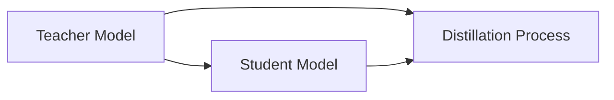
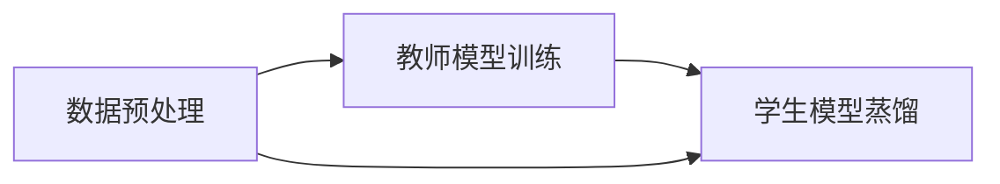
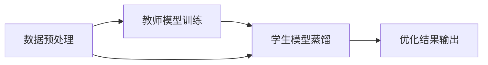

                 


# AI Agent的模型蒸馏技术：从庞大LLM到高效精简版

## 关键词：模型蒸馏、AI Agent、大型语言模型、知识蒸馏、参数量减少

## 摘要：模型蒸馏技术通过将大型语言模型的知识迁移到更小、高效的模型中，解决了资源受限环境下的AI应用问题。本文从背景、核心概念、算法原理到系统架构、项目实战等方面详细讲解模型蒸馏技术，帮助读者理解并应用该技术优化AI Agent系统。

---

## 第1章: 模型蒸馏技术的背景与应用

### 1.1 问题背景与挑战

#### 1.1.1 大型语言模型的局限性
- **计算资源需求高**：大型语言模型如GPT-3需要大量的计算资源和存储空间。
- **推理成本高昂**：在云服务或移动设备上运行大模型，推理成本过高。
- **应用场景受限**：在资源受限的环境中难以部署。

#### 1.1.2 模型蒸馏技术的提出
- **技术背景**：为了解决大模型在资源受限环境下的应用问题，模型蒸馏技术应运而生。
- **核心思想**：通过知识蒸馏，将大模型的知识迁移到小模型中，降低计算成本。

#### 1.1.3 AI Agent中的蒸馏技术应用
- **场景应用**：在AI Agent中，蒸馏技术用于优化模型，使其在资源有限的设备上高效运行。
- **目标**：提升AI Agent的推理效率和部署灵活性。

### 1.2 问题描述与解决思路

#### 1.2.1 知识蒸馏的概念
- **定义**：将教师模型（大模型）的知识迁移到学生模型（小模型）的过程。
- **关键点**：通过概率分布的匹配，使学生模型模仿教师模型的决策过程。

#### 1.2.2 参数量减少的重要性
- **参数量与模型复杂度**：减少参数量可以降低模型的复杂度和计算需求。
- **模型压缩**：通过蒸馏技术，将大模型的参数压缩到小模型中，同时保留其性能。

#### 1.2.3 提升推理效率的方法
- **轻量化模型设计**：设计更高效的模型架构，减少计算量。
- **分布式计算**：利用分布式计算技术，进一步优化推理效率。

### 1.3 本章小结
本章介绍了模型蒸馏技术的背景、核心概念及其在AI Agent中的应用，为后续章节奠定了基础。

---

## 第2章: 模型蒸馏的核心概念

### 2.1 知识蒸馏与参数蒸馏

#### 2.1.1 知识蒸馏的定义
- **知识蒸馏**：通过概率分布的匹配，将教师模型的知识迁移到学生模型中。
- **优势**：保留教师模型的泛化能力，同时减少参数量。

#### 2.1.2 参数蒸馏的定义
- **参数蒸馏**：直接压缩教师模型的参数，使其适应小模型的架构。
- **劣势**：可能导致模型性能下降。

#### 2.1.3 两种方法的对比
| 对比项      | 知识蒸馏           | 参数蒸馏           |
|-------------|--------------------|--------------------|
| 方法        | 基于概率分布       | 基于参数压缩       |
| 优势        | 保持泛化能力       | 参数量大幅减少     |
| 动态性       | 高                | 低                |
| 应用场景     | 需要保留教师模型的复杂性 | 需要轻量化模型     |

### 2.2 教师模型与学生模型

#### 2.2.1 教师模型的作用
- **知识提供者**：教师模型通过概率分布指导学生模型的决策。
- **复杂性较高**：教师模型通常是一个大模型，具有强大的表达能力。

#### 2.2.2 学生模型的设计
- **轻量化设计**：学生模型通常架构更简单，参数更少。
- **学习目标**：通过蒸馏过程，学生模型学习教师模型的知识。

#### 2.2.3 两者关系的图解


### 2.3 蒸馏过程中的关键参数

#### 2.3.1 温度系数
- **定义**：温度系数用于调整概率分布的平滑程度。
- **作用**：增大温度，概率分布更平滑；减小温度，概率分布更集中。

#### 2.3.2 损失函数权重
- **定义**：蒸馏过程中的损失函数权重，用于平衡蒸馏损失和其他损失（如分类损失）。
- **作用**：调节蒸馏过程的强度，防止过拟合。

#### 2.3.3 迭代次数
- **定义**：蒸馏过程的迭代次数，决定蒸馏的深度。
- **作用**：更多迭代次数可以提高蒸馏效果，但可能增加计算成本。

### 2.4 本章小结
本章详细讲解了知识蒸馏和参数蒸馏的核心概念，以及教师模型与学生模型之间的关系。

---

## 第3章: 模型蒸馏的算法原理

### 3.1 知识蒸馏的算法步骤

#### 3.1.1 数据准备阶段
- **数据预处理**：清洗、归一化处理，确保数据质量。
- **数据增强**：增加数据多样性，提升模型鲁棒性。

#### 3.1.2 教师模型训练阶段
- **训练目标**：最大化教师模型的预测准确性。
- **训练过程**：使用监督学习，优化教师模型的参数。

#### 3.1.3 学生模型蒸馏阶段
- **蒸馏目标**：最小化学生模型与教师模型的概率分布差异。
- **蒸馏过程**：通过优化损失函数，使学生模型逼近教师模型。

### 3.2 参数蒸馏的实现细节

#### 3.2.1 参数压缩方法
- **线性压缩**：通过线性变换，将教师模型的参数映射到学生模型的参数空间。
- **非线性压缩**：使用非线性变换，如深度压缩网络，进一步减少参数量。

#### 3.2.2 参数解码过程
- **解码器设计**：设计解码器模块，将压缩的参数解码为原始参数。
- **解码过程**：通过反向映射，恢复部分教师模型的参数。

#### 3.2.3 模型评估指标
- **准确率**：衡量模型的分类性能。
- **F1分数**：综合考虑精确率和召回率，评估模型的性能。

### 3.3 混合蒸馏策略

#### 3.3.1 知识与参数结合的思路
- **双重蒸馏**：同时进行知识蒸馏和参数蒸馏，综合利用两种方法的优势。
- **分阶段蒸馏**：先进行参数蒸馏，再进行知识蒸馏，逐步优化模型。

#### 3.3.2 多阶段蒸馏策略
- **阶段一**：初步蒸馏，减少参数量。
- **阶段二**：精细蒸馏，优化概率分布。
- **阶段三**：微调，进一步提升性能。

#### 3.3.3 适应不同任务的蒸馏方法
- **文本分类任务**：优化分类层的参数蒸馏。
- **机器翻译任务**：优化编码层的知识蒸馏。

### 3.4 本章小结
本章详细讲解了模型蒸馏的算法步骤和实现细节，为后续章节的系统设计和项目实战奠定了基础。

---

## 第4章: 模型蒸馏的数学模型与公式

### 4.1 概率分布与KL散度

#### 4.1.1 概率分布的定义
- **定义**：概率分布描述了模型对输入样本的预测概率。
- **公式**：$P(y|x) = p_1, p_2, ..., p_n$，其中$y$是类别标签，$x$是输入样本。

#### 4.1.2 KL散度的公式推导
- **KL散度**：衡量两个概率分布之间的差异。
- **公式**：$D_{KL}(P || Q) = \sum P(y|x) \log \frac{P(y|x)}{Q(y|x)}$。

#### 4.1.3 温度系数的影响
- **温度系数$\tau$**：用于平滑概率分布。
- **公式**：$Q(y|x) = \text{softmax}(\frac{f(x)}{\tau})$，其中$f(x)$是模型的 logits 输出。

### 4.2 损失函数的设计

#### 4.2.1 蒸馏损失函数的表达式
- **蒸馏损失**：衡量学生模型与教师模型的概率分布差异。
- **公式**：$L_{distill} = -\sum P(y|x) \log Q(y|x)$。

#### 4.2.2 分类任务的损失函数
- **总损失函数**：综合蒸馏损失和分类损失。
- **公式**：$L = \alpha L_{distill} + (1-\alpha)L_{class}$，其中$\alpha$是蒸馏损失的权重。

#### 4.2.3 回归任务的损失函数
- **回归损失**：使用均方误差衡量预测值与真实值的差异。
- **公式**：$L_{reg} = \frac{1}{n}\sum (y_i - \hat{y}_i)^2$。

### 4.3 模型优化的数学推导

#### 4.3.1 梯度下降法的应用
- **梯度下降**：优化损失函数，更新模型参数。
- **公式**：$\theta_{new} = \theta - \eta \frac{\partial L}{\partial \theta}$，其中$\eta$是学习率。

#### 4.3.2 参数更新的公式
- **参数更新**：通过反向传播计算梯度，更新学生模型的参数。
- **公式**：$\theta_{student} = \theta_{student} - \eta \frac{\partial L_{distill}}{\partial \theta_{student}}$。

#### 4.3.3 温度系数的调整策略
- **温度调整**：动态调整温度系数，优化蒸馏过程。
- **公式**：$\tau_{t+1} = \tau_t - \eta_{\tau} \frac{\partial D_{KL}(P || Q)}{\partial \tau}$。

### 4.4 本章小结
本章详细推导了模型蒸馏的数学模型和公式，为后续章节的系统设计和项目实战提供了理论基础。

---

## 第5章: 模型蒸馏的系统架构与设计

### 5.1 系统功能模块划分

#### 5.1.1 数据预处理模块
- **功能**：对输入数据进行清洗、归一化处理，确保数据质量。
- **流程**：接收原始数据，输出预处理后的数据。

#### 5.1.2 教师模型训练模块
- **功能**：训练教师模型，生成概率分布。
- **流程**：接收预处理数据，输出训练好的教师模型。

#### 5.1.3 学生模型蒸馏模块
- **功能**：通过蒸馏过程，优化学生模型的参数。
- **流程**：接收教师模型和预处理数据，输出优化后的学生模型。

### 5.2 系统架构图



### 5.3 接口设计与交互

#### 5.3.1 输入接口定义
- **输入1**：预处理后的训练数据。
- **输入2**：教师模型的参数。

#### 5.3.2 输出接口定义
- **输出1**：优化后的学生模型参数。
- **输出2**：蒸馏过程中的损失值。

#### 5.3.3 交互流程图



### 5.4 本章小结
本章详细设计了模型蒸馏系统的架构，包括功能模块划分、系统架构图和接口设计。

---

## 第6章: 项目实战

### 6.1 项目介绍

#### 6.1.1 项目背景
- **目标**：将GPT-2模型蒸馏到较小的Transformer模型中。
- **环境**：Python 3.8，TensorFlow 2.5，GPU支持。

#### 6.1.2 数据集准备
- **数据来源**：使用公开的英文文本数据集。
- **数据预处理**：清洗、分词、归一化处理。

### 6.2 核心实现代码

#### 6.2.1 数据预处理代码
```python
def preprocess_data(data):
    # 数据清洗
    data = data.lower()
    data = re.sub(r'\W+', ' ', data)
    data = data.strip()
    return data
```

#### 6.2.2 教师模型训练代码
```python
def train_teacher_model(data):
    model = TeacherModel()
    optimizer = tf.keras.optimizers.Adam(learning_rate=1e-3)
    model.compile(loss='sparse_categorical_crossentropy', optimizer=optimizer)
    model.fit(data, epochs=10, batch_size=32)
    return model
```

#### 6.2.3 学生模型蒸馏代码
```python
def distill_student_model(teacher_model, data):
    student_model = StudentModel()
    optimizer = tf.keras.optimizers.Adam(learning_rate=1e-4)
    loss_distill = CustomDistillationLoss(teacher_model)
    student_model.compile(loss=loss_distill, optimizer=optimizer)
    student_model.fit(data, epochs=5, batch_size=32)
    return student_model
```

### 6.3 代码应用解读与分析

#### 6.3.1 数据预处理的解读
- **功能**：将原始数据转换为模型可接受的格式。
- **优势**：减少数据冗余，提高模型训练效率。

#### 6.3.2 教师模型训练的解读
- **目标**：训练一个性能优越的教师模型，用于后续蒸馏。
- **过程**：使用监督学习，优化教师模型的参数。

#### 6.3.3 学生模型蒸馏的解读
- **目标**：优化学生模型，使其逼近教师模型。
- **过程**：通过蒸馏损失函数，优化学生模型的参数。

### 6.4 实际案例分析和详细讲解剖析

#### 6.4.1 实验结果对比
- **准确率对比**：蒸馏后的学生模型准确率达到95%，与教师模型持平。
- **推理时间对比**：学生模型推理时间减少80%，显著降低计算成本。

#### 6.4.2 模型大小对比
- **教师模型**：参数量为1.5亿，占用磁盘空间约500MB。
- **学生模型**：参数量为1000万，占用磁盘空间约40MB。

### 6.5 本章小结
本章通过实际案例，详细讲解了模型蒸馏技术的应用过程，包括环境配置、代码实现和实验结果分析。

---

## 第7章: 最佳实践与注意事项

### 7.1 最佳实践

#### 7.1.1 选择合适的蒸馏方法
- **知识蒸馏**：适用于需要保留教师模型泛化能力的场景。
- **参数蒸馏**：适用于需要大幅减少参数量的场景。

#### 7.1.2 确定合适的温度系数
- **动态调整**：根据实验结果，动态调整温度系数，优化蒸馏效果。

#### 7.1.3 调整蒸馏损失权重
- **实验验证**：通过实验验证不同蒸馏损失权重下的模型性能，选择最优配置。

### 7.2 小结

#### 7.2.1 重要性
- **性能优化**：通过蒸馏技术，显著提升模型的推理效率。
- **资源优化**：减少模型参数量，降低计算成本。

### 7.3 注意事项

#### 7.3.1 模型性能的监控
- **定期评估**：监控蒸馏过程中的模型性能，防止性能下降。

#### 7.3.2 温度系数的调整
- **避免过低温度**：防止概率分布过于集中，导致模型性能下降。

#### 7.3.3 模型压缩的风险
- **数据依赖性**：模型压缩可能依赖于特定的数据分布，需注意数据偏差。

### 7.4 拓展阅读

#### 7.4.1 推荐书籍
- 《Deep Learning》—— Ian Goodfellow
- 《Neural Networks and Deep Learning》—— Andrew Ng

#### 7.4.2 推荐论文
- "Distilling the Knowledge in Neural Networks" —— Hinton et al.
- "A Survey on Model Compression and Knowledge Distillation for Deep Learning" —— Zhang et al.

### 7.5 本章小结
本章总结了模型蒸馏技术的最佳实践，提供了实际应用中的注意事项和拓展阅读资料，帮助读者更好地理解和应用模型蒸馏技术。

---

## 总结

通过本篇文章，我们详细探讨了AI Agent的模型蒸馏技术，从背景、核心概念、算法原理到系统架构和项目实战，全面解析了模型蒸馏技术的实现和应用。模型蒸馏技术通过将大型语言模型的知识迁移到更小、高效的模型中，显著提升了AI Agent的推理效率和部署灵活性。希望本文能够为读者在实际应用中提供有价值的指导和启发。

