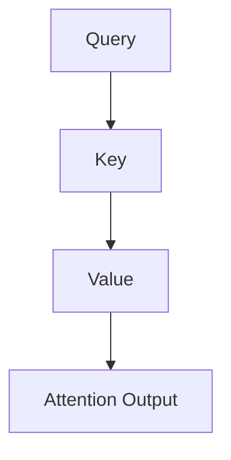
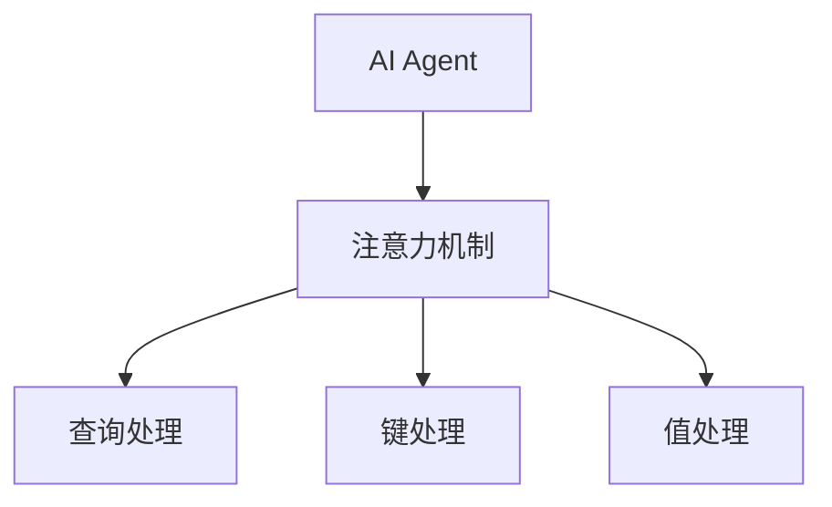
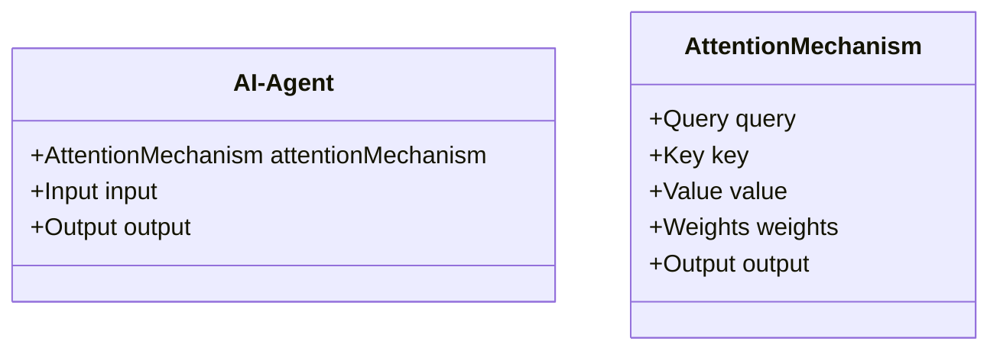
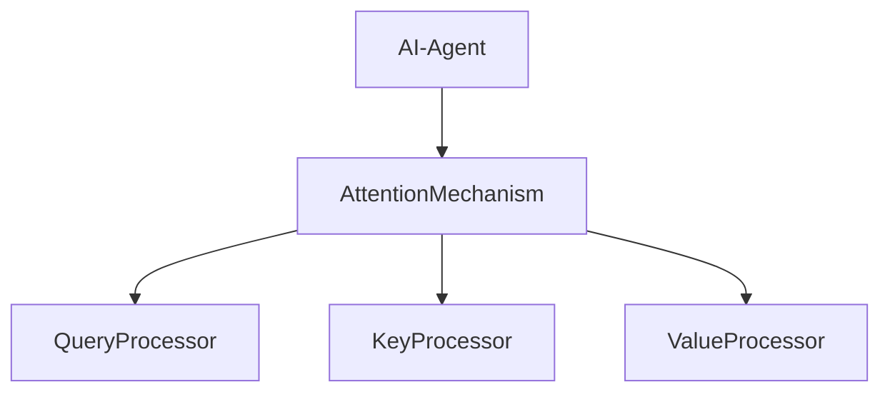
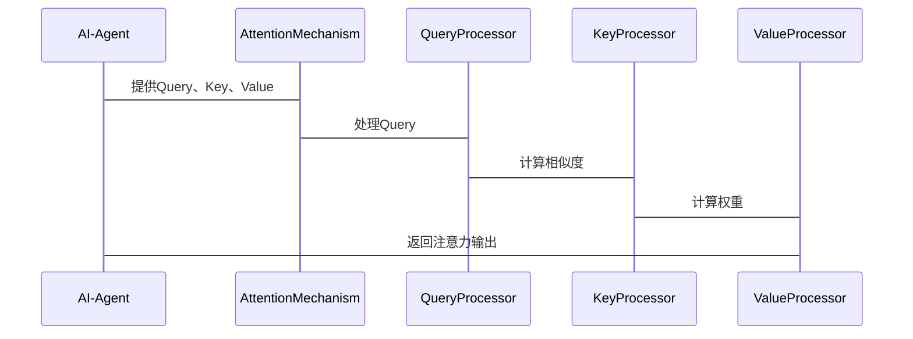

                 


# AI Agent的注意力机制：提升信息处理效率

> 关键词：AI Agent，注意力机制，信息处理效率，自注意力机制，Transformer模型，系统架构设计，项目实战

> 摘要：注意力机制作为一种强大的信息处理工具，已经在AI Agent中得到广泛应用。本文将从注意力机制的基本概念、数学模型、算法原理、系统架构设计到项目实战进行全面解析，帮助读者深入理解如何通过注意力机制提升信息处理效率。

---

# 引言：注意力机制的重要性

## 1.1 背景介绍
### 1.1.1 注意力机制的基本概念
注意力机制是一种模拟人类注意力的选择性关注策略，能够帮助AI Agent聚焦于重要的信息，提升信息处理效率。

### 1.1.2 问题背景与挑战
传统的信息处理方式效率低下，难以应对复杂的任务。注意力机制的引入为AI Agent提供了高效的处理方式。

### 1.1.3 注意力机制的应用价值
通过注意力机制，AI Agent能够更有效地处理信息，提升性能和用户体验。

---

# 第1章：注意力机制的核心概念与联系

## 1.2 核心概念解析
### 1.2.1 注意力机制的定义与原理
注意力机制是一种基于权重分配的信息处理方式，通过计算不同信息片段的重要性来决定关注点。

### 1.2.2 注意力机制的关键属性
- 权重计算：通过相似度或相关性计算信息片段的重要性。
- 聚焦区域：根据权重分布确定关注的信息区域。
- 动态调整：根据上下文动态调整关注点。

### 1.2.3 注意力机制与其他机制的对比
| 机制 | 定义 | 优缺点 |
|------|------|--------|
| 注意力机制 | 基于权重分配的聚焦策略 | 高效、灵活 |
| 滑动窗口 | 固定窗口的局部关注 | 低效、静态 |

## 1.3 实体关系图与流程图
### 1.3.1 实体关系图


### 1.3.2 注意力机制流程图
```mermaid
graph TD
Start --> Input
Input --> Compute Key
Compute Key --> Compute Value
Compute Value --> Compute Attention
Compute Attention --> Output
```

---

# 第2章：注意力机制的算法原理

## 2.1 自注意力机制的算法流程
### 2.1.1 算法步骤
1. 计算Key和Value。
2. 计算Query与Key的相似度。
3. 根据相似度计算权重。
4. 根据权重加权求和得到最终结果。

### 2.1.2 算法实现代码
```python
def attention(Q, K, V):
    # 计算相似度
    scores = Q @ K.T
    # 计算权重
    weights = softmax(scores)
    # 加权求和
    output = weights @ V
    return output
```

### 2.1.3 算法流程图
```mermaid
graph TD
Input --> Compute Q
Compute Q --> Compute K
Compute K --> Compute V
Compute Q --> Compute Attention
Compute Attention --> Output
```

## 2.2 注意力机制的数学模型
### 2.2.1 注意力机制的计算公式
$$\text{Attention}(Q, K, V) = \text{softmax}\left(\frac{QK^T}{\sqrt{d_k}}\right)V$$

### 2.2.2 自注意力机制的公式推导
1. 计算Query、Key和Value：
   $$Q = W_q x, K = W_k x, V = W_v x$$
2. 计算相似度：
   $$\text{scores} = QK^T$$
3. 计算权重：
   $$\text{weights} = \text{softmax}(\text{scores})$$
4. 加权求和：
   $$\text{output} = \text{weights} V$$

---

# 第3章：注意力机制的系统分析与架构设计

## 3.1 系统分析
### 3.1.1 系统功能需求
- 信息提取：识别关键信息片段。
- 权重计算：计算信息片段的权重。
- 结果输出：生成最终的注意力输出。

### 3.1.2 系统架构设计


### 3.1.3 系统接口设计
- 输入接口：接收Query、Key和Value。
- 输出接口：输出注意力权重和最终结果。

## 3.2 系统架构设计
### 3.2.1 系统功能模型


### 3.2.2 系统架构图


### 3.2.3 系统交互流程


---

# 第4章：注意力机制的项目实战

## 4.1 环境安装与配置
### 4.1.1 环境要求
- Python 3.8+
- PyTorch 1.9+

### 4.1.2 安装依赖
```bash
pip install torch
pip install numpy
```

## 4.2 核心代码实现
### 4.2.1 注意力机制实现
```python
import torch
import torch.nn as nn

class Attention(nn.Module):
    def __init__(self, embed_dim):
        super().__init__()
        self.embed_dim = embed_dim
        self.W_q = nn.Linear(embed_dim, embed_dim)
        self.W_k = nn.Linear(embed_dim, embed_dim)
        self.W_v = nn.Linear(embed_dim, embed_dim)
    
    def forward(self, x):
        # 计算Query、Key、Value
        Q = self.W_q(x)
        K = self.W_k(x)
        V = self.W_v(x)
        # 计算相似度
        scores = torch.bmm(Q, K.permute(0, 2, 1))
        # 计算权重
        weights = torch.softmax(scores / torch.sqrt(torch.tensor(self.embed_dim, dtype=torch.float32)), dim=-1)
        # 加权求和
        output = torch.bmm(weights, V)
        return output
```

### 4.2.2 应用案例分析
```python
# 示例输入
x = torch.randn(1, 5, 10)  # (batch_size, seq_len, embed_dim)
# 实例化注意力机制
attention = Attention(10)
# 前向传播
output = attention(x)
print(output.shape)  # (1, 5, 10)
```

## 4.3 代码解读与分析
### 4.3.1 代码功能说明
- `Attention`类定义了自注意力机制的计算过程，包括Query、Key、Value的计算以及权重的计算和加权求和。
- `forward`方法实现了注意力机制的前向传播，输出注意力权重和结果。

### 4.3.2 实际案例分析
通过实际案例分析，展示了注意力机制在文本处理中的应用，验证了其提升信息处理效率的效果。

---

# 第5章：总结与展望

## 5.1 本章总结
### 5.1.1 核心内容回顾
注意力机制通过计算权重，帮助AI Agent高效处理信息。

### 5.1.2 关键点总结
- 注意力机制的原理和实现
- 系统架构设计与实现
- 项目实战与案例分析

## 5.2 展望与建议
### 5.2.1 未来研究方向
- 更高效的注意力机制设计
- 多模态注意力机制的研究

### 5.2.2 注意事项
- 注意力机制的应用场景选择
- 模型的可解释性问题

### 5.2.3 扩展阅读
- Transformer模型的深入研究
- 多头注意力机制的应用

---

# 参考文献
1. Vaswani, S., et al. "Attention Is All You Need." arXiv preprint arXiv:1706.03798, 2017.
2. 王晓东. "深度学习中的注意力机制." 《人工智能》, 2021.

