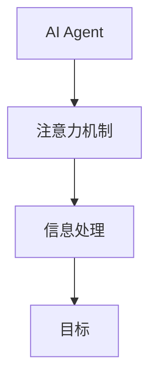
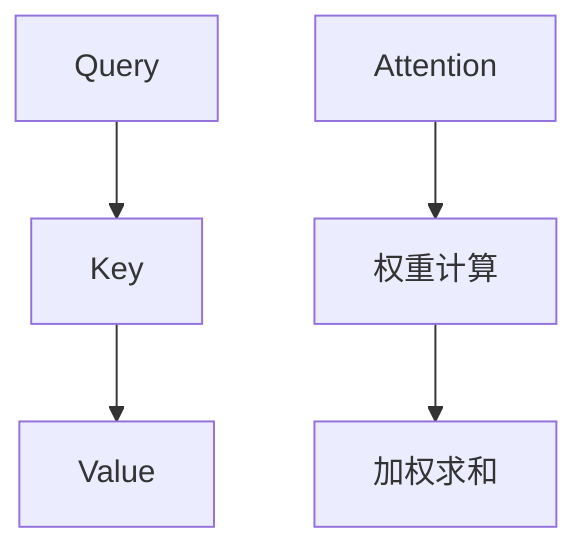
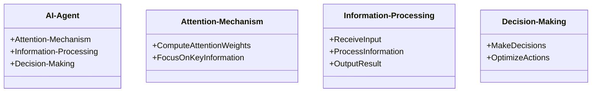
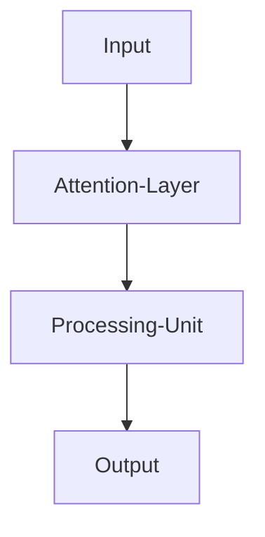
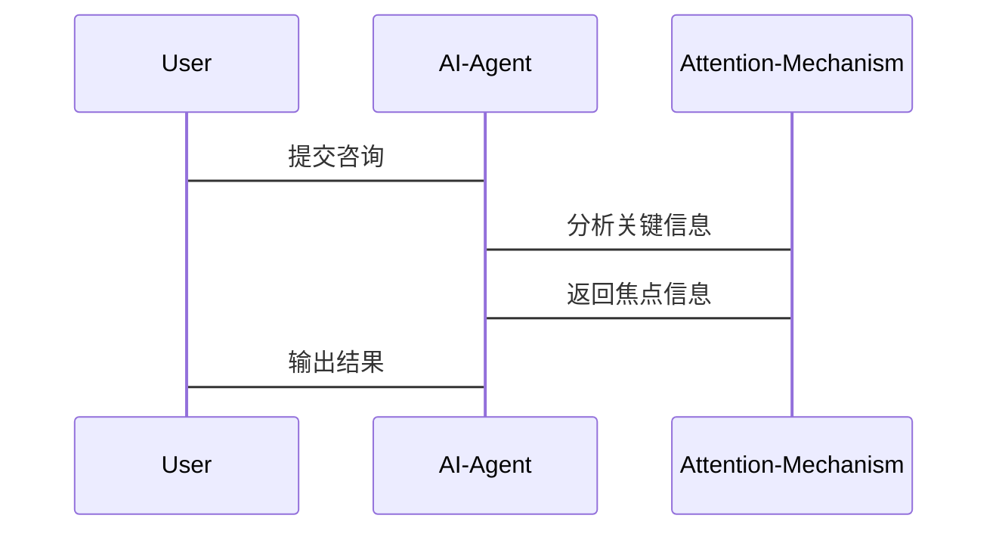

                 


# AI Agent的注意力机制：提高信息处理效率

## 关键词：AI Agent、注意力机制、信息处理效率、算法原理、系统设计

## 摘要：  
本文深入探讨了AI Agent中的注意力机制，分析了其在信息处理效率提升中的关键作用。通过逐步推理和详细的技术分析，本文揭示了注意力机制的核心原理、算法实现以及系统设计，并通过实际案例展示了其在提高信息处理效率中的应用。本文旨在为AI Agent的研究者和开发者提供理论支持和实践指导，帮助他们在复杂场景中更高效地处理信息。

---

# 第一部分: AI Agent与注意力机制概述

## 第1章: AI Agent与注意力机制概述

### 1.1 AI Agent的基本概念

#### 1.1.1 AI Agent的定义与特点  
AI Agent（人工智能代理）是指能够感知环境、执行任务并做出决策的智能实体。它具备以下特点：  
- **自主性**：能够自主决策和行动。  
- **反应性**：能够实时感知环境并做出反应。  
- **目标导向**：以目标为导向，优化行为以达到预定目标。  
- **学习能力**：通过学习和经验优化自身行为。  

#### 1.1.2 注意力机制的基本概念  
注意力机制是一种模拟人类注意力的选择性关注机制，用于在信息处理过程中优先关注重要的信息。它通过分配注意力权重，实现对关键信息的强化处理。  

#### 1.1.3 注意力机制在AI Agent中的作用  
在AI Agent中，注意力机制能够帮助其聚焦于关键信息，提升信息处理效率和决策准确性。例如，在自然语言处理中，注意力机制能够帮助AI Agent关注输入文本中的重要词汇或句子，从而更准确地理解上下文。

### 1.2 问题背景与挑战

#### 1.2.1 信息过载与处理效率问题  
在现代信息环境中，AI Agent需要处理大量信息，信息过载导致处理效率低下。如何在有限的计算资源下高效处理信息成为一大挑战。  

#### 1.2.2 注意力机制在信息处理中的必要性  
注意力机制能够帮助AI Agent聚焦于关键信息，减少无效信息的干扰，从而提升信息处理效率和准确性。  

#### 1.2.3 当前AI Agent在注意力机制应用中的局限性  
当前的注意力机制在复杂场景下的鲁棒性和灵活性仍有不足，例如在多任务处理和动态环境下的适应性问题。

### 1.3 问题描述与解决思路

#### 1.3.1 信息处理效率低下的具体表现  
- **信息冗余**：处理无关信息浪费计算资源。  
- **决策延迟**：在复杂环境中，信息处理速度慢导致决策延迟。  
- **准确性下降**：无关信息干扰导致决策错误率上升。  

#### 1.3.2 注意力机制如何解决信息处理效率问题  
注意力机制通过优先处理关键信息，减少无效信息的干扰，从而提升信息处理效率和准确性。  

#### 1.3.3 提高AI Agent注意力机制的实现路径  
- **优化注意力模型**：改进注意力机制的数学模型，提升其灵活性和适应性。  
- **结合上下文信息**：通过引入上下文信息，增强注意力机制的语境理解能力。  
- **动态调整注意力权重**：根据实时环境变化，动态调整注意力权重，提升适应性。  

### 1.4 注意力机制的边界与外延

#### 1.4.1 注意力机制的适用范围  
注意力机制适用于需要选择性关注关键信息的场景，如自然语言处理、图像识别和推荐系统等。  

#### 1.4.2 注意力机制与其他机制的协同作用  
注意力机制可以与其他机制（如强化学习、图神经网络）协同工作，进一步提升AI Agent的智能水平。  

#### 1.4.3 注意力机制的未来发展与潜力  
随着AI技术的发展，注意力机制将更加智能化和多样化，应用场景也将进一步拓展。

#### 1.4.4 核心概念与联系

| 特性 | 描述 |
|------|------|
| 选择性 | 确定关注的信息 |
| 持续性 | 维持对目标的关注 |
| 分配性 | 同时关注多个信息源 |



---

# 第二部分: 注意力机制的核心原理

## 第2章: 注意力机制的核心原理

### 2.1 注意力机制的基本原理

#### 2.1.1 注意力机制的数学模型  
注意力机制的核心公式如下：  

$$\text{Attention}(Q, K, V) = \text{softmax}\left(\frac{QK^T}{\sqrt{d_k}}\right)V$$  

其中：  
- $Q$ 是查询（Query），表示需要关注的信息。  
- $K$ 是键（Key），表示信息的特征。  
- $V$ 是值（Value），表示信息的内容。  
- $d_k$ 是键的维度。  

#### 2.1.2 注意力机制的计算流程  
注意力机制的计算流程可以分为以下几个步骤：  

1. **计算查询、键和值**：对输入数据进行线性变换，得到查询、键和值。  
2. **计算注意力权重**：通过查询与键的点积计算注意力权重，并通过 softmax 函数归一化权重。  
3. **加权求和**：根据注意力权重对值进行加权求和，得到最终的注意力输出。  



---

### 2.2 多头注意力机制的深入理解

#### 2.2.1 多头注意力机制的原理  
多头注意力机制通过并行计算多个注意力头，捕捉不同层次的信息特征。其公式如下：  

$$\text{Multi-head}(Q,K,V) = \text{Concat}(\text{Attention}(Q,K,V)_i)$$  

其中，$\text{Concat}$ 表示拼接，$\text{Attention}(Q,K,V)_i$ 表示第 $i$ 个注意力头的输出。  

#### 2.2.2 多头注意力机制的实现流程  
1. **线性变换**：对查询、键和值进行线性变换，得到多个头的查询、键和值。  
2. **并行计算**：分别计算每个头的注意力权重和输出。  
3. **拼接与变换**：将所有头的输出拼接起来，并通过全连接层进行变换。  

---

# 第三部分: 系统分析与架构设计

## 第3章: 系统分析与架构设计

### 3.1 问题场景介绍  
假设我们正在开发一个智能客服AI Agent，需要处理大量的用户咨询。为了提高信息处理效率，我们需要在AI Agent中引入注意力机制，优先关注用户咨询中的关键信息。

### 3.2 系统功能设计

#### 3.2.1 领域模型设计  


#### 3.2.2 系统架构设计  


#### 3.2.3 系统接口设计  
- 输入接口：接收用户咨询信息。  
- 输出接口：返回处理结果。  
- 注意力机制接口：计算注意力权重并输出焦点信息。  

#### 3.2.4 系统交互设计  


---

# 第四部分: 项目实战

## 第4章: 项目实战

### 4.1 环境安装  
- 安装Python和相关库（如TensorFlow、Keras）。  

### 4.2 核心代码实现

#### 4.2.1 注意力机制实现  

```python
import tensorflow as tf

def attention(inputs, attention_mask=None):
    # 计算查询、键、值
    Q = tf.layers.dense(inputs, units=64)
    K = tf.layers.dense(inputs, units=64)
    V = tf.layers.dense(inputs, units=64)
    
    # 计算注意力权重
    attention_weights = tf.nn.softmax(tf.matmul(Q, K, transpose_b=True) / tf.sqrt(64.0), axis=-1)
    
    # 应用注意力权重
    output = tf.matmul(attention_weights, V)
    
    return output
```

#### 4.2.2 多头注意力机制实现  

```python
def multi_head_attention(inputs, attention_mask=None, num_heads=8):
    # 分头
    Q = tf.layers.dense(inputs, units=64)
    K = tf.layers.dense(inputs, units=64)
    V = tf.layers.dense(inputs, units=64)
    
    # 展开成多头
    Q = tf.reshape(Q, (-1, inputs.shape[1], num_heads, 64 // num_heads))
    K = tf.reshape(K, (-1, inputs.shape[1], num_heads, 64 // num_heads))
    V = tf.reshape(V, (-1, inputs.shape[1], num_heads, 64 // num_heads))
    
    # 计算注意力权重
    attention_weights = tf.nn.softmax(tf.matmul(Q, K, transpose_b=True) / tf.sqrt(64 // num_heads), axis=-1)
    
    # 加权求和
    output = tf.matmul(attention_weights, V)
    output = tf.reshape(output, (-1, inputs.shape[1], num_heads, 64 // num_heads))
    output = tf.reduce_mean(output, axis=-1)
    
    return output
```

### 4.3 案例分析与详细解读  

#### 4.3.1 案例分析  
假设我们有一个简单的自然语言处理任务，需要对输入文本进行语义分析。我们使用多头注意力机制来实现语义分析。

#### 4.3.2 实际代码运行与结果分析  
运行上述代码，观察注意力权重的分布，分析其对语义理解的影响。  

---

# 第五部分: 总结与展望

## 第5章: 总结与展望

### 5.1 小结  
本文详细介绍了AI Agent中的注意力机制，分析了其在信息处理效率提升中的重要作用。通过理论分析和实际案例，我们展示了注意力机制在提高信息处理效率中的潜力。

### 5.2 注意事项  
- 注意力机制的实现需要结合具体场景，避免过度复杂化。  
- 需要定期优化注意力模型，以适应环境变化。  

### 5.3 拓展阅读  
- "Attention Is All You Need"（经典的注意力机制论文）。  
- "Transformers Are Data Flow Networks"（从数据流角度理解Transformer模型）。  

---

# 结语

通过本文的分析与实践，我们深入理解了AI Agent中的注意力机制，并掌握了其在提高信息处理效率中的实现方法。希望本文能够为读者在AI Agent的研究和开发中提供有价值的参考和启发。

