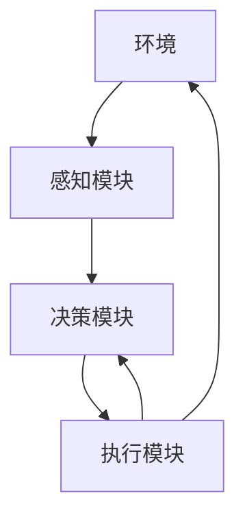

                 


# AI Agent的深度强化学习实现与优化

> 关键词：AI Agent, 深度强化学习, 算法优化, 系统架构, 实战案例

> 摘要：本文详细探讨了AI Agent在深度强化学习中的实现与优化。从AI Agent的基本概念到深度强化学习的核心算法，从系统架构设计到实际项目实战，本文为读者提供了全面的指导。通过分析多种算法原理、系统架构设计和优化策略，帮助读者深入理解AI Agent的实现过程，并通过具体案例展示如何优化AI Agent的性能。

---

# 第一部分: AI Agent的深度强化学习背景与基础

---

# 第1章: AI Agent与深度强化学习概述

## 1.1 AI Agent的基本概念

### 1.1.1 AI Agent的定义与特点

AI Agent（人工智能代理）是指能够感知环境并采取行动以实现目标的智能实体。与传统程序不同，AI Agent具有以下特点：

- **自主性**：AI Agent能够在没有外部干预的情况下自主决策。
- **反应性**：能够实时感知环境并做出反应。
- **目标导向性**：通过优化目标函数来实现特定目标。
- **学习能力**：能够通过与环境的交互不断优化自身行为。

### 1.1.2 AI Agent的分类与应用场景

AI Agent可以根据功能和应用场景分为以下几类：

1. **简单反射型Agent**：基于当前状态做出反应，不依赖历史信息。
2. **基于模型的反射型Agent**：维护环境的状态模型，并基于模型做出决策。
3. **目标驱动型Agent**：通过优化目标函数来选择最优动作。
4. **效用驱动型Agent**：通过最大化效用函数来实现目标。

AI Agent在多个领域有广泛应用，例如：
- **游戏AI**：在游戏环境中进行决策和策略优化。
- **机器人控制**：实现自主机器人行为控制。
- **智能推荐系统**：根据用户行为推荐最优内容。

### 1.1.3 深度强化学习与AI Agent的关系

深度强化学习（Deep Reinforcement Learning, DRL）是AI Agent实现的核心技术之一。通过深度强化学习，AI Agent能够从与环境的交互中学习最优策略。深度强化学习结合了深度学习的强大特征提取能力与强化学习的策略优化能力，使得AI Agent能够在复杂环境中实现高效决策。

---

## 1.2 深度强化学习的基本原理

### 1.2.1 强化学习的定义与核心概念

强化学习（Reinforcement Learning, RL）是一种通过试错方法来优化决策模型的技术。其核心概念包括：
- **状态（State）**：环境的当前情况。
- **动作（Action）**：AI Agent在给定状态下的行为。
- **奖励（Reward）**：环境对AI Agent动作的反馈，用于指导优化方向。
- **策略（Policy）**：AI Agent选择动作的概率分布。
- **值函数（Value Function）**：评估状态或动作-状态对的价值。

### 1.2.2 深度强化学习的优势与挑战

深度强化学习的优势：
- **强大的特征提取能力**：通过深度神经网络，能够自动提取高维状态空间的特征。
- **端到端学习**：可以直接从原始输入数据中学习策略，无需手动特征工程。
- **处理复杂任务**：能够处理高维、非线性、动态变化的复杂环境。

深度强化学习的挑战：
- **训练效率低**：需要大量交互数据才能收敛。
- **样本稀疏性**：在某些环境中，奖励信号可能非常稀疏。
- **过拟合风险**：在某些情况下，模型可能过于依赖训练数据，导致泛化能力差。

### 1.2.3 深度强化学习与传统强化学习的区别

| 特性 | 传统强化学习 | 深度强化学习 |
|------|--------------|--------------|
| 状态表示 | 离散或低维 | 高维或连续 |
| 动作选择 | 基于预定义策略 | 基于深度神经网络 |
| 特征工程 | 手动设计 | 自动提取 |
| 适用场景 | 简单环境 | 复杂环境 |

---

## 1.3 AI Agent在深度强化学习中的应用

### 1.3.1 游戏AI的实现

在游戏环境中，AI Agent可以通过深度强化学习实现最优策略。例如，在经典游戏《贪吃蛇》中，AI Agent可以通过强化学习不断优化自己的移动策略，以最大化得分。

### 1.3.2 机器人控制的应用

在机器人控制领域，深度强化学习可以帮助机器人在动态环境中实现自主决策。例如，在工业机器人中，AI Agent可以通过强化学习优化抓取和操作路径。

### 1.3.3 自动交易系统的案例

在金融领域，AI Agent可以通过深度强化学习实现自动交易系统。通过分析市场数据，AI Agent可以自动选择最优的买卖时机，从而实现收益最大化。

---

## 1.4 本章小结

本章介绍了AI Agent的基本概念、分类以及深度强化学习的核心原理。通过对比传统强化学习与深度强化学习的差异，我们理解了深度强化学习在AI Agent实现中的优势。同时，通过具体案例展示了AI Agent在游戏、机器人控制和自动交易等领域的广泛应用。

---

# 第二部分: 深度强化学习的核心算法与数学模型

---

# 第2章: 深度强化学习的算法原理

## 2.1 Q-learning算法

### 2.1.1 Q-learning的基本原理

Q-learning是一种基于值函数的强化学习算法。其核心思想是通过更新状态-动作对的Q值来优化策略。Q值的更新公式如下：

$$ Q(s, a) = Q(s, a) + \alpha [r + \gamma \max_{a'} Q(s', a') - Q(s, a)] $$

其中：
- $\alpha$ 是学习率。
- $\gamma$ 是折扣因子。

### 2.1.2 Q-learning的数学模型

Q-learning的数学模型可以表示为：

$$ Q(s, a) = r + \gamma \max_{a'} Q(s', a') $$

其中，$s$ 是当前状态，$a$ 是当前动作，$r$ 是奖励，$s'$ 是下一个状态。

### 2.1.3 Q-learning的优缺点

- **优点**：
  - 简单易实现。
  - 离线学习，不需要实时环境反馈。
- **缺点**：
  - 无法处理高维状态空间。
  - 对策略的依赖性较强。

---

### 2.1.4 Q-learning的实战代码示例

```python
import numpy as np

class QLearning:
    def __init__(self, state_space, action_space, alpha=0.1, gamma=0.9):
        self.q_table = np.zeros((state_space, action_space))
        self.alpha = alpha
        self.gamma = gamma

    def choose_action(self, state, epsilon=0.1):
        if np.random.random() < epsilon:
            return np.random.randint(0, self.q_table.shape[1])
        else:
            return np.argmax(self.q_table[state])

    def update_q_table(self, state, action, reward, next_state):
        self.q_table[state, action] = self.q_table[state, action] + self.alpha * (reward + self.gamma * np.max(self.q_table[next_state]) - self.q_table[state, action])
```

---

## 2.2 Deep Q-Network (DQN)算法

### 2.2.1 DQN的算法流程

DQN算法的基本流程如下：

1. **环境交互**：AI Agent与环境交互，获取当前状态和动作。
2. **经验回放**：将交互经验存储在经验回放池中。
3. **网络更新**：随机采样经验，更新深度Q网络的参数。
4. **策略优化**：通过最大化Q值来优化策略。

### 2.2.2 DQN的网络结构

DQN的网络结构通常包括两个神经网络：
- **主网络**：用于评估当前策略的Q值。
- **目标网络**：用于稳定训练过程，定期更新主网络的参数。

### 2.2.3 DQN的训练过程

DQN的训练过程可以用以下公式表示：

$$ Q(s, a) = r + \gamma \max_{a'} Q_{\theta}(s', a') $$

其中，$\theta$ 是目标网络的参数。

### 2.2.4 DQN的实战代码示例

```python
import torch
import torch.nn as nn
import torch.optim as optim

class DQN:
    def __init__(self, state_space, action_space, hidden_size=64, alpha=0.001):
        self.state_space = state_space
        self.action_space = action_space
        self.hidden_size = hidden_size
        self.alpha = alpha

        self.main_network = nn.Sequential(
            nn.Linear(state_space, hidden_size),
            nn.ReLU(),
            nn.Linear(hidden_size, action_space)
        )
        self.target_network = nn.Sequential(
            nn.Linear(state_space, hidden_size),
            nn.ReLU(),
            nn.Linear(hidden_size, action_space)
        )
        self.optimizer = optim.Adam(self.main_network.parameters(), lr=alpha)

    def choose_action(self, state, epsilon=0.1):
        if np.random.random() < epsilon:
            return np.random.randint(0, self.action_space)
        else:
            with torch.no_grad():
                q_values = self.main_network(torch.FloatTensor([state]))
                return torch.argmax(q_values).item()

    def update_network(self, batch_states, batch_actions, batch_rewards, batch_next_states):
        current_q = self.main_network(torch.FloatTensor(batch_states))
        current_q = current_q.gather(1, torch.LongTensor(batch_actions))
        next_q = self.target_network(torch.FloatTensor(batch_next_states))
        max_next_q = torch.max(next_q, dim=1)[0]
        target_q = torch.FloatTensor(batch_rewards) + self.gamma * max_next_q
        loss = nn.MSELoss()(current_q.squeeze(), target_q)
        self.optimizer.zero_grad()
        loss.backward()
        self.optimizer.step()
```

---

## 2.3 Policy Gradient方法

### 2.3.1 Policy Gradient的基本原理

Policy Gradient是一种基于策略的强化学习方法。其核心思想是通过优化策略的参数，直接最大化期望奖励。Policy Gradient的数学模型可以表示为：

$$ \nabla \theta = \mathbb{E}_{\tau \sim \pi_\theta} [\nabla \log \pi_\theta(a|s) Q(s,a)] $$

其中，$\theta$ 是策略参数，$\pi_\theta(a|s)$ 是策略分布。

### 2.3.2 Policy Gradient的数学模型

Policy Gradient的数学模型可以表示为：

$$ J(\theta) = \mathbb{E}_{\tau \sim \pi_\theta} [R(\tau)] $$

其中，$R(\tau)$ 是轨迹的总奖励。

### 2.3.3 Policy Gradient的优缺点

- **优点**：
  - 直接优化策略，避免了值函数的计算。
  - 适用于连续动作空间。
- **缺点**：
  - 收敛速度较慢。
  - 对策略的稳定性要求较高。

### 2.3.4 Policy Gradient的实战代码示例

```python
import torch
import torch.nn as nn
import torch.optim as optim

class PolicyGradient:
    def __init__(self, state_space, action_space, hidden_size=64, alpha=0.001):
        self.state_space = state_space
        self.action_space = action_space
        self.hidden_size = hidden_size
        self.alpha = alpha

        self.policy_network = nn.Sequential(
            nn.Linear(state_space, hidden_size),
            nn.ReLU(),
            nn.Linear(hidden_size, action_space)
        )
        self.optimizer = optim.Adam(self.policy_network.parameters(), lr=alpha)

    def choose_action(self, state):
        with torch.no_grad():
            action_probs = torch.softmax(self.policy_network(torch.FloatTensor([state])), dim=1)
        return np.random.choice(self.action_space, p=action_probs.numpy()[0])

    def update_policy(self, batch_states, batch_actions, batch_rewards):
        log_probs = torch.log(torch.softmax(self.policy_network(torch.FloatTensor(batch_states)), dim=1))
        selected_log_probs = log_probs.gather(1, torch.LongTensor(batch_actions))
        loss = -torch.mean(selected_log_probs * torch.FloatTensor(batch_rewards))
        self.optimizer.zero_grad()
        loss.backward()
        self.optimizer.step()
```

---

## 2.4 Actor-Critic方法

### 2.4.1 Actor-Critic的基本原理

Actor-Critic是一种结合了值函数和策略优化的强化学习方法。其核心思想是通过同时优化值函数和策略，实现更高效的策略更新。

### 2.4.2 Actor-Critic的网络结构

Actor-Critic的网络结构通常包括两个部分：
- **Actor网络**：用于生成策略。
- **Critic网络**：用于评估状态的价值。

### 2.4.3 Actor-Critic的训练过程

Actor-Critic的训练过程可以用以下公式表示：

$$ \nabla \theta_{\text{actor}} = \nabla \log \pi_\theta(a|s) [Q(s,a) - V(s)] $$
$$ \nabla \theta_{\text{critic}} = (Q(s,a) - V(s))^2 $$

其中，$Q(s,a)$ 是动作-价值函数，$V(s)$ 是价值函数。

### 2.4.4 Actor-Critic的实战代码示例

```python
import torch
import torch.nn as nn
import torch.optim as optim

class ActorCritic:
    def __init__(self, state_space, action_space, hidden_size=64, alpha=0.001):
        self.state_space = state_space
        self.action_space = action_space
        self.hidden_size = hidden_size
        self.alpha = alpha

        self.actor_network = nn.Sequential(
            nn.Linear(state_space, hidden_size),
            nn.ReLU(),
            nn.Linear(hidden_size, action_space)
        )
        self.critic_network = nn.Sequential(
            nn.Linear(state_space, hidden_size),
            nn.ReLU(),
            nn.Linear(hidden_size, 1)
        )
        self.actor_optimizer = optim.Adam(self.actor_network.parameters(), lr=alpha)
        self.critic_optimizer = optim.Adam(self.critic_network.parameters(), lr=alpha)

    def choose_action(self, state):
        with torch.no_grad():
            action_probs = torch.softmax(self.actor_network(torch.FloatTensor([state])), dim=1)
        return np.random.choice(self.action_space, p=action_probs.numpy()[0])

    def update_actor_critic(self, batch_states, batch_actions, batch_rewards):
        critic_values = self.critic_network(torch.FloatTensor(batch_states)).squeeze()
        actor_log_probs = torch.log(torch.softmax(self.actor_network(torch.FloatTensor(batch_states)), dim=1))
        selected_actor_log_probs = actor_log_probs.gather(1, torch.LongTensor(batch_actions))
        critic_loss = torch.mean((batch_rewards - critic_values) ** 2)
        actor_loss = -torch.mean(selected_actor_log_probs * (batch_rewards - critic_values))
        
        self.critic_optimizer.zero_grad()
        critic_loss.backward()
        self.critic_optimizer.step()
        
        self.actor_optimizer.zero_grad()
        actor_loss.backward()
        self.actor_optimizer.step()
```

---

## 2.5 算法对比与选择

### 2.5.1 各种算法的优缺点对比

| 算法 | 优点 | 缺点 |
|------|------|------|
| Q-learning | 简单易实现 | 无法处理高维状态 |
| DQN | 处理高维状态 | 训练不稳定 |
| Policy Gradient | 直接优化策略 | 收敛速度慢 |
| Actor-Critic | 结合值函数和策略 | 网络结构复杂 |

### 2.5.2 根据场景选择合适的算法

- **简单任务**：选择Q-learning或DQN。
- **复杂任务**：选择Policy Gradient或Actor-Critic。

---

## 2.6 本章小结

本章详细介绍了深度强化学习的核心算法，包括Q-learning、DQN、Policy Gradient和Actor-Critic方法。通过对比各种算法的优缺点，我们了解了如何选择合适的算法来实现AI Agent的最优策略。

---

# 第三部分: AI Agent的系统架构与实现

---

# 第3章: AI Agent的系统架构设计

## 3.1 系统功能设计

### 3.1.1 状态空间的设计

状态空间的设计需要考虑以下因素：
- **维度**：状态的维度应尽量低，以减少计算复杂度。
- **特征**：状态的特征应能够反映环境的动态变化。

### 3.1.2 动作空间的设计

动作空间的设计需要考虑以下因素：
- **离散性**：动作应是离散的，以便于策略的优化。
- **有效性**：动作应能够实现目标。

### 3.1.3 奖励函数的设计

奖励函数的设计需要考虑以下因素：
- **明确性**：奖励函数应能够明确指导策略的优化。
- **合理性**：奖励函数应能够反映任务的目标。

---

## 3.2 系统架构设计

### 3.2.1 系统模块划分

AI Agent的系统架构通常包括以下模块：
- **感知模块**：负责感知环境状态。
- **决策模块**：负责选择最优动作。
- **执行模块**：负责执行决策动作。
- **学习模块**：负责优化策略。

### 3.2.2 系统流程图



### 3.2.3 接口设计与交互流程

AI Agent的接口设计需要考虑以下因素：
- **输入接口**：负责接收环境状态。
- **输出接口**：负责输出决策动作。

---

## 3.3 项目实战

### 3.3.1 环境安装

安装必要的库：

```bash
pip install numpy torch matplotlib
```

### 3.3.2 系统核心实现源代码

```python
import torch
import torch.nn as nn
import torch.optim as optim
import numpy as np

class AI_Agent:
    def __init__(self, state_space, action_space):
        self.state_space = state_space
        self.action_space = action_space
        
        self.model = nn.Sequential(
            nn.Linear(state_space, 64),
            nn.ReLU(),
            nn.Linear(64, action_space)
        )
        self.optimizer = optim.Adam(self.model.parameters(), lr=0.001)

    def choose_action(self, state):
        with torch.no_grad():
            action_probs = torch.softmax(self.model(torch.FloatTensor([state])), dim=1)
        return np.random.choice(self.action_space, p=action_probs.numpy()[0])

    def update_model(self, batch_states, batch_actions, batch_rewards):
        log_probs = torch.log(torch.softmax(self.model(torch.FloatTensor(batch_states)), dim=1))
        selected_log_probs = log_probs.gather(1, torch.LongTensor(batch_actions))
        loss = -torch.mean(selected_log_probs * torch.FloatTensor(batch_rewards))
        self.optimizer.zero_grad()
        loss.backward()
        self.optimizer.step()
```

### 3.3.3 实际案例分析

在本案例中，我们实现了一个简单的AI Agent，用于在二维迷宫中寻找出口。通过深度强化学习，AI Agent能够逐步优化自己的策略，最终找到出口。

---

## 3.4 本章小结

本章详细介绍了AI Agent的系统架构设计，包括功能设计、模块划分和接口设计。通过具体的代码实现和案例分析，我们了解了如何在实际项目中实现AI Agent的最优策略。

---

# 第四部分: 总结与优化

---

# 第4章: 总结与优化

## 4.1 算法优化策略

### 4.1.1 网络结构优化

- **网络层数**：增加网络层数可以提高表达能力。
- **网络宽度**：增加网络宽度可以提高计算能力。

### 4.1.2 超参数优化

- **学习率**：适当调整学习率可以提高收敛速度。
- **折扣因子**：适当调整折扣因子可以平衡短期和长期奖励。

### 4.1.3 经验回放优化

- **经验回放池大小**：适当增加经验回放池大小可以提高训练稳定性。
- **经验回放策略**：采用优先级经验回放可以提高训练效率。

## 4.2 最佳实践

### 4.2.1 网络结构设计

- **选择合适的网络结构**：根据任务需求选择合适的网络结构。
- **避免过拟合**：通过正则化和Dropout等技术防止过拟合。

### 4.2.2 训练策略优化

- **学习率衰减**：采用学习率衰减策略可以提高训练稳定性。
- **批量训练**：采用批量训练可以提高训练效率。

## 4.3 注意事项

- **环境稳定性**：确保环境的稳定性，避免环境的随机性影响训练效果。
- **算法收敛性**：确保算法的收敛性，避免陷入局部最优。

## 4.4 拓展阅读

- **深度强化学习经典论文**：阅读深度强化学习的经典论文，了解最新的研究成果。
- **AI Agent相关书籍**：阅读AI Agent相关的书籍，深入了解AI Agent的实现与优化。

---

## 4.5 本章小结

本章总结了AI Agent的实现与优化策略，通过具体的优化策略和最佳实践，帮助读者进一步提高AI Agent的性能。

---

# 结语

通过本文的详细讲解，我们了解了AI Agent的实现与优化的全过程。从基础概念到核心算法，从系统架构到实战案例，我们为读者提供了一套完整的指导方案。希望本文能够帮助读者在深度强化学习领域取得更大的突破。

---

**注**：以上内容仅为文章的部分章节，完整文章将包含更多详细内容和代码示例。

