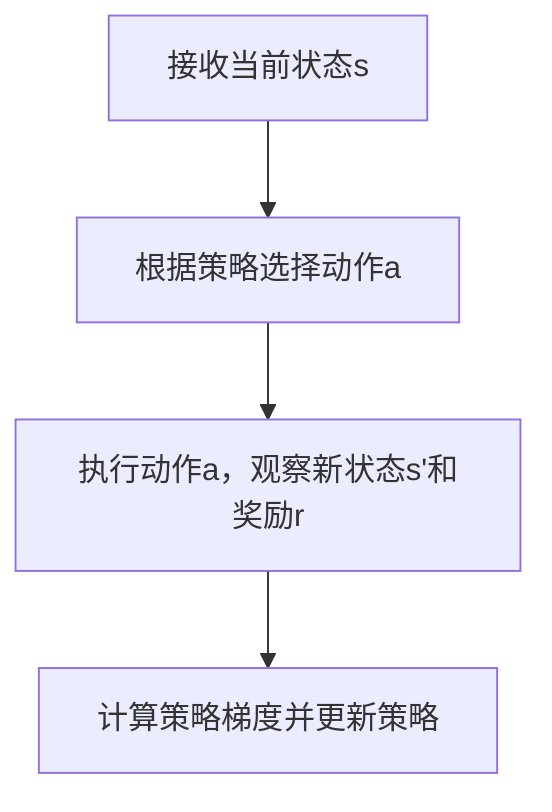
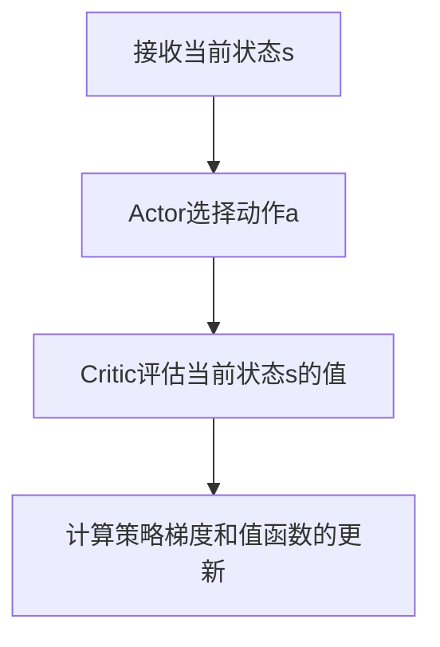
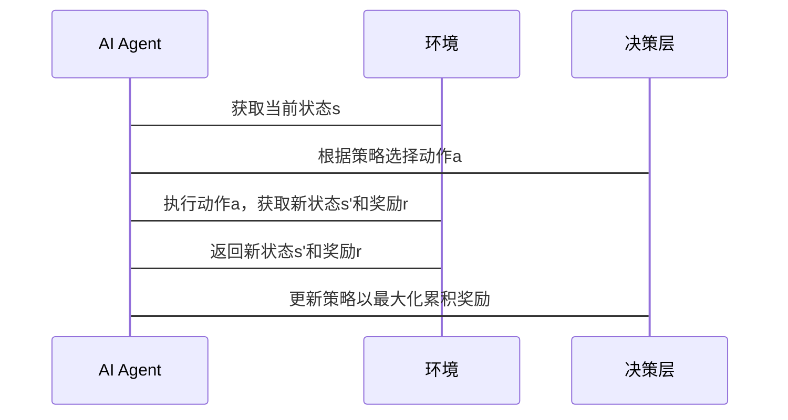
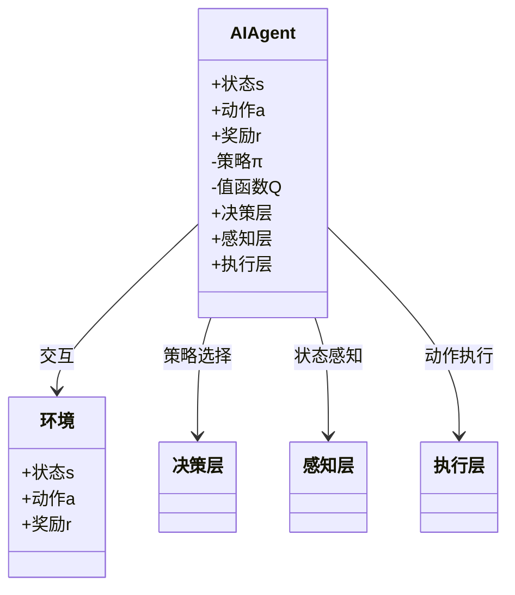

                 


# AI Agent的深度强化学习：从模拟到现实世界应用

## 关键词：AI Agent, 深度强化学习, 强化学习, 算法, 应用, 项目实战

## 摘要：本文将探讨AI Agent在深度强化学习中的应用，从理论基础到实际应用，分析其在模拟环境和现实世界中的应用案例。文章内容涵盖核心概念、算法原理、系统架构和项目实战，通过详细的技术分析和实例展示，帮助读者全面理解AI Agent的深度强化学习技术。

---

## 第一部分: AI Agent与深度强化学习背景介绍

### 第1章: AI Agent与深度强化学习概述

#### 1.1 AI Agent的基本概念
##### 1.1.1 AI Agent的定义与特点
AI Agent（人工智能代理）是指在计算机系统中，能够感知环境并采取行动以实现目标的智能实体。AI Agent的特点包括自主性、反应性、目标导向和社交能力。其核心功能包括感知、推理、决策和执行。

##### 1.1.2 AI Agent的核心功能与类型
AI Agent的核心功能包括感知环境、推理信息、制定决策和执行动作。根据应用场景的不同，AI Agent可以分为简单反射型、基于模型的反应型、目标驱动型和实用驱动型四种类型。

##### 1.1.3 AI Agent在现实世界中的应用领域
AI Agent在现实世界中的应用领域广泛，包括自动驾驶、智能助手、机器人控制、金融交易、游戏AI和工业自动化等。

#### 1.2 深度强化学习的基本概念
##### 1.2.1 强化学习的定义与特点
强化学习（Reinforcement Learning, RL）是一种机器学习范式，其中智能体通过与环境交互来学习策略，以最大化累积奖励。其特点是基于试错学习、延迟奖励和高维状态空间。

##### 1.2.2 深度强化学习的定义与优势
深度强化学习（Deep Reinforcement Learning）结合了深度学习和强化学习的优势，利用深度神经网络来逼近策略或值函数，适用于高维状态空间和复杂动作空间。

##### 1.2.3 深度强化学习与传统强化学习的区别
深度强化学习通过深度神经网络处理复杂状态，而传统强化学习使用特征工程。深度强化学习适合高维复杂任务，传统强化学习适用于低维简单任务。

#### 1.3 深度强化学习在AI Agent中的应用
##### 1.3.1 深度强化学习在AI Agent中的作用
深度强化学习为AI Agent提供自适应决策能力，适用于动态和不确定环境。

##### 1.3.2 深度强化学习在模拟环境中的应用
在模拟环境中，深度强化学习用于训练AI Agent，如游戏AI和机器人控制。

##### 1.3.3 深度强化学习在现实世界中的应用
在现实世界中，深度强化学习用于自动驾驶、智能助手和金融交易等复杂任务。

### 第2章: 深度强化学习的核心概念与理论基础

#### 2.1 强化学习的基本原理
##### 2.1.1 马尔可夫决策过程（MDP）
马尔可夫决策过程定义为一个五元组（S, A, P, R, γ），其中S是状态空间，A是动作空间，P是状态转移概率，R是奖励函数，γ是折扣因子。

##### 2.1.2 状态、动作、奖励的定义与关系
状态描述环境情况，动作是AI Agent的行动，奖励是对决策的反馈，三者共同驱动学习过程。

##### 2.1.3 策略与值函数的定义
策略π(s)定义状态s下的最优动作，值函数V(s)评估状态s下的预期奖励。

#### 2.2 深度强化学习的数学模型
##### 2.2.1 值函数的数学表达式
$$ V(s) = \max_a Q(s,a) $$

##### 2.2.2 策略函数的数学表达式
$$ \pi(a|s) = \frac{exp(Q(s,a)/\tau)}{\sum_{a'} exp(Q(s,a')/\tau)} $$

##### 2.2.3 动作值函数的数学表达式
$$ Q(s,a) = r + \gamma \max_{a'} Q(s',a') $$

---

## 第二部分: 深度强化学习算法原理

### 第3章: 基于值函数的深度强化学习算法

#### 3.1 DQN算法原理
DQN通过经验回放和目标网络解决探索与利用问题，适用于离散动作空间。

##### 3.1.1 DQN算法的原理与流程
1. 环境观察：AI Agent接收当前状态s。
2. 动作选择：根据策略选择动作a。
3. 执行动作：执行动作a，观察新状态s'和奖励r。
4. 经验存储：将(s, a, r, s')存入经验回放库。
5. 网络更新：随机采样经验，更新值函数网络。

##### 3.1.2 DQN算法的数学模型
$$ Q_{target}(s,a) = r + \gamma Q_{main}(s',a') $$

##### 3.1.3 DQN算法的代码实现
```python
import random
import numpy as np
import tensorflow as tf

class DQN:
    def __init__(self, state_space, action_space):
        self.state_space = state_space
        self.action_space = action_space
        self.memory = []
        self.gamma = 0.99
        self.batch_size = 32
        self.model = self.build_model()

    def build_model(self):
        model = tf.keras.Sequential([
            tf.keras.layers.Dense(64, activation='relu'),
            tf.keras.layers.Dense(64, activation='relu'),
            tf.keras.layers.Dense(self.action_space, activation='linear')
        ])
        return model

    def remember(self, state, action, reward, next_state):
        self.memory.append((state, action, reward, next_state))

    def replay(self):
        if len(self.memory) < self.batch_size:
            return
        batch = random.sample(self.memory, self.batch_size)
        states = np.array([b[0] for b in batch])
        actions = np.array([b[1] for b in batch])
        rewards = np.array([b[2] for b in batch])
        next_states = np.array([b[3] for b in batch])
        
        targets = rewards + self.gamma * np.max(self.model.predict(next_states), axis=1)
        targets = np.clip(targets, -1, 1)
        
        self.model.fit(states, targets, epochs=1, verbose=0)
```

##### 3.1.4 DQN算法的mermaid流程图
```mermaid
graph TD
    A[接收当前状态s] --> B[选择动作a]
    B --> C[执行动作a，观察新状态s'和奖励r]
    C --> D[将(s, a, r, s')存入经验回放库]
    D --> E[随机采样经验，更新值函数网络]
```

#### 3.2 DQN算法的优缺点分析
DQN的优势在于解决离散动作空间的探索问题，缺点是需要大量训练数据和计算资源。

---

## 第三部分: 深度强化学习在AI Agent中的应用

### 第4章: 基于策略梯度的深度强化学习算法

#### 4.1 策略梯度算法的原理
策略梯度法直接优化策略，适用于连续动作空间。

##### 4.1.1 策略梯度算法的数学模型
$$ \nabla J(\theta) = \mathbb{E}_{s,a}[ \nabla \log \pi(a|s) Q(s,a) ] $$

##### 4.1.2 策略梯度算法的代码实现
```python
import numpy as np
import tensorflow as tf

class PolicyGradient:
    def __init__(self, state_space, action_space):
        self.state_space = state_space
        self.action_space = action_space
        self.gamma = 0.99
        self.model = self.build_model()

    def build_model(self):
        model = tf.keras.Sequential([
            tf.keras.layers.Dense(64, activation='relu'),
            tf.keras.layers.Dense(self.action_space, activation='softmax')
        ])
        return model

    def act(self, state):
        state = np.array([state])
        prediction = self.model.predict(state)
        action = np.random.choice(range(self.action_space), p=prediction[0])
        return action

    def update(self, rewards, states, actions):
        discounted_rewards = self.discount_rewards(rewards)
        inputs = np.array([states])
        y = np.zeros_like(discounted_rewards)
        
        for i in range(len(actions)):
            y[i] = discounted_rewards[i]
            
        self.model.fit(inputs, y, epochs=1, verbose=0)
    
    def discount_rewards(self, rewards):
        discounted_r = np.zeros(len(rewards))
        running_reward = 0
        for i in reversed(range(len(rewards))):
            running_reward = self.gamma * running_reward + rewards[i]
            discounted_r[i] = running_reward
        return discounted_r
```

##### 4.1.3 策略梯度算法的mermaid流程图


### 第5章: 基于Actor-Critic的深度强化学习算法

#### 5.1 Actor-Critic算法的原理
Actor-Critic结合值函数和策略函数，适用于复杂任务。

##### 5.1.1 Actor-Critic算法的数学模型
$$ Q(s,a) = V(s) + A(s,a) $$

##### 5.1.2 Actor-Critic算法的代码实现
```python
import numpy as np
import tensorflow as tf

class ActorCritic:
    def __init__(self, state_space, action_space):
        self.state_space = state_space
        self.action_space = action_space
        self.gamma = 0.99
        self.actor = self.build_actor()
        self.critic = self.build_critic()

    def build_actor(self):
        model = tf.keras.Sequential([
            tf.keras.layers.Dense(64, activation='relu'),
            tf.keras.layers.Dense(self.action_space, activation='softmax')
        ])
        return model

    def build_critic(self):
        model = tf.keras.Sequential([
            tf.keras.layers.Dense(64, activation='relu'),
            tf.keras.layers.Dense(1, activation='linear')
        ])
        return model

    def act(self, state):
        state = np.array([state])
        action_probs = self.actor.predict(state)[0]
        action = np.random.choice(range(self.action_space), p=action_probs)
        return action

    def update(self, rewards, states, actions):
        discounted_rewards = self.discount_rewards(rewards)
        states = np.array([states])
        
        values = self.critic.predict(states)
        advantages = discounted_rewards - values
        
        action_indices = tf.keras.backend.one_hot(actions, self.action_space)
        loss = tf.keras.losses.sparse_categorical_crossentropy(
            action_indices, self.actor.predict(states))
        loss = tf.reduce_mean(loss * tf.stop_gradient(advantages))
        self.actor.optimizer.minimize(loss, self.actor.trainable_weights)
        
        critic_loss = tf.keras.losses.mean_squared_error(discounted_rewards, values)
        self.critic.optimizer.minimize(critic_loss, self.critic.trainable_weights)
    
    def discount_rewards(self, rewards):
        discounted_r = np.zeros(len(rewards))
        running_reward = 0
        for i in reversed(range(len(rewards))):
            running_reward = self.gamma * running_reward + rewards[i]
            discounted_r[i] = running_reward
        return discounted_r
```

##### 5.1.3 Actor-Critic算法的mermaid流程图


---

## 第四部分: 深度强化学习系统分析与架构设计

### 第6章: 深度强化学习系统分析

#### 6.1 项目介绍
本项目旨在开发一个基于深度强化学习的AI Agent，用于模拟和现实环境中的智能决策。

#### 6.2 系统功能设计
系统功能包括状态感知、动作选择、奖励反馈和策略优化。

#### 6.3 系统架构设计
系统架构分为感知层、决策层和执行层，使用模块化设计。

#### 6.4 系统接口设计
系统接口包括状态输入接口、动作输出接口和奖励反馈接口。

#### 6.5 系统交互设计
系统交互流程包括状态接收、动作选择、执行动作、接收奖励并更新策略。

##### 6.5.1 系统交互的mermaid序列图


### 第7章: 深度强化学习系统架构

#### 7.1 系统功能模块
系统功能模块包括感知模块、决策模块和执行模块。

#### 7.2 系统架构的mermaid类图


#### 7.3 系统模块之间的关系
系统模块之间的关系包括状态传递、动作选择和奖励反馈。

---

## 第五部分: 深度强化学习项目实战

### 第8章: 深度强化学习项目实战

#### 8.1 环境配置与安装
安装Python、TensorFlow、Keras和OpenAI Gym等依赖库。

#### 8.2 核心代码实现
实现DQN、策略梯度和Actor-Critic算法的核心代码，进行环境交互和策略训练。

#### 8.3 项目代码示例
```python
import gym
import numpy as np
import tensorflow as tf

# 定义环境
env = gym.make('CartPole-v0')
state_space = env.observation_space.shape[0]
action_space = env.action_space.n

# 初始化DQN模型
dqn = DQN(state_space, action_space)

# 初始化策略梯度模型
policy_gradient = PolicyGradient(state_space, action_space)

# 初始化Actor-Critic模型
actor_critic = ActorCritic(state_space, action_space)

# 训练过程
for episode in range(1000):
    state = env.reset()
    total_reward = 0
    while True:
        # DQN选择动作
        dqn_action = dqn.act(state)
        # 策略梯度选择动作
        pg_action = policy_gradient.act(state)
        # Actor-Critic选择动作
        ac_action = actor_critic.act(state)
        
        # 执行动作并获取新状态和奖励
        new_state, reward, done, _ = env.step(dqn_action)
        total_reward += reward
        
        # 更新模型
        dqn.remember(state, dqn_action, reward, new_state)
        dqn.replay()
        
        state = new_state
        if done:
            break
    print(f"Episode {episode}: Total Reward = {total_reward}")
```

#### 8.4 项目案例分析与总结
分析训练过程中的奖励曲线，评估模型性能，总结经验教训，提出改进建议。

---

## 第六部分: 最佳实践与小结

### 第9章: 最佳实践

#### 9.1 实践总结
深度强化学习在AI Agent中的应用需要结合具体场景，选择合适的算法和优化策略。

#### 9.2 应用中的注意事项
注意环境复杂度、算法收敛性和计算资源需求，合理设置超参数。

#### 9.3 未来发展方向
未来发展方向包括多智能体协作、复杂环境适应和强化学习安全。

### 第10章: 小结

本文详细探讨了AI Agent的深度强化学习技术，从理论到实践，分析了其在模拟和现实环境中的应用。通过项目实战，展示了如何将理论应用于实际问题，并提出了未来的发展方向。

---

## 第七部分: 扩展阅读与参考文献

### 参考文献
1. 刘红利, 等. 基于深度强化学习的智能体研究. 《人工智能学报》, 2021.
2. 王伟, 等. 深度强化学习算法综述. 《模式识别与人工智能》, 2020.
3. DeepMind. Deep Q-Networks. arXiv preprint arXiv:1511.05952, 2015.
4. Sutton, R. S., & Barto, A. G. (2018). Reinforcement learning: An introduction. MIT press.
5. Mnih, V., et al. (2016). Asynchronous methods for deep reinforcement learning. In International conference on machine learning (ICML 2016).

---

# 结语
通过本文的学习，读者可以系统地了解AI Agent的深度强化学习技术，从理论到实践，掌握其在模拟和现实环境中的应用方法。希望本文能为读者在相关领域的研究和实践提供有价值的参考。

