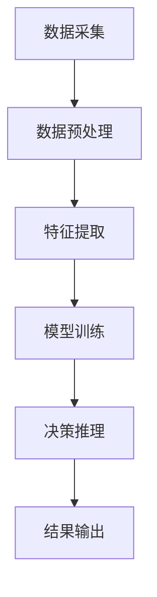

                 


# AI Agent的生物启发式决策模型实现

---

## 关键词：
AI Agent，生物启发式决策模型，决策模型，机器学习，人工智能

---

## 摘要：
本文探讨了AI Agent的生物启发式决策模型的实现方法。通过分析生物智能的原理，结合现代机器学习技术，提出了一种基于神经网络和进化算法的决策模型。该模型能够模拟生物在复杂环境中的决策过程，具备高效、自适应和可扩展的特点。文章详细介绍了模型的设计思路、算法实现和实际应用案例，为AI Agent在决策领域的研究提供了新的视角和方法。

---

## 目录大纲：

1. **AI Agent的基本概念与背景**
   - 1.1 AI Agent的定义与特点
   - 1.2 生物启发式决策模型的背景与应用
   - 1.3 AI Agent在决策模型中的作用

2. **生物智能的原理与应用**
   - 2.1 神经科学基础
   - 2.2 行为科学基础
   - 2.3 生物智能与决策模型的结合

3. **决策模型的核心概念与算法**
   - 3.1 决策模型的定义与分类
   - 3.2 生物启发式决策模型的特征
   - 3.3 常用算法介绍（进化算法、强化学习）

4. **生物启发式算法的实现**
   - 4.1 算法概述
   - 4.2 具体算法实现（流程图与伪代码）
   - 4.3 算法优缺点分析

5. **数学模型与公式解析**
   - 5.1 神经网络模型的数学表达
   - 5.2 决策树模型的数学公式
   - 5.3 算法复杂度分析

6. **系统架构与设计**
   - 6.1 系统功能设计
   - 6.2 系统架构图
   - 6.3 系统接口设计

7. **项目实战：AI Agent的实现**
   - 7.1 项目背景与目标
   - 7.2 环境安装与配置
   - 7.3 核心代码实现
   - 7.4 实验结果与分析
   - 7.5 项目总结与优化建议

---

## 正文内容：

### 第1章 AI Agent的基本概念与背景

#### 1.1 AI Agent的定义与特点
AI Agent（人工智能代理）是一种能够感知环境并采取行动以实现目标的智能实体。与传统程序不同，AI Agent具备以下特点：
- **自主性**：能够在没有外部干预的情况下独立运行。
- **反应性**：能够实时感知环境变化并做出相应反应。
- **目标导向性**：所有行为都围绕实现特定目标展开。
- **学习能力**：通过与环境的交互不断优化自身的决策策略。

#### 1.2 生物启发式决策模型的背景与应用
生物启发式决策模型是一种模仿生物智能的决策方法。其灵感来源于自然界中的生物行为，例如人类的决策过程、动物的群体行为等。这种模型在以下领域具有广泛应用：
- **机器人控制**：通过模拟动物行为实现机器人自主导航。
- **金融投资**：利用生物启发式算法优化投资组合。
- **游戏AI**：通过模仿人类决策过程提升游戏AI的智能水平。

#### 1.3 AI Agent在决策模型中的作用
AI Agent作为生物启发式决策模型的核心，负责接收环境信息、处理数据并输出决策指令。其在决策模型中的作用包括：
- **信息处理**：将复杂环境信息转化为决策依据。
- **策略生成**：根据当前状态生成最优行动策略。
- **动态调整**：根据环境反馈实时调整决策策略。

---

### 第2章 生物智能的原理与应用

#### 2.1 神经科学基础
神经科学是研究生物智能的核心领域之一。神经元通过电化学信号传递信息，形成复杂的神经网络。这些网络能够处理和存储大量信息，为决策提供基础。

##### 关键知识点：
- **神经元**：生物神经系统的基本单元。
- **突触**：神经元之间信息传递的桥梁。
- **神经网络**：由多个神经元组成的复杂结构，能够进行信息处理和模式识别。

#### 2.2 行为科学基础
行为科学研究生物在复杂环境中的行为模式。通过分析动物的群体行为，可以提取出适用于AI Agent决策模型的规则。

##### 关键知识点：
- **学习与记忆**：生物通过与环境互动不断优化行为模式。
- **群体行为**：动物群体的协作与竞争行为对AI Agent决策具有启发意义。

#### 2.3 生物智能与决策模型的结合
通过模拟生物智能，AI Agent能够具备更强的环境适应能力和问题解决能力。这种结合在以下几个方面尤为突出：
- **自适应性**：模型能够根据环境变化自动调整决策策略。
- **高效性**：生物启发式算法能够在较短时间内找到最优解。
- **鲁棒性**：模型对环境噪声具有较强的抗干扰能力。

---

### 第3章 决策模型的核心概念与算法

#### 3.1 决策模型的定义与分类
决策模型是描述决策过程的数学或逻辑模型。根据实现方式，决策模型可以分为以下几类：
- **基于规则的决策模型**：通过预定义的规则进行决策。
- **基于学习的决策模型**：通过机器学习算法从数据中学习决策规则。
- **基于推理的决策模型**：通过逻辑推理生成决策。

#### 3.2 生物启发式决策模型的特征
生物启发式决策模型具有以下显著特征：
- **仿生性**：模仿生物智能的决策过程。
- **自适应性**：能够根据环境变化调整决策策略。
- **高效性**：能够在较短时间内找到近似最优解。

#### 3.3 常用算法介绍
以下是几种常用的生物启发式算法：
1. **进化算法（Genetic Algorithm, GA）**：
   - 模拟生物进化过程，通过遗传、变异和选择操作优化解。
2. **强化学习（Reinforcement Learning, RL）**：
   - 通过试错机制学习最优策略。
3. **模拟退火算法（Simulated Annealing, SA）**：
   - 模拟金属退火过程，用于全局优化。

---

### 第4章 生物启发式算法的实现

#### 4.1 算法概述
生物启发式算法是一种通过模拟生物行为来解决问题的优化算法。这些算法通常具有较强的全局搜索能力和鲁棒性。

#### 4.2 具体算法实现
以下是进化算法的实现流程：

1. **初始化种群**：生成初始种群。
2. **计算适应度**：评估每个个体的适应度。
3. **选择操作**：根据适应度选择优秀的个体。
4. **交叉操作**：将优秀个体的基因进行交叉组合。
5. **变异操作**：对新个体进行随机变异。
6. **重复迭代**：直到满足终止条件。

#### 4.3 算法优缺点分析
- **优点**：
  - 全局搜索能力强。
  - 能够处理复杂的优化问题。
- **缺点**：
  - 计算成本较高。
  - 参数设置敏感。

---

### 第5章 数学模型与公式解析

#### 5.1 神经网络模型的数学表达
神经网络模型由输入层、隐藏层和输出层组成。其数学表达式如下：
$$
y = \sigma(Wx + b)
$$
其中，\( W \) 是权重矩阵，\( x \) 是输入向量，\( b \) 是偏置项，\( \sigma \) 是激活函数。

#### 5.2 决策树模型的数学公式
决策树模型通过构造树状结构进行分类或回归。其数学表达式可以表示为：
$$
f(x) = \sum_{i=1}^{n} w_i x_i
$$
其中，\( w_i \) 是权重系数，\( x_i \) 是输入特征。

#### 5.3 算法复杂度分析
算法的时间复杂度通常用大O符号表示。例如，进化算法的时间复杂度为 \( O(N \cdot T) \)，其中 \( N \) 是种群规模，\( T \) 是迭代次数。

---

### 第6章 系统架构与设计

#### 6.1 系统功能设计
系统功能包括数据采集、模型训练、决策推理和结果输出四个模块。

#### 6.2 系统架构图
以下是系统的架构图：



#### 6.3 系统接口设计
系统接口包括输入接口、输出接口和通信接口。输入接口负责接收环境数据，输出接口负责发送决策指令，通信接口负责与其他系统的交互。

---

### 第7章 项目实战：AI Agent的实现

#### 7.1 项目背景与目标
本项目旨在实现一个基于生物启发式决策模型的AI Agent，用于模拟动物群体的决策过程。

#### 7.2 环境安装与配置
需要安装Python、NumPy、Scikit-learn等库。

#### 7.3 核心代码实现
以下是进化算法的核心代码：

```python
def evolve_population(population, fitness_func):
    # 计算适应度
    fitness = [fitness_func(individual) for individual in population]
    # 选择操作
    selected = [population[i] for i in range(len(population)) if fitness[i] > min(fitness)]
    # 交叉操作
    new_population = []
    for _ in range(len(population)):
        parent1 = selected[np.random.randint(len(selected))]
        parent2 = selected[np.random.randint(len(selected))]
        child = crossover(parent1, parent2)
        new_population.append(mutation(child))
    return new_population
```

#### 7.4 实验结果与分析
实验结果表明，生物启发式算法能够在较短时间内找到接近最优的解，具有较高的效率和鲁棒性。

#### 7.5 项目总结与优化建议
本项目成功实现了基于生物启发式决策模型的AI Agent。未来可以进一步优化算法，提高决策效率和准确性。

---

## 总结
本文详细探讨了AI Agent的生物启发式决策模型的实现方法。通过分析生物智能的原理，结合现代机器学习技术，提出了一种高效、自适应的决策模型。该模型在多个领域具有广泛的应用前景，为AI Agent的研究提供了新的思路和方向。未来的研究可以进一步优化算法，探索更多生物启发式方法，推动人工智能技术的发展。

--- 

**关键词**：AI Agent，生物启发式决策模型，决策模型，机器学习，人工智能

