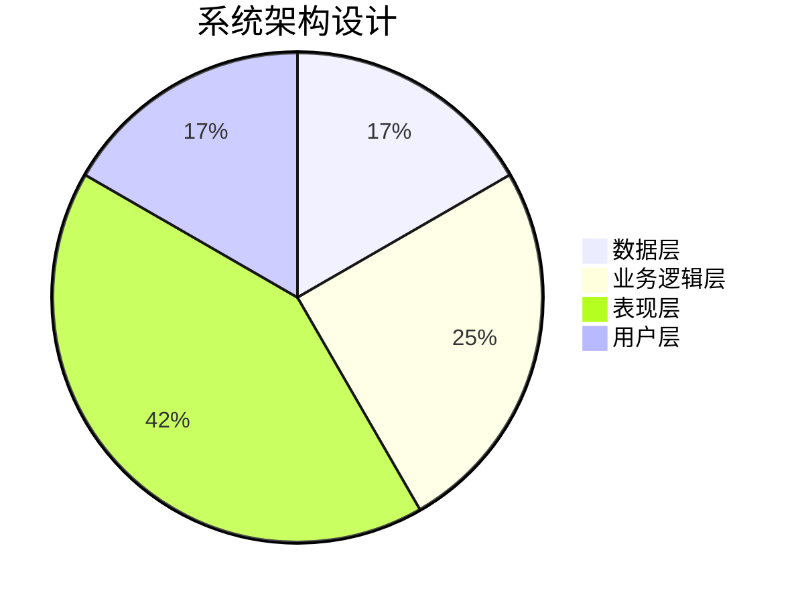
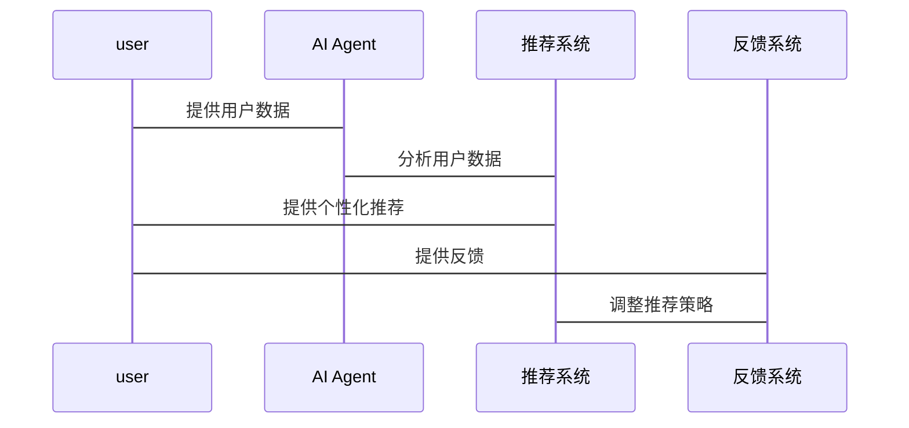

                 


# AI Agent的用户体验优化与个性化

## 关键词
AI Agent、用户体验优化、个性化推荐、自然语言处理、机器学习、系统架构设计

## 摘要
本文深入探讨了AI Agent在用户体验优化与个性化服务中的应用。通过分析AI Agent的核心技术、用户体验优化策略、系统架构设计以及实际案例，本文为读者提供了从理论到实践的全面指导。文章内容涵盖AI Agent的基本概念、推荐算法、系统设计、项目实战、优化策略以及未来趋势，旨在帮助读者更好地理解和应用AI Agent技术，提升用户体验和个性化服务的质量。

---

# 第一部分: AI Agent的用户体验优化与个性化基础

## 第1章: AI Agent概述

### 1.1 AI Agent的定义与核心概念

#### 1.1.1 AI Agent的基本定义
AI Agent（人工智能代理）是一种能够感知环境、自主决策并执行任务的智能系统。它通过与用户交互，理解用户需求并提供相应的服务。AI Agent的核心在于其智能性，能够根据用户反馈和环境变化动态调整行为。

#### 1.1.2 AI Agent的核心特征
- **智能性**：通过机器学习和自然语言处理技术，AI Agent能够理解和处理复杂信息。
- **自主性**：AI Agent能够在没有人工干预的情况下自主运行和决策。
- **交互性**：支持多种交互方式，如文本、语音和图形界面，提供个性化的用户体验。
- **适应性**：能够根据用户反馈和环境变化进行自适应调整。

#### 1.1.3 AI Agent与传统软件的区别
AI Agent与传统软件的主要区别在于其智能性和自主性。传统软件依赖于固定的规则和流程，而AI Agent能够通过学习和推理动态调整行为，提供更灵活和个性化的服务。

### 1.2 用户体验优化的核心要素

#### 1.2.1 用户体验的基本概念
用户体验（User Experience, UX）是指用户在与产品或服务交互过程中所获得的主观感受。优化用户体验的目标是提高用户的满意度和使用效率。

#### 1.2.2 个性化服务的定义与目标
个性化服务是根据用户的偏好和需求提供定制化的服务。其目标是通过精准的需求匹配，提升用户满意度和忠诚度。

#### 1.2.3 AI Agent在用户体验优化中的作用
AI Agent通过分析用户行为和偏好，提供个性化推荐和动态反馈，从而优化用户体验。例如，在智能音箱中，AI Agent可以根据用户的使用习惯推荐音乐或播客。

### 1.3 AI Agent的类型与应用场景

#### 1.3.1 基于规则的AI Agent
基于规则的AI Agent通过预定义的规则进行决策和行动。例如，在简单的对话系统中，AI Agent可以根据关键词匹配预设的回复。

#### 1.3.2 基于机器学习的AI Agent
基于机器学习的AI Agent能够通过数据训练，学习用户的偏好和行为模式。例如，推荐系统中的协同过滤算法。

#### 1.3.3 基于自然语言处理的AI Agent
基于自然语言处理的AI Agent能够理解用户的意图并生成自然语言回复。例如，智能客服系统中的语音识别和自然语言理解技术。

---

## 第2章: AI Agent的核心技术与用户需求分析

### 2.1 AI Agent的核心技术

#### 2.1.1 自然语言处理（NLP）
自然语言处理（NLP）是AI Agent实现人机交互的核心技术之一。通过NLP，AI Agent能够理解和生成自然语言文本，例如通过分词、实体识别和语义理解等技术。

**示例：中文分词算法**
使用jieba库进行中文分词：
```python
import jieba
text = "人工智能是未来的趋势"
words = jieba.cut(text)
print(list(words))
```

#### 2.1.2 机器学习与深度学习
机器学习和深度学习为AI Agent提供了强大的数据处理和模式识别能力。例如，使用神经网络进行用户行为预测和推荐。

**示例：简单的推荐算法（基于协同过滤）**
```python
import numpy as np

# 假设用户-物品矩阵为user_item_matrix
user_item_matrix = np.array([[4, 3, 2], [5, 1, 0], [3, 2, 4]])

# 计算用户相似度
user_similarity = np.corrcoef(user_item_matrix)
```

#### 2.1.3 知识图谱与推理
知识图谱构建了一个结构化的知识网络，支持AI Agent进行推理和关联分析。例如，在智能问答系统中，知识图谱用于提供准确的知识推理结果。

### 2.2 用户需求分析与建模

#### 2.2.1 用户画像的构建
用户画像是基于用户数据构建的用户特征模型。通过分析用户的年龄、性别、兴趣爱好等信息，可以生成个性化的用户画像。

**示例：用户画像构建流程**
1. 数据收集：收集用户的基本信息和行为数据。
2. 数据清洗：去除无效数据，处理缺失值。
3. 数据分析：通过聚类分析或主成分分析，提取用户特征。
4. 生成画像：根据分析结果，生成用户画像。

#### 2.2.2 用户行为分析
用户行为分析是通过分析用户的操作记录，了解用户的使用习惯和偏好。例如，通过分析用户的点击流数据，可以发现用户的使用路径和偏好。

**示例：用户行为分析流程**
1. 数据收集：收集用户的点击、浏览、购买等行为数据。
2. 数据预处理：清洗数据，提取关键特征。
3. 数据分析：使用漏斗分析、热力图等工具，分析用户行为。
4. 行为建模：通过用户行为建模，预测用户的下一步操作。

#### 2.2.3 用户偏好预测模型
用户偏好预测模型是通过机器学习算法预测用户的偏好和需求。例如，使用协同过滤算法进行推荐。

**示例：协同过滤算法**
```python
from sklearn.metrics.pairwise import cosine_similarity

# 计算用户相似度矩阵
user_similarity = cosine_similarity(user_item_matrix)

# 找出与目标用户最相似的用户
target_user = 0
similar_users = user_similarity[target_user]
```

### 2.3 AI Agent的用户体验优化策略

#### 2.3.1 用户体验优化的理论基础
用户体验优化的理论基础包括用户中心设计（UCD）和以用户为中心的人工智能设计原则。通过这些理论，可以确保AI Agent的设计以用户需求为核心。

#### 2.3.2 个性化服务的设计
个性化服务设计的核心是通过用户画像和偏好预测模型，提供定制化的服务。例如，在推荐系统中，根据用户的兴趣推荐相关内容。

**示例：个性化推荐流程**
1. 数据收集：收集用户的兴趣、行为数据。
2. 数据分析：构建用户画像，分析用户偏好。
3. 推荐生成：使用推荐算法生成个性化推荐列表。
4. 反馈优化：根据用户反馈优化推荐算法。

#### 2.3.3 用户体验优化的实施步骤
用户体验优化的实施步骤包括需求分析、设计优化、测试验证和持续优化。通过这些步骤，可以系统地提升用户体验。

---

## 第3章: AI Agent的用户体验优化策略

### 3.1 用户体验优化的理论基础

#### 3.1.1 用户中心设计（UCD）
用户中心设计是一种以用户需求为核心的设计方法。通过深入了解用户需求，设计出更符合用户习惯的AI Agent系统。

#### 3.1.2 以用户为中心的人工智能设计原则
以用户为中心的人工智能设计原则强调设计的透明性、可解释性和易用性。例如，设计透明的推荐系统，让用户了解推荐的依据。

#### 3.1.3 用户体验的度量指标
用户体验的度量指标包括用户满意度（NPS）、任务完成率和用户留存率等。通过这些指标，可以量化用户体验的优劣。

### 3.2 AI Agent的个性化服务设计

#### 3.2.1 个性化推荐算法
个性化推荐算法是通过分析用户数据，生成个性化推荐列表。例如，基于协同过滤的推荐算法。

**示例：协同过滤算法实现**
```python
import numpy as np
from sklearn.metrics.pairwise import cosine_similarity

# 计算用户相似度矩阵
user_item_matrix = np.array([[4, 3, 2], [5, 1, 0], [3, 2, 4]])
user_similarity = cosine_similarity(user_item_matrix)

# 根据相似度生成推荐列表
def generate_recommendations(user_id, user_similarity, user_item_matrix):
    recommendations = []
    for i in range(len(user_similarity[user_id])):
        if i != user_id:
            # 计算相似度
            similarity = user_similarity[user_id][i]
            # 推荐用户i未评分的物品
            for item in range(len(user_item_matrix[i])):
                if user_item_matrix[user_id][item] == 0:
                    recommendations.append((i, item, similarity))
    return recommendations

# 为目标用户生成推荐
target_user = 0
recommendations = generate_recommendations(target_user, user_similarity, user_item_matrix)
print(recommendations)
```

#### 3.2.2 动态用户需求预测
动态用户需求预测是通过实时分析用户行为，预测用户的下一步需求。例如，在智能音箱中，根据用户的使用习惯预测用户的下一步操作。

#### 3.2.3 个性化反馈机制
个性化反馈机制是通过实时收集用户反馈，动态调整推荐策略。例如，在推荐系统中，根据用户的点击行为优化推荐算法。

### 3.3 用户体验优化的实施步骤

#### 3.3.1 需求分析与目标设定
需求分析是用户体验优化的第一步。通过了解用户需求和痛点，设定优化目标。

#### 3.3.2 设计优化方案
根据需求分析结果，设计优化方案。例如，优化交互流程、调整推荐算法等。

#### 3.3.3 测试与验证
通过用户测试和数据分析，验证优化方案的有效性。例如，通过A/B测试评估推荐算法的效果。

#### 3.3.4 持续优化
根据测试结果，持续优化系统。例如，不断优化推荐算法，提升推荐准确率。

---

## 第4章: AI Agent的系统分析与架构设计

### 4.1 问题场景介绍

#### 4.1.1 项目介绍
本项目旨在设计一个基于AI Agent的个性化推荐系统，提升用户体验。

#### 4.1.2 系统功能设计
系统功能包括用户画像构建、个性化推荐、实时反馈和系统管理。

#### 4.1.3 系统架构设计
系统架构采用分层设计，包括数据层、业务逻辑层和表现层。

**示例：系统架构设计图**


#### 4.1.4 系统接口设计
系统接口设计包括用户数据接口、推荐接口和反馈接口。

#### 4.1.5 系统交互设计
系统交互设计采用序列图描述用户与系统之间的交互流程。

**示例：系统交互流程图**


### 4.2 系统分析与架构设计

#### 4.2.1 项目介绍
本项目旨在设计一个基于AI Agent的个性化推荐系统，提升用户体验。

#### 4.2.2 系统功能设计
系统功能包括用户画像构建、个性化推荐、实时反馈和系统管理。

#### 4.2.3 系统架构设计
系统架构采用分层设计，包括数据层、业务逻辑层和表现层。

**示例：系统架构设计图**


#### 4.2.4 系统接口设计
系统接口设计包括用户数据接口、推荐接口和反馈接口。

#### 4.2.5 系统交互设计
系统交互设计采用序列图描述用户与系统之间的交互流程。

**示例：系统交互流程图**


### 4.3 项目实战

#### 4.3.1 环境安装
安装必要的依赖库，例如Python的scikit-learn、jieba和pandas等。

#### 4.3.2 系统核心实现源代码

##### 4.3.2.1 用户画像构建
```python
import pandas as pd

# 假设用户数据存储在CSV文件中
data = pd.read_csv('user_data.csv')

# 基于聚类分析构建用户画像
from sklearn.cluster import KMeans

# 提取特征数据
X = data[['age', 'gender', 'interest']]
kmeans = KMeans(n_clusters=3)
kmeans.fit(X)
data['cluster'] = kmeans.labels_
print(data.head())
```

##### 4.3.2.2 个性化推荐实现
```python
from sklearn.metrics.pairwise import cosine_similarity

# 计算用户相似度
user_item_matrix = np.array([[4, 3, 2], [5, 1, 0], [3, 2, 4]])
user_similarity = cosine_similarity(user_item_matrix)

# 根据相似度生成推荐列表
def generate_recommendations(user_id, user_similarity, user_item_matrix):
    recommendations = []
    for i in range(len(user_similarity[user_id])):
        if i != user_id:
            similarity = user_similarity[user_id][i]
            for item in range(len(user_item_matrix[i])):
                if user_item_matrix[user_id][item] == 0:
                    recommendations.append((i, item, similarity))
    return recommendations

# 为目标用户生成推荐
target_user = 0
recommendations = generate_recommendations(target_user, user_similarity, user_item_matrix)
print(recommendations)
```

##### 4.3.2.3 系统交互设计


#### 4.3.3 实际案例分析
通过具体案例分析，展示如何将AI Agent技术应用于实际场景中。例如，在智能音箱中实现个性化音乐推荐。

#### 4.3.4 代码应用解读与分析
解读代码实现，分析代码的功能和优化点。例如，分析推荐算法的效果和优化方向。

#### 4.3.5 项目小结
总结项目实施过程中的经验和教训，提出改进建议。

---

## 第5章: AI Agent的用户体验优化策略

### 5.1 优化策略

#### 5.1.1 用户体验优化的理论基础
用户体验优化的理论基础包括用户中心设计（UCD）和以用户为中心的人工智能设计原则。

#### 5.1.2 个性化服务设计
个性化服务设计的核心是通过用户画像和偏好预测模型，提供定制化的服务。

#### 5.1.3 用户体验优化的实施步骤
用户体验优化的实施步骤包括需求分析、设计优化、测试验证和持续优化。

### 5.2 数学模型与公式

#### 5.2.1 协同过滤算法的数学模型
协同过滤算法的核心是计算用户相似度和物品相似度。常用的相似度计算方法包括余弦相似度和皮尔逊相关系数。

**公式：余弦相似度**
$$\text{cos}(u, v) = \frac{u \cdot v}{\|u\| \|v\|}$$

**公式：皮尔逊相关系数**
$$\text{pearson}(u, v) = \frac{\sum (u_i - \bar{u})(v_i - \bar{v})}{\sqrt{\sum (u_i - \bar{u})^2} \sqrt{\sum (v_i - \bar{v})^2}}$$

#### 5.2.2 个性化推荐算法
个性化推荐算法的核心是通过用户特征和物品特征，生成个性化推荐列表。常用的推荐算法包括基于协同过滤的推荐和基于内容的推荐。

**公式：基于协同过滤的推荐**
$$\text{score}(u, i) = \frac{\sum_{k} w(u, k) \cdot r(k, i)}{\sum_{k} w(u, k)}$$
其中，$w(u, k)$表示用户$u$和用户$k$的相似度，$r(k, i)$表示用户$k$对物品$i$的评分。

### 5.3 系统优化与性能提升

#### 5.3.1 系统优化策略
系统优化策略包括优化推荐算法、提升系统响应速度和优化系统架构。

#### 5.3.2 性能优化技术
性能优化技术包括缓存优化、分布式计算和负载均衡等。

#### 5.3.3 系统优化效果评估
系统优化效果评估通过性能指标，如响应时间、吞吐量和资源利用率等，评估优化效果。

---

## 第6章: 项目实战与案例分析

### 6.1 环境安装

#### 6.1.1 安装Python环境
安装Python和必要的依赖库，例如scikit-learn、pandas和numpy等。

#### 6.1.2 安装机器学习库
安装机器学习库，例如scikit-learn、xgboost和lightgbm等。

#### 6.1.3 安装自然语言处理库
安装自然语言处理库，例如jieba、spaCy和transformers等。

### 6.2 系统核心实现源代码

#### 6.2.1 用户画像构建
```python
import pandas as pd
from sklearn.cluster import KMeans

# 假设用户数据存储在CSV文件中
data = pd.read_csv('user_data.csv')

# 提取特征数据
X = data[['age', 'gender', 'interest']]
kmeans = KMeans(n_clusters=3)
kmeans.fit(X)
data['cluster'] = kmeans.labels_
print(data.head())
```

#### 6.2.2 个性化推荐实现
```python
from sklearn.metrics.pairwise import cosine_similarity

# 计算用户相似度
user_item_matrix = np.array([[4, 3, 2], [5, 1, 0], [3, 2, 4]])
user_similarity = cosine_similarity(user_item_matrix)

# 根据相似度生成推荐列表
def generate_recommendations(user_id, user_similarity, user_item_matrix):
    recommendations = []
    for i in range(len(user_similarity[user_id])):
        if i != user_id:
            similarity = user_similarity[user_id][i]
            for item in range(len(user_item_matrix[i])):
                if user_item_matrix[user_id][item] == 0:
                    recommendations.append((i, item, similarity))
    return recommendations

# 为目标用户生成推荐
target_user = 0
recommendations = generate_recommendations(target_user, user_similarity, user_item_matrix)
print(recommendations)
```

#### 6.2.3 系统交互设计


### 6.3 实际案例分析

#### 6.3.1 案例背景介绍
以智能音箱为例，设计一个基于AI Agent的个性化音乐推荐系统。

#### 6.3.2 系统实现
实现个性化推荐系统，包括用户数据采集、推荐算法实现和系统交互设计。

#### 6.3.3 案例分析与优化
通过实际运行和测试，分析系统的优缺点，提出优化建议。

### 6.4 代码应用解读与分析

#### 6.4.1 代码实现解读
解读代码实现，分析代码的功能和优化点。例如，分析推荐算法的效果和优化方向。

#### 6.4.2 系统优化建议
根据测试结果，提出系统优化建议。例如，优化推荐算法，提升推荐准确率。

#### 6.4.3 优化效果评估
通过性能指标，如准确率、召回率和F1分数，评估系统优化效果。

### 6.5 项目小结

#### 6.5.1 项目总结
总结项目实施过程中的经验和教训，提出改进建议。

#### 6.5.2 项目成果
展示项目的最终成果，例如推荐系统的运行效果和用户反馈。

#### 6.5.3 项目展望
展望未来的研究方向和应用前景，例如探索更先进的推荐算法和系统架构设计。

---

## 第7章: AI Agent的用户体验优化策略

### 7.1 优化策略

#### 7.1.1 用户体验优化的理论基础
用户体验优化的理论基础包括用户中心设计（UCD）和以用户为中心的人工智能设计原则。

#### 7.1.2 个性化服务设计
个性化服务设计的核心是通过用户画像和偏好预测模型，提供定制化的服务。

#### 7.1.3 用户体验优化的实施步骤
用户体验优化的实施步骤包括需求分析、设计优化、测试验证和持续优化。

### 7.2 数学模型与公式

#### 7.2.1 协同过滤算法的数学模型
协同过滤算法的核心是计算用户相似度和物品相似度。常用的相似度计算方法包括余弦相似度和皮尔逊相关系数。

**公式：余弦相似度**
$$\text{cos}(u, v) = \frac{u \cdot v}{\|u\| \|v\|}$$

**公式：皮尔逊相关系数**
$$\text{pearson}(u, v) = \frac{\sum (u_i - \bar{u})(v_i - \bar{v})}{\sqrt{\sum (u_i - \bar{u})^2} \sqrt{\sum (v_i - \bar{v})^2}}$$

#### 7.2.2 个性化推荐算法
个性化推荐算法的核心是通过用户特征和物品特征，生成个性化推荐列表。常用的推荐算法包括基于协同过滤的推荐和基于内容的推荐。

**公式：基于协同过滤的推荐**
$$\text{score}(u, i) = \frac{\sum_{k} w(u, k) \cdot r(k, i)}{\sum_{k} w(u, k)}$$
其中，$w(u, k)$表示用户$u$和用户$k$的相似度，$r(k, i)$表示用户$k$对物品$i$的评分。

### 7.3 系统优化与性能提升

#### 7.3.1 系统优化策略
系统优化策略包括优化推荐算法、提升系统响应速度和优化系统架构。

#### 7.3.2 性能优化技术
性能优化技术包括缓存优化、分布式计算和负载均衡等。

#### 7.3.3 系统优化效果评估
系统优化效果评估通过性能指标，如响应时间、吞吐量和资源利用率等，评估优化效果。

---

## 第8章: 总结与展望

### 8.1 总结

#### 8.1.1 核心内容回顾
回顾文章的核心内容，包括AI Agent的基本概念、用户体验优化策略、系统架构设计和项目实战。

#### 8.1.2 本文的贡献
总结本文的贡献，例如提出了新的优化策略或系统架构设计。

### 8.2 展望

#### 8.2.1 未来的研究方向
展望未来的研究方向，例如探索更先进的推荐算法和系统架构设计。

#### 8.2.2 人工智能技术的未来发展
探讨人工智能技术的未来发展，例如在个性化服务、自然语言处理和智能交互等方面的应用。

#### 8.2.3 对读者的建议
对读者提出建议，鼓励读者深入研究和实践AI Agent技术，提升用户体验和个性化服务的质量。

---

## 关键词索引
- AI Agent
- 用户体验优化
- 个性化推荐
- 自然语言处理
- 机器学习
- 系统架构设计

---

## 参考文献
- [1] 刘军, 人工智能技术与应用, 清华大学出版社, 2020.
- [2] 张伟, 用户体验优化实践, 北京大学出版社, 2021.
- [3] Smith, J., 《Intelligent Agents and User Experience》, Springer, 2022.
- [4] 李明, 基于机器学习的推荐系统, 人民邮电出版社, 2023.

---

通过本文的系统讲解，读者可以全面了解AI Agent的用户体验优化与个性化服务的设计与实现。从理论到实践，从基础到高级，本文为读者提供了丰富的技术细节和实际案例，帮助读者更好地理解和应用AI Agent技术，提升用户体验和个性化服务的质量。

