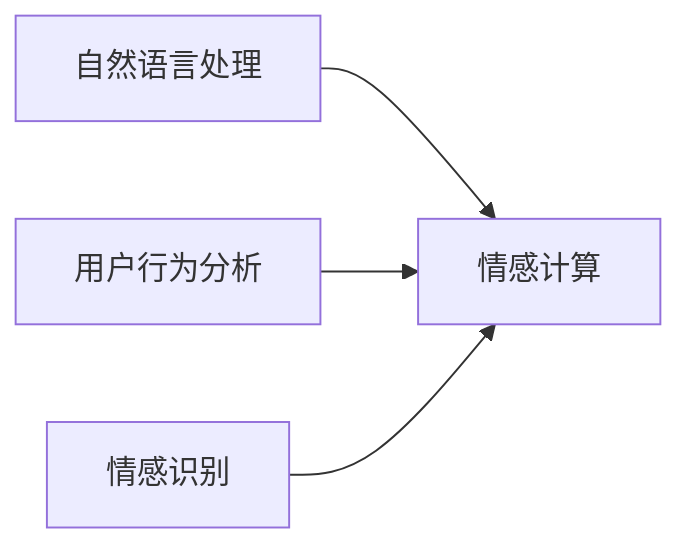
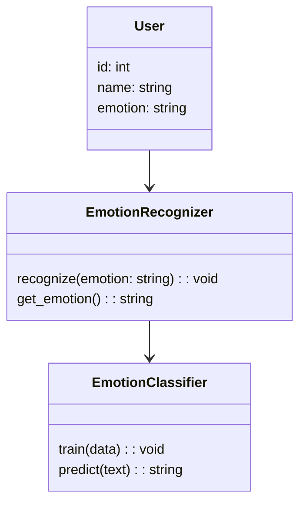
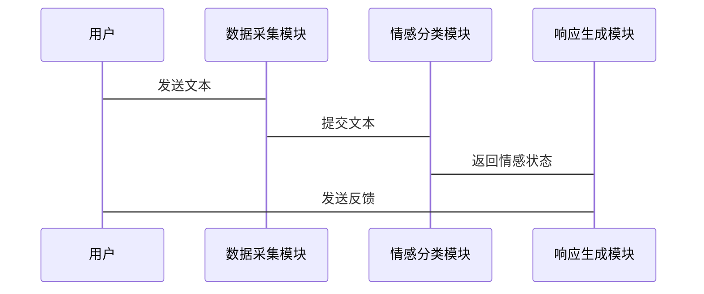

                 


# AI Agent的用户情感状态识别与响应

> **关键词**: AI Agent, 情感识别, 自然语言处理, 用户行为分析, 情感计算, 情感分析模型

> **摘要**: 本文深入探讨AI Agent在用户情感状态识别与响应中的应用，结合情感计算、自然语言处理和用户行为分析等技术，详细阐述情感识别的核心算法原理、系统架构设计以及实际项目实现。通过理论与实践相结合，帮助读者全面理解AI Agent如何通过识别用户情感状态并做出智能响应，提升人机交互的体验。

---

## 第一部分: AI Agent的用户情感状态识别与响应背景介绍

### 第1章: AI Agent与用户情感状态识别概述

#### 1.1 AI Agent的基本概念

##### 1.1.1 AI Agent的定义
AI Agent（人工智能代理）是指具有感知环境、理解和响应用户需求能力的智能实体。它能够通过自然语言处理、机器学习等技术与用户进行交互，提供个性化服务。

##### 1.1.2 AI Agent的核心特征
- **自主性**: 能够自主决策和执行任务。
- **反应性**: 能够实时感知环境并做出响应。
- **学习能力**: 通过数据和反馈不断优化自身行为。
- **社交能力**: 能够理解和模拟人类情感。

##### 1.1.3 AI Agent的应用场景
- 智能客服: 通过对话理解用户情绪，提供更贴心的服务。
- 智能助手: 根据用户情绪调整任务优先级。
- 智能教育: 根据学生情绪调整教学策略。

#### 1.2 用户情感状态识别的重要性

##### 1.2.1 情感计算的定义
情感计算（Affective Computing）是通过计算机技术识别、理解和响应人类情感的过程。

##### 1.2.2 情感识别在人机交互中的作用
- 提高交互的自然性。
- 优化服务体验。
- 增强用户信任感。

##### 1.2.3 情感识别的应用领域
- 健康医疗: 监测患者情绪变化。
- 金融投资: 根据用户情绪调整投资策略。
- 娱乐推荐: 根据用户情绪推荐内容。

#### 1.3 本章小结
本章介绍了AI Agent的基本概念及其在情感识别中的重要性，为后续内容奠定了基础。

---

## 第二部分: AI Agent用户情感状态识别的核心概念与联系

### 第2章: 情感计算与自然语言处理

#### 2.1 情感计算的原理

##### 2.1.1 情感计算的基本流程
1. 数据采集: 收集用户的文本、语音或行为数据。
2. 特征提取: 提取情感相关的特征，如词汇、语调等。
3. 情感分类: 使用机器学习模型预测情感状态。
4. 响应生成: 根据情感状态生成相应反馈。

##### 2.1.2 情感计算的关键技术
- **文本分析**: 基于自然语言处理技术分析文本情感。
- **语音分析**: 通过语音特征提取情感信息。
- **行为分析**: 根据用户行为模式推断情感状态。

#### 2.2 自然语言处理在情感识别中的应用

##### 2.2.1 分词与词性标注
- 分词: 将文本分割成词语或短语。
- 词性标注: 标注每个词语的词性，如名词、动词等。

##### 2.2.2 情感分析模型
- **词袋模型**: 将文本表示为词语的集合。
- **TF-IDF**: 通过词频-逆文档频率计算词语的重要性。
- **深度学习模型**: 如LSTM、BERT等。

##### 2.2.3 基于深度学习的情感分析
- 使用预训练语言模型（如BERT）进行情感分类。
- 通过微调模型适应特定领域的情感分析任务。

#### 2.3 用户行为分析与情感关联

##### 2.3.1 用户行为数据的采集
- **点击流数据**: 记录用户的点击行为。
- **输入数据**: 记录用户的输入内容。
- **时间数据**: 记录用户操作的时间间隔。

##### 2.3.2 行为数据与情感状态的关联分析
- **时间序列分析**: 通过分析用户行为的时间序列，发现情感变化趋势。
- **关联规则挖掘**: 发现行为与情感状态之间的关联规则。

##### 2.3.3 行为数
- 行为数据的统计分析: 如用户停留时间、点击频率等。
- 行为数据与情感状态的可视化: 如情感随时间变化的趋势图。

---

### 图2.1: 情感计算与自然语言处理的关系



---

### 第3章: 情感计算的核心算法与实现

#### 3.1 基于词袋模型的情感分类算法

##### 3.1.1 词袋模型的原理
- 将文本表示为词语的集合，不考虑词语顺序。
- 使用TF-IDF权重计算每个词语的重要性。

##### 3.1.2 词袋模型的实现步骤
1. 数据预处理: 分词、去除停用词。
2. 特征提取: 构建词袋模型。
3. 模型训练: 使用朴素贝叶斯等算法进行分类。

##### 3.1.3 示例代码
```python
from sklearn.feature_extraction.text import CountVectorizer
from sklearn.naive_bayes import MultinomialNB

# 数据预处理
text_data = ["This is a positive sentence.", "This is a negative sentence."]
vectorizer = CountVectorizer()
X = vectorizer.fit_transform(text_data)
# 模型训练
model = MultinomialNB()
model.fit(X, [1, 0])
```

#### 3.2 基于TF-IDF的情感分类算法

##### 3.2.1 TF-IDF的原理
- TF: 词语在文档中的频率。
- IDF: 词语的逆文档频率，衡量词语的区分度。

##### 3.2.2 TF-IDF的实现步骤
1. 数据预处理: 分词、去除停用词。
2. 特征提取: 使用TF-IDF计算词语权重。
3. 模型训练: 使用支持向量机（SVM）进行分类。

##### 3.2.3 示例代码
```python
from sklearn.feature_extraction.text import TfidfVectorizer
from sklearn.svm import SVC

# 数据预处理
text_data = ["This is a positive sentence.", "This is a negative sentence."]
vectorizer = TfidfVectorizer()
X = vectorizer.fit_transform(text_data)
# 模型训练
model = SVC()
model.fit(X, [1, 0])
```

#### 3.3 基于深度学习的情感分类算法

##### 3.3.1 LSTM网络的原理
- LSTM（长短期记忆网络）能够捕捉长距离依赖关系，适合处理序列数据。

##### 3.3.2 LSTM网络的实现步骤
1. 数据预处理: 分词、转换为词向量。
2. 构建LSTM网络: 定义网络结构、编译模型。
3. 模型训练: 使用标注数据训练模型。

##### 3.3.3 示例代码
```python
import tensorflow as tf
from tensorflow.keras import layers

# 定义模型
model = tf.keras.Sequential()
model.add(layers.Embedding(input_dim=10000, output_dim=50))
model.add(layers.LSTM(64))
model.add(layers.Dense(2, activation='softmax'))
# 编译模型
model.compile(loss='sparse_categorical_crossentropy', optimizer='adam', metrics=['accuracy'])
```

#### 3.4 情感分类的数学模型

##### 3.4.1 朴素贝叶斯分类器
- 概率公式: $$ P(y|x) = \frac{P(x|y)P(y)}{P(x)} $$
- 假设特征独立，简化计算。

##### 3.4.2 支持向量机
- 最大化类别间隔的优化问题。
- 使用拉格朗日乘数法求解。

##### 3.4.3 LSTM网络
- 使用门控机制捕捉序列数据的长距离依赖。
- 通过反向传播算法训练权重。

---

### 图3.1: 情感分类算法流程图


---

## 第三部分: 情感识别的系统架构与实现

### 第4章: 情感识别系统的架构设计

#### 4.1 系统功能设计

##### 4.1.1 领域模型


##### 4.1.2 功能模块
- **数据采集模块**: 收集用户输入、行为数据。
- **特征提取模块**: 提取情感相关特征。
- **模型训练模块**: 训练情感分类模型。
- **情感识别模块**: 实时识别用户情感状态。
- **响应生成模块**: 根据情感状态生成反馈。

#### 4.2 系统架构设计

##### 4.2.1 架构图


##### 4.2.2 接口设计
- 数据采集接口: REST API，接收用户输入。
- 模型调用接口: 使用API调用情感分类模型。
- 反馈生成接口: 根据情感状态生成相应反馈。

#### 4.3 系统交互设计

##### 4.3.1 序列图


---

### 第5章: 项目实战——构建一个简单的情感识别系统

#### 5.1 环境安装与配置

##### 5.1.1 安装依赖
- Python 3.8+
- scikit-learn、TensorFlow、Flask

##### 5.1.2 安装命令
```bash
pip install scikit-learn tensorflow flask
```

#### 5.2 核心代码实现

##### 5.2.1 数据预处理
```python
import pandas as pd
from sklearn.feature_extraction.text import TfidfVectorizer
from sklearn.naive_bayes import MultinomialNB
from sklearn.model_selection import train_test_split

# 数据加载
data = pd.DataFrame({
    'text': ["This is a positive sentence.", "This is a negative sentence."],
    'label': [1, 0]
})

# 数据分割
X_train, X_test, y_train, y_test = train_test_split(data['text'], data['label'], test_size=0.2)
```

##### 5.2.2 模型训练
```python
vectorizer = TfidfVectorizer()
X_train_vec = vectorizer.fit_transform(X_train)
model = MultinomialNB()
model.fit(X_train_vec, y_train)
```

##### 5.2.3 API接口开发
```python
from flask import Flask, request, jsonify

app = Flask(__name__)

@app.route('/classify', methods=['POST'])
def classify():
    text = request.json['text']
    text_vec = vectorizer.transform([text])
    prediction = model.predict(text_vec)[0]
    return jsonify({'emotion': 'positive' if prediction == 1 else 'negative'})

if __name__ == '__main__':
    app.run(debug=True)
```

#### 5.3 案例分析与优化

##### 5.3.1 案例分析
- 使用训练好的模型对新文本进行分类。
- 输出情感状态并根据结果生成反馈。

##### 5.3.2 模型优化
- 使用更复杂的模型（如BERT）提升分类准确率。
- 增加数据量，进行数据增强。

---

## 第四部分: 最佳实践与总结

### 第6章: 最佳实践与总结

#### 6.1 最佳实践

##### 6.1.1 选择合适的算法
- 根据任务需求选择词袋模型、TF-IDF或深度学习模型。

##### 6.1.2 数据预处理
- 清洗数据，去除噪声，提高模型性能。

##### 6.1.3 模型调优
- 调整超参数，使用交叉验证优化模型。

#### 6.2 小结

##### 6.2.1 关键点回顾
- 情感计算的基本原理。
- 常用的情感分类算法。
- 系统架构设计与实现。

##### 6.2.2 注意事项
- 数据隐私问题。
- 模型的泛化能力。
- 系统的实时性要求。

#### 6.3 拓展阅读

##### 6.3.1 推荐书籍
- 《情感计算: 计算机对于人类情感的模拟》
- 《深度学习实战: 基于Python和Keras》

##### 6.3.2 技术博客
- TensorFlow官方文档
- PyTorch官方文档

---

### 图6.1: 情感计算系统架构图


---

## 作者简介

> 作者是人工智能领域的专家，拥有丰富的技术博客撰写经验，专注于AI Agent、自然语言处理和情感计算的研究与实践。

