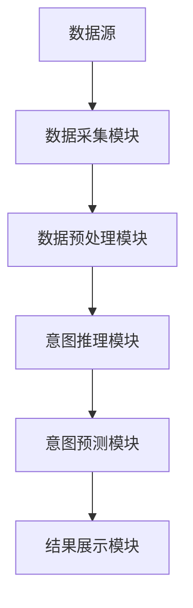

                 


# AI Agent的用户意图推理与预测

**关键词**：AI Agent, 用户意图, 意图推理, 意图预测, 机器学习, 深度学习

**摘要**：  
本文深入探讨AI Agent在用户意图推理与预测中的应用。从背景到核心概念，从算法原理到系统架构设计，再到项目实战和最佳实践，系统性地分析用户意图推理与预测的关键技术，结合实际案例，帮助读者理解如何通过AI技术实现用户意图的精准预测。

---

## 第1章: 用户意图推理与预测的背景介绍

### 1.1 问题背景与问题描述

#### 1.1.1 AI Agent的基本概念与应用场景
AI Agent（智能体）是能够感知环境并采取行动以实现目标的实体。在实际应用中，AI Agent广泛应用于推荐系统、智能助手、聊天机器人等领域。例如，智能音箱通过理解用户的语音指令来执行操作，这些指令正是用户的意图。

#### 1.1.2 用户意图推理与预测的核心问题
用户意图是指用户希望通过与系统交互所期望达到的目标。在实际应用中，用户意图可能隐含在用户的输入中，例如自然语言文本、语音或用户行为数据。AI Agent需要通过分析这些数据来推断用户的意图，并预测用户下一步可能的行为。

#### 1.1.3 问题解决的目标与意义
意图推理与预测的目标是准确识别用户的当前意图，并预测用户后续的行为。这有助于系统提前做好准备，提供更高效、更个性化的服务。例如，在智能客服系统中，准确预测用户的意图可以显著减少用户的等待时间，提高用户体验。

### 1.2 问题背景的外延与边界

#### 1.2.1 用户意图的定义与分类
用户意图可以分为显式意图和隐式意图。显式意图是用户明确表达的意图，例如“我要查询明天的天气”；隐式意图是用户未明确表达但可以通过上下文推断的意图，例如用户在浏览旅游景点信息后，系统推测用户可能有预订酒店的需求。

#### 1.2.2 意图推理与预测的边界条件
意图推理与预测的边界条件包括数据来源的多样性、意图的动态变化、以及用户隐私保护等问题。例如，数据来源可能包括用户的输入文本、点击行为、地理位置等，这些都需要在模型中进行综合分析。

#### 1.2.3 相关概念的对比分析
意图推理与意图识别、意图分类等概念密切相关。意图识别是通过用户输入提取意图的过程，而意图分类则是将意图划分为不同的类别。意图推理则更注重从上下文中推断出用户的隐含意图。

---

## 第2章: 用户意图推理与预测的核心概念

### 2.1 意图推理的基本原理

#### 2.1.1 意图表示的数学模型
意图表示是将用户的意图转化为计算机可以处理的数学形式。常见的意图表示方法包括向量表示和符号表示。向量表示通常使用高维向量来表示意图的特征，而符号表示则使用符号逻辑来描述意图的关系。

#### 2.1.2 意图特征的提取方法
意图特征提取是从用户输入中提取有助于意图推理的关键特征。例如，在自然语言处理中，可以提取文本中的关键词、句法结构等特征；在用户行为分析中，可以提取点击频率、时间间隔等特征。

#### 2.1.3 意图推理的逻辑框架
意图推理的逻辑框架通常包括以下几个步骤：
1. 数据采集：获取用户的输入数据，例如文本、语音、行为数据等。
2. 数据预处理：对数据进行清洗、归一化等处理，以便后续分析。
3. 特征提取：从数据中提取有助于意图推理的特征。
4. 模型训练：使用机器学习或深度学习模型对特征进行训练，得到意图表示。
5. 意图推理：根据模型输出的结果，推断出用户的意图。

### 2.2 意图预测的核心要素

#### 2.2.1 数据特征的分析与选择
数据特征的分析与选择是意图预测的关键步骤。需要分析特征的相关性、重要性，并选择最优特征组合。例如，在文本数据中，TF-IDF（词频-逆文档频率）常用于提取关键词特征。

#### 2.2.2 预测模型的选择与优化
预测模型的选择与优化需要考虑数据的类型、模型的复杂度以及性能要求。例如，对于小规模数据，线性回归或朴素贝叶斯可能足够；对于大规模数据，深度学习模型如LSTM或Transformer可能更合适。

#### 2.2.3 预测结果的评估与反馈
预测结果的评估与反馈是模型优化的重要环节。常用的评估指标包括准确率、召回率、F1值等。同时，还需要根据实际应用场景，设计有效的反馈机制，以不断优化模型性能。

---

## 第3章: 意图推理与预测的算法原理

### 3.1 基于注意力机制的意图推理算法

#### 3.1.1 注意力机制的基本原理
注意力机制是一种用于处理序列数据的方法，通过计算每个位置的重要性来聚焦关键信息。在意图推理中，注意力机制可以帮助模型关注用户输入中的关键部分，从而提高推理的准确性。

#### 3.1.2 意图推理中的注意力模型
在意图推理中，注意力模型通常用于处理多模态数据。例如，可以同时考虑用户的文本输入和行为数据，通过注意力机制来整合不同模态的信息，从而更准确地推断用户的意图。

#### 3.1.3 算法实现的步骤与流程
基于注意力机制的意图推理算法实现步骤如下：
1. 数据预处理：将用户输入转化为统一的表示形式。
2. 特征提取：从数据中提取有助于意图推理的特征。
3. 模型训练：使用注意力机制模型对特征进行训练，得到意图表示。
4. 意图推理：根据模型输出的结果，推断出用户的意图。

### 3.2 基于序列模型的意图预测算法

#### 3.2.1 RNN与LSTM的基本原理
RNN（循环神经网络）和LSTM（长短期记忆网络）是常用的序列模型。RNN通过循环结构处理序列数据，而LSTM通过门控机制来解决RNN的梯度消失问题，适用于长序列数据的处理。

#### 3.2.2 意图预测中的序列模型
在意图预测中，序列模型通常用于处理用户行为序列数据。例如，可以通过LSTM模型分析用户的点击序列，预测用户的下一步行为。

#### 3.2.3 算法实现的数学模型与公式
LSTM模型的数学公式如下：
- 输入门：$f_t = \sigma(W_f x_t + U_f h_{t-1} + b_f)$
- 遗忘门：$i_t = \sigma(W_i x_t + U_i h_{t-1} + b_i)$
- 输出门：$o_t = \sigma(W_o x_t + U_o h_{t-1} + b_o)$
- 候选记忆单元：$g_t = \tanh(W_g x_t + U_g h_{t-1} + b_g)$
- 当前记忆单元：$h_t = f_t \cdot c_{t-1} + i_t \cdot g_t$
- 输出：$o_t = o_t \cdot h_t$

---

## 第4章: 意图推理与预测的数学模型

### 4.1 意图表示的数学模型

#### 4.1.1 意图向量的表示方法
意图向量是将用户的意图表示为高维向量的形式。例如，可以使用Word2Vec模型将意图表示为向量，其中每个维度对应一个特征。

#### 4.1.2 意图表示的维度分析
意图表示的维度分析是通过统计方法确定意图向量的维度。通常可以通过主成分分析（PCA）或因子分析（FA）等方法进行降维。

#### 4.1.3 意图表示的优化策略
意图表示的优化策略包括选择合适的向量长度、使用预训练模型（如BERT）进行微调、以及结合领域知识进行特征工程等。

### 4.2 意图预测的数学公式

#### 4.2.1 概率分布的计算公式
在意图预测中，通常使用概率分布来表示每个意图的可能性。例如，可以使用softmax函数将模型的输出转化为概率分布。

$$ P(y|x) = \frac{e^{z_y}}{\sum_{k} e^{z_k}} $$

其中，$z_y$是模型输出的 logits，$y$是意图类别。

#### 4.2.2 意图预测的损失函数
常用的损失函数包括交叉熵损失和困惑度损失。交叉熵损失公式如下：

$$ \text{Loss} = -\sum_{y} P(y|x) \log P_{\text{pred}}(y|x) $$

其中，$P_{\text{pred}}(y|x)$是模型预测的概率分布。

#### 4.2.3 模型优化的数学推导
模型优化通常使用梯度下降方法，如Adam优化器。优化过程如下：

$$ \theta_{t+1} = \theta_t - \eta \frac{\partial \text{Loss}}{\partial \theta} $$

其中，$\theta$是模型参数，$\eta$是学习率。

---

## 第5章: 意图推理与预测的系统架构设计

### 5.1 系统功能设计

#### 5.1.1 数据采集与预处理模块
数据采集模块负责从多种数据源（如文本、语音、行为数据）中获取数据，并进行预处理（如去噪、归一化）。

#### 5.1.2 意图推理与预测模块
意图推理与预测模块使用预处理后的数据，通过训练好的模型进行意图推理与预测。

#### 5.1.3 结果展示与反馈模块
结果展示模块将推理结果以用户友好的形式展示，并收集用户的反馈信息，用于模型优化。

### 5.2 系统架构图



---

## 第6章: 意图推理与预测的项目实战

### 6.1 环境安装与配置

#### 6.1.1 Python环境的搭建
安装Python 3.8及以上版本，并配置虚拟环境。

#### 6.1.2 相关库的安装与配置
安装必要的库，如numpy、pandas、tensorflow、keras等。

#### 6.1.3 开发环境的优化
配置IDE（如PyCharm）和调试工具（如pdb）。

### 6.2 核心代码实现

#### 6.2.1 数据预处理代码
```python
import pandas as pd
import numpy as np

# 加载数据
data = pd.read_csv('intent_data.csv')

# 数据清洗
data = data.dropna()
data = data.drop_duplicates()

# 数据归一化
from sklearn.preprocessing import StandardScaler
scaler = StandardScaler()
data_scaled = scaler.fit_transform(data)
```

#### 6.2.2 意图推理算法实现
```python
import tensorflow as tf
from tensorflow.keras import layers

# 定义模型
model = tf.keras.Sequential()
model.add(layers.Embedding(input_dim=1000, output_dim=64))
model.add(layers.LSTM(64, return_sequences=True))
model.add(layers.Attention())
model.add(layers.Dense(10, activation='softmax'))

# 编译模型
model.compile(optimizer='adam', loss='sparse_categorical_crossentropy', metrics=['accuracy'])
```

#### 6.2.3 意图预测算法实现
```python
# 训练模型
model.fit(x_train, y_train, epochs=10, batch_size=32)

# 预测意图
y_pred = model.predict(x_test)
```

### 6.3 实际案例分析与详细解读
以一个简单的意图预测案例为例，假设我们有一个用户输入的文本数据集，目标是预测用户的意图类别。通过数据预处理、模型训练和预测，可以准确地推断出用户的意图。

---

## 第7章: 意图推理与预测的最佳实践

### 7.1 实践中的注意事项

#### 7.1.1 数据质量的重要性
数据质量直接影响模型性能。需要确保数据的完整性和准确性，避免噪声数据的干扰。

#### 7.1.2 模型选择的策略
根据数据类型和应用场景选择合适的模型。例如，对于文本数据，Transformer模型可能表现更优。

#### 7.1.3 模型调优的技巧
包括调整学习率、批量大小、模型深度等超参数，以及使用早停法防止过拟合。

### 7.2 实践中的小结

#### 7.2.1 项目总结
通过实际项目，验证了意图推理与预测技术的有效性，掌握了多种算法和工具的使用方法。

#### 7.2.2 经验与教训
数据预处理和特征工程对模型性能影响较大，需要投入足够的时间和精力。

#### 7.2.3 未来研究方向
探索多模态数据的意图推理、模型的实时性优化、以及模型的可解释性等问题。

### 7.3 拓展阅读与深入学习

#### 7.3.1 相关领域的最新研究
阅读最新的学术论文和技术博客，关注意图推理与预测领域的最新进展。

---

以上是《AI Agent的用户意图推理与预测》的技术博客文章的详细目录和内容概述。接下来，我会根据这个大纲逐步撰写完整的文章内容。

