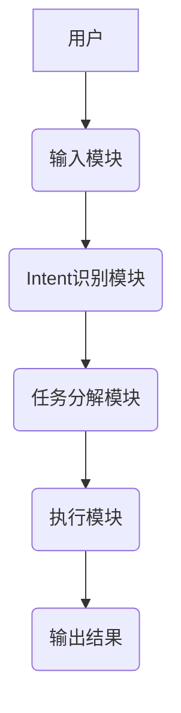
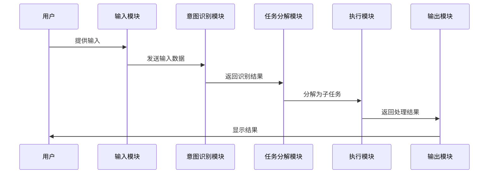

                 


# AI Agent的用户意图识别与任务分解

> 关键词：AI Agent, 用户意图识别, 任务分解, 意图识别算法, 系统架构设计

> 摘要：本文将详细探讨AI Agent中的用户意图识别与任务分解的关键技术。首先介绍AI Agent的基本概念和用户意图识别的重要性，接着分析意图识别与任务分解的核心概念及其联系。随后，深入讲解意图识别的算法原理与实现，包括基于规则、统计学习和深度学习的方法。最后，通过实际案例展示系统设计与项目实现，并总结相关最佳实践。

---

# 第一部分: AI Agent的用户意图识别与任务分解基础

## 第1章: AI Agent与用户意图识别概述

### 1.1 AI Agent的基本概念

#### 1.1.1 AI Agent的定义与特点
AI Agent（人工智能代理）是指能够感知环境、自主决策并执行任务的智能实体。它通过与用户或环境的交互，完成特定的目标。AI Agent的特点包括自主性、反应性、目标导向和学习能力。

#### 1.1.2 用户意图识别的背景与意义
用户意图识别是AI Agent的核心任务之一，旨在理解用户的输入（如文本、语音或行为）背后的真正需求。在智能客服、语音助手等领域，准确识别用户意图可以提高用户体验和系统效率。

#### 1.1.3 任务分解的重要性
任务分解是将复杂问题拆解为简单子任务的过程。在AI Agent中，任务分解帮助系统更高效地执行任务，确保每个子任务都能被准确理解和处理。

### 1.2 用户意图识别的背景与应用

#### 1.2.1 当前人机交互的发展趋势
随着技术进步，人机交互越来越依赖自然语言处理（NLP）和机器学习。用户意图识别成为实现更智能交互的关键技术。

#### 1.2.2 用户意图识别的典型场景
- 智能音箱：通过语音指令识别用户需求。
- 智能客服：理解用户的问题并提供解决方案。
- 智能助手：帮助用户安排日程和执行任务。

#### 1.2.3 任务分解在实际应用中的重要性
任务分解使AI Agent能够处理复杂的请求。例如，用户说“预订明天的会议”，系统需要分解为理解时间、联系参与者、发送提醒等多个子任务。

---

## 第2章: 用户意图识别的核心概念与联系

### 2.1 意图识别的核心原理

#### 2.1.1 意图识别的基本流程
1. **输入接收**：获取用户的输入数据（如文本或语音）。
2. **特征提取**：从输入中提取关键特征（如关键词、情感）。
3. **模型训练与推理**：使用机器学习模型预测用户的意图。

#### 2.1.2 意图识别的关键技术
- **自然语言处理（NLP）**：用于理解和生成人类语言。
- **机器学习**：用于训练分类模型以识别意图。
- **上下文理解**：考虑对话历史和当前输入的关系。

#### 2.1.3 意图识别的挑战与解决方案
- **模糊性**：用户输入可能存在歧义。
- **数据稀疏性**：某些意图的训练数据不足。
- **解决方案**：结合上下文、多模态数据和迁移学习来提高准确率。

### 2.2 任务分解的基本原理

#### 2.2.1 任务分解的定义与特点
任务分解是将整体任务拆解为多个子任务的过程。每个子任务都有明确的目标和输入输出。

#### 2.2.2 任务分解的常见方法
- **层次分解法**：自顶向下或自底向上分解任务。
- **贪心算法**：逐步选择最优子任务。
- **动态规划**：将任务分解为重叠子问题并存储中间结果。

#### 2.2.3 任务分解的复杂性分析
任务分解的复杂性取决于任务的结构和目标的多样性。复杂的任务可能需要更多的子任务，增加系统的复杂度。

### 2.3 意图识别与任务分解的关系

#### 2.3.1 两者之间的相互作用
- 意图识别为任务分解提供目标。
- 任务分解帮助系统高效执行意图识别的结果。

#### 2.3.2 意图识别如何影响任务分解
准确的意图识别可以减少任务分解的不确定性，提高效率。

#### 2.3.3 任务分解如何优化意图识别
通过分解任务，系统可以更细致地理解用户需求，提升意图识别的准确性。

### 2.4 核心概念对比表格

| **特征**         | **意图识别**                | **任务分解**                |
|------------------|-----------------------------|-----------------------------|
| **目标**         | 确定用户的意图              | 拆解任务为子任务            |
| **输入**         | 用户输入（文本、语音等）     | 复杂任务                   |
| **输出**         | 具体意图（如“查询天气”）     | 子任务列表                 |
| **依赖性**       | 高（依赖于上下文）          | 低（独立于用户输入）        |
| **应用场景**     | 智能客服、语音助手          | 项目管理、自动化系统        |

### 2.5 ER实体关系图

```mermaid
er
actor(用户) -|> 意图识别系统 : 提供输入
intent(意图) -|> 意图识别系统 : 返回识别结果
intent -|> 任务分解系统 : 分解为子任务
task_list(任务列表) -|> 任务分解系统 : 返回子任务列表
```

---

## 第3章: 意图识别的算法原理与实现

### 3.1 意图识别的算法原理

#### 3.1.1 基于规则的意图识别
- **原理**：通过预定义的规则匹配用户输入。
- **优点**：简单易实现，适用于规则明确的场景。
- **缺点**：难以处理复杂或模糊的输入。

#### 3.1.2 基于统计学习的意图识别
- **原理**：使用机器学习模型（如SVM、随机森林）训练分类器。
- **优点**：能够处理大量数据，泛化能力强。
- **缺点**：需要大量标注数据。

#### 3.1.3 基于深度学习的意图识别
- **原理**：利用神经网络（如RNN、LSTM）处理序列数据。
- **优点**：能够捕捉上下文信息，处理复杂任务。
- **缺点**：训练时间长，需要大量计算资源。

### 3.2 意图识别的数学模型

#### 3.2.1 概率论基础
- 概率论是机器学习的基础，常用于分类和预测任务。
- 例如，贝叶斯定理用于计算条件概率。

#### 3.2.2 贝叶斯定理在意图识别中的应用
- 贝叶斯定理公式：
  $$ P(B|A) = \frac{P(A|B)P(B)}{P(A)} $$
- 应用于计算用户输入的概率属于某个意图的概率。

#### 3.2.3 深度学习模型的数学表达式
- RNN模型的前向传播公式：
  $$ h_t = \tanh(W_{hh}h_{t-1} + W_{xh}x_t + b_h) $$
  $$ y_t = W_{hy}h_t + b_y $$

### 3.3 意图识别的算法实现

#### 3.3.1 基于规则的意图识别实现（Python代码示例）

```python
def rule_based_intent Recognition(user_input):
    # 预定义规则
    rules = {
        '天气': ['天气怎么样', '今天天气如何'],
        '时间': ['现在几点', '时间是什么']
    }
    for intent, patterns in rules.items():
        if user_input in patterns:
            return intent
    return '未知'
```

#### 3.3.2 基于统计学习的意图识别实现（Python代码示例）

```python
from sklearn.svm import SVC

# 假设X是训练数据，y是意图标签
model = SVC()
model.fit(X, y)
intent = model.predict([user_input])
```

#### 3.3.3 基于深度学习的意图识别实现（Python代码示例）

```python
import torch
import torch.nn as nn

class IntentClassifier(nn.Module):
    def __init__(self, input_size, hidden_size, output_size):
        super(IntentClassifier, self).__init__()
        self.rnn = nn.LSTM(input_size, hidden_size, batch_first=True)
        self.fc = nn.Linear(hidden_size, output_size)
    
    def forward(self, x):
        out, _ = self.rnn(x)
        out = self.fc(out[:, -1, :])
        return out

model = IntentClassifier(input_size=100, hidden_size=50, output_size=5)
outputs = model(inputs)
```

---

## 第4章: 系统分析与架构设计

### 4.1 问题场景介绍
假设我们正在开发一个智能客服系统，用户输入问题，系统需要识别意图并分解任务进行处理。

### 4.2 系统功能设计
- 用户输入接收模块
- 意图识别模块
- 任务分解模块
- 执行模块

### 4.3 系统架构设计



### 4.4 系统接口设计
- 输入接口：接收用户输入
- 输出接口：返回处理结果
- 数据接口：存储和管理用户数据

### 4.5 系统交互序列图



---

## 第5章: 项目实战

### 5.1 电商客服系统案例

#### 5.1.1 环境安装
安装Python、TensorFlow、Scikit-learn等库。

#### 5.1.2 核心代码实现

```python
def decompose_task(user_intent):
    if user_intent == '查询订单':
        return ['查询订单信息', '获取订单状态']
    elif user_intent == '取消订单':
        return ['检查订单状态', '确认取消', '记录取消原因']
    else:
        return ['未知意图']

# 示例
intent = '取消订单'
tasks = decompose_task(intent)
print(tasks)
```

#### 5.1.3 案例分析与结果展示
- 输入意图：取消订单
- 分解结果：['检查订单状态', '确认取消', '记录取消原因']

---

## 第6章: 最佳实践与小结

### 6.1 小结
- 意图识别是AI Agent的核心任务，任务分解是实现复杂任务的关键。
- 组合使用多种算法可以提高系统性能。

### 6.2 注意事项
- 数据质量对意图识别至关重要。
- 任务分解需考虑系统的可扩展性和可维护性。

### 6.3 拓展阅读
- 《深度学习实战》
- 《自然语言处理入门》

---

通过以上详细的内容，希望为读者提供一个全面理解AI Agent的用户意图识别与任务分解的框架。

